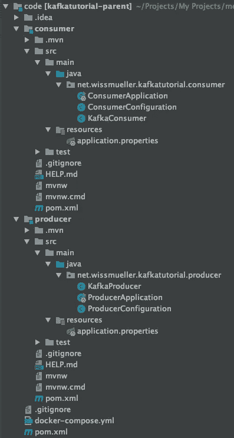
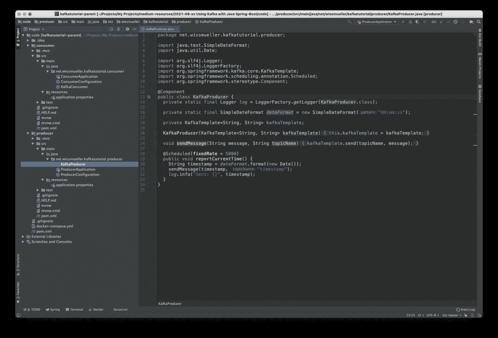
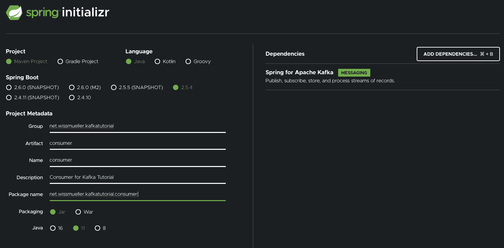
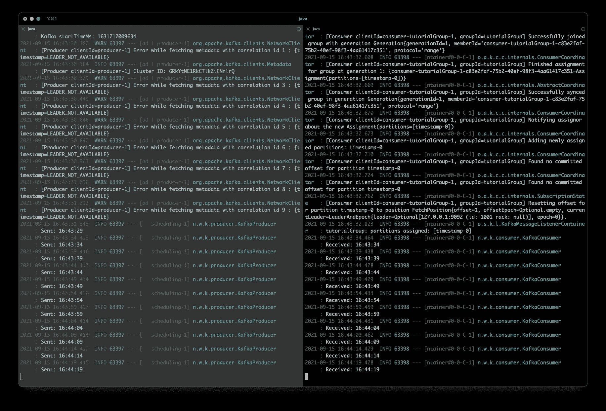

# 使用 Kafka 和 Java Spring-Boot 的事件驱动架构

> 原文：<https://itnext.io/event-driven-architectures-with-kafka-and-java-spring-boot-6ded048e86f3?source=collection_archive---------0----------------------->

## 入门所需的一切


事件驱动架构在过去几年里已经成为一种事物，Kafka 是工具方面事实上的标准。

这篇文章提供了一个事件驱动架构的完整示例，它是用两个通过 Kafka 通信的 Java Spring-Boot 服务实现的。

本教程的主要目标是提供一个工作示例，而不涉及太多的细节，在我看来，这不必要地分散了尽快启动和运行“某些东西”的主要任务的注意力。

我们主要有几个构件

*   基础设施(卡夫卡，动物园管理员)
*   生产者(Java Spring-Boot 服务)
*   消费者(Java Spring-Boot 服务)

生产者的唯一任务是定期向卡夫卡发送一个事件。这个事件只是带有一个时间戳。消费者的工作是监听这个事件并打印时间戳。


卡夫卡

整个实现产生了下面的项目结构。



项目结构

[**完整的项目代码可以从这里下载。**](https://github.com/twissmueller/event-driven-architectures/tree/main/java-tutorial)

这可以在命令行上构建，如下所述，或者导入到 IDE 中，例如 IntelliJ。



IntelliJ 项目

## 基础设施

尽管有这些服务，但要让基于事件的架构正常运行，只需要两个组件:Kafka 和 Zookeeper。

查看本教程末尾的参考资料部分，获得两者的链接。

尽管卡夫卡是交换事件的“主要”部分，但出于几个原因，动物园管理员是需要的。来自[动物园管理员网站](https://zookeeper.apache.org):

> ZooKeeper 是一个集中式服务，用于维护配置信息、命名、提供分布式同步和提供组服务。

下面是启动和运行的`docker-compose.yml`:

```
version: '3'

services:

    kafka:
      image: wurstmeister/kafka
      container_name: kafka
      ports:
        - "9092:9092"
      environment:
        - KAFKA_ADVERTISED_HOST_NAME=127.0.0.1
        - KAFKA_ADVERTISED_PORT=9092
        - KAFKA_ZOOKEEPER_CONNECT=zookeeper:2181
      depends_on:
        - zookeeper

    zookeeper:
      image: wurstmeister/zookeeper
      ports:
        - "2181:2181"
      environment:
        - KAFKA_ADVERTISED_HOST_NAME=zookeeper
```

当这一切就绪时，只需要实现“业务领域”的两个 Java 服务。很简单:发送和接收时间戳。

## 代码设置

有一个非常实用的网站，在那里你可以创建并初始化一个包含所有必需依赖项的 Spring 项目: [Spring Initializr](https://start.spring.io) 。

首先，我创建了生产者应用程序:



生产者初始化

接下来是消费者应用:


消费者初始化

注意，我已经添加了对“Apache Kafka 的 Spring”的依赖。

下载并解压缩项目文件后，是时候开始实现了。

对于生产者和消费者，每个人需要 4 个文件:

*   应用程序
*   配置
*   生产者，分别是消费者
*   属性文件

在接下来的两章中解释了这些文件的内容。我不打算在这里深入讨论细节，因为本教程并不意味着是一个深入的卡夫卡教程。

## 生产者

如上所述，制作者正在“制作”时间戳，并通过 Kafka 将它们发送给有兴趣接收它们的每个人。

一切都从`ProducerApplication.java`中的应用程序类开始，它或多或少没有被改动。仅添加了生产者本身所需的`@EnableScheduling`-注释。

```
package net.wissmueller.kafkatutorial.producer;

// imports ...

@SpringBootApplication
@EnableScheduling
public class ProducerApplication {

  public static void main(String[] args) {
    SpringApplication.run(ProducerApplication.class, args);
  }

}
```

一些配置是需要的，我已经把它放进了`ProducerConfiguration.java`。

我们需要告诉制片人在哪里可以找到卡夫卡，以及这些事件要用哪些连载。这是在`producerConfigs()`中完成的。

一个事件有一个键和值。两者我们都使用了`String`级。这在`kafkaTemplate()`中指定。

我们还需要发送事件的主题。因此我们有了返回`NewTopic`的`timestampTopic()`。

```
package net.wissmueller.kafkatutorial.producer;

// imports ...

public class ProducerConfiguration {

  @Value("${kafka.bootstrap-servers}")
  private String bootstrapServers;

  @Bean
  public Map<String, Object> producerConfigs() {
    Map<String, Object> props = new HashMap<>();
    props.put(ProducerConfig.BOOTSTRAP_SERVERS_CONFIG, bootstrapServers);
    props.put(ProducerConfig.KEY_SERIALIZER_CLASS_CONFIG, StringSerializer.class);
    props.put(ProducerConfig.VALUE_SERIALIZER_CLASS_CONFIG, StringSerializer.class);
    return props;
  }

  @Bean
  public ProducerFactory<String, String> producerFactory() {
    return new DefaultKafkaProducerFactory<>(producerConfigs());
  }

  @Bean
  public KafkaTemplate<String, String> kafkaTemplate() {
    return new KafkaTemplate<>(producerFactory());
  }

  @Bean
  public NewTopic timestampTopic() {
    return TopicBuilder.name("timestamp")
                       .build();
  }

}
```

这个类需要一些常见的属性:`application.properties`

```
spring.kafka.bootstrap-servers=localhost:9092
spring.kafka.consumer.group-id=tutorialGroup
```

制作人本身在`KafkaProducer.java`:

```
package net.wissmueller.kafkatutorial.producer;

// imports ...

@Component
public class KafkaProducer {
  private static final Logger log = LoggerFactory.getLogger(KafkaProducer.class);

  private static final SimpleDateFormat dateFormat = new SimpleDateFormat("HH:mm:ss");

  private KafkaTemplate<String, String> kafkaTemplate;

  KafkaProducer(KafkaTemplate<String, String> kafkaTemplate) {
    this.kafkaTemplate = kafkaTemplate;
  }

  void sendMessage(String message, String topicName) {
    kafkaTemplate.send(topicName, message);
  }

  @Scheduled(fixedRate = 5000)
  public void reportCurrentTime() {
    String timestamp = dateFormat.format(new Date());
    sendMessage(timestamp, "timestamp");
    log.info("Sent: {}", timestamp);
  }
}
```

该类由`KafkaTemplate`初始化。

在`reportCurrentTime()`中，时间戳每 5 秒钟被发送到 Kafka，这是通过`@Scheduled`注释实现的。这仅在应用程序类中设置了`@EnableScheduling`-注释时有效。

这就是制作人的全部。对消费者而言…

## 消费者

是时候接收由生产者发出的时间戳了。

与生产者一样，入口点是`ConsumerApplication.java`中的应用程序类。这一次完全不变，就像它已经由 Spring Initializr 生成一样。

```
package net.wissmueller.kafkatutorial.consumer;

// imports ...

@SpringBootApplication
public class ConsumerApplication {

  public static void main(String[] args) {
    SpringApplication.run(ConsumerApplication.class, args);
  }

}
```

配置在`ConsumerConfiguration.java`中，我们模拟生产者，

*   指定如何到达卡夫卡
*   要使用哪些连续出版物
*   卡夫卡事件的形式

```
package net.wissmueller.kafkatutorial.consumer;

// imports ...

public class ConsumerConfiguration {

  @Value("${kafka.bootstrap-servers}")
  private String bootstrapServers;

  @Bean
  public Map<String, Object> consumerConfigs() {
    Map<String, Object> props = new HashMap<>();
    props.put(ConsumerConfig.BOOTSTRAP_SERVERS_CONFIG, bootstrapServers);
    props.put(ConsumerConfig.KEY_DESERIALIZER_CLASS_CONFIG, StringDeserializer.class);
    return props;
  }

  @Bean
  public ConsumerFactory<String, String> consumerFactory() {
    return new DefaultKafkaConsumerFactory<>(consumerConfigs());
  }

  @Bean
  public KafkaListenerContainerFactory<ConcurrentMessageListenerContainer<String, String>> kafkaListenerContainerFactory() {
    ConcurrentKafkaListenerContainerFactory<String, String> factory = new ConcurrentKafkaListenerContainerFactory<>();
    factory.setConsumerFactory(consumerFactory());
    return factory;
  }

  @Bean
  public NewTopic timestampTopic() {
    return TopicBuilder.name("timestamp")
                       .build();
  }

}
```

同样在这里，我们需要在`application.properties`中设置一些属性:

```
spring.kafka.bootstrap-servers=localhost:9092
spring.kafka.consumer.group-id=tutorialGroup
```

最后但并非最不重要的是，我们有消费者在`KafkaConsumer.java`。我们只需通过使用`@KafkaListener` -topic 和动作来指定一个主题的监听器。在这种情况下，时间戳只是被记录。

```
package net.wissmueller.kafkatutorial.consumer;

// imports ...

@Component
public class KafkaConsumer {
  private static final Logger log = LoggerFactory.getLogger(KafkaConsumer.class);

  @KafkaListener(topics = "timestamp")
  void listener(String timestamp) {
    log.info("Received: {}", timestamp);
  }
}
```

## 运行示例代码

是时候运行一切了。请记住以下项目结构:

```
code/
- docker-compose.yml
- producer/
-- pom.xml
-- ...
- consumer/
-- pom.xml
-- ...
```

在目录`code`中，Kafka 和 Zookeeper 正在通过`docker-compose`启动:

```
docker-compose up -d
```

进入`producer`目录，服务开始于:

```
mvn spring-boot:run
```

最后，在新的终端窗口中，切换到`consumer`目录，以同样的方式启动服务:

```
mvn spring-boot:run
```

现在，你应该能看到类似这样的东西。左边是生产者的日志输出，右边是消费者的日志输出。



终端输出

关于如何使用 Kafka 和 Java Spring-Boot 创建事件驱动架构的介绍性教程到此结束。

[**完整的项目代码可以从这里下载。**](https://github.com/twissmueller/event-driven-architectures/tree/main/java-tutorial)

如果你喜欢这篇文章，请给我买杯咖啡。

## 资源

*   [阿帕奇卡夫卡](https://kafka.apache.org)
*   [阿帕奇动物园管理员](https://zookeeper.apache.org)
*   [与 Spring Boot 一起使用卡夫卡](https://reflectoring.io/spring-boot-kafka/)
*   [Spring Boot 与卡夫卡——实例](https://thepracticaldeveloper.com/spring-boot-kafka-config/)