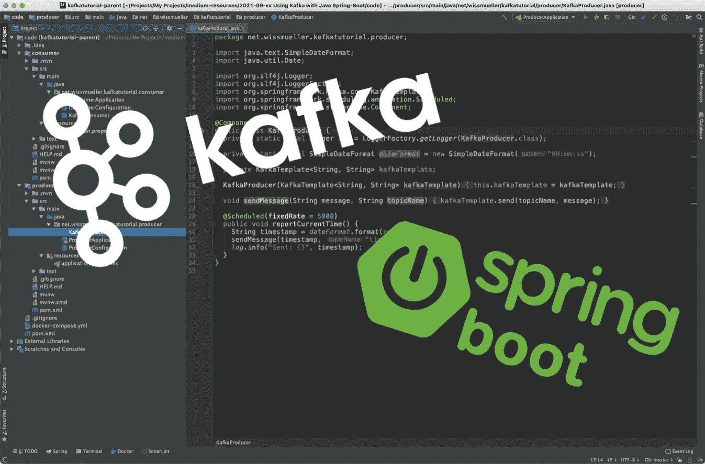
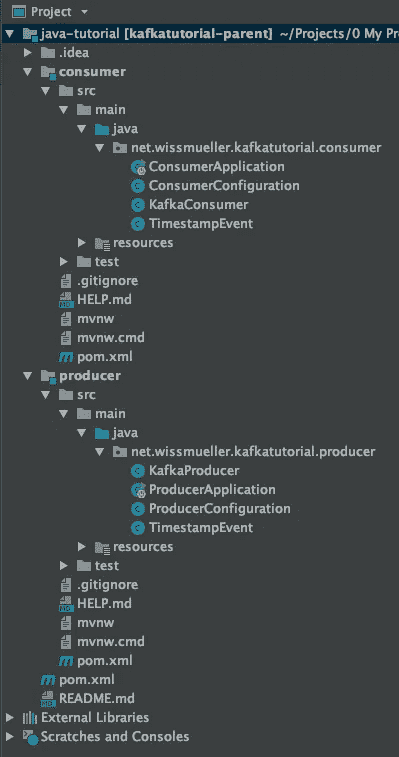
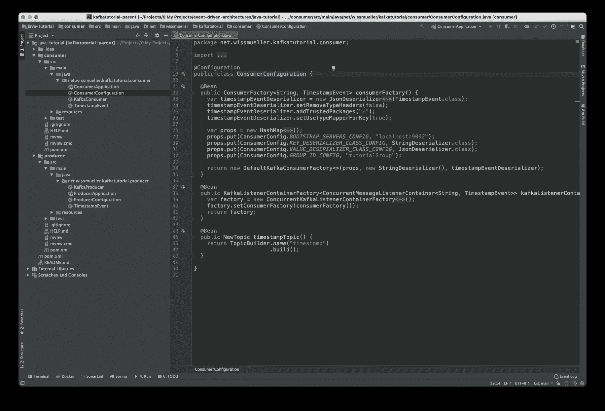
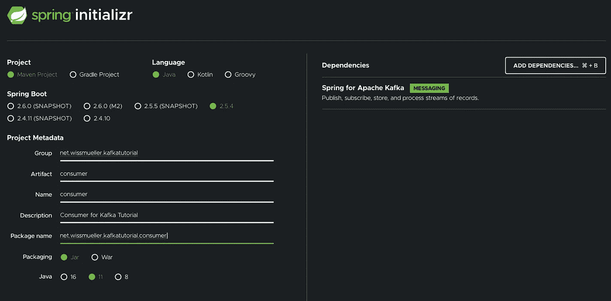
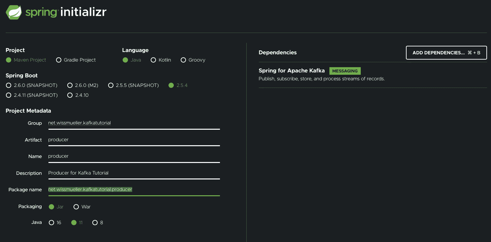
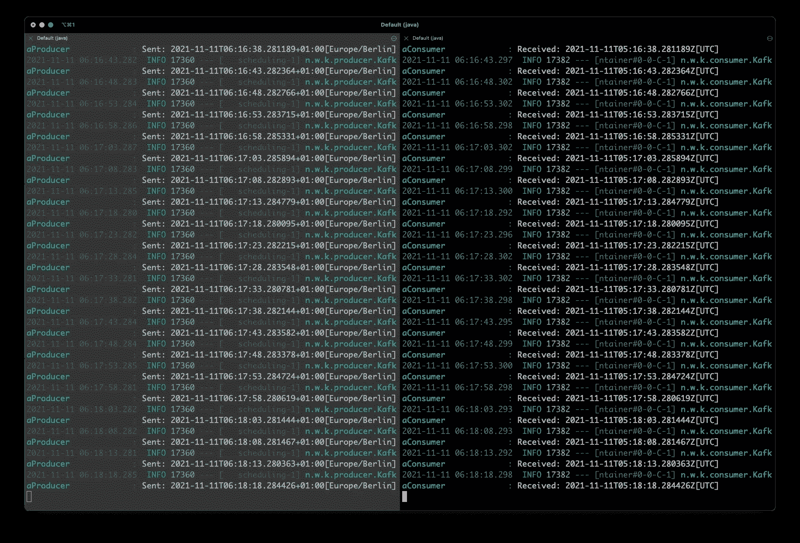

# 使用 Kafka 和 Java Spring-Boot 的事件驱动架构—修订版 1

> 原文：<https://itnext.io/event-driven-architectures-with-kafka-and-java-spring-boot-revision-1-c0d43d103ee7?source=collection_archive---------0----------------------->

## 入门所需的一切



欢迎来到我的文章[“使用 Kafka 和 Java Spring-Boot 的事件驱动架构”](/event-driven-architectures-with-kafka-and-java-spring-boot-6ded048e86f3)的第一版。

在[原文](/event-driven-architectures-with-kafka-and-java-spring-boot-6ded048e86f3)中发出的事件是一个字符串。虽然这对于许多用例来说已经足够了，但是我的大多数用例都需要发送一个自定义类型的对象。

因此，我修改了代码和教程，使用 JSON 的对象序列化和反序列化。

当然，还有其他方法来序列化和去序列化数据。一个非常受欢迎的例子是 Avro。

虽然条条大路通罗马，但让我们从一条路开始，继续本教程。

## 介绍

事件驱动架构在过去几年里已经成为一种事物，Kafka 是工具方面事实上的标准。

这篇文章提供了一个事件驱动架构的完整示例，它是用两个通过 Kafka 通信的 Java Spring-Boot 服务实现的。

本教程的主要目标是提供一个工作示例，而不涉及太多的细节，在我看来，这不必要地分散了尽快启动和运行“某些东西”的主要任务的注意力。

我们主要有几个构件

*   基础设施(卡夫卡，动物园管理员)
*   生产者(Java Spring-Boot 服务)
*   消费者(Java Spring-Boot 服务)

生产者的唯一任务是定期向卡夫卡发送一个事件。这个事件只是带有一个时间戳。消费者的工作是监听这个事件并打印时间戳。


卡夫卡

整个实现产生了下面的项目结构。



项目结构

[**完整的项目代码可以从这里下载。**](https://github.com/twissmueller/event-driven-architectures/tree/main/java-tutorial)

这可以在命令行上构建，如下所述，或者导入到 IDE 中，例如 IntelliJ。



IntelliJ 项目

## 基础设施

尽管有这些服务，但要让基于事件的架构正常运行，只需要两个组件:Kafka 和 Zookeeper。

查看本教程末尾的参考资料部分，获得两者的链接。

尽管卡夫卡是处理事件的“主要”部分，但出于几个原因，动物园管理员是需要的。来自动物园管理员网站:

> ZooKeeper 是一个集中式服务，用于维护配置信息、命名、提供分布式同步和提供组服务。

下面是启动和运行的`docker-compose.yml`:

```
version: '3'

services:

    kafka:
      image: wurstmeister/kafka
      container_name: kafka
      ports:
        - "9092:9092"
      environment:
        - KAFKA_ADVERTISED_HOST_NAME=127.0.0.1
        - KAFKA_ADVERTISED_PORT=9092
        - KAFKA_ZOOKEEPER_CONNECT=zookeeper:2181
      depends_on:
        - zookeeper

    zookeeper:
      image: wurstmeister/zookeeper
      ports:
        - "2181:2181"
      environment:
        - KAFKA_ADVERTISED_HOST_NAME=zookeeper
```

当这一切就绪时，只需要实现“业务领域”的两个 Java 服务。很简单:发送和接收时间戳。

## 代码设置

有一个非常实用的网站，在那里你可以创建并初始化一个包含所有必需依赖项的 Spring 项目。

首先，我创建了生产者应用程序:



接下来是消费者应用:



消费者初始化

注意，我已经添加了对“Apache Kafka 的 Spring”的依赖。

下载并解压缩项目文件后，是时候开始实现了。

对于生产者和消费者，每个人需要 4 个文件:

*   应用程序
*   配置
*   生产者，分别是消费者
*   属性文件

在接下来的两章中解释了这些文件的内容。我不打算在这里深入讨论细节，因为本教程并不意味着是一个深入的卡夫卡教程。

## 生产者

如上所述，生产者正在“生产”带有时间戳的事件，并通过 Kafka 将它们发送给有兴趣接收它们的每个人。

```
package net.wissmueller.kafkatutorial.producer;

import java.time.ZonedDateTime;

public class TimestampEvent {
  private ZonedDateTime timestamp;

  public TimestampEvent(ZonedDateTime timestamp) {
    this.timestamp = timestamp;
  }

  public ZonedDateTime getTimestamp() {
    return timestamp;
  }

  public void setTimestamp(ZonedDateTime timestamp) {
    this.timestamp = timestamp;
  }
}
```

一切都从`ProducerApplication.java`中的应用程序类开始，它或多或少没有被改动。仅添加了生产者本身所需的`@EnableScheduling`-注释。

```
package net.wissmueller.kafkatutorial.producer;

// imports ...

@SpringBootApplication
@EnableScheduling
public class ProducerApplication {

  public static void main(String[] args) {
    SpringApplication.run(ProducerApplication.class, args);
  }

}
```

一些配置是需要的，我已经把它放进了`ProducerConfiguration.java`。

在`producerFactory()`中，我们指定:

*   哪里可以找到服务器:`BOOTSTRAP_SERVERS_CONFIG`
*   事件键的序列:`KEY_SERIALIZER_CLASS_CONFIG`
*   事件值的序列:`VALUE_SERIALIZER_CLASS_CONFIG`
*   卡夫卡群的 ID:`GROUP_ID_CONFIG`

我们还需要发送事件的主题。因此我们有了返回`NewTopic`的`timestampTopic()`。

```
package net.wissmueller.kafkatutorial.producer;

// imports ...

public class ProducerConfiguration {

  @Bean
  public ProducerFactory<String, TimestampEvent> producerFactory() {
    var props = new HashMap<String, Object>();
    props.put(ConsumerConfig.BOOTSTRAP_SERVERS_CONFIG, "localhost:9092");
    props.put(ProducerConfig.KEY_SERIALIZER_CLASS_CONFIG, StringSerializer.class);
    props.put(ProducerConfig.VALUE_SERIALIZER_CLASS_CONFIG, JsonSerializer.class);
    props.put(ConsumerConfig.GROUP_ID_CONFIG, "tutorialGroup");
    return new DefaultKafkaProducerFactory<>(props);
  }

  @Bean
  public KafkaTemplate<String, TimestampEvent> kafkaTemplate() {
    return new KafkaTemplate<>(producerFactory());
  }

  @Bean
  public NewTopic timestampTopic() {
    return TopicBuilder.name("timestamp")
                       .build();
  }
}
```

制作人本身在`KafkaProducer.java`:

```
package net.wissmueller.kafkatutorial.producer;

// imports ...

@Component
public class KafkaProducer {
  private static final Logger log = LoggerFactory.getLogger(KafkaProducer.class);

  @Autowired
  private KafkaTemplate<String, TimestampEvent> kafkaTemplate;

  @Scheduled(fixedRate = 5000)
  public void reportCurrentTime() {
    var event = new TimestampEvent(ZonedDateTime.now());
    kafkaTemplate.send("timestamp", event);
    log.info("Sent: {}", event.getTimestamp().toString());
  }
}
```

该类用`KafkaTemplate`初始化。

在`reportCurrentTime()`中，时间戳每 5 秒被发送到 Kafka，这是通过`@Scheduled`注释实现的。这仅在应用程序类中设置了`@EnableScheduling`-注释时有效。

这就是制作人的全部。对消费者而言…

## 消费者

是时候接收由生产者发出的带有时间戳的事件了。

```
package net.wissmueller.kafkatutorial.consumer;

import java.time.ZonedDateTime;

public class TimestampEvent {
  private ZonedDateTime timestamp;

  public TimestampEvent() {}

  public ZonedDateTime getTimestamp() {
    return timestamp;
  }

  public void setTimestamp(ZonedDateTime timestamp) {
    this.timestamp = timestamp;
  }
}
```

与生产者一样，入口点是`ConsumerApplication.java`中的应用程序类。这一次完全不变，就像它已经由 Spring Initializr 生成一样。

```
package net.wissmueller.kafkatutorial.consumer;

// imports ...

@SpringBootApplication
public class ConsumerApplication {

  public static void main(String[] args) {
    SpringApplication.run(ConsumerApplication.class, args);
  }

}
```

配置在`ConsumerConfiguration.java`中，我们模拟生产者，

在`consumerFactory()`我们指定:

*   去哪里找服务器:`BOOTSTRAP_SERVERS_CONFIG`
*   事件关键字的描述符:`KEY_DESERIALIZER_CLASS_CONFIG`
*   事件值的描述符:`VALUE_DESERIALIZER_CLASS_CONFIG`
*   卡夫卡群的 ID:`GROUP_ID_CONFIG`

```
package net.wissmueller.kafkatutorial.consumer;

// imports ...

public class ConsumerConfiguration {

  @Bean
  public ConsumerFactory<String, TimestampEvent> consumerFactory() {
    var timestampEventDeserializer = new JsonDeserializer<TimestampEvent>(TimestampEvent.class);
    timestampEventDeserializer.setRemoveTypeHeaders(false);
    timestampEventDeserializer.addTrustedPackages("*");
    timestampEventDeserializer.setUseTypeMapperForKey(true);

    var props = new HashMap<String, Object>();
    props.put(ConsumerConfig.BOOTSTRAP_SERVERS_CONFIG, "localhost:9092");
    props.put(ConsumerConfig.KEY_DESERIALIZER_CLASS_CONFIG, StringDeserializer.class);
    props.put(ConsumerConfig.VALUE_DESERIALIZER_CLASS_CONFIG, JsonDeserializer.class);
    props.put(ConsumerConfig.GROUP_ID_CONFIG, "tutorialGroup");

    return new DefaultKafkaConsumerFactory<>(props, new StringDeserializer(), timestampEventDeserializer);
  }

  @Bean
  public KafkaListenerContainerFactory<ConcurrentMessageListenerContainer<String, TimestampEvent>> kafkaListenerContainerFactory() {
    var factory = new ConcurrentKafkaListenerContainerFactory<String, TimestampEvent>();
    factory.setConsumerFactory(consumerFactory());
    return factory;
  }

  @Bean
  public NewTopic timestampTopic() {
    return TopicBuilder.name("timestamp")
                       .build();
  }
}
```

最后但并非最不重要的是，我们有`KafkaConsumer.java`中的消费者。我们只需要通过使用`@KafkaListener` -topic 和动作来指定一个主题的监听器。在这种情况下，时间戳只是被记录。

```
package net.wissmueller.kafkatutorial.consumer;

// imports ...

@Component
public class KafkaConsumer {
  private static final Logger log = LoggerFactory.getLogger(KafkaConsumer.class);

  @KafkaListener(topics = "timestamp", containerFactory = "kafkaListenerContainerFactory")
  void listener(TimestampEvent event) {
    log.info("Received: {}", event.getTimestamp()
                                  .toString());
  }
}
```

## 运行示例代码

是时候运行一切了。请记住以下项目结构:

```
code/
- docker-compose.yml
- producer/
-- pom.xml
-- ...
- consumer/
-- pom.xml
-- ...
```

在目录`code`中，卡夫卡和动物园管理员正在通过`docker-compose`启动:

```
docker-compose up -d
```

切换到`producer`-目录，服务开始于:

```
mvn spring-boot:run
```

最后，在新的终端窗口中，切换到`consumer`目录，以同样的方式启动服务:

```
mvn spring-boot:run
```

现在，你应该能看到类似这样的东西。左边是生产者的日志输出，右边是消费者的日志输出。



终端输出

关于如何使用 Kafka 和 Java Spring-Boot 创建事件驱动架构的介绍性教程到此结束。

完整的项目代码可以从这里下载。

*   如果你喜欢这个，请 [**跟我上媒**](https://twissmueller.medium.com/)
*   给我买杯咖啡让我继续前进
*   支持我和其他媒体作者 [**在这里报名**](https://twissmueller.medium.com/membership)

## 资源

*   [阿帕奇卡夫卡](https://kafka.apache.org)
*   [阿帕奇动物园管理员](https://zookeeper.apache.org)
*   [用卡夫卡和 Spring Boot](https://reflectoring.io/spring-boot-kafka/)
*   [Spring Boot 与卡夫卡——实例](https://thepracticaldeveloper.com/spring-boot-kafka-config/)