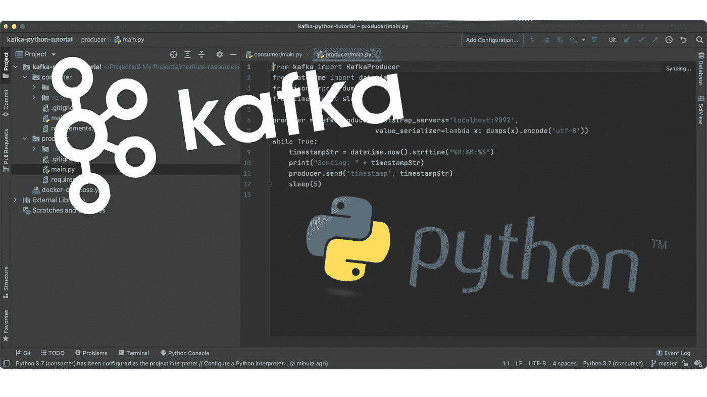
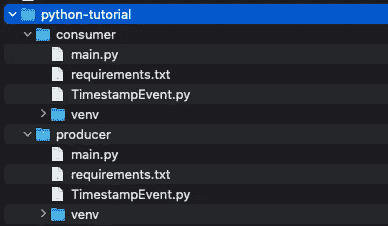
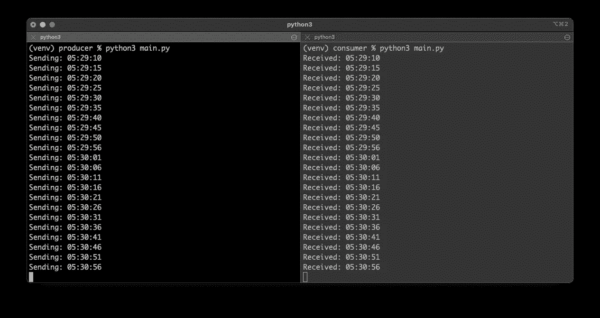

# 使用 Kafka 和 Python 的事件驱动架构—修订版 1

> 原文：<https://itnext.io/event-driven-architectures-with-kafka-and-python-revision-1-50276d3ee3dd?source=collection_archive---------1----------------------->

## 入门所需的一切



欢迎来到我的文章[“使用 Kafka 和 Python 的事件驱动架构”](/event-driven-architectures-with-kafka-and-python-41114de4938b)的第一次修订版。

在最初的文章中，发出的事件是一个字符串。虽然这对于许多用例来说已经足够了，但是我的大多数用例都需要发送一个自定义类型的对象。

因此，我修改了代码和教程，使用 JSON 的对象序列化和反序列化。

当然，还有其他方法来序列化和去序列化数据。一个非常受欢迎的例子是 Avro。

虽然条条大路通罗马，但让我们从一条路开始，继续本教程。

## 介绍

事件驱动架构在过去几年里已经成为一种事物，Kafka 是工具方面事实上的标准。

这篇文章提供了一个事件驱动架构的完整例子，用 Python 编写的两个服务实现，这两个服务通过 Kafka 进行通信。

本教程的主要目标是提供一个工作示例，而不涉及太多的细节，在我看来，这不必要地分散了尽快启动和运行“某些东西”的主要任务的注意力。

我们主要有几个构件

*   基础设施(卡夫卡，动物园管理员)
*   生产者(Python 服务)
*   消费者(Python 服务)

生产者的唯一任务是定期向卡夫卡发送一个事件。这个事件只是带有一个时间戳。消费者的工作是监听这个事件并打印时间戳。


卡夫卡

整个实现产生了下面的项目结构。



项目结构

[**完整的代码可以从这里下载。**](https://github.com/twissmueller/event-driven-architectures/tree/main/python-tutorial)

## 基础设施

尽管有这些服务，但要让基于事件的架构正常运行，只需要两个组件:Kafka 和 Zookeeper。

查看本教程末尾的参考资料部分，获得两者的链接。

尽管卡夫卡是交换事件的“主要”部分，但出于几个原因，动物园管理员是需要的。来自动物园管理员网站:

> ZooKeeper 是一个集中式服务，用于维护配置信息、命名、提供分布式同步和提供组服务。

下面是 docker-compose.yml，用于启动和运行:

```
version: '3'

services:

    kafka:
      image: wurstmeister/kafka
      container_name: kafka
      ports:
        - "9092:9092"
      environment:
        - KAFKA_ADVERTISED_HOST_NAME=127.0.0.1
        - KAFKA_ADVERTISED_PORT=9092
        - KAFKA_ZOOKEEPER_CONNECT=zookeeper:2181
      depends_on:
        - zookeeper

    zookeeper:
      image: wurstmeister/zookeeper
      ports:
        - "2181:2181"
      environment:
        - KAFKA_ADVERTISED_HOST_NAME=zookeeper
```

当这一切就绪时，只需要实现“业务领域”的两个服务。很简单:发送和接收时间戳。

## 代码设置

有两个 Python 项目，所有代码都在它们各自的`main.py`中。

它们只有一个在它们的`requirements.txt`中定义的依赖项:

```
kafka-python==2.0.2
```

需要使用以下命令为每个项目安装该依赖项:

```
python3 -m pip install -r requirements.txt
```

## 生产者

如上所述，生产者正在“生产”时间戳。

```
class TimestampEvent:
    def __init__(self, timestamp):
        self.timestamp = timestamp
```

这些时间戳正通过卡夫卡发送给每一个有兴趣接收它们的人。

```
import json
from kafka import KafkaProducer
from datetime import datetime
from time import sleep

from TimestampEvent import TimestampEvent

producer = KafkaProducer(bootstrap_servers='localhost:9092',
                         value_serializer=lambda x: json.dumps(x.__dict__).encode('utf-8'))

while True:
    timestampEvent = TimestampEvent(datetime.now().strftime("%H:%M:%S"))
    print("Sending: " + timestampEvent.timestamp)
    producer.send('timestamp', timestampEvent)
    sleep(5)
```

创建生成器时，我们提供两条信息:

*   `bootstrap_servers`:去哪里找卡夫卡。这本来是可以省去的，因为`localhost:9092`是默认值。
*   `value_serializer`:信息将如何被编码。

消息将被发送到`timestamp`主题。这与消费者只能收听来自该主题的消息有关。

这就是制作人的全部。对消费者而言…

## 消费者

时间戳的数据结构与生产者的数据结构相同。

```
class TimestampEvent:
    def __init__(self, timestamp):
        self.timestamp = timestamp
```

是时候接收由生产者发出的时间戳了。

```
from kafka import KafkaConsumer
import json

from TimestampEvent import TimestampEvent

consumer = KafkaConsumer('timestamp',
                         value_deserializer=lambda x: json.loads(x.decode('utf-8')))

for message in consumer:
    timestampEvent = TimestampEvent(**(message.value))
    print("Received: " + timestampEvent.timestamp)
```

这一次，我们没有向消费者提供`bootstrap_servers`。它将默认为`localhost:9092`。

提供的必要参数有:

*   消费者将会听到的话题:`timestamp`
*   `value_deserializer`:消息收到后如何解码。

现在一切都各就各位了。准备好行动了。

## 运行示例代码

是时候运行一切了。请记住以下项目结构:

```
event-driven-architectures
- docker-compose.yml
- python-tutorial
-- producer
--- main.py
-- consumer
--- main.py
```

在目录`event-driven-architectures`中，卡夫卡和动物园管理员正在通过`docker-compose`启动:

```
docker-compose up -d
```

切换到`producer`-目录，使用以下命令启动服务:

```
$ source venv/bin/activate
(venv) $ python3 main.py
```

最后，在新的终端窗口中，切换到`consumer`目录，以同样的方式启动服务:

```
$ source venv/bin/activate
(venv) $ python3 main.py
```

现在，你应该能看到类似这样的东西。左边是生产者的日志输出，右边是消费者的日志输出。



终端输出

如果你能走到这一步，恭喜你。实际上，坚持到底应该很容易。如果没有，让我知道如何改善这个教程。

## 清除

完成后，只需输入

```
(venv) $ deactivate
```

Docker 服务也仍在运行。这些也需要停止和清理。

下面的命令执行以下操作

*   停止所有正在运行的 Docker 容器
*   删除停止的码头集装箱
*   移除所有卷

```
$ docker-compose stop && docker-compose rm -f && docker volume prune -f
Stopping kafka                             ... done
Stopping kafka-python-tutorial_zookeeper_1 ... done
Going to remove kafka, kafka-python-tutorial_zookeeper_1
Removing kafka                             ... done
Removing kafka-python-tutorial_zookeeper_1 ... done
Deleted Volumes:
e4380413983bb36f914621dac4019565cd9ed130c04c5336c898874b648c2c92
120ab4ab7e227bdc5ee155d1cc61f29b1b0f8d7ed2fa9ee29deb05c90e33b8fe
0636bf46ec05cdda15deec280cdef672c68366a7d8d57ff424938069498e4063

Total reclaimed space: 67.13MB
```

## 结论

关于如何使用 Kafka 和 Python 创建事件驱动架构的教程到此结束。

完整的项目代码可以从这里下载。

*   如果你喜欢这个，请 [**跟我上媒**](https://twissmueller.medium.com/)
*   [**给我买杯咖啡**](https://www.buymeacoffee.com/twissmueller) 让我继续前进
*   支持我和其他媒体作者 [**在这里报名**](https://twissmueller.medium.com/membership)

## 资源

*   [阿帕奇卡夫卡](https://kafka.apache.org)
*   [阿帕奇动物园管理员](https://zookeeper.apache.org)
*   [卡夫卡-巨蟒](https://github.com/dpkp/kafka-python)
*   [Kafka-Python 用 10 行代码解释](https://towardsdatascience.com/kafka-python-explained-in-10-lines-of-code-800e3e07dad1)
*   [使用 Flask 和 Kafka 的流式模型推断](https://medium.com/geekculture/streaming-model-inference-using-flask-and-kafka-3476d9ff5ca5)

[](https://twissmueller.medium.com/membership) [## 通过我的推荐链接加入媒体

### 作为一个媒体会员，你的会员费的一部分会给你阅读的作家，你可以完全接触到每一个故事…

twissmueller.medium.com](https://twissmueller.medium.com/membership)