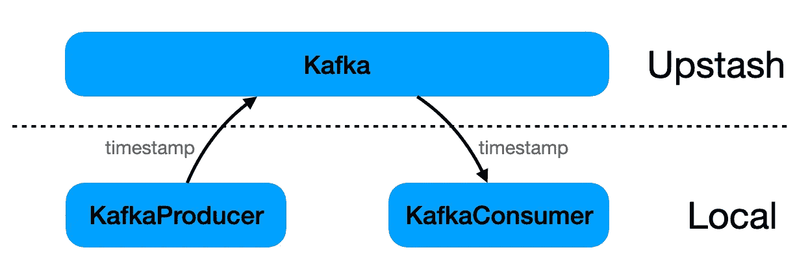
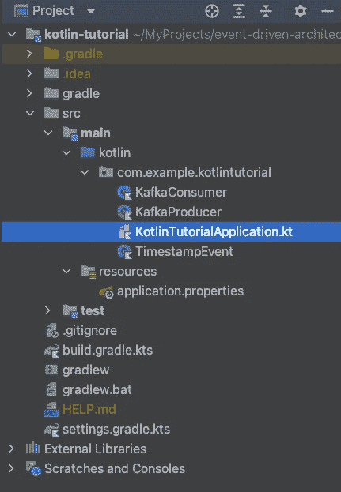
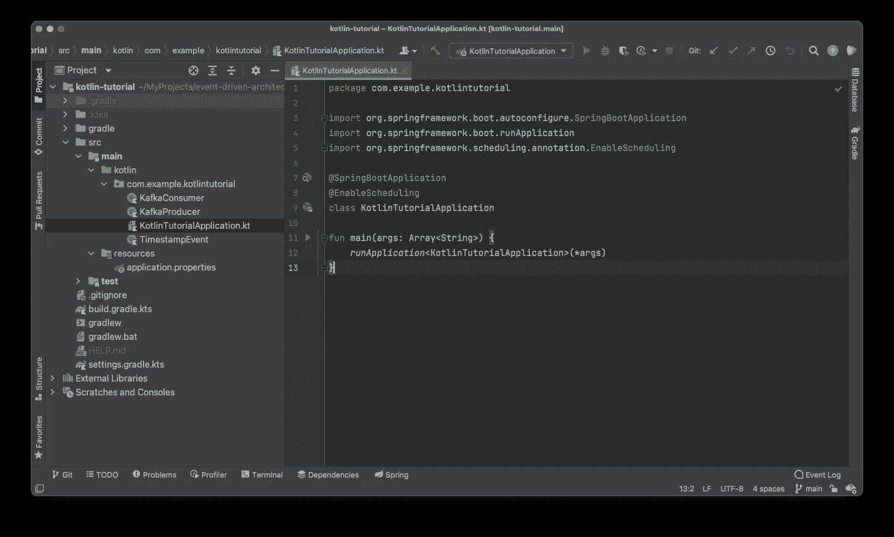
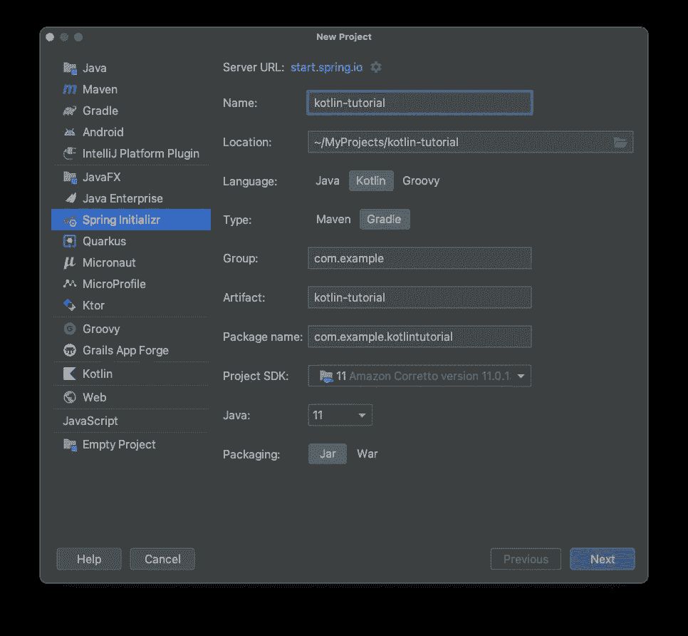
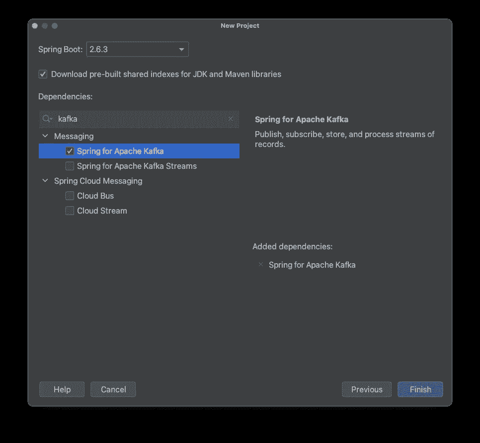
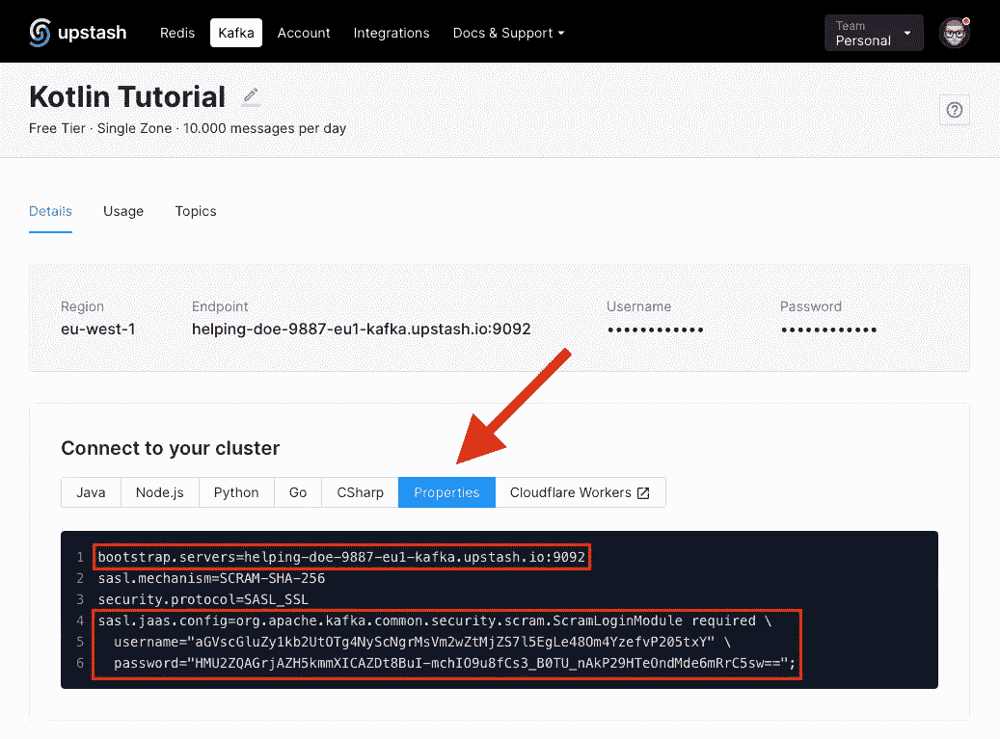
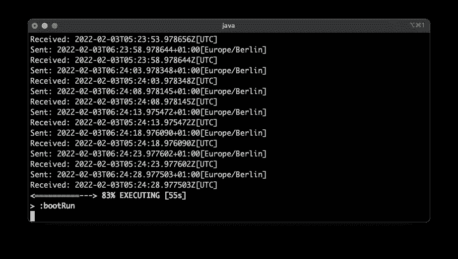
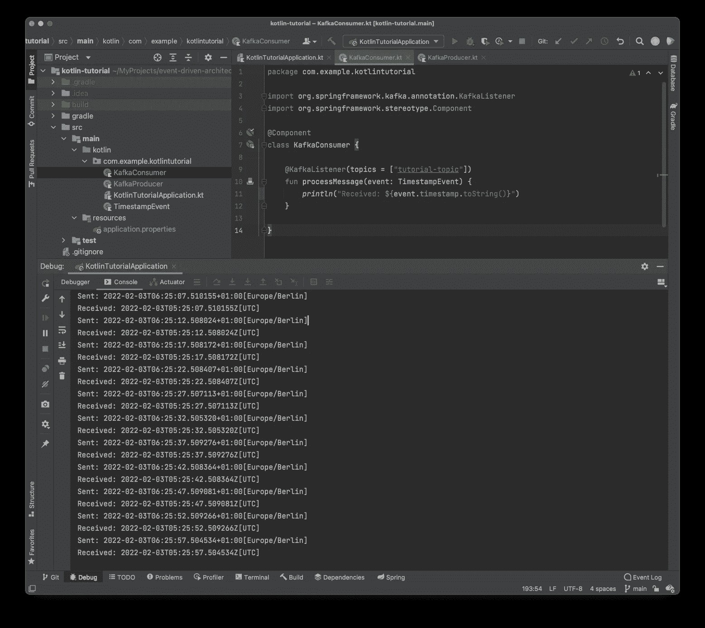

# 无服务器 Kafka 上 Kotlin 的事件驱动架构

> 原文：<https://itnext.io/event-driven-architectures-with-kotlin-on-serverless-kafka-a29aa7ba1a79?source=collection_archive---------3----------------------->

入门所需的一切


Denys Nevozhai 在 [Unsplash](https://unsplash.com?utm_source=medium&utm_medium=referral) 上拍摄的照片

欢迎来到我的事件驱动架构系列的另一集。这是我的系列文章的第三部分。

到目前为止，我们有:

*   [使用 Kafka 和 Java Spring-Boot 的事件驱动架构](/event-driven-architectures-with-kafka-and-java-spring-boot-6ded048e86f3) + [版本 1](/event-driven-architectures-with-kafka-and-java-spring-boot-revision-1-c0d43d103ee7)
*   [使用 Kafka 和 Python 的事件驱动架构](/event-driven-architectures-with-kafka-and-python-41114de4938b) + [修订版 1](/event-driven-architectures-with-kafka-and-python-revision-1-50276d3ee3dd)

这篇文章是关于如何用 Kotlin 实现一个事件驱动的架构，但是与之前的文章相比有一些不同:

*   如前所述，我们将使用 Kotlin 而不是 Java。
*   我们将使用 Gradle 代替 Maven 进行依赖管理和构建我们的应用程序。
*   该项目是用 IntelliJs 内置的 Spring Initializr 而不是基于 web 的 Initializr 创建的。
*   一个项目/服务被生产者和消费者使用。这对本教程来说并没有什么影响，而且更容易掌握。
*   不再使用通过 docker-compose 启动的本地 Kafka 实例，一个名为 [Upstash](https://upstash.com/?utm_source=tobias1) 的外部服务将为 Kafka 提供一切。你没有必要摆弄基础设施，因此得名“无服务器卡夫卡”。

[Upstash](https://upstash.com/?utm_source=tobias2) 是 Kafka 和 Redis 的真正无服务器产品，提供按需付费的解决方案，无需摆弄硬件、虚拟机或 docker 容器等东西。

我已经在 [Upstash](https://upstash.com/?utm_source=tobias1) 上写了一篇介绍性的帖子，名为“[卡夫卡 Upstash 的第一步”。](https://twissmueller.medium.com/first-steps-with-upstash-for-kafka-6d4d023da590)

[](/first-steps-with-upstash-for-kafka-6d4d023da590) [## 卡夫卡的第一步

### 编辑描述

itnext.io](/first-steps-with-upstash-for-kafka-6d4d023da590) 

## 介绍

事件驱动架构在过去几年里已经成为一种事物，Kafka 是工具方面事实上的标准。

这篇文章提供了一个事件驱动架构的完整示例，它是用 Kotlin Spring-Boot 服务实现的，该服务通过[舞台上方](https://upstash.com/?utm_source=tobias2)的 Kafka-cluster 进行通信。

本教程的主要目标是提供一个工作示例，而不涉及太多的细节，在我看来，这不必要地分散了尽快启动和运行“某些东西”的主要任务的注意力。

我们主要有几个构件

*   基础设施(卡夫卡在[上抢了](https://upstash.com/?utm_source=tobias2)的风头)
*   制片人(科特林，弹簧靴)
*   消费者(Kotlin，弹簧靴)

生产者的唯一任务是定期向卡夫卡发送一个事件。这个事件只是带有一个时间戳。消费者的工作是监听这个事件并打印时间戳。



无标题的

整个实施过程产生了以下项目结构:



无标题的

完整的代码可以从这里下载。

这可以直接在命令行上构建，或者导入到 IntelliJ 之类的 IDE 中。



无标题的

# 代码设置

IntelliJs Ultimate Edition 的用户可以从 IDEs 的“新建项目”对话框中直接使用 Spring Initializr。如果它不可用，那么您总是可以在[https://start . spring . io](https://start.spring.io/)创建项目。然后下载并解压 ZIP 文件，将所有内容导入 IntelliJ 或任何其他 IDE、编辑器或您喜欢的东西。

首先，我创建了一个新项目，它使用 Kotlin 作为它的语言，并对依赖和构建管理进行分级。



截图 2022 年 1 月 26 日，17.21.17.png

在下一步中，我刚刚为 Spring 添加了一个依赖项。其余的是我后来手动添加的。



截图 2022 年 1 月 26 日，17.21.34.png

在为生产者和消费者添加文件之后，项目看起来像这样:


无标题的

这些文件的内容将在下一章中解释。

## 生产者

如上所述，生产者正在“生产”带有时间戳的事件，并通过 Kafka 将它们发送给有兴趣接收它们的每个人。

卡夫卡的事件基本上是一个键值对。为此，我们需要为生产定义一个序列化器，为消费定义一个反序列化器。我已经在`application.properties`中这样做了。

```
spring.kafka.producer.key-serializer=org.apache.kafka.common.serialization.StringSerializer
spring.kafka.producer.value-serializer=org.springframework.kafka.support.serializer.JsonSerializer
```

键是一个简单的字符串，而值需要是 JSON。

消费者有一种方法来发送每 5 秒触发一次的事件。`@Scheduled` -注释使得以一种简单的方式完成这一点成为可能。

首先，创建一个时间戳，然后将它“发送”到“教程主题”。

```
@Component
class KafkaProducer(private val kafkaTemplate: KafkaTemplate<String, TimestampEvent>) {

    @Scheduled(fixedRate = 5000)
    fun send() {
        val event = TimestampEvent(timestamp = ZonedDateTime.now())
        kafkaTemplate.send("tutorial-topic", event)
        println("Sent: ${event.timestamp.toString()}")
    }

}
```

这就是制作人的全部。对消费者而言…

## 消费者

是时候接收由生产者发出的带有时间戳的事件了。

同样，我们从一点配置开始。与生产者类似，我们需要指定在键和值的事件中使用什么数据类型。

消费者还需要指定其所属的消费者群体。

然后我们需要告诉 Kafka，当 Kafka 中没有初始偏移或者当前偏移不再存在时，该怎么做。通过`auto-offset-reset=earliest`,我们告诉系统使用它能找到的最早的偏移量。

我们还需要提供一个逗号分隔的包列表，这些包允许用属性`spring.kafka.consumer.properties.spring.json.trusted.packages`去序列化。

下面是`application.properties`中的完整配置:

```
spring.kafka.consumer.key-deserializer=org.apache.kafka.common.serialization.StringDeserializer
spring.kafka.consumer.value-deserializer=org.springframework.kafka.support.serializer.JsonDeserializer
spring.kafka.consumer.group-id=tutorial-group
spring.kafka.consumer.auto-offset-reset=earliest
spring.kafka.consumer.properties.spring.json.trusted.packages=com.example.kotlintutorial
```

最后但并非最不重要的是，我们有消费者在`KafkaConsumer.kt`。我们只需要通过使用`@KafkaListener`主题和动作来指定一个主题的监听器。在这种情况下，时间戳只是被记录。

```
@Component
class KafkaConsumer {

    @KafkaListener(topics = ["tutorial-topic"])
    fun processMessage(event: TimestampEvent) {
                println("Received: ${event.timestamp.toString()}")
    }

}
```

现在，我们已经有了所有的代码，我们只差提供 Kafka 集群的基础设施了。

## 基础设施

正如简介中提到的， [Upstash](https://upstash.com/?utm_source=tobias2) 将提供 Kafka 集群。

如果您在那里没有运行集群的帐户，请参见本文[的第一步。](https://twissmueller.medium.com/first-steps-with-upstash-for-kafka-6d4d023da590)

[](/first-steps-with-upstash-for-kafka-6d4d023da590) [## 卡夫卡的第一步

### 编辑描述

itnext.io](/first-steps-with-upstash-for-kafka-6d4d023da590) 

与 Java 教程相比，我已经将整个配置放到了属性中

当您的集群就位时，您需要在`application.properties`中更改两个属性。

首先，应用程序需要知道集群的地址。这将在`spring.kafka.bootstrap-servers.`中提供

```
spring.kafka.bootstrap-servers=CHANGE_ME
```

然后需要设置几个与安全相关的属性。唯一需要改变的是

`spring.kafka.properties.sasl.jaas.config`。

```
spring.kafka.properties.security.protocol=SASL_SSL
spring.kafka.properties.sasl.mechanism=SCRAM-SHA-256
spring.kafka.properties.sasl.jaas.config=CHANGE_ME
```

将为您动态创建`bootstrap.servers`和`sasl.jass.config`的值，并且可以从您的[后台控制台](https://upstash.com/?utm_source=tobias2)复制过来。不要复制下面的内容，因为这个确切的配置属于我为本教程创建的集群，并且在我完成后已经被删除了。



截图 2022 年 2 月 3 日，06.43.23.png

## 运行示例代码

是时候运行一切了。首先，确保您在上方的[上的集群正在运行。](https://upstash.com/?utm_source=tobias2)

可以直接从 IDE 中运行项目，也可以使用命令从终端中运行项目

```
./gradlew bootRun
```

现在，您应该能够从终端上看到类似这样的内容。



无标题的

IDEs 控制台输出如下所示:



无标题的

## 结论

关于如何在[舞台上方](https://upstash.com/?utm_source=tobias2)使用卡夫卡和科特林创建事件驱动架构的介绍性教程到此结束。

您现在知道如何

*   创建一个集群
*   发送带有生产者的事件
*   接收消费者的事件
*   在科特林做这些

感谢您的阅读！

*   如果你喜欢这个，请[在媒体](https://twissmueller.medium.com/)上跟随我
*   给我买杯咖啡让我继续前进
*   通过[在这里注册](https://twissmueller.medium.com/membership)来支持我和其他媒体作者

[](https://twissmueller.medium.com/membership) [## 通过我的推荐链接加入媒体

### 作为一个媒体会员，你的会员费的一部分会给你阅读的作家，你可以完全接触到每一个故事…

twissmueller.medium.com](https://twissmueller.medium.com/membership) 

这篇文章包含附属链接，由 [Upstash](https://upstash.com/?utm_source=tobias2) 赞助。

## 资源

*   [阿帕奇卡夫卡文档](https://kafka.apache.org/documentation.html)
*   [卡夫卡的春天](https://docs.spring.io/spring-kafka/reference/html/)
*   [抢风头](https://upstash.com/?utm_source=tobias1)