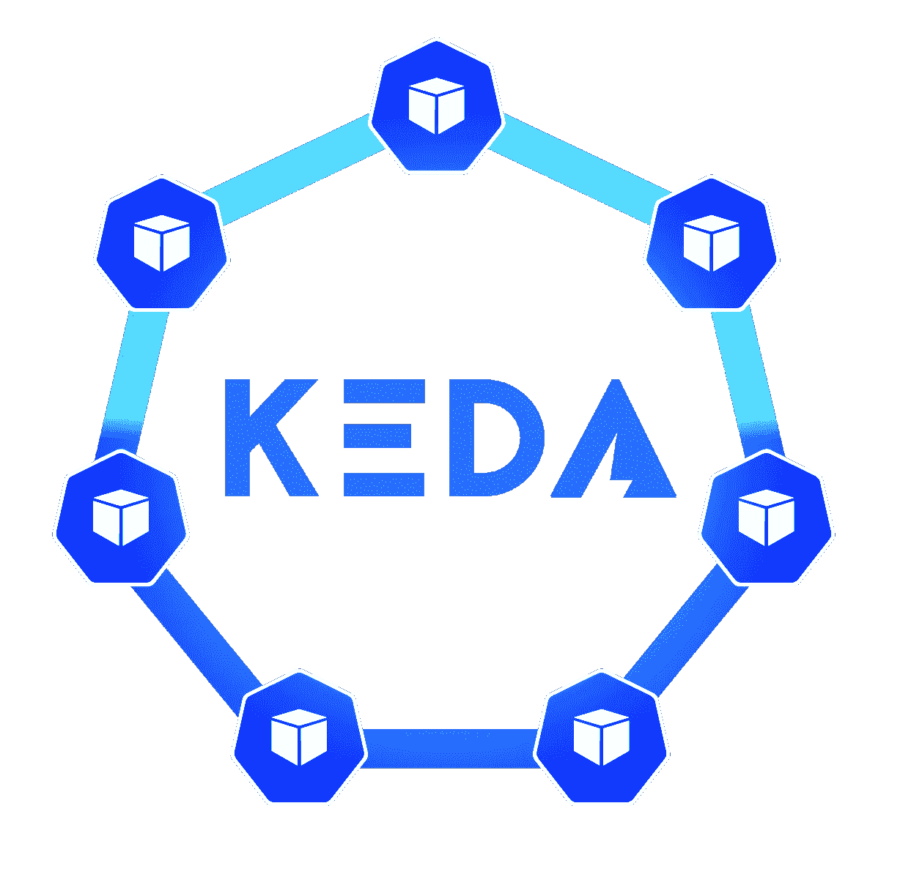
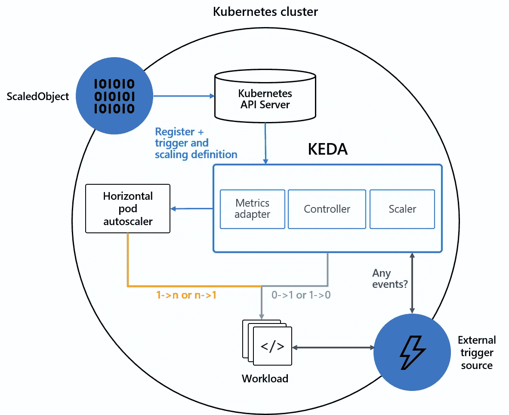
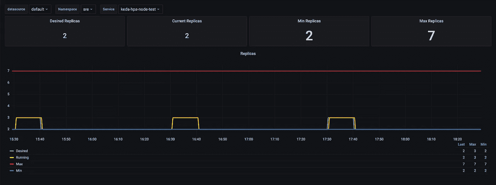
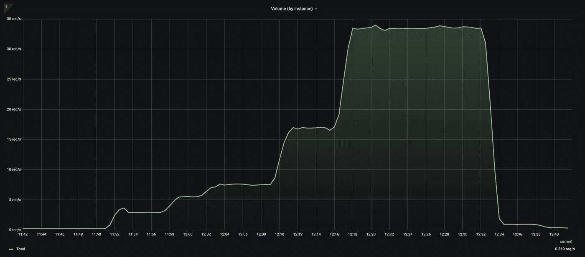
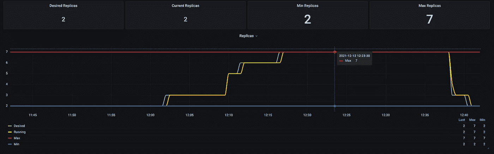

# 事件驱动的自动缩放

> 原文：<https://itnext.io/event-driven-autoscaling-503b5cefaa49?source=collection_archive---------4----------------------->



数据是宝贵的资产。收集、管理和使用信息的能力给企业带来了竞争优势。当一家公司采用“数据驱动”方法时，这意味着**它根据数据分析和解释做出战略决策**。数据驱动的方法使公司能够检查和使用他们的数据，以更好地服务于他们的成员和消费者的需求。

# 自动缩放服务

**事件**已经成为一个微服务需要向另一个传递信息时的常用方法。根据生成事件的性质，一天中的交易量可能持平，也可能非常不规则。拥有独立扩展生产者/消费者以适应这些变化的能力至关重要。

Kubernetes 提供了一种水平自动缩放服务的方式，即**水平 Pod 自动缩放器。**水平 Pod 自动缩放器根据观察到的 CPU 或内存利用率，自动缩放部署、副本集或有状态集中的 Pod 数量。或者，在[自定义指标](https://git.k8s.io/community/contributors/design-proposals/instrumentation/custom-metrics-api.md)的支持下，您可以基于其他一些应用程序提供的指标进行扩展。

虽然 HPA 是一个很好的起点，并且它在 CPU 和内存指标方面都非常好，但是如果您想要基于自定义或外部指标进行扩展，它有其局限性。或者像我们一样需要基于时间的缩放。HPA 也不允许将部署规模缩减到零。

对于 HTTP 工作负载，CPU /内存使用自动伸缩通常就足够了。对于非 HTTP 工作负载，您可能希望基于其他指标进行自动伸缩，例如，队列中挂起的工作量。

# 介绍 KEDA

KEDA 是一个基于 Kubernetes 的事件驱动自动缩放器。使用 KEDA，您可以根据需要处理的事件数量来扩展 Kubernetes 中的任何容器。KEDA 与标准 Kubernetes 组件一起工作，如[水平 Pod 自动缩放器](https://kubernetes.io/docs/tasks/run-application/horizontal-pod-autoscale/)，可以扩展功能而无需覆盖或复制。

您可以将 KEDA 视为各种系统的度量适配器。这很重要，因为 Kubernetes 只允许您在集群中运行这些适配器中的一个。所以，如果你想使用普罗米修斯和另一个没有 KEDA 的系统，你需要 2 个适配器，这是不可能的。

您可以从一系列[预定义触发器](https://keda.sh/#scalers)(也称为**缩放器**)中进行选择，这些触发器充当自动缩放部署(或`Job`)的事件和指标的来源。这些可以被认为是适配器，包含连接到外部源(例如 Kafka、Redis、ActiveMQ)的必要逻辑，并获取驱动自动缩放操作所需的指标。

使用[舵](https://keda.sh/docs/deploy/#helm)或通过[操纵器毂](https://keda.sh/docs/deploy/#operatorhub)可以很容易地部署 KEDA。

## KEDA 是如何运作的

KEDA 在 Kubernetes 担任两个关键角色:

1.  **代理** — KEDA 激活和停用 Kubernetes [部署](https://kubernetes.io/docs/concepts/workloads/controllers/deployment)以在无事件时从零扩展到零。这是安装 KEDA 时运行的`keda-operator`容器的主要角色之一。
2.  **指标** — KEDA 充当 [Kubernetes 指标服务器](https://github.com/kubernetes-sigs/metrics-server)，向水平 Pod 自动缩放器公开丰富的事件数据，如队列长度或流延迟，以推动横向扩展。度量服务是安装 KEDA 时运行的`keda-operator-metrics-apiserver`容器的主要角色。



KEDA 建筑。keda.sh 摄

KEDA 与多个[缩放器](https://keda.sh/docs/scalers/)(事件源)集成，并使用自定义资源定义(CRD)来定义所需/期望的缩放行为和参数。这些自定义资源使您能够将事件源映射到部署、状态集、自定义资源或作业，以便进行扩展。

安装 KEDA 时，会创建四个自定义资源:

*   `scaledobjects.keda.sh`
*   `scaledjobs.keda.sh`
*   `triggerauthentications.keda.sh`
*   `clustertriggerauthentications.keda.sh`

这些自定义资源使您能够将事件源(即 SQS、ActiveMQ)映射到部署、状态集、自定义资源或作业以进行扩展。

*   `ScaledObjects`表示事件源和 Kubernetes 部署、StatefulSet 或任何定制资源之间的期望映射。`ScaledObject`定义了您想要自动缩放的内容，以及您想要自动缩放的方式或时间。
*   `ScaledJobs`表示事件源和 Kubernetes 作业之间的映射。
*   `ScaledObject` / `ScaledJob`也可以引用一个`TriggerAuthentication`或`ClusterTriggerAuthentication`来监控事件源，其中包含认证配置或秘密。

KEDA 监控`ScaledObjects` / `ScaledJobs`中定义的事件源，并将信息反馈给 HPA，以便 HPA 根据源中的事件按需扩展对象/作业。

KEDA 还具有将**扩展到零**的能力，这对于 HPA 是不可能的(至少需要 1 个吊舱)。KEDA 通过删除 HPA 对象并将工作负载缩减为零来实现这一点。一旦我们从 0 到 1，KEDA 就会反其道而行之，即将工作负载调整回 1，并重新创建 HPA，HPA 会接管并决定 1 是否足够，或者是否应该增加到一个更高的数字，直至达到定义的最大值。这是构建经济高效的应用程序的好方法。

# 监测 KEDA

可以通过 Kubernetes 事件、HPA 指标以及 Prometheus 指标对 KEDA 进行**监控**，以便可以监控和调整自动扩展活动，从而找到成本、时间和性能之间的最佳平衡点。

# KEDA 用例

## 用例 1:普罗米修斯定标器

该规范描述了基于普罗米修斯指标扩展的`prometheus`触发器:

```
apiVersion: keda.sh/v1alpha1
kind: ScaledObject
metadata:
  name: my-app-scaledobject
  namespace: my-namespace
spec:
  scaleTargetRef:
    name: my-app
    kind: Deployment
  pollingInterval: 15
  minReplicaCount: 2
  maxReplicaCount: 8
  triggers:
  - type: prometheus
    metadata:
      serverAddress: http://<prometheus-host>:9090
      metricName: istio_requests_total
      threshold: '3'
      query: sum(rate(istio_requests_total{reporter="source", destination_service_name="my-app"}[1m]))
```

分解配置:

*   它通过 my-app 的`name`瞄准了一个`Deployment`。
*   它实现了类型为`prometheus`的触发器。Prometheus `serverAddress`用于使用`query`中指定的 PromQL 表达式查询 Prometheus，频率由`pollingInterval`指定。
*   `minReplicaCount`指定 Kubernetes 将运行的 pod 的最小数量，而`maxReplicaCount`指定最大数量。
*   `threshold`值用作向上或向下扩展部署的触发器。

KEDA 将查询结果与阈值进行比较，并将采取适当的措施(扩大、缩小或保持相同数量的副本)。

重要的是要理解，在根据`threshold.` 进行评估之前，查询的结果除以当前副本的数量。例如，在上面的示例中，在查询的结果超过 6 之前，`Deployment`不会扩大到 3 个副本。另一方面，部署永远不会缩减到低于`minReplicaCount`值。

## 用例 2: Cron Scaler

下面的规范展示了一个带有`cron`触发器的`ScaledObject`，它基于 Cron 调度进行伸缩。

```
apiVersion: keda.sh/v1alpha1
kind: ScaledObject
metadata:
  name: my-app-scaledobject
  namespace: default
spec:
  scaleTargetRef:
    kind: Deployment
    name: my-app
  pollingInterval: 30
  triggers:  
  - type: cron
    metadata:
      desiredReplicas: "8"
      end: 0 6 * * *
      start: 0 0 * * *
      timezone: Europe/London
```

分解配置:

*   它的目标是一个名为 my-app 的`Deployment`。
*   部署将在`start`时间缩放到`desiredReplicas`，并将在`end`时间缩放回`Deployment`资源中指定的副本数量。
*   时间基于欧洲/伦敦`timezone`。

> 有效时区列表可在[这里](https://en.wikipedia.org/wiki/List_of_tz_database_time_zones)找到。

## 用例 3: CPU /内存缩放器

虽然您可以直接使用 HPA 实现 CPU/内存自动缩放，但是 KEDA 允许您设置一个`cpu` / `memory`触发器，例如使用`cron`触发器。

以下示例实现了两个触发器:`cpu`和`memory`。

```
apiVersion: keda.sh/v1alpha1
kind: ScaledObject
metadata:
  name: my-app-scaledobject
  namespace: default
spec:
  scaleTargetRef:
    name: my-app
  triggers:
  - type: cpu
    metadata:
      type: Utilization
      value: "90"
  - type: memory
    metadata:
      type: AverageValue
      value: "1500Mi"
```

在每个触发器中:

*   `type`设置要使用的度量类型。选项有`Utilization`或`AverageValue`。
*   `value`为:
    **–**设置触发缩放操作的值，当使用`Utilization`时，目标值是所有相关 pod 的资源指标的平均值，**表示为 pod 的**请求的**资源值的百分比**。
    **–**使用`AverageValue`时，目标值是所有相关 pod(数量)的指标平均值的目标值。

> 理解`Utilization`使用**请求的**CPU/内存值，而不是**限制**很重要。

用于计算所需副本数量的算法如下:

```
desiredReplicas = ceil[currentReplicas * ( currentMetricValue / desiredMetricValue )]
```

例如，如果`cpu`触发器的当前度量值是`80`，阈值是`40`，副本的数量将加倍:`80 / 40 == 2.0`

另一方面，如果当前值改为`20`，我们将副本的数量减半:`20 / 40 == 0.5`。

如果比率足够接近 1.0(在全局可配置的容差范围内，来自`--horizontal-pod-autoscaler-tolerance`标志，默认为 0.1)，我们将跳过缩放。理解这种行为以避免混淆是很重要的。考虑下面的例子:

```
apiVersion: keda.sh/v1alpha1
kind: ScaledObject
metadata:
  name: my-app-scaledobject
  namespace: default
spec:
  scaleTargetRef:
    name: my-app
  maxReplicaCount: 35
  minReplicaCount: 25
  pollingInterval: 30
  triggers:
  - type: memory
    metadata:
      type: AverageValue
      value: "90"
```

其中:

```
**apiVersion**: v1
**kind**: Pod
**metadata**:
  **name**: my-app
  **namespace**: default
**spec**:
  **containers**:
    ...
    **resources**:
      **limits**:
        **memory**: "1500Mi"
      **requests**:
        **memory**: "1500Mi"
```

`currentMetricValue`是通过对 HorizontalPodAutoscaler 的缩放目标中的所有窗格取给定指标的平均值来计算的。让我们想象一下`currentMetricValue`是`1250Mi`而`currentReplicas`是`30`。

```
desiredReplicas = ceil[30 * ( 1250 / 1500*0.9 )] = ceil[30 * (0.92)] = ceil[27.6] = 28
```

即使公式给出的`desiredReplicas`值为 28，而`currentReplicas`值为 30，也不会有任何缩放活动，因为比率非常接近 1 (0.92)，并且在前面讨论的 0.1 默认容差范围内。

**用例 4:组合定标器**

如**用例 3** 所述，KEDA 允许您将 CPU/内存触发器与任何其他可用的触发器相结合。以下`ScaledObject`结合了一个`cron`触发器和两个`cpu`和`memory`触发器:

```
apiVersion: keda.sh/v1alpha1
kind: ScaledObject
metadata:
  name: my-app-scaledobject
  namespace: default
spec:
  maxReplicaCount: 35
  minReplicaCount: 25
  pollingInterval: 30
  scaleTargetRef:
    apiVersion: apps/v1
    kind: Deployment
    name: my-app
  triggers:
  - type: cron
    metadata:
      desiredReplicas: "30"
      end: 0 6 * * *
      start: 0 0 * * *
      timezone: Europe/London
  - type: cpu
    metadata:
      type: Utilization
      value: "90"
  - type: memory
    metadata:
      type: Utilization
      value: "90"
```

让我们再一次分解配置:

*   它的目标是一个名为 my-app 的`Deployment`。
*   它实现了三个触发器:`cron`、`cpu`、`memory`(这三个我们在前面的例子中都已经讲过了，所以不再解释了)。
*   在任何时间点，部署扩展到的副本数量都是任何触发器所需的最高副本数量。例如，午夜和早上 6 点之间的副本数量将是 30，除非根据`cpu` / `memory`值需要更多。

# KEDA 实例

让我们看看 KEDA 的行动吧！下面的`ScaledObject`以名为 my-app 的`Deployment`为目标，结合了一个`prometheus`和一个`cron`触发器:

```
apiVersion: keda.sh/v1alpha1
kind: ScaledObject
metadata:
  name: my-app
  namespace: sre
spec:
  maxReplicaCount: 7
  minReplicaCount: 2
  pollingInterval: 15
  scaleTargetRef:
    apiVersion: apps/v1
    kind: Deployment
    name: my-app
  triggers:
  - type: prometheus
    metadata:
      metricName: http_requests_total
      query: sum(rate(http_requests_total{app="my-app"}[1m]))
      serverAddress: http://po-prometheus.monitoring:9090
      threshold: "3"
  - type: cron
    metadata:
      desiredReplicas: "3"
      start: 30 * * * *
      end: 35 * * * *
      timezone: Europe/London
```

根据每秒收到的请求数，部署将在 2 到 7 个副本之间扩展。根据`cron`触发器，从第 30 分钟到第 35 分钟，部署还将扩展到每小时 3 个副本。



显示 cron 触发器运行的 Grafana 仪表板

如果您仔细观察前面的图像，您会看到部署在第 40 分钟而不是第 35 分钟缩小。这是 HPA 的默认行为:逐步缩小规模，消除快速波动的指标值的影响。`--horizontal-pod-autoscaler-downscale-stabilization`标志控制这种行为，默认为 5 分钟。

描述 HPA 对象将向您展示正在发生的自动缩放事件:

```
Type    Reason             Age    From           Message                                                                                                                                                      
----    ------             ----   ----           -------                                                                                                                                                      
Normal  SuccessfulRescale  16m (x47 over 46h)    horizontal-pod-autoscaler  New size: 3; reason: external metric cron-Europe-London-30xxxx-35xxxx(&LabelSelector{MatchLabels:map[string]string{scaledobject.keda.sh/name: my-app,},MatchExpressions:[]LabelSelectorRequirement{},}) above target Normal  SuccessfulRescale  7m3s (x263 over 10d)  horizontal-pod-autoscaler  New size: 2; reason: All metrics below target
```

现在让我们发送一些流量来测试`prometheus`触发器。我们将运行一个负载测试，在我们的应用程序中生成一些流量，我们将逐渐增加 **req/s** 来观察 KEDA 的行为:



我的应用程序接收的流量



在我的应用中扩展活动

我们在图表中看到的是:

*   在开始负载测试之前，副本的数量等于`minReplicaCount`，即 2。
*   每秒发送 3 个请求不会触发任何扩展活动。
*   第一次扩展活动是在 12:02 左右触发的，当时我们达到了 6.5 req/s。由于我们的`threshold`设置为 3，`6.5 / 3 = 2.1 ~ 3`。
*   12:09 左右，我们将负载增加到 17 req/s:，部署扩展到 6 个 pod:`17 / 3 = 5.6 ~ 6`。
*   12 点 18 分，我们将负载增加到 33.5 req/s。在这种情况下，我们需要`33.5 / 3 = 11.1 ~ 12`吊舱。然而，我们将`maxReplicaCount`设置为 7，因此部署扩展到 7 个副本。
*   12:32 我们停止了负载测试，req/s 下降到 0.9。由于前面解释过的`--horizontal-pod-autoscaler-downscale-stabilization`标志，副本的数量直到 5 分钟后才减少。
*   部署最终缩减到`minReplicaCount`，因为没有一个触发器是活动的。

Kubernetes 为上述所有扩展活动生成事件，如果您描述这个特定部署的 HPA 对象，就可以找到这些事件:

```
Type     Reason      Age      From            Message
----     ------      ----     ----            -------
Normal   SuccessfulRescale    38m (x3 over 7d)    horizontal-pod-autoscaler  New size: 3; reason: external metric prometheus-http---po-prometheus-monitoring-9090-http_requests_total(&LabelSelector{MatchLabels:map[string]string{scaledobject.keda.sh/name: my-app,},MatchExpressions:[]LabelSelectorRequirement{},}) above targetNormal   SuccessfulRescale             30m (x2 over 2d)    horizontal-pod-autoscaler  New size: 5; reason: external metric prometheus-http---po-prometheus-monitoring-9090-http_requests_total(&LabelSelector{MatchLabels:map[string]string{scaledobject.keda.sh/name: my-app,},MatchExpressions:[]LabelSelectorRequirement{},}) above targetNormal   SuccessfulRescale             28m (x2 over 2d)    horizontal-pod-autoscaler  New size: 6; reason: external metric prometheus-http---po-prometheus-monitoring-9090-http_requests_total(&LabelSelector{MatchLabels:map[string]string{scaledobject.keda.sh/name: my-app,},MatchExpressions:[]LabelSelectorRequirement{},}) above targetNormal   SuccessfulRescale             23m                 horizontal-pod-autoscaler  New size: 7; reason: external metric prometheus-http---po-prometheus-monitoring-9090-http_requests_total(&LabelSelector{MatchLabels:map[string]string{scaledobject.keda.sh/name: my-app,},MatchExpressions:[]LabelSelectorRequirement{},}) above targetNormal   SuccessfulRescale             2m30s               horizontal-pod-autoscaler  New size: 4; reason: All metrics below target Normal   SuccessfulRescale             2m15s (x2 over 7d)  horizontal-pod-autoscaler  New size: 3; reason: All metrics below target Normal   SuccessfulRescale             9s (x264 over 10d)  horizontal-pod-autoscaler  New size: 2; reason: All metrics below target
```

# 结论

正如我们所看到的，KEDA 通过管理与外部资源的集成扩展了 Kubernetes 的功能，允许您基于来自内部和外部指标的数据自动扩展您的 Kubernetes 部署。KEDA 消除了不能在一个集群中运行多个适配器的限制。如果需要，它还允许您将工作负载扩展到零。