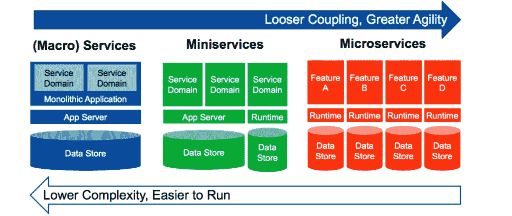
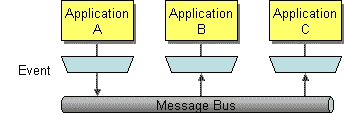
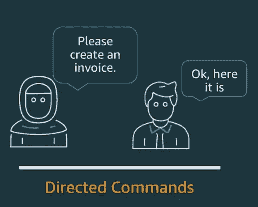
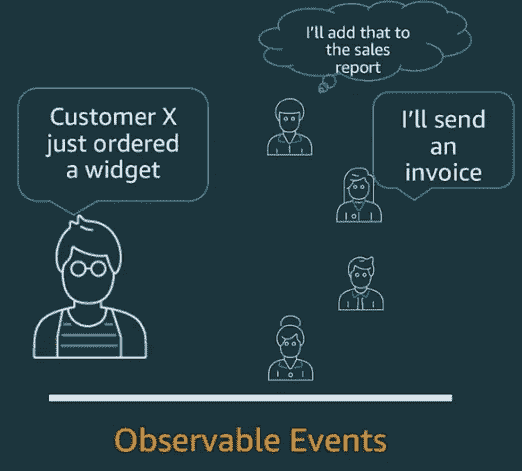

# 事件驱动的微服务:实现进化发展

> 原文：<https://itnext.io/event-driven-microservices-achieving-evolutionary-development-278c18caf6a3?source=collection_archive---------4----------------------->

雨果·赫塞尔拍摄的图片

# 应用增长的解决方案

所有的软件都是从一个单一的想法开始的，并且在这个想法的基础上，软件需要扩展。这篇文章将描述如何使用事件驱动的微服务来最好地发展您的应用，并解释每个决策的优势。

# 硬件扩展

随着应用程序中软件的增长，它最终会达到服务器所能提供的极限。需要决定硬件如何随应用程序扩展。有两种解决方案:

*   垂直扩展—一台更大、功能更强的服务器。
*   水平扩展—多个较小的服务器，应用程序分布在这些服务器上。

## 水平缩放的优势

*   成本更低—许多小型服务器比 1 台大型服务器更便宜。
*   可靠性—其他地方的峰值不会影响本地服务器。
*   无限扩展—垂直扩展的上限是您能找到的最大服务器，水平扩展的上限是您能添加越来越多的服务器。

水平缩放通常是首选方法。

# 如何拆分应用程序

决定使用多台服务器后，您需要考虑将应用程序分散到这些服务器上。那么我们该怎么做呢？

## 选项 1:微型服务，也称为模块化整体:

这被定义为一套**依赖的模块化服务**，意味着这些服务相互依赖。如果一个服务有问题，那么整个系统都有问题。

该选项具有整个企业的范围，使得难以扩展软件，更新影响系统的多个部分，并且使得开发者难以理解和测试。该选项通常使用同步通信，这意味着一个函数在执行前必须等待第一个函数完成。然而，该选项也更容易运行，并且具有较低的复杂性。这是一个分布式架构。

## **选项 2:微服务:**

[Martin Fowler](https://martinfowler.com/) 将微服务定义为**“可独立部署的服务套件”**。这意味着它还可以独立扩展，节省资金和资源，将故障隔离限制在一项服务中，并且不受技术限制，可以防止供应商锁定。

该选项具有单个业务域的范围，提供松散耦合，并且每个服务都有一个固定的模块边界。由于这些界限，每个服务由一个特定的团队拥有和管理变得非常容易。该选项通常使用异步通信，这意味着功能可以同时执行。该选项采用了一种渐进的设计，使得添加更多服务变得容易，并允许更大的灵活性。这是一个集成架构。

图片由 Gartner 提供

# 微服务应该有多大？

在决定微服务后，我们需要考虑规模，微服务的规模应该根据认知负载来考虑。

> “认知负荷:用于工作记忆的脑力劳动总量”。约翰·斯威勒

[Daniel Terhorst-North](https://twitter.com/tastapod) 说微服务应该是“适合你头脑的软件”的大小，根据[团队拓扑](https://teamtopologies.com/)的教导，你应该“将软件服务的大小限制在团队可以处理的认知负荷之内”。这意味着更少的错误、所有权和更易理解的代码。

# 分什么

我们需要找到产品的接缝。从商业角度来看，它们自然属于哪一类？使用领域驱动设计——软件代码的结构和语言应该与业务领域相匹配的概念。

需要有一个团队优先的软件边界方法，其中服务必须由一个团队拥有，考虑到康威定律:

> “组织被迫生产应用程序设计，这是他们的通信结构的副本”——康威定律

相反，使用“逆康威定律”——进化你的团队和组织结构，以促进你想要的架构。理想情况下，您的技术架构将显示出与您的业务架构的同构。

# 如何集成服务

既然我们已经将应用程序拆分为服务，那么我们需要将这些服务集成在一起，以便它们能够通信。有 4 种集成服务的常见方法。

*   文件传输—将数据写入文件，然后将其发送给另一个服务进行读取。
*   共享数据库—所有服务存储和访问数据的一个数据库。
*   远程过程调用(RMI) /远程过程调用(RPC)——向另一个服务上的函数发送数据并接收输出。
*   消息传递——将数据发送到消息总线，然后消息总线负责将数据异步转发到其他服务。

图片由 enterpriseintegrationpatterns.com 拍摄

## 使用消息传递的优势

*   异步可靠交付——我们可以信任消息总线发出消息，并同时将它们发送给不同的服务。
*   发送并忽略——源服务只负责将消息发送到消息总线，然后就可以忽略它了。
*   通用连接性——消息总线具有与许多不同服务的内置连接性，应该易于集成。
*   无过载—接收方控制其消耗请求的速率，因此服务不会过载。
*   断开连接的操作——不依赖任何其他东西，客户端仍然可以访问消息总线。
*   支持使用事件源—对应用程序状态的所有更改都存储为一系列事件。

# 整合问题

集成服务有 3 个主要问题:

1.  网络不可靠且速度慢。
2.  任何两个应用程序都是不同的。
3.  变化是不可避免的——应用程序确实会随着时间而变化。

## **我们选择消息传递是因为:**

它比文件传输更直接，比共享数据库封装得更好，比远程过程调用更可靠。

# 什么是事件驱动架构？

AWS 将事件驱动架构定义为“使用事件在解耦的服务之间触发和通信”。我们通过微服务创建一个事件，将其发送到我们的消息总线，然后将其发送到其他解耦的微服务，触发一些操作来实现这一点。

事件驱动架构和其他架构的明显区别在于事件是可观察的，而不是可控制的。这使我们能够拥有清晰的边界，并且可以在不知道其他服务的情况下同时执行多个功能。

图片由 AWS 提供——詹姆斯·贝斯维克

图片由 AWS 提供——詹姆斯·贝斯维克

## 事件驱动架构有 4 个组件:

*   事件制作者
*   事件总线
*   事件路由器
*   事件消费者

事件生成器创建发送到事件总线的事件。然后，事件路由器将事件定向到适当的事件消费者。

在 AWS 中，您可以通过使用 Amazons EventBridge 服务来重新创建它。事件生产者被称为事件源，事件消费者被称为目标，事件路由器被称为规则，您配置一个规则来触发来自事件源的事件模式，然后路由到目标。

# 进化发展

> 最终，我们今天写的是明天的遗留代码，所以让它进化吧！

上面的步骤已经为我们实现进化开发做好了准备，通过利用**扼杀者模式**，使用事件路由器向新服务和旧服务发送数据，我们可以在不威胁遗产的情况下进化我们的软件。

> **扼杀者模式**是一种渐进地迁移遗留系统的方法，通过分阶段地用新的应用程序和服务替换现有的功能

我曾与许多在高压下设计和建造的系统一起工作过，尽管它们符合所有的验收标准，但很少有人考虑接下来会发生什么。人们更容易接受这样的想法，即项目完成了，需求列表结束了，就好像业务处于需要恢复正常的不稳定状态。为了开发成功的软件，我们需要更加适应变化的标准状态，始终关注不断变化的环境带来的好处。通过这种方式，可以用更少的努力从技术中获得更多的价值，这就是为什么你需要一个进化的架构。它使您能够快速、独立地构建想法，而不会威胁到遗产，因此您可以在客户面前获得最佳想法，并更快地开始实现收益。