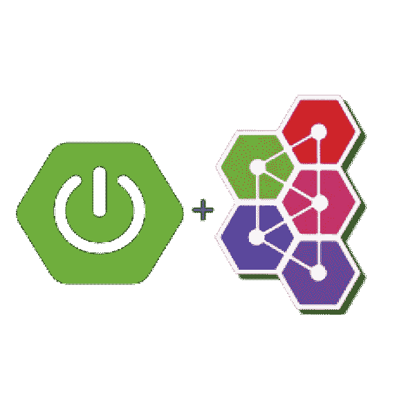
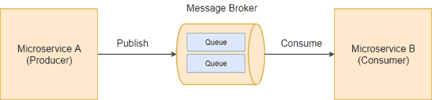
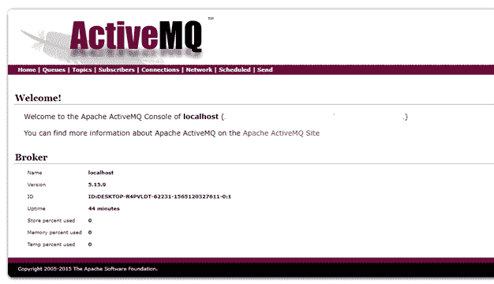
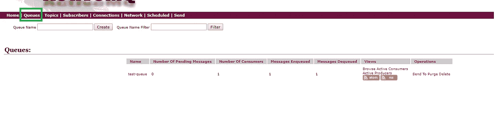
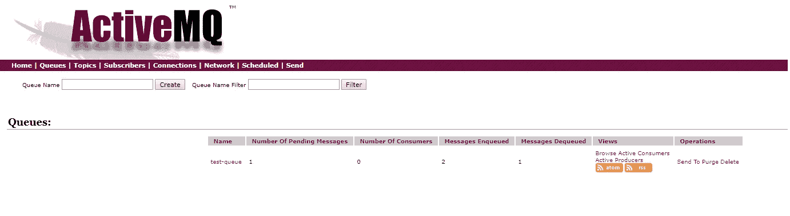
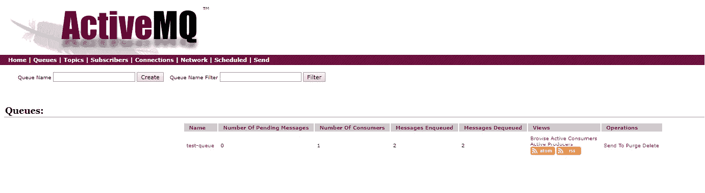

# 使用 Spring Boot 和 ActiveMQ 的事件驱动微服务

> 原文：<https://itnext.io/event-driven-microservices-with-spring-boot-and-activemq-5ef709928482?source=collection_archive---------0----------------------->

微服务之间的大多数通信要么通过 HTTP 请求-响应 API，要么通过异步消息传递。虽然这两种机制是最常用的，但它们非常不同。知道何时使用哪种机制很重要。



Spring Boot 和 ActiveMQ

当跨多个微服务及其相关领域模型传播变更时，事件驱动的通信非常重要。这意味着当变化发生时，我们需要某种方法来协调不同模型之间的变化。这确保了可靠的通信以及微服务之间的松散耦合。

有多种模式可以实现事件驱动的架构。其中一个常见和流行的是消息模式。这是极其**可伸缩的**，灵活且有保证的消息传递。有几个工具可以用于消息传递模式，比如 RabbitMQ、ActiveMQ、Apache Kafka 等等。



消息模式

在本文中，我们将使用 Spring Boot 构建微服务，并且我们将设置 ActiveMQ 消息代理在微服务之间进行异步通信。

# 构建微服务

让我们创建两个 Spring Boot 项目“activemq 发送者”和“activemq 接收者”。下面是示例项目结构。


示例项目结构

我们需要添加 maven 依赖*spring-boot-starter-activemq*来启用 ActiveMQ。下面是一个 pom.xml 示例。

```
<?xml version="1.0" encoding="UTF-8"?>
<project 
         xmlns:xsi="http://www.w3.org/2001/XMLSchema-instance"
         xsi:schemaLocation="http://maven.apache.org/POM/4.0.0 http://maven.apache.org/xsd/maven-4.0.0.xsd">
    <modelVersion>4.0.0</modelVersion>

    <groupId>com.techshard.activemqsender</groupId>
    <artifactId>activemq-sender</artifactId>
    <version>1.0-SNAPSHOT</version>

    <parent>
        <groupId>org.springframework.boot</groupId>
        <artifactId>spring-boot-starter-parent</artifactId>
        <version>2.1.6.RELEASE</version>
        <relativePath />
    </parent>

    <properties>
        <project.build.sourceEncoding>UTF-8</project.build.sourceEncoding>
        <project.reporting.outputEncoding>UTF-8</project.reporting.outputEncoding>
    </properties>

    <dependencies>
        <dependency>
            <groupId>org.springframework.boot</groupId>
            <artifactId>spring-boot-starter-web</artifactId>
        </dependency>
        <dependency>
            <groupId>org.springframework.boot</groupId>
            <artifactId>spring-boot-starter-activemq</artifactId>
        </dependency>
    </dependencies>

</project>
```

# 配置发布者

在项目 *activemq-sender* 中，我们将首先配置一个队列。按如下方式创建 JmsConfig 类。

```
package com.techshard.activemq.configuration;import org.apache.activemq.command.ActiveMQQueue;
import org.springframework.context.annotation.Bean;
import org.springframework.context.annotation.Configuration;
import org.springframework.jms.annotation.EnableJms;import javax.jms.Queue;@Configuration
public class JmsConfig { @Bean
    public Queue queue(){
        return new ActiveMQQueue("test-queue");
    }
}
```

上面的类只声明了一个 bean *队列*，我们的队列名称应该是 *test-queue。*注意，队列名称也可以从应用程序属性中读取。这只是一个例子。

现在，让我们创建一个 REST API，用于将消息发布到队列。

```
package com.techshard.activemq.controller;

import org.springframework.beans.factory.annotation.Autowired;
import org.springframework.http.HttpStatus;
import org.springframework.http.ResponseEntity;
import org.springframework.jms.core.JmsTemplate;
import org.springframework.web.bind.annotation.GetMapping;
import org.springframework.web.bind.annotation.PathVariable;
import org.springframework.web.bind.annotation.RequestMapping;
import org.springframework.web.bind.annotation.RestController;

import javax.jms.Queue;

@RestController
@RequestMapping("/api")
public class MessageController {

    @Autowired
    private Queue queue;

    @Autowired
    private JmsTemplate jmsTemplate;

    @GetMapping("message/{message}")
    public ResponseEntity<String> publish(@PathVariable("message") final String message){
        jmsTemplate.convertAndSend(queue, message);
        return new ResponseEntity(message, HttpStatus.OK);
    }

}
```

在控制器中，我们将注入之前声明的 bean 队列，我们还将注入 *JmsTemplate。*

为了通过 JMS 发送或接收消息，我们需要建立到 JMS 提供者的连接并获得会话*。JmsTemplate* 是一个帮助器类，它简化了通过 JMS 发送和接收消息，并摆脱了样板代码。

我们现在已经创建了一个简单的 API 端点，它将接受 string 作为参数并将其放入队列。

# 配置消费者

在项目 *activemq-receiver* 中，创建如下组件类:

```
package com.techshard.activemq.consumer;

import org.slf4j.Logger;
import org.slf4j.LoggerFactory;
import org.springframework.jms.annotation.EnableJms;
import org.springframework.jms.annotation.JmsListener;
import org.springframework.stereotype.Component;

@Component
@EnableJms
public class MessageConsumer {

    private final Logger logger = LoggerFactory.getLogger(MessageConsumer.class);

    @JmsListener(destination = "test-queue")
    public void listener(String message){
        logger.info("Message received {} ", message);
    }
}
```

在这个类中，我们已经用 *@JmsListener* 注释了方法，并且我们已经传递了我们在发布者中配置的队列名称 *test-queue* 。@JmsListener 用于监听任何放入队列*测试队列的消息。*

注意，我们用 *@EnableJms 注释了类。*正如 Spring 文档中所说的 *"* `*@EnableJms*` *允许检测容器中任何 Spring 管理的 bean 上的* `[JmsListener](https://docs.spring.io/spring/docs/current/javadoc-api/org/springframework/jms/annotation/JmsListener.html)` *注释。*”

这里有趣的一点是，即使没有 *@EnableJms* 注释，Spring Boot 也能检测到这些方法。此问题已在[*stack overflow*](https://stackoverflow.com/questions/45796021/how-does-spring-look-for-enablejms-methods-if-i-dont-have-class-marked-enable)中报告。

# 创建 Spring Boot 应用程序

在这两个项目中，创建一个用 *@SpringBootApplication* 注释的*应用程序*类，如下所示。

```
package com.techshard.activemq;

import org.springframework.boot.SpringApplication;
import org.springframework.boot.autoconfigure.SpringBootApplication;
import org.springframework.boot.web.servlet.support.SpringBootServletInitializer;

@SpringBootApplication
public class Application extends SpringBootServletInitializer {

    public static void main(String[] args) {
        SpringApplication.run(Application.class, args);
    }
}
```

# 安装 ActiveMQ

我在这里下载[安装了 ActiveMQ。我们也可以使用 Spring Boot 的嵌入式 ActiveMQ 进行测试。安装完成后，ActiveMQ 服务器应该可以在](https://activemq.apache.org/components/classic/download/)[http://localhost:8161/admin](http://localhost:8161/admin)上找到，我们会看到下面的欢迎页面。



ActiveMQ 主页

# 配置 ActiveMQ

在这两个项目中，创建 *application.properties* 文件，并添加以下属性。

```
spring.activemq.broker-url=tcp://localhost:61616
spring.activemq.user=admin
spring.activemq.password=admin
```

ActiveMQ 支持多种[协议](https://activemq.apache.org/protocols)来连接到消息代理。在本例中，我们将使用 OpenWire 协议。

就是这样！

# 测试 ActiveMQ

在运行应用程序之前，请确保更改其中一个项目的服务器端口。默认情况下，嵌入式 tomcat 服务器运行在端口 8080 上。

运行这两个应用程序并运行 URL[http://localhost:8080/API/message/Welcome to ActiveMQ！](http://localhost:8080/api/message/Welcome%20to%20ActiveMQ!)在浏览器或任何 REST API 测试工具中。

在消费者应用程序中，我们将在控制台中看到以下日志。

*2019–08–06 22:29:57.667 INFO 17608—[ener container-2]c . t . activemq . consumer . Message consumer:消息已收到欢迎使用 ActiveMQ！*

刚刚发生的是消息被放入队列。监听队列的消费者应用程序从队列中读取消息。

在 ActiveMQ 仪表板中，导航到队列选项卡。我们可以看到详细信息，例如队列中的消费者数量、挂起、排队和出列的消息数量。



在本文的开始，我提到了消息代理保证消息的传递。假设消费者服务关闭，消息由发布者服务放到队列中。

停止应用程序 *activemq 接收器*。再次运行这个网址[http://localhost:8080/API/message/欢迎使用 ActiveMQ！](http://localhost:8080/api/message/Welcome%20to%20ActiveMQ!)在浏览器中。

导航到 ActiveMQ 仪表板并注意队列状态。



我们可以看到一条消息正在等待处理和排队。再次启动应用程序 *activemq-receiver* 。

一旦应用程序启动，我们将在控制台中显示以下消息。

*2019–08–06 22:54:32.667 INFO 17608—[ener container-2]c . t . activemq . consumer . Message consumer:消息已收到欢迎使用 ActiveMQ！*



挂起消息的数量现在设置为 0，出列消息的数量设置为 2。消息代理保证消息的传递。

# 结论

在本文中，我们刚刚看到了一个简单的消息传递模式示例。消息传递系统负责将数据从一个服务传输到另一个服务，因此服务可以专注于它们需要共享的数据，而不必担心如何共享数据。

我希望你喜欢这篇文章。如果你有任何意见或建议，请随时告诉我。

和往常一样，完整的代码可以在我的 [GitHub 库](https://github.com/swathisprasad/event-driven-microservices-with-springboot-activemq)中找到。

*本文原载于*[*Techshard.com*](https://techshard.com/2019/08/07/event-driven-microservices-with-spring-boot-and-activemq/)*。*