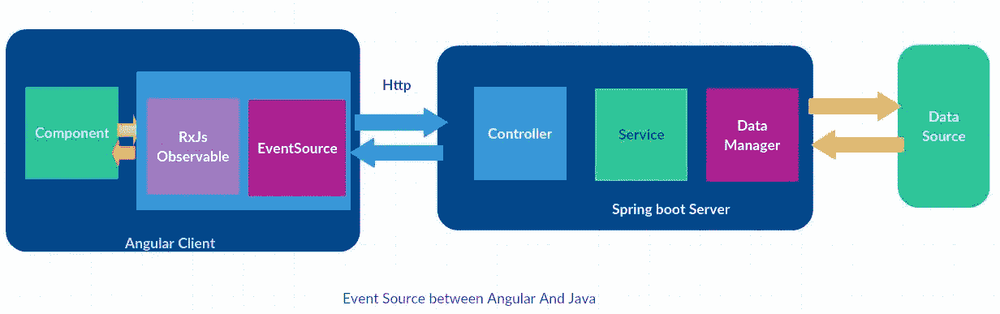

# 带角度的事件源

> 原文：<https://itnext.io/event-source-with-angular-c9f7f5369082?source=collection_archive---------1----------------------->

# 介绍

事件源是 SSE(服务器发送的事件)的一部分。它通过提供服务器与浏览器之间的单向通信，将数据推送到浏览器。这里，通信只在服务器和浏览器之间进行，浏览器不向服务器发送任何数据。

## 事件源示例

1.  网站上板球比分的自动更新。
2.  在线股票价格更新的自动更新。
3.  自动更新天气信息，如温度、湿度、降雨预报等。
4.  Twitter 更新时间表。



Angular 和 Java 之间的事件源(spring boot)

# **事件源或 SSE Vs Web-socket**

## *事件来源*

1.  它是服务器发送的通信，仅在服务器和 web 浏览器客户端之间进行。它支持单向通信。
2.  它不支持二进制。它只使用 UTF-8。
3.  它有一个最大的开放连接限制。
4.  它内置了对重新连接和事件 Id 的支持。

## *网络插座*

1.  它通过单个 TCP 连接提供双向全双工通信。
2.  数据可以从服务器传输到浏览器，反之亦然。网聊就是最好的例子。
3.  它支持任意二进制数据。

# **代码讨论**

*服务等级(弹簧启动)*

这里，服务类从某个数据源接收数据，并将其提供给控制器类，如下所示:

```
package com.myservice;import java.io.IOException;
import java.util.HashMap;
import java.util.Map;import org.springframework.cache.annotation.CachePut;
import org.springframework.cache.annotation.Cacheable;
import org.springframework.stereotype.Service;import com.fasterxml.jackson.databind.ObjectMapper;
import com.philips.models.WorkflowDataModel;[@Service](http://twitter.com/Service)
public class StatusInProgress { private static Map<String, String> storeData = new HashMap<String, String>();[@Override](http://twitter.com/Override)
 public void triggerEvent(MyDataModel eventData) {
  System.out.println("Display To Angular App");
  try {System.out.println(eventData.getPatientId());
   ObjectMapper mapper = new ObjectMapper();
   String jsonText = mapper.writeValueAsString(eventData);
   putPatient(jsonText);
  } catch (IOException e1) {
   e1.printStackTrace();
  }
 }[@CachePut](http://twitter.com/CachePut)(value = "myData")
 public void putMyData(String myData) {
  if (storeData.containsKey("mydata")) {
   storeData.remove("mydata");
  }storeData.put("mydata", patientData);
 }[@Cacheable](http://twitter.com/Cacheable)(value = "myData")
 public String getMyData() {
  String myitem= "";
  try {
   myitem = storeData.get("mydata");
  } catch (Exception e) {
  }return myitem;
 }
}
```

*控制器类(弹簧启动)*

控制器类从服务类接收数据，并通过 REST API 发出数据。它使用 SseEmitter。

```
package com.controller;import java.io.IOException;import org.springframework.beans.factory.annotation.Autowired;import org.springframework.stereotype.Controller;import org.springframework.web.bind.annotation.CrossOrigin;import org.springframework.web.bind.annotation.RequestMapping;import org.springframework.web.servlet.mvc.method.annotation.SseEmitter;import com.myservice;@Controllerpublic class MyDataController {@Autowiredprivate StatusInProgress statusInProgress;@CrossOrigin(exposedHeaders = "Access-Control-Allow-Origin")@RequestMapping(value = "/get_mydata")public SseEmitter getMyData() throws InterruptedException {SseEmitter notifier = new SseEmitter(600L);try {String myData = statusInProgress.getMyData();if (myData!= null && myData!= "") {notifier.send(SseEmitter.event().reconnectTime(500).data(myData));}} catch (IOException e) {e.printStackTrace();}return notifier;}}
```

*组件(角度 4)*

该组件类型脚本类从服务器订阅 API，如下所示:

```
import { Component, OnInit } from '[@angular/core](http://twitter.com/angular/core)';
import {Observable} from "rxjs";[@Component](http://twitter.com/Component)({
templateUrl: './app/home/home.html'
})export class HomeListComponent{
  myData: any;

    constructor(private airService: AIRadiologyService) {
    this.connect();
  }connect(): void {
    let source = new EventSource('[http://serverip:port/get_mydata'](http://serverip:port/get_mydata'));
    source.addEventListener('message', message => {
        this.myData = JSON.parse(message.data);        
    });
 }
}
```

# 结论

事件源非常适合用实时数据更新或刷新浏览器数据。这种协议非常简单，因为它不需要添加任何外部 JavaScript 库，从而提供了灵活性。JavaScript 本身提供了 EventSource 接口来接收服务器发送的实时数据或消息。