# Apache Kafka 与 Spring 的最终一致性:第 1 部分，共 2 部分

> 原文：<https://itnext.io/eventual-consistency-with-spring-for-apache-kafka-cfbbed450b5e?source=collection_archive---------1----------------------->

## 使用 Spring for Apache Kafka 跨多个微服务管理 MongoDB 中的分布式数据模型

假设一个现代的[分布式系统](https://en.wikipedia.org/wiki/Distributed_computing)由多个微服务组成，每个微服务拥有一个域集合数据的子集，那么这个系统几乎肯定会有一些数据重复。鉴于这种重复，我们如何保持数据的一致性？在这个[的两部分](/eventual-consistency-with-spring-for-apache-kafka-part-2-of-2-23bedd512ccf)的帖子中，我们将探索这个挑战的一个可能的解决方案——[阿帕奇卡夫卡](https://kafka.apache.org/)和[最终一致性](https://en.wikipedia.org/wiki/Eventual_consistency)的模型。

# 介绍

Apache Kafka 是一个开源的分布式事件流平台，能够处理数万亿条消息。根据最初被认为是消息队列的 [Confluent](https://www.confluent.io/what-is-apache-kafka) ，Kafka 基于分布式提交日志的抽象。自 2011 年由 LinkedIn 创建并开源以来，Kafka 已经从一个消息队列迅速发展成为一个成熟的事件流媒体平台。

根据[维基百科](https://en.wikipedia.org/wiki/Eventual_consistency)的说法，最终一致性是一种在分布式计算中使用的一致性模型，以实现高可用性，非正式地保证如果给定数据项没有新的更新，最终对该项目的所有访问都将返回上次更新的值。我之前在 2017 年 5 月的帖子[最终一致性:用 Spring AMQP 和 RabbitMQ 解耦微服务中，提到了使用 RabbitMQ 在分布式系统中实现最终一致性的话题。这篇文章出现在 Pivotal 的 RabbitMQ 网站上。](http://programmaticponderings.com/2017/05/15/eventual-consistency-decoupling-microservices-with-spring-amqp-and-rabbitmq/)

# 领域驱动设计

为了给讨论打下基础，让我们来看一个常见的例子——在线店面。使用[领域驱动设计(DDD)](https://en.wikipedia.org/wiki/Domain-driven_design) 方法，我们期望我们的[问题领域](https://en.wikipedia.org/wiki/Problem_domain)，在线店面，由多个[有界上下文](https://en.wikipedia.org/wiki/Domain-driven_design#Bounded_context)组成。有界上下文可能包括购物、客户服务、营销、安全、履行、会计等等，如下面的[上下文图](https://en.wikipedia.org/wiki/Domain-driven_design#Context_map)所示。

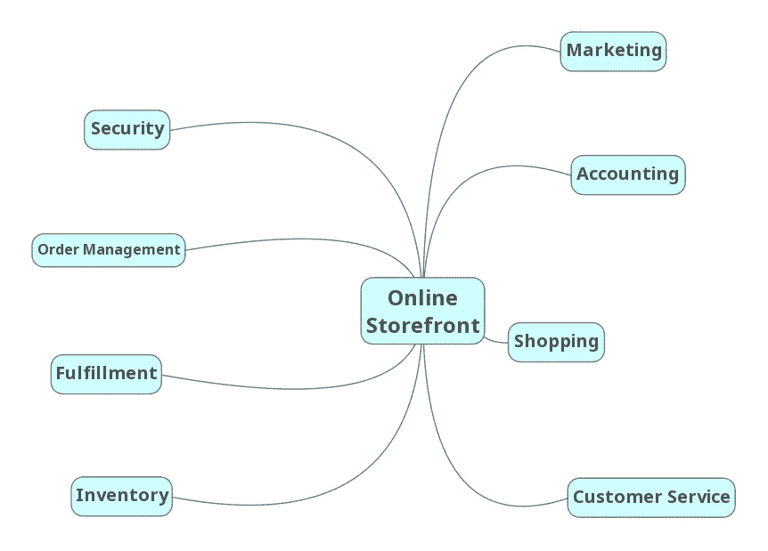

给定这个问题域，我们可以假设我们有客户的概念。此外，我们可以假设定义客户的独特属性很可能分布在几个有界的上下文中。要全面了解客户，您需要从多个环境中收集数据。例如，会计环境可以是主要客户信息的[记录系统](https://en.wikipedia.org/wiki/System_of_record)，例如客户的姓名、联系信息、联系偏好以及帐单和送货地址。营销部门可能掌握关于客户使用商店忠诚度计划和在线购物活动的额外信息。履行部门可能会保留一份运送给客户的所有订单的记录。安全部门可能持有客户的访问凭证、帐户访问历史和隐私设置。

下面是用黄色显示的客户数据对象。橙色代表每个有界上下文中的逻辑责任划分。在我们的在线店面示例中，这些部门将表现为单独的微服务。

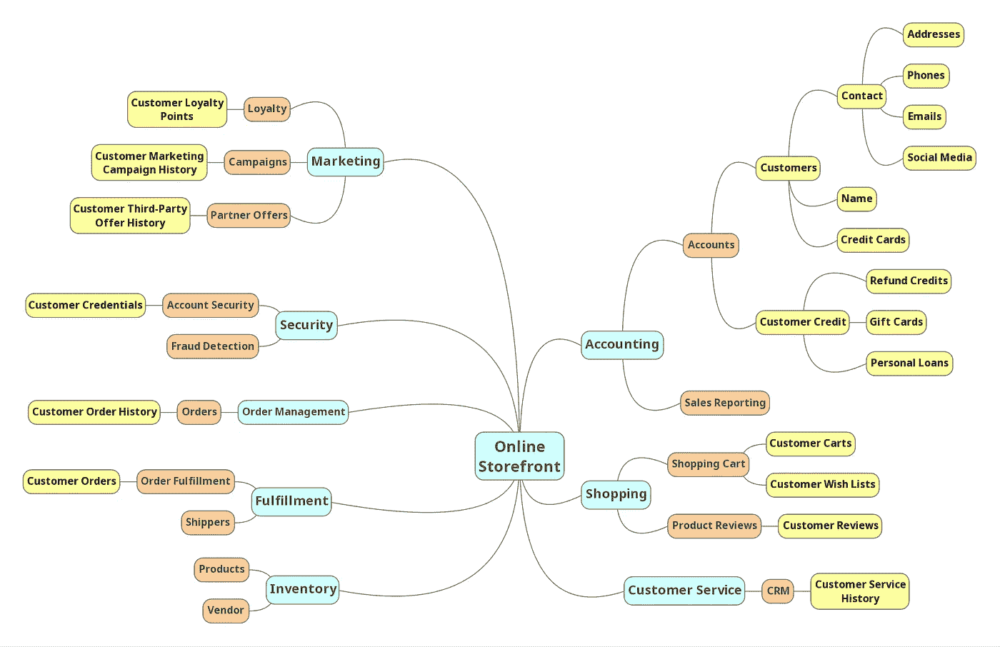

# 分布式数据一致性

让我们同意，我们领域的数据模型的架构需要跨有界的上下文或者甚至在同一上下文中的服务之间的一些数据复制。我们必须确保数据的一致性。举个例子，一个客户改变了他们的家庭地址或电子邮件。让我们假设会计环境是这些数据字段的记录系统。但是，为了完成订单，配送上下文可能还需要维护客户的当前家庭地址。同样，负责选择加入电子邮件广告的营销上下文也需要了解电子邮件的变化并更新其客户记录。

如果某个共享数据发生了变化，那么做出变化的一方应该负责传达这一变化，而不要期待响应。他们在陈述事实，而不是提问。相关方可以选择是否以及如何根据变更通知采取行动。这种解耦的通信模型通常被描述为事件承载的状态转移，由 ThoughtWorks 的 [Martin Fowler](https://twitter.com/martinfowler) 在其见解深刻的文章[中定义，“事件驱动”是什么意思？](https://martinfowler.com/articles/201701-event-driven.html)。对一段数据的更改可以被认为是一个状态更改事件，即包含已更改数据的详细信息的事件。巧合的是，Fowler 在文章中使用了一个客户地址变更作为事件携带状态转移的例子。前思想工作者 Graham Brooks 也在他的文章[中详述了这个概念，事件携带状态转移模式](http://www.grahambrooks.com/event-driven-architecture/patterns/stateful-event-pattern/)。

## 一致性策略

可以采用多种架构方法来解决分布式系统中的数据一致性问题。例如，您可以使用带有共享模式的单个关系数据库来持久化数据，完全避免分布式数据模型。然而，有人可能会争辩说，使用单一的数据库只是把你的分布式系统变成了一个整体。

您可以使用[变更数据捕获](https://en.wikipedia.org/wiki/Change_data_capture) (CDC)来跟踪每个数据库的变更，并将这些变更的记录发送到 Kafka 主题，供感兴趣的人使用。 [Kafka Connect](https://www.confluent.io/product/connectors/) 是一个很好的选择，如 Confluent 的 Robin Moffatt 的文章[No More Silos:How Integrate your Databases with Apache Kafka and CDC](https://www.confluent.io/blog/no-more-silos-how-to-integrate-your-databases-with-apache-kafka-and-cdc)中所述。

或者，我们可以使用独立的数据服务，独立于域的其他业务服务，其唯一的作用是确保跨域的数据一致性。如果消息在 Kafka 中持续存在，该服务还可以通过消息重放提供数据可审计性。当然，另一组服务增加了系统操作的复杂性。

在这篇文章有些简单的架构中，业务微服务将通过从它们订阅的多个 Kafka 主题中产生和消费消息来保持它们各自领域的一致性。卡夫卡[的生产者](https://docs.confluent.io/current/clients/producer.html)也可能是我们领域内的[消费者](https://docs.confluent.io/current/clients/consumer.html)。

# 店面示例

在本帖中，我们的在线店面 API 将使用 [Spring Boot](https://spring.io/projects/spring-boot) 和 [OpenJDK 16](https://openjdk.java.net/projects/jdk/16/) 用 Java 构建。我们将通过为 Apache Kafka 项目使用[发布/订阅模型](https://kafka.apache.org/intro)和 [Spring 来确保分布式数据的一致性。当一个 Spring Boot 微服务更改一条数据时，如果合适，该状态更改将触发状态更改事件，该事件将使用 Kafka 主题与其他微服务共享。](https://spring.io/projects/spring-kafka)

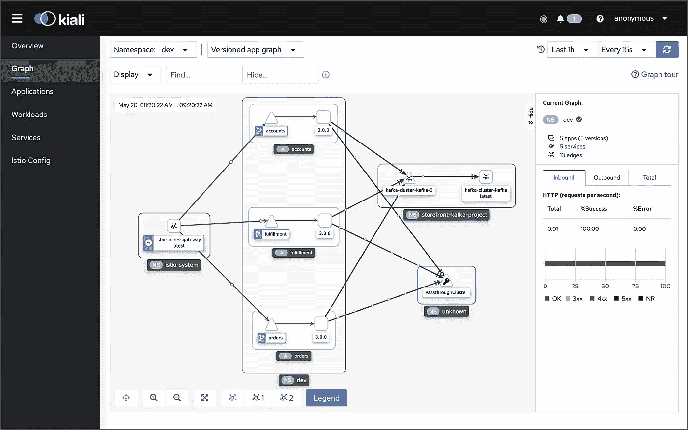

Kiali 的店面 API 视图

我们将探索利用 Spring Kafka 来传达与客户通过在线店面下订单的特定用例相关的状态变化事件的不同方法。下图显示了店面订购流程的简略视图。箭头表示数据的交换。Kafka 将作为一种分离服务的手段，同时仍然确保数据是分布式的。


给定下订单的用例，我们将检查组成我们的店面 API 的三个服务的交互:会计绑定上下文中的帐户服务、实现上下文中的实现服务和订单管理上下文中的订单服务。我们将研究这三个服务如何使用 Kafka 以完全完整的方式相互交流状态变化(对其数据的变化)。

下图显示了帖子中讨论的子系统之间的事件流。下面的编号对应于上面订购过程中的编号。我们将查看三个事件流 2、5 和 6。我们将模拟事件流 3，即购物车服务创建的订单。

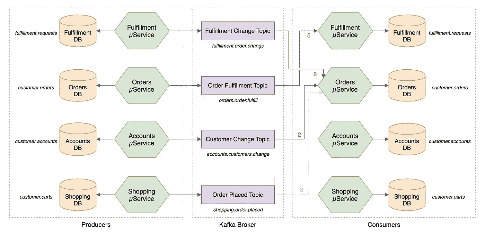

下面是从所涉及的主要子系统的角度来看在线店面的视图。尽管该图过于简化，但它应该会让您了解 Kafka 和 Kafka 当前的集群管理器 Zookeeper 在一个典型的、高度可用的、基于微服务的分布式应用平台中的位置。

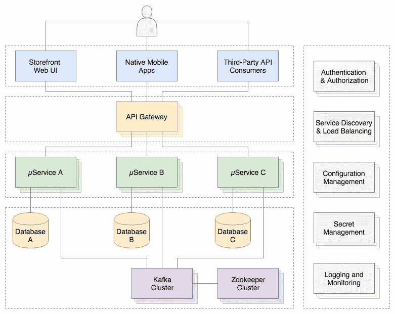

这篇文章将关注店面的后端 API——它的服务、数据库和消息传递子系统。

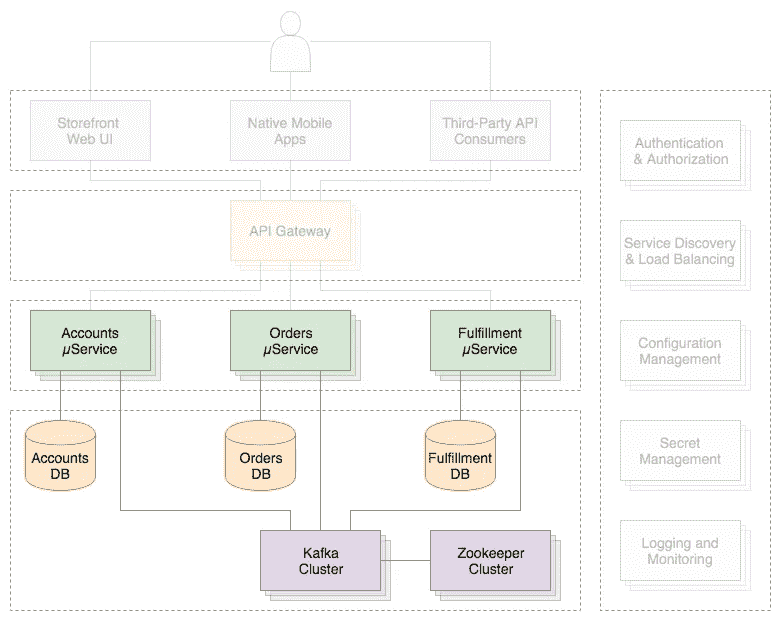

# 店面微服务

我们将探索三个微服务的功能，以及它们如何使用 [Kafka 2.8](https://www.confluent.io/blog/kafka-2-8-0-features-and-improvements-with-early-access-to-kip-500/) 共享状态改变事件。每个店面 API 服务都是使用 [Spring Boot 2.0](https://spring.io/projects/spring-boot) 和 [Gradle](https://gradle.org/) 构建的。每个 Spring Boot 服务包括 [Spring Data REST](https://projects.spring.io/spring-data-rest/) ， [Spring Data MongoDB](https://projects.spring.io/spring-data-mongodb/) ， [Spring for Apache Kafka](https://spring.io/projects/spring-kafka) ， [Spring Cloud Sleuth](https://cloud.spring.io/spring-cloud-sleuth/) ， [SpringFox](http://springfox.github.io/springfox/) ，以及 [Spring Boot 执行器](https://spring.io/guides/gs/actuator-service/)。为了简单起见，[卡夫卡溪流](https://kafka.apache.org/documentation/streams/)和[春云溪流](https://cloud.spring.io/spring-cloud-stream/)的使用不在此贴。

## 源代码

店面的微服务源代码在 GitHub 上公开。可以使用以下命令克隆四个 GitHub 项目:

```
git clone --branch 2021-istio \
    --single-branch --depth 1 \
    [https://github.com/garystafford/storefront-demo-accounts.git](https://github.com/garystafford/storefront-demo-accounts.git)git clone --branch 2021-istio \
    --single-branch --depth 1 \
    [https://github.com/garystafford/storefront-demo-orders.git](https://github.com/garystafford/storefront-demo-orders.git)git clone --branch 2021-istio \
    --single-branch --depth 1 \
    [https://github.com/garystafford/storefront-demo-fulfillment.git](https://github.com/garystafford/storefront-demo-fulfillment.git)git clone --branch 2021-istio \
    --single-branch --depth 1 \
    [https://github.com/garystafford/storefront-demo.git](https://github.com/garystafford/storefront-demo.git)
```

*本帖中的代码示例显示为*[*Gists*](https://help.github.com/articles/about-gists/)*，在某些移动和社交媒体浏览器上可能无法正确显示。还提供了到 gists 的链接。*

## 账户服务

帐户服务负责管理基本的客户信息，如姓名、联系信息、地址和购物信用卡。下面显示了 Accounts 服务的数据模型的局部视图。这个域对象的[集群代表客户账户](https://martinfowler.com/bliki/DDD_Aggregate.html)[集合](https://en.wikipedia.org/wiki/Domain-driven_design#Building_blocks)。

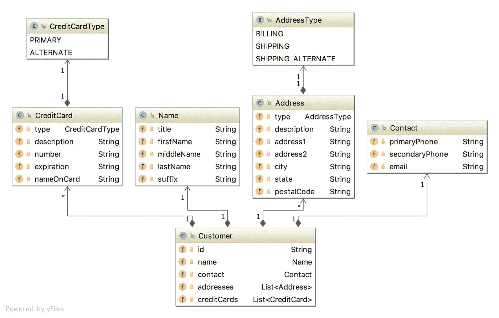

Accounts 服务的主要数据实体`Customer`类保存在 Accounts MongoDB 数据库中。下面我们看到一个`Customer`的表示，作为`customer.accounts` MongoDB 数据库集合中的 [BSON](https://www.mongodb.com/json-and-bson) 文档。

除了主要的`Customer`实体，账户服务还包含一个`CustomerChangeEvent`类。作为 Kafka 生产者，账户服务使用`CustomerChangeEvent` [域事件](https://en.wikipedia.org/wiki/Domain-driven_design#Building_blocks)对象来携带当添加新客户或对现有客户进行更改时账户服务希望共享的客户端的状态信息。`CustomerChangeEvent`对象不是`Customer`对象的精确副本。例如，`CustomerChangeEvent`对象不与其他消息消费者(`CreditCard`数据对象)共享敏感的信用卡信息。

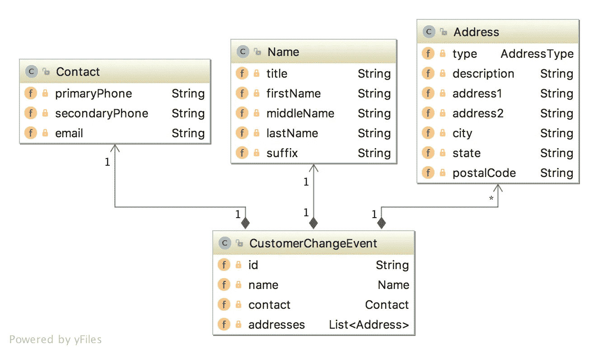

由于`CustomerChangeEvent`域事件对象在 MongoDB 中没有持久化，我们可以在 Kafka 中查看它的 JSON 消息有效载荷来检查它的结构。请注意 MongoDB 中的`Customer`文档和 Kafka `CustomerChangeEvent`消息有效负载之间的数据结构(模式)差异。

为简单起见，我们假设其他服务不会更改客户的姓名、联系信息或地址，这是帐户服务的唯一职责。

账户服务的源代码可以在 [GitHub](https://github.com/garystafford/storefront-demo-accounts/tree/2021-istio) 上找到。使用项目的最新`2021-istio`分支。

## 订单服务

订单服务负责管理客户过去和当前的订单；这是记录客户订单历史的系统。订单服务的数据模型的局部视图如下所示。这个域对象集群代表客户订单集合。

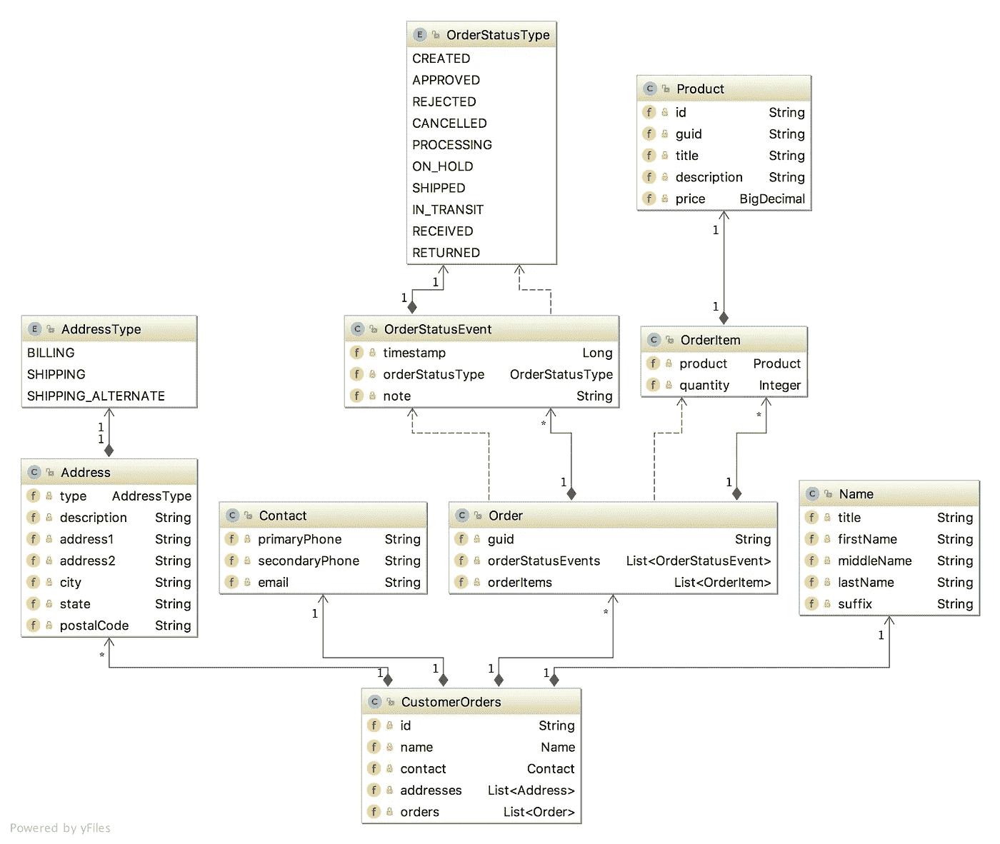

订单服务的主要数据实体`CustomerOrders`类在 MongoDB 中持久化。该实体包含所有客户订单的历史记录(`Order`数据对象)，以及客户的姓名、联系信息和地址。在 Orders MongoDB 数据库中，一个`CustomerOrders`，在`customer.orders`数据库集合中表示为一个 BSON 文档，如下所示:

除了主要的`CustomerOrders`实体，订单服务还包含了`FulfillmentRequestEvent`类。作为 Kafka 的生产者，Orders 服务使用`FulfillmentRequestEvent`域事件对象来携带关于已批准订单的状态信息，准备执行。它发送给 Kafka 供履行服务消费。`FulfillmentRequestEvent`对象只包含它需要共享的信息。我们的示例共享一个`Order`，以及客户的姓名、联系信息和送货地址。

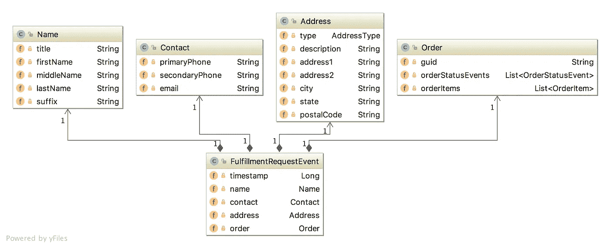

由于`FulfillmentRequestEvent`域事件对象在 MongoDB 中没有持久化，所以我们可以在 Kafka 中查看它的 JSON 消息有效载荷。再次注意 MongoDB 中的`CustomerOrders`文档和 Kafka 中的`FulfillmentRequestEvent`消息负载之间的模式差异。

订单服务的源代码可以在 [GitHub](https://github.com/garystafford/storefront-demo-orders/tree/2021-istio) 上获得。使用项目的最新`2021-istio`分支。

## 履行服务

最后，履行服务负责履行订单。履行服务的数据模型的局部视图如下所示。这个域对象集群代表实现集合。

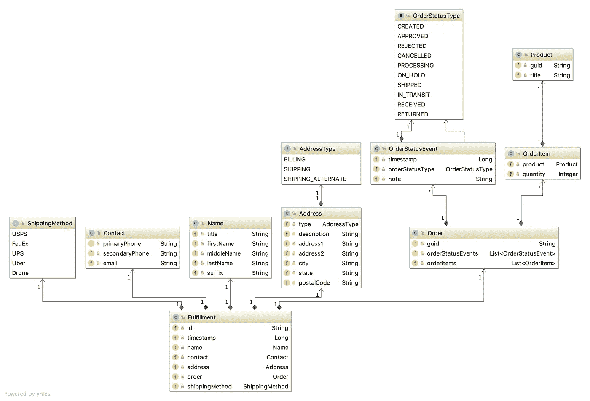

实现服务的主要实体,`Fulfillment`类被保存在 MongoDB 中。这个实体包含一个单独的`Order`数据对象，以及客户的姓名、联系信息和送货地址。履行服务还使用`Fulfillment`实体来存储最新的运输状态，例如“已发货”、“在途”和“已收到”。客户的姓名、联系信息和送货地址由帐户服务管理，复制到订单服务，并通过 Kafka 使用`FulfillmentRequestEvent`实体传递给履行服务。

在 Fulfillment MongoDB 数据库中，`Fulfillment`对象在`fulfillment.requests`数据库集合中表示为 BSON 文档，如下所示:

除了主`Fulfillment`实体，履行服务还有一个`OrderStatusChangeEvent`类。作为 Kafka 生产者，履行服务使用`OrderStatusChangeEvent`域事件对象来携带关于订单履行状态的状态信息。`OrderStatusChangeEvent`对象包含订单的 UUID、时间戳、发货状态和可选的订单状态注释。


因为`OrderStatusChangeEvent`域事件对象在 MongoDB 中没有持久化，所以我们可以再次在 Kafka 中查看它的 JSON 消息有效负载。

履行服务的源代码可在 [GitHub](https://github.com/garystafford/storefront-demo-fulfillment/tree/2021-istio) 上获得。使用项目的最新`2021-istio`分支。

# 状态更改事件消息流

本帖中展示了三个状态更改事件消息流。

1.  对客户的更改触发了由账户服务产生的事件消息，该消息被发布在`accounts.customer.change` Kafka 主题上并由订单服务消费；
2.  订单批准触发由订单服务产生的事件消息，该消息发布在`orders.order.fulfill` Kafka 主题上，并由履行服务消费；
3.  订单状态的改变触发了由履行服务产生的事件消息，该消息被发布在`fulfillment.order.change` Kafka 主题上，并被订单服务消费；

在 Kafka 主题的生产者和消费者端，每个状态改变事件消息流都遵循相同的架构模式。

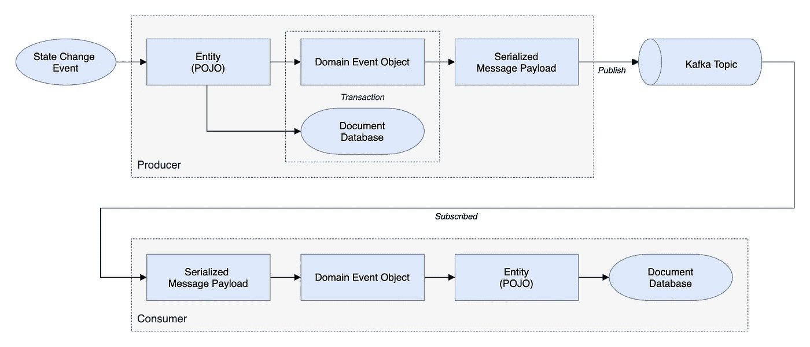

让我们检查每个状态改变事件消息流及其背后的代码。

## 客户状态变化

当 Accounts service 创建或更新一个新的客户实体时，会生成一条`CustomerChangeEvent`消息并发送给`accounts.customer.change` Kafka 主题。该消息由订单服务检索和使用。这就是订单服务最终拥有所有可能下订单的客户的记录的方式。通过 Kafka，可以说订单的客户联系信息[最终与账户的客户联系信息](https://en.wikipedia.org/wiki/Eventual_consistency)一致。

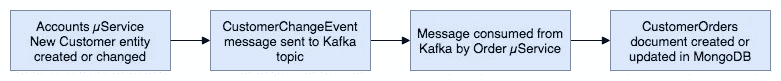

有不同的方法来触发要发送给卡夫卡的消息。对于这种特定的状态更改，帐户服务使用一个侦听器。监听器类扩展了[AbstractMongoEventListener](https://docs.spring.io/spring-data/mongodb/docs/current/api/org/springframework/data/mongodb/core/mapping/event/AbstractMongoEventListener.html)，监听客户实体的 [onAfterSave](https://docs.spring.io/spring-data/mongodb/docs/current/api/org/springframework/data/mongodb/core/mapping/event/AbstractMongoEventListener.html#onAfterSave-org.springframework.data.mongodb.core.mapping.event.AfterSaveEvent-) 事件。

侦听器通过用客户信息实例化一个新的`CustomerChangeEvent`来处理事件，并将其传递给`Sender`类。

`SenderConfig`类处理`Sender`的配置。这个 Spring Kafka producer 配置类使用 Spring Kafka 的 [JsonSerializer](https://docs.spring.io/spring-kafka/api/org/springframework/kafka/support/serializer/JsonSerializer.html) 类将`CustomerChangeEvent`对象序列化为 JSON 消息有效负载。

`Sender`使用 [KafkaTemplate](https://docs.spring.io/spring-kafka/api/org/springframework/kafka/core/KafkaTemplate.html) 向`accounts.customer.change` Kafka 主题发送消息，如下所示。由于消息顺序对于确保按顺序处理对客户信息的更改至关重要，因此所有消息都被发送到具有单个分区的单个主题。

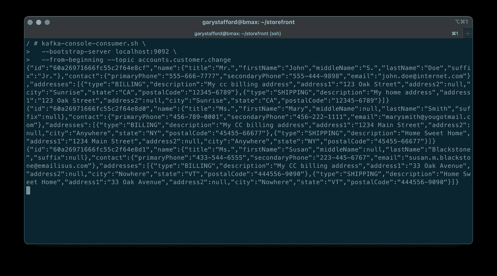

订单服务的`Receiver`类使用账户服务产生的`CustomerChangeEvent`消息。

与履行服务相比，订单服务的`Receiver`类的配置有所不同。订单服务接收来自多个主题的消息，每个主题包含具有不同负载结构的消息。每种类型的消息都必须反序列化为不同的对象类型。为了完成这个任务，`ReceiverConfig`类使用了 Apache Kafka 的 [StringDeserializer](https://kafka.apache.org/0102/javadoc/org/apache/kafka/common/serialization/StringDeserializer.html) 。订单服务的`ReceiverConfig`引用了 Spring Kafka 的`AbstractKafkaListenerContainerFactory`类 [setMessageConverter](https://docs.spring.io/spring-kafka/api/org/springframework/kafka/config/AbstractKafkaListenerContainerFactory.html#setMessageConverter-org.springframework.kafka.support.converter.MessageConverter-) 方法，该方法允许动态对象类型匹配。

订单服务消费消息的每个 Kafka 主题都与`Receiver`类中的一个方法相关联(如上所示)。该方法接受特定的对象类型作为输入，表示消息负载需要反序列化到的对象类型。这样，我们可以接收从多种对象类型序列化的多个消息有效负载，并成功地将每种类型反序列化为正确的数据对象。在`CustomerChangeEvent`的情况下，订单服务调用`receiveCustomerOrder`方法来消费消息并正确地反序列化它。

对于所有服务，每个服务的`resources`目录中的 Spring `application.yaml`属性文件包含 Kafka 配置(第 11–19 行)。

## 订单被批准履行

当`CustomerOrders`实体中的`Order`的状态从“已创建”更改为“已批准”时，会生成一条`FulfillmentRequestEvent`消息并发送给`orders.order.fulfill` Kafka 主题。该消息由履行服务检索和消费。这就是执行服务如何记录哪些订单可以执行的原因。

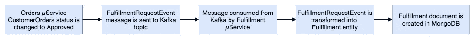

因为我们没有为这篇文章创建购物车服务，所以 Orders 服务模拟一个订单批准事件，包含一个通过 Kafka 从购物车服务接收的批准订单。订单服务可以为每个客户创建一个随机的订单历史，以模拟订单的创建和批准。此外，订单服务可以扫描包含“已创建”和“已批准”订单状态的所有客户订单。对于所有符合这些标准的订单，此状态将作为事件消息传递给 Kafka。生成一个`FulfillmentRequestEvent`,其中包含要履行的订单，以及客户的联系方式和发货信息。将`FulfillmentRequestEvent`传递给`Sender`类。

`SenderConfig`类处理`Sender`类的配置。这个 Spring Kafka producer 配置类使用 Spring Kafka 的 [JsonSerializer](https://docs.spring.io/spring-kafka/api/org/springframework/kafka/support/serializer/JsonSerializer.html) 类将`FulfillmentRequestEvent`对象序列化为 JSON 消息有效负载。

`Sender`类使用`KafkaTemplate`将消息发送到`orders.order.fulfill` Kafka 主题，如下所示。由于消息顺序并不重要，如果消息量需要，可以将消息发送到具有多个分区的主题。

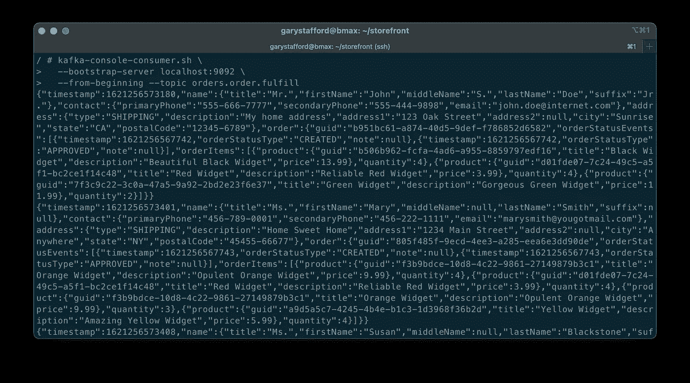

实现服务的`Receiver`类使用来自 Kafka 主题的`FulfillmentRequestEvent`并实例化一个`Fulfillment`对象，包含在`FulfillmentRequestEvent`消息有效负载中传递的数据。`Fulfillment`对象包括要履行的订单和客户的联系和运输信息。

实现服务的`ReceiverConfig`类定义了`DefaultKafkaConsumerFactory`和`ConcurrentKafkaListenerContainerFactory`，负责将来自 JSON 的消息有效负载反序列化为`FulfillmentRequestEvent`对象。

## 履行订单状态状态更改

当履行实体中的订单状态更改为除**已批准**之外的任何状态时，履行服务会生成一条`OrderStatusChangeEvent`消息，并发送给`fulfillment.order.change` Kafka 主题。该消息由订单服务检索和使用。这就是订单服务如何跟踪从最初的**创建**状态到最终的**接收**状态的所有`CustomerOrder`生命周期事件。

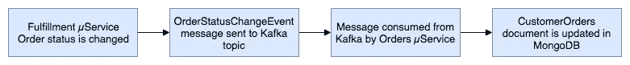

履行服务通过`FulfillmentController`类公开几个端点，模拟订单状态的变化。它们允许订单的状态从**批准**到**处理**，到**发货**，到**在途**，最后到**接收**。此更改适用于符合标准的所有订单。

这些状态变化中的每一个都会触发 MongoDB 中实现文档的变化。每个更改还会生成一个 Kafka 消息，在消息有效负载中包含`OrderStatusChangeEvent`。履行服务的`Sender`类处理这一点。

注意，在这个例子中，这两个事件不是在原子事务中处理的。更新数据库或发送消息可能会各自失败，这将导致数据一致性的丧失。在现实世界中，我们必须确保这两个独立的操作作为单个事务成功或失败，以确保数据一致性，使用少数几种常见的架构模式中的任何一种。

`SenderConfig`类处理`Sender`类的配置。这个 Spring Kafka producer 配置类使用 Spring Kafka 的 [JsonSerializer](https://docs.spring.io/spring-kafka/api/org/springframework/kafka/support/serializer/JsonSerializer.html) 类将`OrderStatusChangeEvent`对象序列化为 JSON 消息有效负载。该类几乎与订单和账户服务中的`SenderConfig`类相同。

`Sender`类使用`KafkaTemplate`将消息发送到`fulfillment.order.change` Kafka 主题，如下所示。由于记录了时间戳，因此消息顺序并不重要，从而确保可以维护订单状态事件的正确顺序。如果消息量需要，可以将消息发送到具有多个分区的主题。

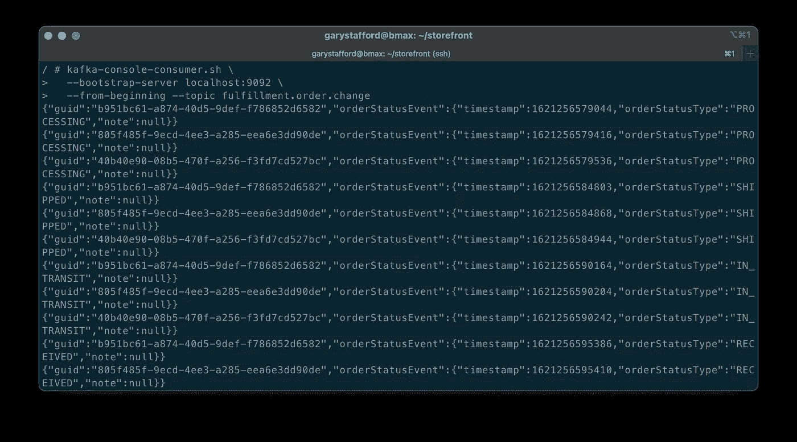

订单服务的`Receiver`类负责消费由履行服务产生的`OrderStatusChangeEvent`消息。

如上所述，订单服务的配置不同于从 Kafka 接收消息的履行服务。订单服务接收来自多个主题的消息。`ReceiverConfig`类使用`StringDeserializer`反序列化所有消息。订单服务的`ReceiverConfig`类引用了 Spring Kafka `AbstractKafkaListenerContainerFactory`类的 [setMessageConverter](https://docs.spring.io/spring-kafka/api/org/springframework/kafka/config/AbstractKafkaListenerContainerFactory.html#setMessageConverter-org.springframework.kafka.support.converter.MessageConverter-) 方法，该方法允许动态对象类型匹配。

订单服务消费消息的每个 Kafka 主题都与`Receiver`类中的一个方法相关联(如上所示)。该方法接受特定的对象类型作为输入参数，表示消息负载需要反序列化到的对象类型。对于`OrderStatusChangeEvent`消息，调用`receiveOrderStatusChangeEvents`方法来消费来自`fulfillment.order.change` Kafka 主题的消息。

# 第二部分

在这篇文章的第二部分中，我们将回顾如何使用 [Minikube](https://minikube.sigs.k8s.io/) 将 storefront API 组件部署并运行到一个本地开发环境中，该环境运行在带有 [Istio](https://istio.io/) 的 Kubernetes 上。为了提供运营可见性，我们将在我们的系统中添加观察工具，如雅虎的[CMAK](https://github.com/yahoo/CMAK)(Apache Kafka 的集群管理器)[蒙戈快车](https://github.com/mongo-express/mongo-express)、[基亚利](https://kiali.io/)、[普罗米修斯](https://prometheus.io/)和[格拉法纳](https://grafana.com/)。


Kiali 的店面 API 视图

这篇博客代表我自己的观点，而不是我的雇主亚马逊网络服务公司(AWS)的观点。所有产品名称、徽标和品牌都是其各自所有者的财产。