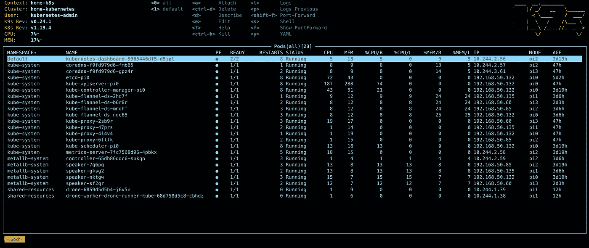
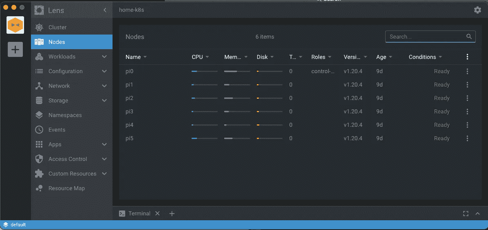
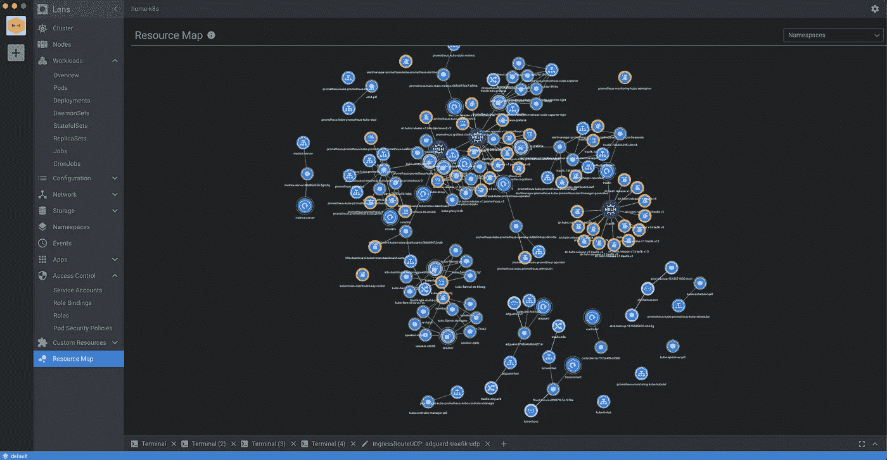
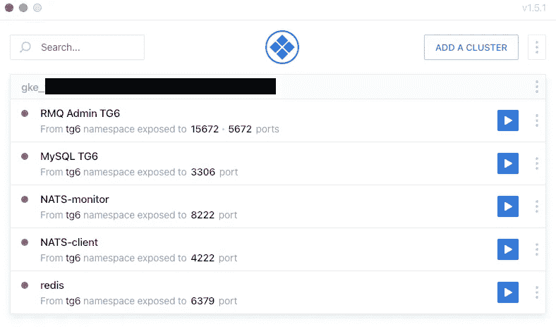
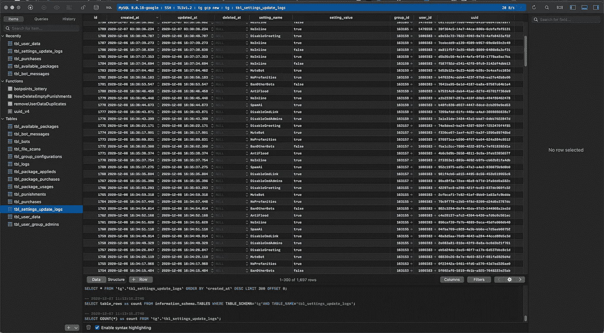
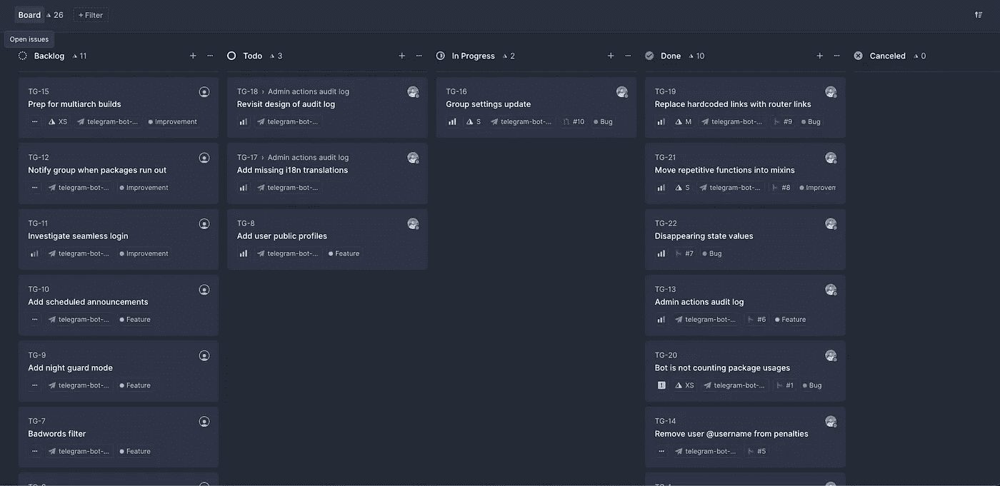
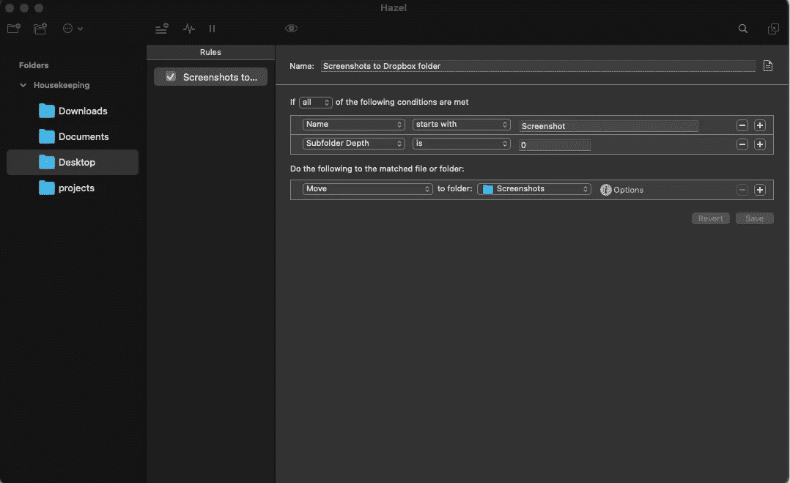
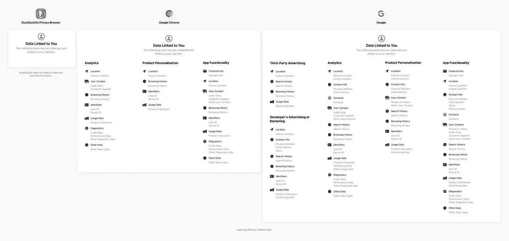

# 面向 2021 年的日常开发*堆栈

> 原文：<https://itnext.io/every-days-dev-stack-in-2021-b8eebebc799d?source=collection_archive---------5----------------------->

## 非常主观的软件选择指南

鸣谢:StockSnap @ pixabay

我在之前的两篇文章中介绍了我个人项目的工作，两篇文章分别是“[管理大规模的私人项目](https://medium.com/javascript-in-plain-english/managing-private-projects-at-scale-a6ff4bf1dff4)”和“[打造最好的电报机器人](https://raczylo.medium.com/building-best-telegram-bot-bbf905d09d74)”，其中有很多关于我日常使用的工具的问题。

我想提醒你，这是建议，而不是“必须做”。在我的职业生涯中，我尝试了数百甚至数千种不同的工具，试图找到最佳匹配。这里展示的堆栈更多的是“我目前正在使用的”，而不是“终身软件”。我强烈建议你做自己的研究，找到最适合你和你需求的东西，最重要的是——不要害怕改变。

软件在发展，我们的工作也在改变——是的，你仍然可以编写整个网站、微服务等等。但这能让你以合理的速度前进，还是为了艺术而艺术？

# **编辑: *VS 代码***

我用过的代码编辑器的历史，按时间顺序排列:Nano，Vi，Emacs，Notepad++(回到我的 Windows 时代)，Sublime Text，Atom，最后是 VS Code。我认为这是 20 年来第一个我非常满意的微软产品，主要是因为它周围的社区，所有的插件都大大加快了开发过程，帮助我编码，编辑器也相对轻量级，如果你没有用所有可能的插件杀死它的话。这不是一个突破性的发现，目前更像是一个行业标准——这就是为什么我不打算详细讨论这个话题。VSCode 加上高质量和维护良好的扩展，使得任何与代码相关的工作都比最初看起来更令人愉快。

*值得一提的是:*出色的 AI 驱动的代码补全与 **TabNine、**通过 **GitLens** 与 git 集成、无处不在的开发(包括最近的[GitHub code spaces](https://github.com/features/codespaces))；

**我喜欢什么:**

*   适用于 Mac 和 Linux
*   大量扩展(尽管质量不同)
*   大量定制选项

# Kubernetes: K9S

我几乎是一个“微服务和 Kubernetes 所有东西”的人，最好的方法当然是在本地运行 Kubernetes 集群，或者在云中运行多个用于开发的 raspberry pi。有相当多的内置仪表盘可以领导团队，但我更像一个老派的终端用户，我更喜欢 ncurses 而不是 clickety-click 方法。K9S 项目允许我每天管理集群、部署和资源，而不需要浏览器控制面板。它的选择比我想象的要多得多。内置的端口转发、对容器外壳的直接访问、实时日志和以前容器运行的日志都很容易访问，并允许您非常、非常快速地进行集群管理。毫无疑问，对于不喜欢冗长的 kubectl 命令的人来说，这是必备的。

K9S 以及集群资源的即时概述。

**我喜欢什么:**

*   直观的终端 K8S 控制台，可快速查看资源
*   不断更新，选项列表不断增加(特别端口转发、ssh 访问 pods 进行调试、日志)

# Kubernetes:镜头应用

这是自从 [Gregory Bennett](https://medium.com/u/a004df101cc7?source=post_page-----b8eebebc799d--------------------------------) 介绍给我之后，我每天都在使用的第二个工具。有时会感觉有点迟钝，尽管—它是群集中所有资源的一站式商店。它要求普罗米修斯在你选择的集群中运行。项目网址:[https://k8slens.dev/](https://k8slens.dev/)

镜头— GUI Kubernetes 仪表板

值得一提的一件重要事情是——因为它使这个项目更加突出——它有自己的插件 API，它(如下)为你提供交互式资源(以及它们之间的关系)图。

**我喜欢什么:**

*   与上面类似——但是使用 GUI
*   资源使用图表
*   他们的插件 API 有很大的潜力

Lens —带有资源概述的插件

# Kubernetes 港口运输公司:Kube 运输公司

另一个非常有用的工具，尤其是在微服务开发期间，用来访问数据库或集群中可用的其他服务。它支持自动重新连接，帮助我避免摆弄额外的命令和终端窗口。

Kube Forwarder —易于设置和管理端口转发

# 数据库:TablePlus

我使用数据库，从设计开始，通过优化，以微服务的常规查询结束(因为 ORM 并不总是为我提供所需的功能)。我发现 TablePlus 是一款出色的软件，它让数据库相关的任务不仅视觉上令人愉快，而且节省时间(因此也节省成本)。有人说它很贵——但是自从我开始使用它，我注意到我的工作流程变得更加面向任务，而不是浪费时间去找出过度包装的界面中合适的功能。SQL 编辑器不仅突出显示您的查询，还可以作为一个记事本(如果您将来需要用到它们)。如果您想将它们附加到文档中，它还可以自动生成和导出现代外观的数据库图表。它“只适用于”多种数据库风格，我非常喜欢它。

**我喜欢什么:**

*   我见过的最轻量级的数据库图形用户界面之一
*   在 Mac 和 Linux 上开箱即用
*   直观，非常直观—绝对没有杂乱的选项

TablePlus 简洁易用的用户界面

# GraphQL: Hasura

最初是由[的 hipertracker](https://medium.com/u/2124d7e93ea4?source=post_page-----b8eebebc799d--------------------------------) 介绍给我的，它集 GraphQL 和数据库集成于一身。有了 Hasura，你可以忘记在 **Apollo** 中定义自己的结构的需要——这可能是痛苦的，尤其是在项目处于积极开发中时，因为变化通常会从数据库结构开始，通过微服务中的定义，并以对 GraphQL 模式的定义的改变而结束。您可以消除一个潜在的故障点，并让 Hasura 负责翻译，这与一个令人惊叹的查询编辑器、您可以触发的操作、内置的身份验证一起大大加快了开发过程，而无需编写您自己的解析器所涉及的额外代码或工作。

用你现有的数据库设置 Hasura 有多容易？良好的...如果您从 docker 容器运行它——向它提供 Postgres 服务器 URL，启用跟踪表和关系，它将为您完成繁重的工作。

**我喜欢什么:**

*   即插即用方法—无需编写自己的解析器
*   不会让您感到困惑的配置选项
*   使用内置控制台轻松开发查询
*   与 Postgres 一起工作，MySQL 支持正在进行中

# Web 框架:Quasar

每当我需要创建一个简单的网站或者从事另一个疯狂的科学家项目时，我不想把时间浪费在编写整个样式上。我通常有一些设计或至少元素放置在脑海中，我希望它在移动设备和桌面上都可用，没有任何故障，我需要它易于部署。hipertracker 的另一个建议是 Quasar——一个惊人的 VueJS 框架，它包含了不断开发和改进的优秀文档，符合我书中的所有要求。是的，可以有更多一点的样式自由(虽然内置材料的实现是惊人的)，但毕竟，你总是可以添加 TailwindCSS 来处理它。
将 Vue 3 引入 Quasar 的工作正在进行中，[目前停留在 SSR 实现上](https://github.com/quasarframework/quasar/issues/7836)——但是如果你更喜欢 SPA——beta 工作得很好。

**我喜欢什么:**

*   是 Vue，用类固醇
*   与一个伟大的社区一起积极发展
*   从个人网站到网上商店，开发任何东西都很可能需要的所有组件

# 项目管理:线性

我倾向于同时做很多事情，一天中会有很多想法出现。我以前使用过 Github 项目，但后来发现了 **Linear** 这是一个现代化的、功能齐全的应用程序，可以整理车票和电路板，为拉取请求提供惊人的支持——将所有东西放在一个地方是我能描述它的最好方式。我希望有一个移动版本，尽管如果你愿意，你可以使用浏览器。

线性项目管理

**我喜欢什么:**

*   集成了我在工作中可能需要的几乎所有东西
*   非常直观和简单——聪明
*   虽然管理权限是付费版本，但与他人协作很容易

# 保持一切清洁:黑兹尔

处理大量文件，摆弄 pdf、文档，然后搜索截图或项目文件，并努力不被淹没在混乱中？Hazel 是我的答案——在后台默默工作，确保适当的文档在它们应该在的地方，并且所有那些*。我下载的 dmg 文件会在一周后被删除。

你只需要黑兹尔规则。

# 备份:Backblaze

我成为他们的用户已经有几年了，到目前为止，我的设备没有出现任何问题，尽管我在升级 Macbook 后使用了恢复选项，这将所有文件都放在了它们应该在的位置，并具有正确的权限，允许我立即开始工作。

Backblaze 提供了非常有用的定制选项——我已经将所有无法重新下载或重新下载会非常困难的内容排除在它们提供的加密备份之外。

[Backblaze 链接](https://secure.backblaze.com/r/0013vy)(免责声明:引用)

**我喜欢什么:**

*   与竞争对手相比，它更便宜
*   *无限制的*备份大小(虽然我已经大大减少了我的)
*   备份加密是默认选项

# 港口隧道:核心隧道

“回到我的时代”，我们使用 SSH 来建立设备和服务器之间的端口隧道。时代变了，随着年龄的增长，懒惰也随之而来。我使用 CT 从我的机器上自动启动所有必要的隧道，所以无论何时我需要它们，它们都已经建立了。

**我喜欢什么:**

*   它易于配置和管理
*   开机自动启动隧道的发射和遗忘方法

# 浏览器:勇敢

每个人都使用 Chrome，然后安装所有的广告拦截插件以保持他们的浏览体验干净流畅，然后当他们的 Chrome 开始变慢并吃掉一半内存时，他们意识到事情不太对劲。我已经从 Chrome 转移到了 Edge，但当它开始放缓时，我发现了 Brave——建立在 Chrome 上，包括广告拦截和奖金——当他们不时向你展示策划和非侵入性广告时，有可能获得 BAT 令牌。如果你需要的话，内置的 TOR 还可以给你额外的隐私空间。

Chrome 想了解你什么？

以上是我从去年年中到现在每天都在使用的东西的清单(给你推荐一些真正有用的东西)。我希望你喜欢这本书，至少能找到一点灵感。