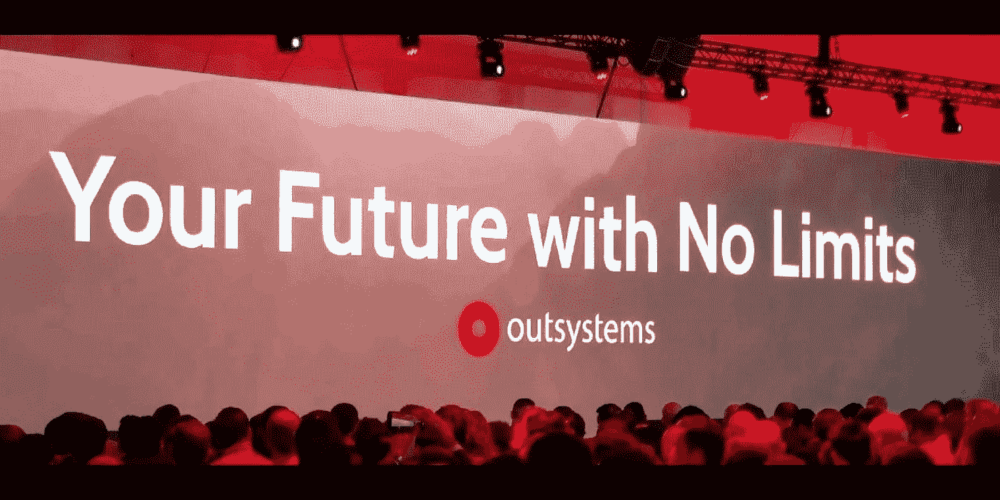
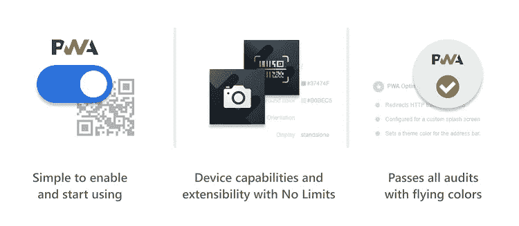

# 你一直想知道的关于 PWA 的一切(或者简单地说，关于业务的 PWA)

> 原文：<https://itnext.io/everything-you-always-wanted-to-know-about-pwa-or-pwas-in-a-nutshell-for-the-business-15948b5734ab?source=collection_archive---------6----------------------->

在 IT 世界中，新的技术、概念、语言和工具不断被创造出来。我们有多少次听到开发人员谈论新的和不同的方法来创建应用程序，并试图说服他们的组织采用这些新技术？

最近，渐进式网络应用程序又名 **PWAs** 成为新的炒作。但是，在决定我们是否应该继续这个新东西之前，我们需要知道更多。最重要的是，我们需要更多的信息来决定何时以及为什么我们应该投资这个新的应用程序架构。

基本上， **PWAs** 是运行在任何设备上的移动优化的网络应用程序，提供一组类似本机的功能。pwa 可以在桌面或移动浏览器上运行，并且可以将它们的图标安装在您的智能手机上，这样就可以很容易地找到和使用它们。一个很大的好处是，你没有与不同的应用商店(Google Play 和 Apple Store)相关的分发过程的开销。此外，您可以在 Windows 设备中安装 PWA 应用程序，而无需重新构建它们。

从**最终用户的角度来看**，PWAs 可以提供:访问本地存储的离线功能、针对其设备优化的性能、在其智能手机上安装应用的能力、更灵敏的用户体验、访问设备功能以及使用推送通知的双向通信。

从**业务角度来看**还有一些巨大的好处，如简化部署流程、更好的用户参与度和采用度、更快的上市时间以及在 app store 中分发应用程序不收取任何费用等。

但是我们如何向前迈进呢？

我建议你考虑使用像 [OutSystems](http://www.outsystems.com) 这样的全功能低代码平台来开发你的应用程序。有了 OutSystems，您将拥有一个统一移动和 web 业务规则、数据库模型和登台程序的单一开发平台。所有这些都与在所有渠道提供相同的用户体验以及决定如何最好地分发您的应用程序的能力相结合。

使用 OutSystems，我们可以非常快速地交付我们的解决方案，并改进我们的应用程序，而无需重新发明轮子。对于实施的每个新业务需求，我们只需点击一下鼠标就可以实现，启用或禁用不同种类的分发方法(Web、PWA、本地移动设备),几乎无需额外的工作即可将应用从一种架构模型转换为另一种。

我们由一组管理应用程序开发整个生命周期的特性支持。此外，当适用于这些领域时，可以使用包含使用本机代码或 HTML5 的正确实现的插件，特别是对于最常见的设备功能，如设备摄像头、位置、通知、文件管理和移动设备中的其他几个内置传感器。

如果我们发现 PWA 模型不支持我们的移动需求，我们只需点击一下鼠标，就可以将我们的实现转移到本地应用。例如，如果您发现您的应用程序需要 NFC、蓝牙、地理围栏、应用程序间通信和/或高级相机控制，那么它将需要本机实现。尽管根据我们的经验，为我们的客户开发的大多数原生应用并不使用 PWAs 支持的复杂设备功能。

在我的公司 [Do iT Lean](https://www.doitlean.com/news/read/the-power-of-low-code-and-pwas-explained) ，我们是利用 OutSystems 平台的 PWA 早期采用者。我们一直与 OutSystems 的研发团队密切合作，同时在我们的客户开始涉足 PWAs 领域时为他们提供支持。

如果您想了解更多关于我们 PWA 项目的经验，或者如果您想讨论哪种架构模型最适合您的下一个项目，请随时联系我们。我们很乐意帮助您，只需发送电子邮件至 learnmore@doitlean.com 的[即可。](mailto://learnmore@doitlean.com)

要了解更多关于 PWAs 的信息，请查看下面的链接

 [## 什么是渐进式网络应用程序(pwa)？

### 渐进式网络应用程序(PWAs)是离线优先的移动应用程序，承诺为用户提供无缝体验，他们的…

www.outsystems.com](https://www.outsystems.com/blog/posts/progressive-web-apps-pwa/)  [## 系统外反应式 Web 应用程序和渐进式 Web 应用程序一样吗？

### OutSystems Reactive Web App 模板是一个想要成为的 PWA 吗？还是反过来？还是说事情都是不相关的？

medium.com](https://medium.com/@techrug/are-outsystems-reactive-web-apps-the-same-as-progressive-web-apps-6260426555d6)  [## 低代码速度的渐进式网络应用

### 在 OutSystems，我们的使命是消除软件开发的复杂性，同时提高其质量。我们的…

www.outsystems.com](https://www.outsystems.com/blog/posts/pwa-low-code/)  [## 如何用低代码构建渐进式 Web 应用程序

### 如果你在软件开发领域，我肯定你听说过渐进式网络应用程序，又名 PWAs。那是因为…

www.outsystems.com](https://www.outsystems.com/blog/posts/how-to-build-progressive-web-apps-with-low-code/) 

*感谢阅读。我希望你喜欢它。请让我知道你的想法。留下你的评论。为下一篇文章提供主题建议。我想听听你的意见。如果你喜欢，请关注我的频道，分享吧。可以通过*[*LinkedIn*](https://linkedin.com/in/fantato/)*或* [*OutSystems 简介*](https://www.outsystems.com/profile/40762/) *联系我。*

[***精益生产——您可以依靠的系统外专业知识！***](http://doitlean.com/)