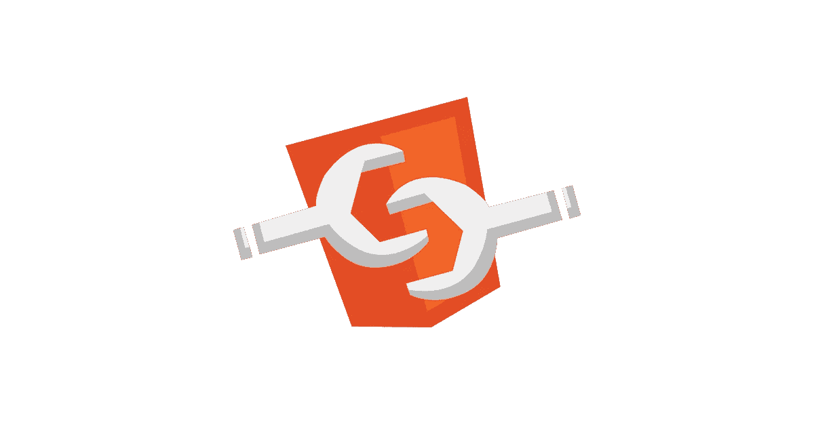

# 你一直想知道的关于 Web 组件的一切(但是不敢问)

> 原文：<https://itnext.io/everything-you-always-wanted-to-know-about-web-components-but-were-afraid-to-ask-d553a504a328?source=collection_archive---------2----------------------->

以下是你需要知道的



你对 Web 组件了解多少？关于 Web 组件，你想知道什么？

以下是我经常被问到的最常见问题的答案。

# Web 组件没有 JavaScript 能工作吗？

是的，通过[声明式阴影 DOM](https://web.dev/declarative-shadow-dom/) 可以不用 JavaScript 渲染 Web 组件。

通常，影子根通过 JavaScript 附加到 Web 组件(技术上是一个自定义元素):

```
const shadowRoot = this.attachShadow({mode: 'open'});this.shadowRoot.innerHTML = `<p>Hi there!</p>`;
```

如果没有 JavaScript，你就不能这样创建一个影子根。

但是声明式影子 DOM 使您能够在 HTML 中直接声明式地定义影子根:

```
<host-element>
  <template shadowroot="open">
    <slot></slot>
  </template>
  <h2>Light content</h2>
</host-element>
```

当 HTML 解析器遇到这个 HTML 时，它会立即应用属性为`shadowroot="open"`的`<template>`元素作为`<host-element>`的影子根，产生以下 HTML，不需要任何 JavaScript:

```
<host-element>
  #shadow-root (open)
  <slot>
    ↳
    <h2>Light content</h2>
  </slot>
</host-element>
```

因为这不需要 JavaScript，所以声明性 Shadow DOM 可以用于服务器端呈现 Web 组件。

现在，不要担心，从现在开始，您将需要用这种语法编写所有的 Web 组件。这有点违背了影子 DOM 带来的封装的目的。

当服务器端呈现 HTML 页面时，您可以使用新的`getInnerHTML`方法简单地获得元素的声明性阴影根:

```
const el = document.querySelector('host-element');
const html = el.getInnerHTML({includeShadowRoots: true});// html is now:
`<host-element>
  <template shadowroot="open"><slot></slot></template>
  <h2>Light content</h2>
</host-element>`
```

`getInnerHTML`的工作方式和`innerHTML`一样，但是你可以将`{includeShadowRoots: true}`作为参数传递，它也将返回元素的阴影 DOM。

在写作的时候，你可以在 Chrome 中省略这个参数，默认情况下它会返回影子根。

在服务器端脚本中，你可以简单地用这个`html`替换`<host-element>`的内容，你的元素的影子根现在不用 JavaScript 就可以呈现了。

请记住，声明式阴影 DOM 只负责在没有 JavaScript 的情况下呈现 Web 组件。

用于点击等交互。您仍然需要 JavaScript，但这适用于任何组件。

在撰写本文时，声明式阴影 DOM 仅在 Chrome、Edge 和 Opera 中受支持。

# React 支持 Web 组件吗？

您可以在任何 JavaScript 框架中使用 Web 组件，React 也支持这一点，但是您可能需要为您的 Web 组件编写一个包装器。

在所有 JS 框架中，React 不是最容易集成 Web 组件的。

[](https://reactjs.org/docs/web-components.html) [## Web 组件-反应

### React 和 Web 组件是为了解决不同的问题而构建的。Web 组件为…提供了强大的封装

reactjs.org](https://reactjs.org/docs/web-components.html) 

# 为什么你会选择 Web 组件而不是框架？

就像我写的，你可以在任何框架中使用 Web 组件，这样你就不用选择了。

但是 Web 组件的好处是它们是标准的，可以在任何地方使用(它们只是 HTML 元素),并且提供真正有作用域的 CSS。

# 什么是作用域 CSS？

您在 Web 组件中定义的 CSS 仅适用于您的组件*。*

*它不会影响 Web 组件之外的任何元素，外部文档的 CSS 也不会应用于您的组件，除了一些标准样式。*

*这意味着 Web 组件提供了真正有作用域的 CSS，而不需要任何命名约定。*

# *Web 组件如何与可访问性一起工作？*

*Web 组件的美妙之处在于它们只是普通的 HTML 元素，就像本地元素一样，如`<p>`、`<div>`、`<h1>`等。*

*这意味着使 Web 组件可访问与使其他 HTML 元素可访问没有什么不同。*

*您可以添加 aria 标签、键盘和焦点处理程序等。*

# *我可以使用外部 CSS 吗？*

*是的，你可以。*

*虽然有更好的方法来设计 Web 组件的样式，但是您可以使用`<link rel="stylesheet">`将样式表加载到 Web 组件中:*

```
*class HostElement extends ***HTMLElement*** {

  constructor() {
    super();

    const shadowRoot = this.attachShadow({mode: 'open'});

    shadowRoot.innerHTML = `
      <link rel="stylesheet" href="/path/to/external.css"> <slot></slot>

    `;
  }}*
```

*另一个更有趣的选择是使用可构造的样式表，这使得定义和准备共享的 CSS 样式成为可能，然后将这些样式应用于多个影子根。*

*这使您能够将共享 CSS 放在如下文件中:*

```
*// shared-css.jsconst css = `h1 {
  color: red;
}`

const sheet= new CSSStyleSheet();
***sheet.replaceSync***(css);

export {
  sheet}*
```

*然后您可以在多个 Web 组件中使用它，如下所示:*

```
*import {sheet} from './shared-css.js';

class HostElement extends ***HTMLElement*** { constructor() {
    super();

    const shadowRoot = this.attachShadow({mode: 'open'});
    shadowRoot.adoptedStyleSheets = [sheet];

    shadowRoot.innerHTML = `
      <h1>Hi there!</h1>
    `;
  }
}*
```

*[](https://web.dev/constructable-stylesheets/) [## 可构造的样式表

### 可构造的样式表提供了一种无缝的方式来创建样式并将其分发到文档或影子根，而无需…

网络开发](https://web.dev/constructable-stylesheets/) 

# 我可以在 Web 组件中使用 SASS 吗？

你也许可以，但是你可能只需要变量，因为 Shadow DOM 可以极大地简化你的 CSS，并且变量已经可以通过 [CSS 自定义属性](https://developer.mozilla.org/en-US/docs/Web/CSS/Using_CSS_custom_properties)获得。

因此，虽然您可以使用 SASS，但您可能不需要它。

# 使用 Web 组件需要第三方库吗？

不，你不知道。

现在所有浏览器都支持 Web 组件。一些实验特征可能需要聚合填充，但核心特征现在随处可用。

请记住，Web 组件就像普通的 HTML 元素一样，浏览器也会这样对待它。

# Web 组件可以服务器端渲染吗？

是的，他们可以用[声明性阴影 DOM](https://web.dev/declarative-shadow-dom/) 。见第一个问题。

# 最重要的优点是什么？

Web 组件只是标准的 HTML 元素，可以在任何地方使用，并且可以集成到任何框架中。

您不需要任何第三方代码来呈现和使用 Web 组件。因为它们只是普通的 HTML 元素，浏览器已经知道如何有效地处理它们。

虽然框架来来去去，但 Web 组件是一种标准，不太可能被废弃。

另一个非常重要的优点是，你可以完全封装你的组件的 HTML 和 CSS，这样你就真正地限定了 CSS 的范围。

这使你能够*极大地*简化你的组件的 CSS，因为它是真正有作用域的，不需要约定。

# 最重要的缺点是什么？

Web 组件不像框架那样提供现成的特性，如数据绑定和声明性模板(尽管实现这些并不难)。

# OMG，Web 组件不是反应式的？？？

Web 组件不像大多数框架那样提供现成的特性，比如反应性和声明性模板。

但是实现这些并不难:

[](https://medium.com/swlh/https-medium-com-drmoerkerke-data-binding-for-web-components-in-just-a-few-lines-of-code-33f0a46943b3) [## 仅用几行代码实现 Web 组件的数据绑定

### 这不是火箭科学，而且虚拟 DOM 通常都是多余的。

medium.com](https://medium.com/swlh/https-medium-com-drmoerkerke-data-binding-for-web-components-in-just-a-few-lines-of-code-33f0a46943b3) 

您可以使用像 setter 这样简单的东西来实现数据绑定。

这里有一个故意简化的例子:

```
class HostElement extends ***HTMLElement*** {
  constructor() {
    super();

    const shadowRoot = this.attachShadow({mode: 'open'});

    this._name = 'John';

    shadowRoot.innerHTML = `
      <h1>
        Hi <span data-bind="name">${this._name}</span>
      </h1>
    `;
  }

  set name(value) {
    this._name = value;
    this.shadowRoot
      .querySelectorAll('[data-bind="name"]')
      .forEach((element) => element.textContent = value);
  }

  get name() {
    return this._name;
  }
}
```

这里，绑定到属性的元素有一个`data-bind`属性，其内容是属性的名称。

在 setter 中，查找所有相应的元素，并将它们的`textContent`属性设置为新值。

当然，如果你有很多绑定属性，这很快就会变得混乱，所以在这种情况下，使用像 [lit](https://lit.dev/) 或 [StencilJS](https://stenciljs.com/) 这样的工具可能会更好，但是我希望你明白这个想法。

# 可以用 11ty 把 Web 组件编译成 HTML 吗？

Web 组件*是* HTML 所以没有什么要编译成 HTML。

已经是 HTML 了。

Web 组件只是可以在任何 HTML 页面中使用的自定义 HTML 元素。

# 使用影子 DOM 总是明智的吗？

这确实取决于您的用例，但通常 Shadow DOM 将是一个很好的选择，因为根据定义，Web 组件是一个自包含的单元，它将受益于 HTML 和 CSS 的封装。

但是如果你不需要它，你可以创建一个不使用影子 DOM 的 Web 组件

# 你的问题是什么？

我希望这篇文章已经回答了你关于 Web 组件的一些问题。

如果您有任何其他问题，请在这里发表评论或在 Twitter([@ dannymoerkerke](https://twitter.com/dannymoerkerke))上给我发消息，在那里您可以关注我以获得更多关于 web 组件和现代 Web 的文章。*