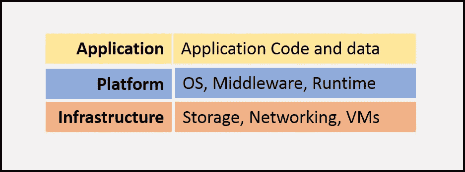
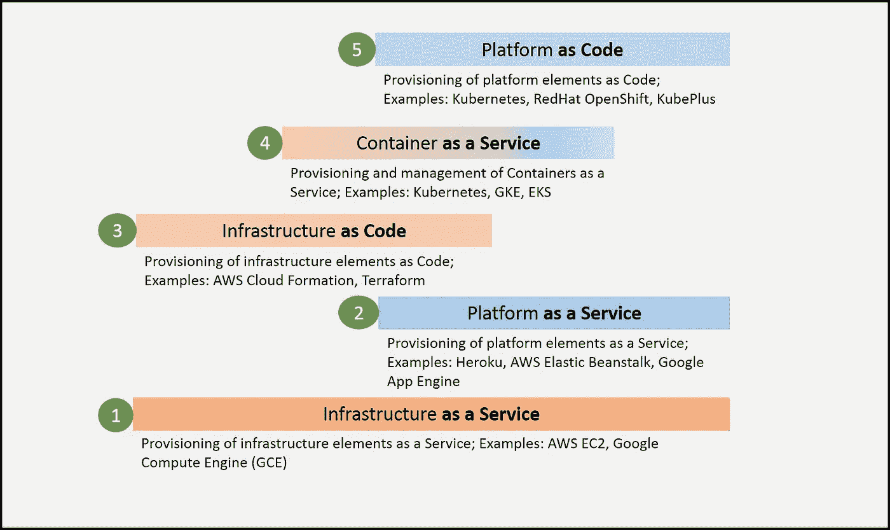

# 在 Kubernetes 世界中，从 PaaSes 到平台即代码的演变

> 原文：<https://itnext.io/evolution-of-paases-to-platform-as-code-in-kubernetes-world-74464b0013ca?source=collection_archive---------1----------------------->

典型的应用程序堆栈可以描述如下，其中基础架构是构建应用程序平台的基础，然后在此堆栈上部署应用程序。

云计算的发展带来了简化这些应用程序堆栈构建的机会。云计算始于“**即服务**”的概念，在这一概念中，您可以承诺按需提供此应用程序堆栈“**”的元素**。这种“即服务”模式始于 AWS EC2 等“基础设施即服务(IaaS)”，然后慢慢发展为 Heroku、Amazon Beanstalk、Google App Engine 等“平台即服务(PaaS)”。

与“**作为代码**的概念并行，它主要在“基础设施作为代码”系统中流行，如 AWS Cloud Formation 和 Terraform。“基础设施即代码”系统在提供基础设施元素方面带来了“**可重复性和可共享性**”的承诺。您可以声明性地编写基础结构元素，并使用该声明/代码重复提供它们。AWS Cloud Formation 等“基础设施即代码”系统在单个云上重复创建相同的基础设施元素，而 Terraform 等系统在多云环境中跨多个云创建这些元素。这些系统依赖于抽象 IaaS APIs，并以公共声明性语言捕获这些 API。

容器化的浪潮模糊了基础设施层和平台层之间的界限，并带来了通常被称为“容器即服务”(CaaS)的新系统。容器展示了在不同基础设施层之间移动相同应用程序堆栈的前景。这改变了“多云”的概念，从仅仅在不同的云中提供元素，到能够在云之间移动整个应用程序堆栈。

Kubernetes 以其声明性的 YAML 格式帮助实现了容器化应用平台栈的可重复性和可共享性。这样的 YAML 声明可以用于你的应用程序代码，也可以用于容器化的平台元素，比如 MySQL、RabbitMQ 等。

事实上，Kubernetes 和它的 YAML 声明可以被认为是一个系统，它提供了以代码形式创建应用程序平台的能力。将基础设施作为代码，Kubernetes YAMLs 易于共享，并且可以在任何云上的任何 Kubernetes 集群上以重复的方式创建应用程序堆栈。它们之间的区别在于，平台即代码系统为[应用程序及其与所提供的平台元素](https://medium.com/@cloudark/microservices-and-relational-data-stores-in-public-clouds-7c7949d29ae1)的绑定提供了一流的支持。相比之下，作为代码系统的基础设施只关注基础设施元素的供应和管理。

深入思考后，我们意识到，基于应用平台堆栈需求的复杂程度，存在一系列“平台即代码”系统。一端是库贝内特斯基地。使用它，您可以创建/重新创建使用基本 Kubernetes 构造定义的应用程序平台，其中所有平台元素都被定义为容器。

但是，如果应用程序想要绑定和使用特定云上作为托管服务提供的平台元素(例如:Amazon RDS、Google CloudSQL 等),基本的 Kubernetes 是不够的。).为了解决此类用例，我们创建了一个名为“ [CaaStle](https://github.com/cloud-ark/caastle) 的工具，该工具将托管托管服务的供应与 CaaS 的声明式定义格式相集成，从而提供全栈微服务开发&部署体验。CaaStle 是“平台即代码”系统的一个例子，它专注于解决容器化应用程序与基于云的托管服务的集成。这种系统的另一个例子是安装了[服务目录服务器](https://github.com/kubernetes-incubator/service-catalog)的 Kubernetes 集群。

如果您决定不使用托管服务，而是坚持使用容器化的平台元素来避免供应商锁定，则会出现另一种复杂性。在这种情况下，如果您需要容器化平台元素的高级功能，例如执行特定于应用程序的生命周期操作(例如:定期备份 MySQL 容器或更新 MySQL 实例的用户密码)，那么基本的 Kubernetes YAMLs 是不够的。

这就是 [Kubernetes 操作符](https://coreos.com/operators/)概念的由来。Kubernetes 操作符允许您使用定制资源和定制控制器来扩展 Kubernetes。使用 Kubernetes Operator，可以为所需的平台元素定义定制资源，如 MySQL、Nginx，类似于任何其他本地 Kubernetes 资源，如 Pods、服务等。您的平台元素成为 Kubernetes 声明性 YAML 定义的组成部分。所需的特定于应用的生命周期动作被编码在管理这些定制资源的定制控制器中。用操作符扩展的 Kubernetes 集群成为另一种“平台即代码”系统。

我们现在正在开发名为' [KubePlus](https://github.com/cloud-ark/kubeplus) '的框架，该框架遵循了这种平台作为代码的方法，通过运营商来扩展 Kubernetes。我们正在标准化一些开源的 Kubernetes 操作者，这样他们就可以互相协作，形成一个完整的应用堆栈。

像 KubePlus 这样的系统的一个显著特点是，它们关注于扩展基础 CaaS 层(在这里是 Kubernetes)而不是抽象它。这与传统的平台即服务系统形成了鲜明的对比，后者倾向于将底层 CaaS 系统抽象化。关于 Kubernetes，抽象之上的扩展允许用户利用 Kubernetes 的全部功能。此外，他们可以根据自己的需求定制自己的平台，而不会拘泥于固执己见地选择预构建的平台。因此，在某种程度上，KubePlus 的“平台即代码”方法可以被认为是为 Kubernetes 提供了“构建您自己的 PaaS”体验。

我们相信“平台即代码”是为 Kubernetes 构建下一代定制平台和平台即服务系统的基础原则。它们将提供在任何 Kubernetes 集群上创建定制平台栈的可重复性。平台工件，如 Kubernetes YAML 文件，舵图，运营商清单等。将在团队之间共享。如果需要托管服务，它们将直接集成到应用程序编排模板中。如果避免厂商锁定至关重要，那么嵌入定制生命周期操作的 Kubernetes 运营商将是最佳选择。

[www.cloudark.io](https://cloudark.io/)

注意:如果你喜欢这篇文章，你可能也想看看【Kubernetes API 扩展如何实现平台即代码体验