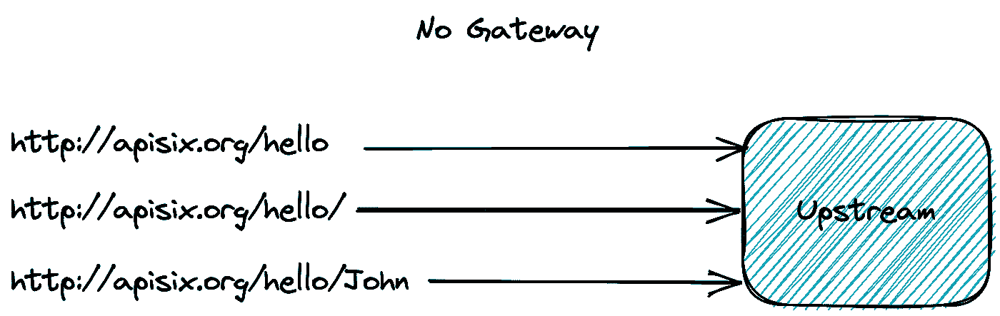
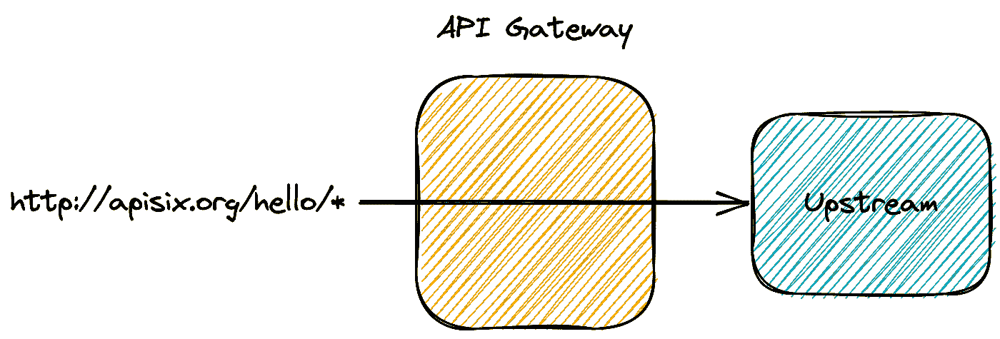
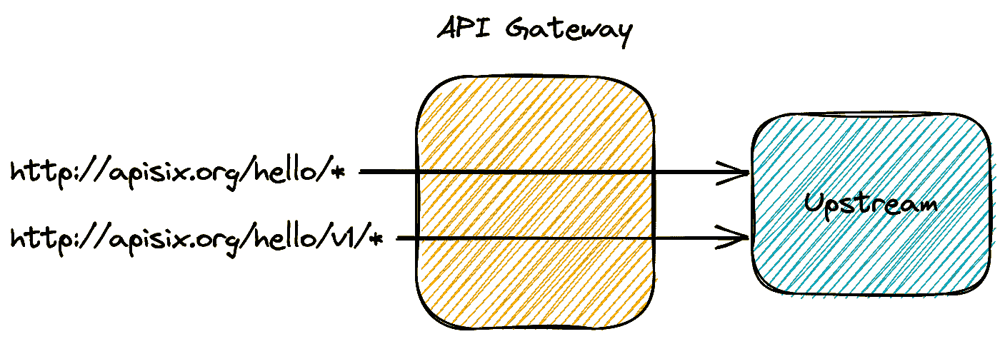
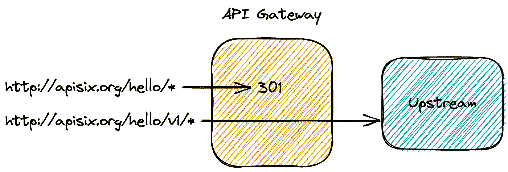
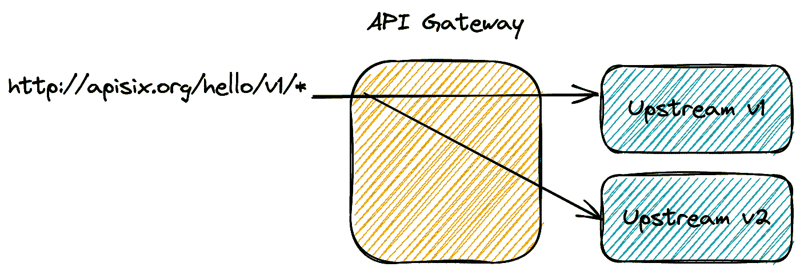

# 进化 RESTful APIs，一步一步的方法

> 原文：<https://itnext.io/evolving-apis-9cb69ea47754?source=collection_archive---------7----------------------->


设计一个直观、用户友好的 RESTful API 是一项艰巨的工作。如果这是你的第一次尝试，它可能已经是一项艰巨的任务了。规划 API 的生命周期管理可能是事后的想法。但无论如何这都是可能的:在这篇文章中，我想提出一个简单的方法来改进你的 API，即使它不是计划中的。

# 最初的情况

让我们考虑一个在使用时会说“Hello”的示例应用程序。

```
> curl http://org. apisix/hello
Hello world> curl http://org. apisix/hello/Joe
Hello Joe
```

底层技术不重要；我们将关注 API 部分。



# 使用 API 网关

第一步也是最关键的一步是停止将应用程序直接暴露给互联网，并在它们之间建立一个 API 网关。如果你不熟悉 API 网关的概念，你可以把它想象成一个增强的反向代理。维基百科提供了以下定义:

> ***网关*** *:充当 API 前端的服务器，接收 API 请求，实施节流和安全策略，将请求传递给后端服务，然后将响应传回给请求者。网关通常包括一个转换引擎，用于动态地编排和修改请求和响应。网关还可以提供收集分析数据和提供缓存等功能。网关可以提供支持认证、授权、安全、审计和法规遵从性的功能。*
> 
> *—* [*API 管理*](https://en.%20wikipedia.%20org/wiki/API_management)

在这篇文章中，我将使用 [Apache APISIX](https://apisix.%20apache.%20org/) ,但是您可以随意使用您最熟悉的一个。

公开网关而不是应用程序要求您更新 DNS 记录以指向网关而不是应用程序，并等待它在全球范围内传播。这可能需要一些时间。为了跟踪传播，您可以使用类似 [dnschecker](https://dnschecker.%20org/) 的网站。

但是，您首先需要将 HTTP 请求从网关路由到您的应用程序。
使用 APISIX，您可以通过向网关发送 HTTP 请求来创建一个*路由*。

```
curl http://apisix:9080/apisix/admin/routes/1 -H 'X-API-KEY: xyz' -X PUT -d ' # 1-2
{
  "name": "Direct Route to Old API",               # 3
  "methods": ["GET"],                              # 4
  "uris": ["/hello", "/hello/", "/hello/*"],       # 5
  "upstream": {                                    # 6
    "type": "roundrobin",                          # 8
    "nodes": {
      "oldapi:8081": 1                             # 7
    }
  }
}'
```

1.  APISIX 可以分配一个自动生成的 ID 或使用提供的 ID。在本例中，我们选择后者，在 URL — `1`中传递它，并使用`PUT`动词
2.  为了更新路由，我们需要传递 API 键
3.  命名路由不是必需的，但是它可以让我们更好地理解它的作用
4.  要路由的 HTTP 方法的数组
5.  要路由的 URL 数组
6.  上游是后端应用程序。在我们的例子中，它是 Hello World API。
7.  节点及其各自权重的散列表。权重只有在有多个节点时才有意义，但在这个简单的场景中并非如此。
8.  配置多个节点时使用的平衡算法



在这一阶段，您可以查询网关并获得与之前相同的结果:

```
> curl http://org. apisix/hello
Hello world> curl http://org. apisix/hello/Joe
Hello Joe
```

# API 版本

发展一个 API 意味着多个版本的 API 在某个时候需要共存。版本 1 的 API 有三个选项:

*   查询参数:

```
curl [http://org.](http://org.) apisix/hello?version=1
curl [http://org.](http://org.) apisix/hello?version=2
```

*   标题:

```
curl -H 'Version: 1' [http://org.](http://org.) apisix/hello
curl -H 'Version: 2' [http://org.](http://org.) apisix/hello
```

*   路径:

```
curl [http://org.](http://org.) apisix/v1/hello
curl [http://org.](http://org.) apisix/v2/hello
```

很多文章都写了什么是最佳选择。在本文的范围内，我们将使用基于路径的版本控制，因为它是最普遍的。如果您想使用其他选项，APISIX 支持它们。

在上一节中，我们创建了一个*路由*，它包装了一个*上游*。APISIX 允许我们创建一个带有专用 ID 的上游，以便在几个路由之间重用它。

```
curl http://apisix:9080/apisix/admin/upstreams/1 -H 'X-API-KEY: xyz' -X PUT -d ' # 1
{
  "name": "Old API",                                                             # 2
  "type": "roundrobin",
  "nodes": {
    "oldapi:8081": 1
  }
}'
```

1.  使用`upstreams`路径
2.  新上游的有效负载

在将查询转发到上游之前，我们还需要重写到达网关的查询。后者知道`/hello`，不知道`/v1/hello`。APISIX 允许这样的转换、过滤等。，通过插件。让我们创建一个插件配置来重写路径:

```
curl http://apisix:9080/apisix/admin/plugin_configs/1 -H 'X-API-KEY: xyz' -X PUT -d ' # 1
{
  "plugins": {
    "proxy-rewrite": {                                        # 2
      "regex_uri": ["/v1/(.*)", "/$1"]                        # 3
    }
  }
}'
```

1.  使用`plugin-configs`路径
2.  使用[代理重写](https://apisix.%20apache.%20org/docs/apisix/plugins/proxy-rewrite/)插件
3.  删除版本前缀

我们现在可以创建引用新创建的上游和插件配置的版本化路由:

```
curl http://apisix:9080/apisix/admin/routes/2 -H 'X-API-KEY: xyz' -X PUT -d '  # 1
{
  "name": "Versioned Route to Old API",
  "methods": ["GET"],
  "uris": ["/v1/hello", "/v1/hello/", "/v1/hello/*"],
  "upstream_id": 1,
  "plugin_config_id": 1
}'
```

1.  看，马，一条新路线！



在此阶段，我们已经配置了两条路由，一条是版本化的，另一条是非版本化的:

```
> curl http://org. apisix/hello
Hello world> curl http://org. apisix/v1/hello
Hello world
```

# 将用户从非版本化路径迁移到版本化路径

我们已经对我们的 API 进行了版本化，但是我们的用户可能仍然使用遗留的非版本化的 API。我们希望它们迁移，但是我们不能因为用户不知道就删除遗留路由。幸运的是，301 HTTP 状态代码是我们的朋友:我们可以让用户知道资源已经从\ [http://org](http://org) 转移了。API six/hello to \[http://org](http://org)。apisix/v1/hello。需要在初始路由上配置[重定向](https://apisix.%20apache.%20org/docs/apisix/plugins/redirect/)插件；

```
curl http://apisix:9080/apisix/admin/routes/1 -H 'X-API-KEY: xyz' -X PATCH -d '
{
  "plugins": {
    "redirect": {
      "uri": "/v1$uri",
      "ret_code": 301
    }
  }
}'
```



结果很有趣:

```
>curl http://apisix. org/hello<html>
<head><title>301 Moved Permanently</title></head>
<body>
<center><h1>301 Moved Permanently</h1></center>
<hr><center>openresty</center>
</body>
</html>>curl -L apisix:9080/hello                     # 1
Hello world
```

1.  `-L`选项跟随重定向

要么用户将透明地使用新的端点，因为他们将跟随，要么他们的集成中断，他们将注意到 301 状态和要使用的新 API 位置。

# 了解你的用户

您可能已经注意到，到目前为止，我们还不知道谁在使用我们的 API。当我们必须引入一个变化时，我们必须有创造性，不破坏用户的使用。其他变化可能不那么容易应付。因此，我们应该努力了解我们的用户，以便在必要时联系他们。

老实说吧。大多数开发者，包括我自己，如果可以避免的话，都不喜欢注册和给出联系方式。我想这是营销团队的错，他们不理解我们的心态——不要打电话给我，我会打电话给你。然而，在这种特殊情况下，这将是有益的。

“核”选项完全不允许用户在系统注册之前调用我们的 API。我更喜欢另一种选择:限制未注册用户在一段时间内可以拨打的电话数量。如果他们达到了限制，我们将返回著名的 429 HTTP 状态和邀请他们注册的消息。

在撰写本文时，还没有现成的插件可以做到这一点。但是有可能写出我们自己的。APISIX 位于 Lua 引擎之上，所有提供的插件都是用 Lua 编写的。或者，可以用 Go、Python、WebAssembly 或任何基于 JVM 的语言编写插件。

为了简单起见，我写了一个 Lua 插件。由于这篇文章的目标不是理解 Lua，我就不深入探讨了。如果你对代码感兴趣，可以在 [GitHub](https://github.%20com/nfrankel/evolve-apis/blob/master/unauth-limit-plugin/src/unauth-limit.%20lua) 上找到。当公众准备好了，我们还有几个步骤要完成:

1.  配置 APISIX 以使用目录:

`apisix: extra_lua_path: "/opt/apisix/?.lua"`

APISIX 可以使用位于`/opt/apisix/`文件夹中的任何 Lua 脚本

2.加载插件:

APISIX 可以自己热重装。我们不需要重启它，也不需要停机来添加额外的插件！

`curl http://apisix:9080/apisix/admin/plugins/reload -H 'X-API-KEY: xyz' -X PUT`

3.修补现有插件配置:

最后，我们需要配置插件本身。由于我们创建了一个专用的插件配置，我们只需用新的配置更新它:

```
curl http://apisix:9080/apisix/admin/plugin_configs/1 -H 'X-API-KEY: xyz' -X PATCH -d '
{
  "plugins": {
    "proxy-rewrite": {                                # 1
      "regex_uri": ["/v1/(.*)", "/$1"]
    },
    "unauth-limit": {                                 # 2
      "count": 1,                                     # 3
      "time_window": 60,                              # 3
      "key_type": "var",                              # 4
      "key": "consumer_name",                         # 4
      "rejected_code": 429,
      "rejected_msg": "Please register at https://apisix. org/register to get your API token and enjoy unlimited calls"
    }
  }
}'
```

1.  不幸的是，我们需要重复现有的插件配置。APISIX 团队正在解决这个问题，所以你可以在不知道现有插件的情况下在配置中添加一个插件。
2.  我们的插件！
3.  如果用户通过了身份验证，插件会限制用户每 60 秒只能打一次电话。否则，它不限制任何东西。
4.  在下一节中解释

我们现在可以检查它是否如预期的那样运行:

```
>curl apisix:9080/v1/hello
Hello world>curl apisix:9080/v1/hello
{"error_msg":"Please register at https:\/\/apisix. org\/register to get your API token and enjoy unlimited calls"}
```

的确如此。

# 创建用户

您可能会开始看到您的用户访问注册页面，这取决于您对未授权使用的限制程度。注册有许多方面；它可以是:

*   自动化或需要尽可能多的手动验证步骤
*   免费还是付费
*   简单到询问一封无需进一步验证的电子邮件，或者复杂到需要更多数据
*   等等。

这要看你的具体语境。

关于 APISIX，最终，它转化为一个新的*消费者*。要创建这样的消费者，我们需要配置一个指定身份验证的插件。一些身份验证插件是现成可用的:basic、API key、JWT、OpenId、LDAP、Keycloak 等。

在这篇文章的范围内， [key-auth 插件](https://apisix.%20apache.%20org/docs/apisix/plugins/key-auth)已经足够了。让我们配置一个由 API 密钥验证的消费者对象:

```
curl http://apisix:9080/apisix/admin/consumers -H 'X-API-KEY: xyz' -X PUT -d '
{
  "username": "johndoe",                 # 1
  "plugins": {
    "key-auth": {                        # 2
      "key": "mykey"                     # 3
    }
  }
}'
```

1.  消费者的 ID
2.  要使用的插件
3.  有效令牌是`mykey`

注意默认的头是`apikey`。有可能配置另一个:请检查密钥认证插件[文档](https://apisix.%20apache.%20org/docs/apisix/plugins/key-auth#attributes)。

我们现在可以测试我们的设置，并验证它是否符合我们的要求:

```
>curl -H 'apikey: mykey' apisix:9080/v1/hello
Hello world>curl -H 'apikey: mykey' apisix:9080/v1/hello
Hello world
```

# 生产中的测试

在这个阶段，我们现在准备让用户了解我们的 Hello world API 的改进版本。我假设我们的团队已经彻底测试过了，但是新代码总是有风险的。部署现有应用程序的一个充满 bug 的新版本会对 API 提供商的形象(和收入)产生负面影响！).

为了将风险降至最低，一个公认的策略是放飞金丝雀:

> *Canary release 是一种降低在生产中引入新软件版本的风险的技术，它通过在将变更推广到整个基础架构并提供给所有人之前，缓慢地将变更推广到一小部分用户。*
> 
> *—*[*canary release*](https://martinfowler.%20com/bliki/CanaryRelease.%20html)

如果某个东西失败了，它只会影响一小部分用户群，我们将能够在没有太大影响的情况下恢复更改。然而，通过 API 网关，我们可以在 canary 发布之前引入一个步骤:我们将生产流量复制到新的 API 端点。尽管网关会丢弃响应，但我们可以发现额外的错误，而对用户没有任何影响。

APISIX 提供了[代理镜像](https://apisix.%20apache.%20org/docs/apisix/plugins/proxy-mirror)插件来复制到其他节点的生产流量。让我们更新我们的插件配置:

```
curl http://apisix:9080/apisix/admin/plugin_configs/1 -H 'X-API-KEY: xyz' -X PATCH -d '
{
 "plugins": {
    "proxy-rewrite": {
      "regex_uri": ["/v1/(.*)", "/$1"]
    },
    "unauth-limit": {
      "count": 1,
      "time_window": 60,
      "key_type": "var",
      "key": "consumer_name",
      "rejected_code": 429,
      "rejected_msg": "Please register at https://apisix. org/register to get your API token and enjoy unlimited calls"
    },
    "proxy-mirror": {
      "host": "http://new. api:8082"                             # 1
    }
  }
}'
```

1.  APISIX 也会向该主机发送流量



我们可以监控新的和旧的端点，以确保前者不会比后者发生更多的错误。如果没有，我们可以修复错误并重新部署，直到它的情况。我们现在准备释放金丝雀。

首先，我们创建一个指向新 API 的上游:

```
curl http://apisix:9080/apisix/admin/upstreams/2 -H 'X-API-KEY: xyz' -X PUT -d '
{
  "name": "New API",
  "type": "roundrobin",
  "nodes": {
    "newapi:8082": 1
  }
}'
```

然后，我们可以用[流量分流](https://apisix.%20apache.%20org/docs/apisix/plugins/traffic-split/)替换`proxy-mirror`插件:

```
curl http://apisix:9080/apisix/admin/plugin_configs/1 -H 'X-API-KEY: xyz' -X PATCH -d '
{
 "plugins": {
    "proxy-rewrite": {
      "regex_uri": ["/v1/(.*)", "/$1"]
    },
    "unauth-limit": {
      "count": 1,
      "time_window": 60,
      "key_type": "var",
      "key": "consumer_name",
      "rejected_code": 429,
      "rejected_msg": "Please register at https://apisix. org/register to get your API token and enjoy unlimited calls"
    },
    "traffic-split": {
      "rules": [
        {
          "weighted_upstreams": [      # 1
            {
              "upstream_id": 2,
              "weight": 1
            },
            {
              "weight": 1
            }
          ]
        }
      ]
    }
  }
}'
```

1.  出于演示目的，将 50%的流量发送到新的 API。在现实生活中，您可能会从更低的起点开始，甚至只为新端点配置内部用户。

```
curl -L -H 'apikey: mykey' apisix:9080/hello
Hello worldcurl -L -H 'apikey: mykey' apisix:9080/hello
Hello world (souped-up version!)
```

如果一切正常，我们可以逐渐增加发送到新 API 的流量百分比，直到达到 100%。我们现在可以移除流量分割，并从默认端点重定向到 v2，而不是 v1。

# 反对旧版本

大多数用户可能会迁移到新版本以从中受益，但他们中的一小部分人会留在 v1 上。有各种各样的原因:没有合适的时间(提示:从来都不是)，太贵，没有足够的动力去迁移，等等。但是作为 API 提供者，每个部署的版本都有一定的成本。您可能需要在某个时候淘汰 v1。

REST 不是一个标准，但是 IETF 有一个关于它的草案规范。有关更多详细信息，请阅读[弃用 HTTP 头字段](https://tools.%20ietf.%20org/id/draft-dalal-deprecation-header-03.%20html)。顾名思义，它基于特定的 HTTP 响应头。

在 API 网关的帮助下，我们可以配置路由来传达其未来的废弃和替换。为此，APISIX 提供了[响应-重写](https://apisix.%20apache.%20org/docs/apisix/plugins/response-rewrite/)。虽然它可以重写响应的任何部分，但我们将使用它来添加额外的 deprecation 头:

```
curl -v http://apisix:9080/apisix/admin/plugin_configs/1 -H 'X-API-KEY: xyz' -X PATCH -d '
{
 "plugins": {
    "proxy-rewrite": {
      "regex_uri": ["/v1/(.*)", "/$1"]
    },
    "unauth-limit": {
      "count": 1,
      "time_window": 60,
      "key_type": "var",
      "key": "consumer_name",
      "rejected_code": 429,
      "rejected_msg": "Please register at https://apisix. org/register to get your API token and enjoy unlimited calls"
    },
    "response-rewrite": {
      "headers": {
        "Deprecation": "true",
        "Link": "<$scheme://apisix:$server_port/v2/hello>; rel=\"successor-version\""
      }
    }
  }
}'curl -v -H 'apikey: mykey' apisix:9080/v1/hello< HTTP/1\. 1 200 
< Content-Type: text/plain;charset=UTF-8
< Content-Length: 11
< Connection: keep-alive
< Date: Fri, 18 Feb 2022 16:33:30 GMT
< Server: APISIX/2\. 12\. 0
< Link: <http://apisix:9080/v2/hello>; rel="successor-version"
< Deprecation: true
< 
Hello world
```

# 结论

在这篇文章中，我们描述了一个简单的逐步过程来管理你的 API 的生命周期:

1.  不要直接公开你的 APIs 在前端设置一个 API 网关
2.  使用路径、查询参数或请求头对现有 API 进行版本化
3.  将用户从未版本化的端点迁移到状态代码为 301 的版本化端点
4.  轻轻地推动你的用户注册
5.  在生产中测试，首先通过复制流量，然后将一小部分用户转移到新版本
6.  正式发布新版本
7.  通过标准响应头传达对旧版本的反对意见

**更进一步:**

*   [阿帕奇 APISIX](https://apisix.%20apache.%20org/)

*原载于* [*一个 Java 极客*](https://blog.frankel.ch/evolve-apis/)*2022 年 2 月 27 日*