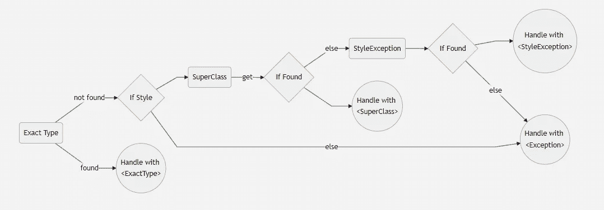

# 风格开发日志 1:异常处理

> 原文：<https://itnext.io/exception-handling-with-style-6020f01af7d8?source=collection_archive---------4----------------------->

> 【https://discord.gg/bPcscvBM】加入我们的不和谐社区[](https://discord.gg/hdCdYfwS4C)**获取消息。**

*我将在一个系列中分享与风格后端框架相关的开发，我已经在[文章](/style-backend-framework-d544bdb78a36)中宣布了。如果你对
风格没有概念或者不理解下面例子中的组件，请看看主要的
文章。*

*您可以通过电子邮件订阅 medium 帐户，以跟踪事态发展。我不会在这个系列和风格之外的主题上添加文章，所有文章都是免费阅读的。这个系列可以被认为是一个
开发者博客。由于这个原因，我将分享发展情况。文档中预期的主题上下文
不应该出现在本系列中。众所周知，后端在运行时会收到许多意想不到的请求。处理这些意外的
请求和事务，并将错误消息发送给客户端。这些可能是与开发人员相关的(例如，错误的类型转换)，也可能是预计在运行时发生的异常(未经授权的请求)。

首先，为了最大限度地减少样式中的意外错误，在服务器第一次运行时，从组件
树中提取错误。程序将停止，因为这些错误没有被处理。*

*在运行时，来自请求的所有异常都被处理，并且服务器不会停止。由于[avid _ catches _ without _ on _ clauses](https://dart-lang.github.io/linter/lints/avoid_catches_without_on_clauses.html)，错误未得到处理。*

*我的主文章中的主题对于解释这个主题很重要。*

# *异常回绕*

*使用 Style，`ExceptionWrapper<Type>`您可以通过类型为发生在包装器下的所有异常定义一个端点。*

*如果没有用端点上下文中发生的异常的确切类型来包装，则使用为超类创建的包装。如果它不存在，它将被默认包装的“异常”端点处理。*

*本例中所有异常都由`MyExEnd`端点处理。*

```
*ExceptionWrapper<Exception>(
    child: Route(
        "exception",
        root: Throw(Exception("always throw"))
    ),
    exceptionEndpoint: MyExEnd()
)*
```

# *等级制度*

*在子组件中重新包装时，包装异常会被覆盖。*

*有 4 层不同的例外。(顶部最具包容性)*

*   *例外*
*   *样式异常-其他异常*
*   *ExceptionGroup (StyleException 实现:客户端错误，服务器错误)*
*   *ExactType(异常组实现)*

*获取上下文中的异常终结点时，遵循以下顺序。*

**

## *`StyleException`*

*`StyleException`是一个异常实现。这个异常包含一些信息，比如 statusCode、异常发生的位置、它正在处理的请求以及客户端信息等。*

## *客户端错误—服务器错误*

*它们是具有 4**/5**状态代码的例外。以下链接中的所有例外都已实现。*

*例如有`NotFoundException` (404)。*

*[](https://developer.mozilla.org/en-US/docs/Web/HTTP/Status#client_error_responses) [## HTTP 响应状态代码- HTTP | MDN

### 这个临时响应表明客户端应该继续请求或者忽略响应，如果请求…

developer.mozilla.org](https://developer.mozilla.org/en-US/docs/Web/HTTP/Status#client_error_responses) 

## 例子

作为最后手段的所有例外。

```
ExceptionWrapper<Exception>(
    child: ..,
    exceptionEndpoint: MyExceptionEndpoint()),
```

如果精确类型或中间(客户端-服务器错误)类型没有被包装，则处理所有的`StyleException`。

```
ExceptionWrapper<StyleException>(
    child: ..,
    exceptionEndpoint: MyExceptionEndpoint()),
```

如果不是精确的包装类型，处理所有的`ClientError`。

```
ExceptionWrapper<ClientError>(
    child: ..,
    exceptionEndpoint: MyExceptionEndpoint()),
```

处理`BadRequests`。

```
ExceptionWrapper<BadRequest>(
    child: ..,
    exceptionEndpoint: MyExceptionEndpoint()),
```

手柄`FormatException`。

```
ExceptionWrapper<FormatException>(
    child: ..,
    exceptionEndpoint: MyExceptionEndpoint()),
```

## 不止一个定义

```
ExceptionWrapper.fromMap(
  map: {
    InternalServerError : My500Endpoint(),
    MethodNotAllowedException : My405Endpoint()
  },
  child: ..,),
```

## 服务器默认值

同`ExceptionWrapper.fromMap`

```
Server(
    defaultExceptionEndpoints: {
      InternalServerError : My500Endpoint(),
      MethodNotAllowedException : My405Endpoint()
    },
    children: []
);
```

# 端点

```
*/// TODO: Document* class MyStyleExEndpoint extends ExceptionEndpoint<StyleException> {
  MyStyleExEndpoint() : super();

  @override
  FutureOr<Response> onError(
      Message message, StyleException exception, StackTrace stackTrace) {
    return (message as Request).createResponse({
      "err": "client_error_received",
      "type": "${exception.runtimeType}",
      "sup": "${exception.superType}",
      "st": stackTrace.toString()
    });
  }
}
```

`Message`是五月`Request`还是`Response`。因为创建响应后可能会出现异常。(例如发生在`ResponseSchemaGate`)。*