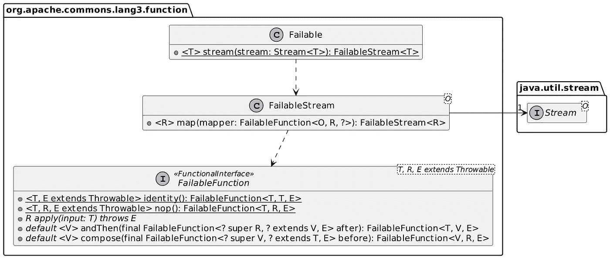
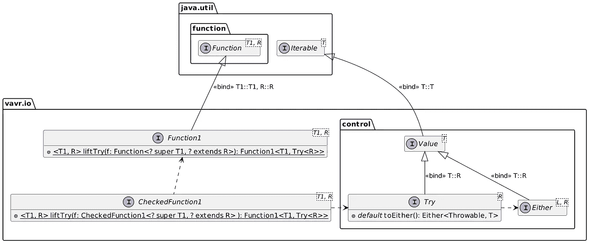

# Java lambdas 中的异常

> 原文：<https://itnext.io/exceptions-lambdas-efba6c591483?source=collection_archive---------0----------------------->


Java 引入了*检查异常*的概念。与早期的方法相比，强迫开发人员管理异常的想法是革命性的。

如今，Java 仍然是唯一广泛使用的提供检查异常的语言。例如，Kotlin 中的每个异常都是未检查的。

即使在 Java 中，新特性也与检查异常不一致:Java 内置函数接口的签名不使用异常。当在 lambdas 中集成遗留代码时，会导致代码变得繁琐。这在溪流中显而易见。

在这篇文章中，我想更深入地探讨如何管理这样的问题。

# 代码中的问题

这里有一个示例代码来说明这个问题:

```
Stream.of("java.lang.String", "ch.frankel.blog.Dummy", "java.util.ArrayList")
      .map(it -> new ForNamer().apply(it))                      // 1
      .forEach(System.out::println);
```

1.  不编译:需要捕捉选中的`ClassNotFoundException`

我们必须添加一个 try/catch 块来解决编译问题。

```
Stream.of("java.lang.String", "ch.frankel.blog.Dummy", "java.util.ArrayList")
      .map(it -> {
          try {
              return Class.forName(it);
          } catch (ClassNotFoundException e) {
              throw new RuntimeException(e);
          }
      })
      .forEach(System.out::println);
```

添加块违背了易于阅读的管道的目的。

# 将 try/catch 块封装到一个类中

为了恢复可读性，我们需要重构代码来引入一个新的类。IntelliJ IDEA 甚至提出了一个记录:

```
var forNamer = new ForNamer();                                  // 1
Stream.of("java.lang.String", "ch.frankel.blog.Dummy", "java.util.ArrayList")
      .map(forNamer::apply)                                     // 2
      .forEach(System.out::println);record ForNamer() implements Function<String, Class<?>> { @Override
    public Class<?> apply(String string) {
        try {
            return Class.forName(string);
        } catch (ClassNotFoundException e) {
            return null;
        }
    }
}
```

1.  创建单个记录对象
2.  重复使用它

# 尝试使用龙目岛

Project Lombok 是一个编译时注释处理器，它生成额外的*字节码*。人们使用适当的注释并获得结果，而不必编写样板代码。

> Project Lombok 是一个 java 库，可以自动插入到你的编辑器和构建工具中，增加你的 java 的味道。再也不用编写另一个 getter 或 equals 方法了，有了一个注释，你的类就有了一个全功能的构建器，自动记录变量，等等。
> 
> *—* [*项目龙目岛*](https://projectlombok.org/)

Lombok 提供了`@SneakyThrow`注释:它允许抛出检查过的异常，而不用在方法签名中声明它们。然而，目前它并不适用于现有的 API。

如果你是一个 Lombok 用户，请注意有一个[打开的 GitHub 问题](https://github.com/projectlombok/lombok/issues/3096)，状态为“已暂停”。

# 平民郎来拯救

[Apache Commons Lang](https://commons.apache.org/proper/commons-lang/) 是一个古老的项目。它在当时很普遍，因为它提供了本来可以成为 Java API 一部分的实用程序，但没有。这是一个比在每个项目中重新发明`DateUtils`和`StringUtils`更好的选择。在研究这篇文章的时候，我发现它仍然被很好的 API 定期维护。其中之一就是`Failable` API。

API 由两部分组成:

1.  一张包装纸包裹着一个`Stream`
2.  签名接受异常的管道方法

这里有一小段摘录:



代码最终变成了我们一开始期望的样子:

```
Stream<String> stream = Stream.of("java.lang.String", "ch.frankel.blog.Dummy", "java.util.ArrayList");
Failable.stream(stream)
        .map(Class::forName)                                    // 1
        .forEach(System.out::println);
```

# 修复编译时错误是不够的

前面的代码在*运行时*抛出一个包装在`UndeclaredThrowableException`中的`ClassNotFoundException`。我们满足了编译器，但是我们没有办法指定预期的行为:

*   在第一个异常时抛出
*   丢弃异常
*   聚合类和异常，这样我们可以在管道的最后阶段对它们进行操作
*   别的东西

为了实现这一点，我们可以利用 Vavr 的力量。Vavr 是一个为 Java 语言带来函数式编程能力的库:

> *Vavr core 是 Java 的函数库。这有助于减少代码量并增加健壮性。迈向函数式编程的第一步是开始考虑不可变的值。Vavr 提供了不可变的集合以及必要的函数和控制结构来操作这些值。结果是美丽的，只是工作。*
> 
> *—*[*Vavr*](https://www.vavr.io/)

假设我们想要一个收集异常和类的管道。下面是 API 的摘录，描述了几个构建块。



它转化为以下代码:

```
Stream.of("java.lang.String", "ch.frankel.blog.Dummy", "java.util.ArrayList")
      .map(CheckedFunction1.liftTry(Class::forName))            // 1
      .map(Try::toEither)                                       // 2
      .forEach(e -> {
          if (e.isLeft()) {                                     // 3
              System.out.println("not found:" + e.getLeft().getMessage());
          } else {
              System.out.println("class:" + e.get().getName());
          }
      });
```

1.  将呼叫打包到 Vavr 中`Try`
2.  将`Try`转换成`Either`来保存异常。如果我们不感兴趣，我们可以用一个`Optional`来代替
3.  根据`Either`是否包含异常*左*或预期结果*右*来行动

到目前为止，我们一直停留在 Java 流的世界中。直到看起来不“好看”的`forEach`才按预期工作。

Vavr 确实提供了自己的`Stream`类，它模仿了 Java `Stream` API 并增加了额外的特性。让我们用它来重写管道:

```
var result = Stream.of("java.lang.String", "ch.frankel.blog.Dummy", "java.util.ArrayList")
        .map(CheckedFunction1.liftTry(Class::forName))
        .map(Try::toEither)
        .partition(Either::isLeft)                              // 1
        .map1(left -> left.map(Either::getLeft))                // 2
        .map2(right -> right.map(Either::get));                 // 3result._1().forEach(
  it -> System.out.println("not found: " + it.getMessage()));   // 4
result._2().forEach(
  it -> System.out.println("class: " + it.getName()));          // 4
```

1.  将`Either`的`Stream`分成两个`Stream`的元组
2.  将左流从`Either`的`Stream`展平到`Throwable`的`Stream`
3.  将右流从`Either`的`Stream`展平到`Class`的`Stream`
4.  做我们想做的任何事

# 结论

Java 的最初设计大量使用了检查异常。编程语言的发展证明这不是一个好主意。

Java 流不能很好地处理检查异常。将后者集成到前者所必需的代码看起来并不怎么样。为了恢复我们期望的流的可读性，我们可以依赖 Apache Commons Lang。

汇编只代表了问题的一小部分。我们通常希望对异常采取行动，而不是停止管道或忽略异常。在这种情况下，我们可以利用 Vavr 库，它提供了一种更加实用的方法。

你可以在 [GitHub](https://github.com/ajavageek/lambdas-exceptions) 上找到这篇文章的源代码。

**更进一步:**

*   [Java 8 Lambda 表达式中的异常](https://www.baeldung.com/java-lambda-exceptions)
*   [如何用 Lambda 表达式处理检查过的异常](https://dzone.com/articles/how-to-handle-checked-exception-in-lambda-expressi)
*   [“stack overflow:抛出异常的 Java 8 Lambda 函数？”](https://stackoverflow.com/questions/18198176/java-8-lambda-function-that-throws-exception)
*   [失败的 JavaDoc](https://commons.apache.org/proper/commons-lang/apidocs/org/apache/commons/lang3/function/Failable.html)
*   [Vavr](https://docs.vavr.io/)
*   [使用 Vavr 的 Lambda 表达式中的异常](https://www.baeldung.com/exceptions-using-vavr)
*   [Java 流 vs Vavr 流](https://www.baeldung.com/vavr-java-streams)

*原载于* [*一个 Java 极客*](https://blog.frankel.ch/exceptions-lambdas/)*2022 年 10 月 16 日*