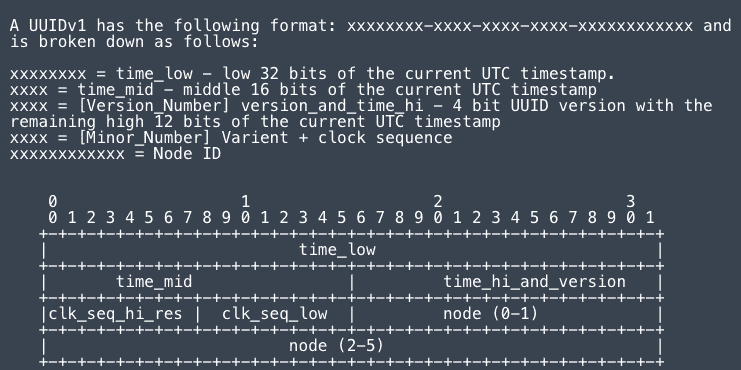

# 扩展 UUIDv1 安全问题

> 原文：<https://itnext.io/expanding-on-uuidv1-security-issues-751a02460f81?source=collection_archive---------0----------------------->

每个星期，几乎毫无例外，我都会遇到一件让我困惑、娱乐或者最常见的激怒我的事情。我决定记录我的冒险经历。

本周早些时候，Daniel Thatcher 发表了一篇关于[滥用安全应用中的 UUIDv1](https://www.intruder.io/research/in-guid-we-trust) 令牌的文章。那篇博客的要点和这篇文章的要点一样:**只在安全应用中使用 UUIDv4】。我们将在本周和下周更深入地研究 UUIDv1(以及扩展的 UUIDv2)令牌。**

# 背景

诚然，我花了很长时间通读 post 和 RFC，才真正理解 UUIDv1 是一种编码机制，而不是散列机制。正如 Daniel 在[他的工具](https://github.com/intruder-io/guidtool)中所展示的，该工具主要是利用 Python [UUID 库](https://github.com/python/cpython/blob/main/Lib/uuid.py)(为什么要重新创建功能代码)，UUIDv1 令牌的分解如下:



如你所见，这是完全可逆的。虽然“众所周知”UUIDv1 的使用具有泄露 MAC 地址的隐私后果(见鬼，甚至 [stackoverflow 警告了这一点](https://stackoverflow.com/questions/534839/how-to-create-a-guid-uuid-in-python))，但大多数文档并没有强调它在多用户环境中生成 UUIDs 所固有的潜在随机性不足。真的，所有的 UUID 文档都应该有一个警告，表明你是否在寻找 random——uuid v4 是你想要的。

但是，有没有这样一种情况，UUIDv1 仍然可以合理地安全使用呢？好吧，合理可能不是正确的措辞——我称之为“商业可接受”。这个术语与“学术上可接受的”形成对比，在“学术上可接受的”中，没有 1000 个开发者争论的研究人员经常哀叹为什么所有假设的问题没有被立即解决。

# 问题是

在我们的场景中，假设您在一个安全上下文中发现了一个使用 UUIDv1 的服务，但是开发人员无法确定修复的优先级，有没有什么情况下这并不重要？

首先，我们应该记住，Daniel 博客中描述的主要问题是被多个用户使用的服务。这种配置意味着同一台服务器正在生成 UUIDv1 令牌，这实际上导致了令牌的 MAC 部分和时钟序列(62 位)被泄露。作为一个因素，这将 UUIDv1 的安全窗口减少到了时间，正如我们所看到的，这可能是一个问题。

我想强调三种备选方案，并对它们进行研究:

1.  一种服务，其中用户向服务器提供 UUIDv1 令牌来唯一地表示他们自己(考虑这类似于 Duo Device Health 如何使用 MachineGUID 来唯一地标识主机，尽管那是 UUIDv4)
2.  一个向用户提供 UUIDv1 令牌散列版本的服务(*作者注:我实际上在阅读一些 SAML 代码*时看到了一个这样的例子)
3.  一个以明文形式向用户提供 UUIDv1 令牌的服务，但支持纳秒级的时间组件(这与 Daniel 的博客场景相同，但支持符合[RFC](https://datatracker.ietf.org/doc/html/rfc4122)的 UUIDv1)

这样的实现“安全”吗？

# 解决方案

在前两种情况下，问题归结为猜测 MAC 地址。MAC 地址并不是完全随机的，并且有固定的数量，但是正如你们大多数人所知，MAC 地址只由 6 对十六进制数字组成。对此最天真的解释是 16 种可能的组合(刚好超过 281 万亿种组合)。从表面上看，即使确切的时序和时钟序列是已知的，这也会对 MAC 搜索空间进行彻底的暴力攻击，这是非常不合理的。

然而，这并没有说明 OUIs。MAC 地址的前三个八位字节保留用于识别网络接口的制造商(*作者注:主要是在全球 MAC 中，下周会有更多关于此的内容*)。查看由 IEEE 维护的 [OUI 列表，人们会立即被各种可能不生产客户端硬件的制造商所震惊。因此，大致了解你的目标使用什么类型的硬件可以大大减少你的搜索空间。例如，如果你知道你的目标使用苹果设备，而不是 281 万亿台苹果电脑，你只剩下 1600 多万个可能的选择。](https://standards-oui.ieee.org/)

**场景 1**

因此，在场景 1 中，攻击者可能需要为每个可能的时间戳发送大约 1600 万个请求(加上一些额外的序列)。该博客指出了关于该时间戳的最重要的信息之一，即尽管能够达到 100 纳秒的间隔(每秒 1000 万个)，但“系统在生成 GUIDs 时使用这种精度水平是不常见的”，而不是使用毫秒精度，这意味着每秒钟有 1000 个可能的时间戳值(*作者注:粗略检查后，我实际上无法， 要在 node 之外找到这样做的任何实现，* [*当然不是 Python*](https://github.com/python/cpython/pull/11189) *—因此场景 3* ) —这在一秒钟内将搜索空间从 1600 万增加到 160 亿，但平均会在 80 亿次请求后完成。

场景 1 的主要问题是，即使中央服务在同一个网络上，它也在验证这个请求，因此存在网络和处理延迟，假设即使每秒 [160 个请求](https://ubiq.co/tech-blog/increase-apache-requests-per-second/)，平均仍需要 2 年时间才能发生冲突。**所以，大部分类似场景 1 的网络攻击都是不现实的。**

**场景二**

但是场景 2 呢，在这个场景中，攻击者有一个哈希的 UUIDv1，一旦他们与哈希冲突，他们就会知道服务器的 MAC 地址。相比之下，这有一些独特的优势，时间多少是已知的，更重要的是，攻击可以离线完成。此外，一旦完成，我们就拥有了与最初的博客相同的信息，攻击也大致相同(只是由于增加了哈希运算而稍微慢了一点)。

服务器硬件有时很容易猜测。数据中心产品中通常只使用有限的网卡子集。同样，公司内部的物理硬件通常也是标准化的。这意味着来自任何组织的任何 UUIDv1 都有可能(可能)与他们的其余服务器反映相同的 MAC OUI。此外，正在使用的编排器和虚拟机通常允许有限的搜索空间。例如，Docker 似乎总是分配相同的 MAC(大约 65K):

```
The MAC address is generated using the IP address allocated to the container to avoid ARP collisions, using a range from 02:42:ac:11:00:00 to 02:42:ac:11:ff:ff
```

同样，VMWare 使用“00:50:56”作为 VSphere 主机的前缀，VirtualBox 主机使用“08:00:27”等。与前面提到的主机不同，EC2 和 GCP 计算实例似乎有随机的 MAC 地址。当然，这些 MAC 不是真正随机的，很可能是基于主机的网络/IP 地址生成的，而是基于\_(ツ)_/。

假设使用的 MAC 范围有时可以合理地猜测，那么场景 2 归结为猜测，在最坏的情况下，该提供商的所有 MAC(1600 万)，如果我们这样做一秒钟(1000 毫秒)，我们将生成大约 160 亿个散列。尽管这与场景 1 的复杂性相似，但场景 2 是离线的。原来现代的图形处理器可以在一两秒钟内完成。这也只需要在每台服务器上做一次，所以回报是相当不错的。**因此，这种攻击是完全可行的。**

我想测试这种攻击有多可行，因为它已经正确地猜出了 MAC 地址的前 6 个字节(*作者注:这让我经历了一次如何确定 MAC 地址的冒险，我们将在下周的博客*中讨论)。[这项工作的解决方案](https://github.com/csanders-git/uuidv1-bruteforcing)花了大约 10 秒钟为我的苹果 M1 上的所有序列和 MAC 生成一个有效的 UUID。每隔 3 秒做一次需要 20，000，000 次迭代，这在我的电脑上需要 9 年时间。当然，这是在没有并行化的情况下，同时使用低效的 python，并且不使用任何 GPU 增强。

**场景 3**

早些时候，我做了一个值得重复的附加声明。虽然最初的作者稍微掩饰了一下这个事实，但是如果 uuidv1 实现*确实遵循了 RFC 请求的[纳秒/100 实现，那么**就会发现一个正确的 UUIDv1 实现实际上对于偶然的攻击是相当安全的。**即使考虑到最初博客中描述的弱点，也需要每秒 1000 万次请求(平均 500 万次 **)** 才能正确实现。这在我们的光学场景中变得更加糟糕。对于场景 1，对所有 MAC 地址的一秒间隔搜索将需要 160 万亿次请求。即使在第二种情况下，搜索是使用已知的 OUI 离线完成的，攻击者也需要生成 16 万亿个哈希来进行碰撞，这相当于每次碰撞需要大约 6 个小时的计算，而这只是为了获得服务器的 MAC 和序列。](https://datatracker.ietf.org/doc/html/rfc4122)*

**总之，服务仍然不应该依赖 UUIDv1，而是应该使用 UUIDv4。我们已经表明，在一些网络环境中，当 UUIDv1s 由客户端而不是单个服务器生成时，弱点是存在的，但不容易被利用。然而，我们已经能够扩大攻击的范围，甚至在服务器的 MAC 地址没有直接暴露时(例如通过散列 UUIDv1)，我们已经表明攻击者完全有能力滥用这个用例。**