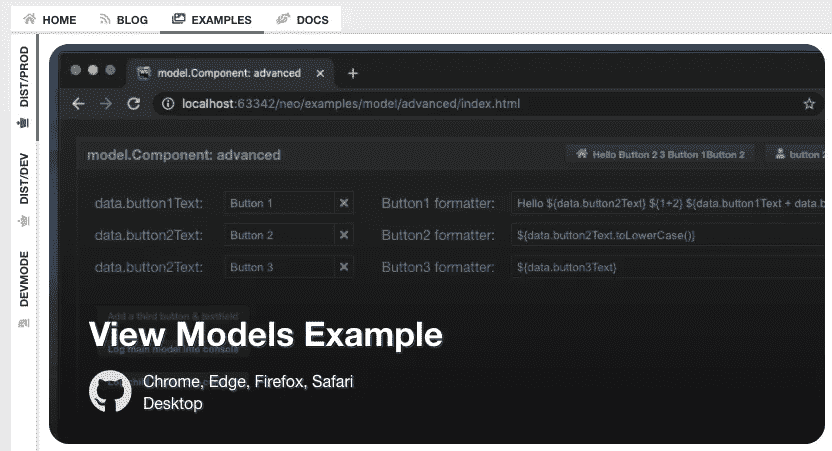
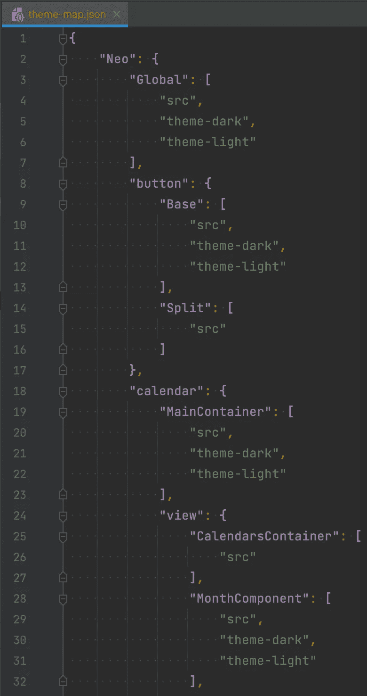
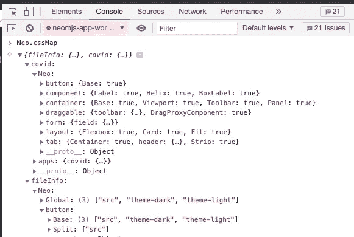
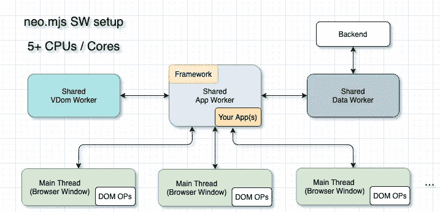

# 将单页应用扩展到多个浏览器窗口——第 2 部分

> 原文：<https://itnext.io/expanding-single-page-apps-into-multiple-browser-windows-part-2-2619ab40361d?source=collection_archive---------2----------------------->

包括跨浏览器窗口懒惰加载的 CSS 增量更新

这篇文章介绍了一种突破性的新方法，关于我们如何进一步提高基于 web 的前端的渲染性能，因为我们将根据需要延迟加载 CSS。

# 内容

1.  介绍
2.  neo.mjs 中的三种不同环境
3.  OOP 为什么会“过时”？
4.  跨浏览器窗口 CSS 增量更新
5.  这是如何工作的？
6.  接下来是什么？
7.  呼吁行动！

# 1.介绍

自从我写完第 1 部分已经有一段时间了。如果你错过了，它绝对值得一读:

[](https://medium.com/swlh/expanding-single-page-apps-into-multiple-browser-windows-e6d9bd155d59) [## 将单页应用程序扩展到多个浏览器窗口

### 内容

medium.com](https://medium.com/swlh/expanding-single-page-apps-into-multiple-browser-windows-e6d9bd155d59) 

neo.mjs 项目已经发展了很多。让我们再来看看多窗口 covid dashboard 应用程序:

应用程序工作人员仍然是主角。在 [neo.mjs](https://github.com/neomjs/neo) 中，我们不仅仅是将昂贵的任务转移到[专用](https://developer.mozilla.org/en-US/docs/Web/API/Worker)或[共享工人](https://developer.mozilla.org/en-US/docs/Web/API/SharedWorker)中。相反，您的应用程序和组件实际上就在那里。我们可以将主线程描述为“渲染工人”。Main 只有 42KB 的代码，用于创建工人、操作 DOM 和委托 UI 事件。

如果您关注 app worker 控制台，您会看到我们现在正在根据需要为新视图延迟加载 JS 模块。当将现有的组件树移动到不同的窗口时，我们不需要再次加载它们。我们也不需要为我们的视图创建新的 JS 实例，我们实际上重用了现有的实例。

在创建新的主题引擎之前, [neo.mjs](https://github.com/neomjs/neo) 项目使用的是单片 CSS 输出，这与 Javascript 端的美丽工作方式并不相称。

如果您对如何使用来自文件缓冲区的`sass.render()`创建一个定制的 SCSS 版本感兴趣，请随意阅读我以前的文章。

本文还包含关于 [neo.mjs](https://github.com/neomjs/neo) SCSS 结构的一般信息(例如，解释不同的模式→使用包含或不包含 CSS 变量来构建 SCSS)。

[](/how-to-create-a-file-by-file-custom-scss-build-including-dependencies-using-postcss-and-optional-c83f8e5677d8) [## 如何创建一个文件由文件自定义 SCSS 建立包括依赖关系，使用 postcss 和可选的…

### 虽然这听起来像是一个常见的问题，但我无法在网上找到一个好的解决方案。所以我想写作…

itnext.io](/how-to-create-a-file-by-file-custom-scss-build-including-dependencies-using-postcss-and-optional-c83f8e5677d8) 

有了粒度 CSS 输出，我们现在可以根据需要延迟加载基于类的 CSS 文件:

此时你可能会想:“嗯，我也可以使用 [webpack](https://github.com/webpack/webpack) 创建 CSS 分割块，这有什么大不了的？”

这是正确的，但是请等待多窗口上下文:)

# 2.neo.mjs 中的三种不同环境

我得到的反馈是一些基本概念还不太清楚。在我们进入“好东西”之前，让我们简短地介绍一下，以确保我们在同一页上。

万一你打开网上的例子【https://neomjs.github.io/pages/
T3

您将看到三种不同的模式:



**dist/production** 我们在 JS 端使用基于 [webpack](https://github.com/webpack/webpack) 的构建。即使在不同的应用程序中，我们也会得到缩小的分割块。CSS 输出也会缩小。两者都没有源映射。这是您完成开发后部署的最快版本。

**dist/development** 如果你使用的是 Angular、React 或 Vue，这就是你习惯称之为开发模式的东西。这是一个没有缩小的基于 webpack 的构建，包含 JS 端的源代码图，让你能够看到实际上潜在的错误发生在哪里。

**开发模式** 这是 [neo.mjs](https://github.com/neomjs/neo) 的独特之处。您可以直接在浏览器中运行真正的代码。如果您更改了您的代码库，您会立即得到这些更改。不需要构建、移植或热模块替换。你可以 100%确定没有外部因素导致 bug。

将 UI 开发带回浏览器不仅仅是一个浪漫的想法。浏览器已经准备好了。你也应该这样。

# 3.OOP 为什么会“过时”？

我们可以扩展课程。这允许我们添加新方法、覆盖方法、添加和更改类字段。这样可以减少很多冗余。你可以使用工厂设计模式来接近它，但在大项目中它会弄得一团糟。

在 ES6 类系统之上添加一个配置系统使得扩展类更加强大。我们可以批量更新配置，减少对 vdom 引擎的调用。

我经历过许多处理内存泄漏的高调项目。经常发生的情况是，开发人员在创建组件方面做得很好，但是忽略了析构方面。比如使用数据存储，并且在需要时不销毁它。

那么，哪里出了问题？

真正的问题是声明性的(模板驱动的)库和框架。其中一些提供了一个`Component.render()`方法，允许您定义标记，包括匹配组件名称的定制标签。调用`render()`将为使用的定制标签创建 JS 实例。再次调用`render()`将销毁以前的实例并创建新的实例。

现在猜猜如果你改变状态会发生什么？对，这个就叫`render()`。内存泄漏的乘数，在我看来，这也是函数式编程流行的关键原因之一。

对于 JS 一方负责的编程方法来说，这是一个非常不同的故事。在 [neo.mjs](https://github.com/neomjs/neo) 中调用`Component.render()`既不会创建也不会销毁任何 js 实例。如果你想做这件事，什么时候做都是你在掌控之中。这使得“重用组件(JS 实例)”成为可能，这也是我在提到跨不同浏览器窗口移动组件树时经常提到的，即使这样也会保留相同的 JS 实例。

你的零件值得比单程票更多的爱。用了**右**，OOP 没毛病。

# 4.跨浏览器窗口 CSS 增量更新

回到多窗口 covid 应用程序。如果您查看不同的入口点:

[apps/sharedcovid](https://github.com/neomjs/neo/tree/dev/apps/sharedcovid) 、 [apps/sharedcovidchart](https://github.com/neomjs/neo/tree/dev/apps/sharedcovidchart) 、[apps/sharedcovidgallery](https://github.com/neomjs/neo/tree/dev/apps/sharedcovidgallery)等。

您会注意到，只有第一个(主)应用程序包含多个视图和控制器。所有子应用程序只包含一个空的视口。

如果我们要将视图移动到不同的浏览器窗口中，我们只需使用:

```
parentView.remove(view, false); // false keeps the instance alive
me.getMainView(appName).add(view);
```

真的就这么简单。

现在，在子应用程序的 CSS 方面，我们希望最初加载视口(和父链)的文件，一旦我们从主应用程序动态地移动视图，此时就加载丢失的 CSS 文件。

使用弹出窗口显示有点棘手(没有增加延迟)，所以我使用普通窗口来显示它。我还添加了一个 3s 的延迟来使它更加清晰:

现在可能最令人印象深刻的演示是在跨浏览器窗口拖放演示中使用 CSS delta 更新。

这个应用程序需要一点调整:当在一个窗口中开始拖动操作时，我们在拖动到另一个窗口时创建一个拖动代理元素(节点)。拖动代理基于对话框样式。然而，我们很可能还没有在“window2”中创建对话框。

不过，我们可以用一行代码来解决这个问题:

```
***Neo***.currentWorker.insertThemeFiles(dockedWindowAppName, ***Neo***.***dialog***.Base.prototype);
```

如果您查看控制台日志(网络→ CSS)，您会看到当代理进入 window2 时，对话框样式被加载到 window 2 中。

放下时，窗口还会加载对话框内容样式(文本字段)。在 window2 中启动拖动操作将加载真正的拖动代理 CSS(以前不需要)。进一步的拖放操作不需要加载文件(没有增量)。

# 5.这是如何工作的？

具有挑战性的部分无疑是生成基于文件的 CSS 输出。你可以在顶部的文章链接中深入了解细节。

我需要对源地图做一点“猴子修补”。行号并不总是正确的，所以我们需要确保内容文件之前的文件缓冲区以一行结束(首先删除注释，然后删除换行符)。地图还显示“stdin”而不是文件名。通过调整内部数组集映射很容易修复。

[dev/build scripts/build themes . js # L264](https://github.com/neomjs/neo/blob/dev/buildScripts/buildThemes.js#L264)

对这个文件更重要的补充是生成一个基于 JSON 的文件结构图:



(现实中被缩小了。)

我们的应用程序工作人员现在需要加载这个文件(或者不使用 CSS 变量的版本)一次，即使在使用多个窗口时也是如此。

由于文件可能在第一个组件需要 CSS 之后到达，所以我也在 app worker 中添加了一个缓存映射。

像`component.Base`这样的类正在使用一个`appName_`配置。如果有变化，它将触发:

如果我们创建一个类的新实例，或者将一个现有实例插入到一个`container.Base`中，就会发生这种情况。

该类将更新直接子项。因此，当我们将任何类型的组件树插入到一个新的应用程序(不同的浏览器窗口)中时，所有子项都将获得新的`appName`，从而在新的主线程中加载它们的 CSS 文件(如果需要的话)。

应用程序工作人员执行以下操作:

如果这个类有 CSS 文件，它会检查 cssMap。它还检查原型链(例如，`button.Split`可以使用`button.Base`的样式)。

添加文件将向地图添加一个标志，以确保它不会在给定范围(应用程序)内加载多次。



这已经是我们启用跨窗口 CSS 增量更新所需要的全部了。

# 6.接下来是什么？

为了完成 v2.1 版本，我仍然需要增强使用 [neo.mjs](https://github.com/neomjs/neo) 作为节点模块的工作区，以便在这个级别上启用主题化。

工作区应该包含它们自己的 resources/scss 文件夹，所以构建需要将这里生成的文件添加到混合文件中。

我可以创建一个快速指南，介绍如何在工作区内创建应用程序，在那里创建自定义组件并对它们进行样式化。如果你对此感兴趣，请告诉我！

现在我收到了一些关于 JSDoc 和 jsdoc-x 的依赖警告。这两个项目都不再被维护，这是一个问题。他们正在使用包含不推荐使用的包的依赖关系，包括安全问题。我们可能只是将它们分叉，以确定手动调整依赖关系是否可以解决这个问题。如果没有，我们可能需要切换到其他东西或者创建一个定制的文档注释解析引擎。在这个问题上的帮助是赞赏的。

总的来说，我喜欢创造一些闪亮的新组件，但我试图保持专注于基础。含义:推动核心和生态系统，让你更容易创建自己的组件和应用。

# 7.呼吁行动！

大多数示例应用程序的初始渲染速度明显加快。不要相信我的话，你自己看吧:

[](https://github.com/neomjs/neo) [## 近地天体

### neo.mjs 使您能够使用一个以上的 CPU 创建可扩展的高性能应用程序，而无需使用…

github.com](https://github.com/neomjs/neo) 

如果您需要帮助，欢迎加入 neo.mjs Slack 频道:

https://join.slack.com/t/neotericjs/

我这边时间有限，但是我喜欢给好奇的开发者指出正确的方向。

如果你的公司确实需要帮助创建一个原型应用程序来弄清楚 neo.mjs 在他们的场景中是如何发挥作用的，只需 ping 我。

作为麻省理工学院许可的开源项目，neo.mjs 依赖于您的支持。你可以影响路线图。我在 v2 发布公告中列出了几个潜在的项目:

[](/the-webworkers-driven-ui-framework-neo-mjs-version-2-release-announcement-b91b476d6f16) [## webworkers 驱动的 UI 框架 neo.mjs 第 2 版发布公告

### 新产品的概念必须是颠覆性的，否则就没什么必要。然而，使用它们的方法…

itnext.io](/the-webworkers-driven-ui-framework-neo-mjs-version-2-release-announcement-b91b476d6f16) 

如果你想看某个特定主题的新文章，欢迎你为它创建门票:【github.com/neomjs/neo/issues

问候&快乐编码，
托拜厄斯

预览图像:

