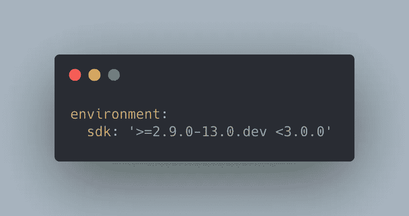

# 试验 Mobx、Dart 扩展和空安全

> 原文：<https://itnext.io/experimenting-with-mobx-and-dart-extensions-444d1d5e1779?source=collection_archive---------4----------------------->


照片[尼克·费恩](https://unsplash.com/@jannerboy62)乘上 [Unsplash](https://unsplash.com/photos/zF_pTLx_Dkg)

M obx 是一个很棒的 Flutter 状态管理库，唯一的缺点是编写 Mobx 商店有点进退两难。

您可以选择:

## 使用 Mobx 代码生成器:

*   ***优点*** :语法清晰，样板文件少
*   ***缺点*** :生成代码需要一些时间，您可能需要为您的存储的每次更改运行代码生成器，或者使用构建生成器中的 watch 选项。

## 使用不带代码生成器的 Mobx:

*   ***优点*** :对于 **mobx_codegen** 和 **build_runner** 没有依赖关系
*   ***缺点*** :你必须自己写所有的东西(更多的代码意味着更多的错误)。当你有一个大项目时，它是不可扩展的。

那么解决办法是什么呢？这就是我们在本文中使用 Dart 扩展试图回答的问题吗？

# 省道延伸方法:

它是在 Dart 2.7 中引入的，扩展方法背后的概念是您可以在对象编译后添加方法。

如果你有兴趣了解更多关于扩展方法的知识，你可以在这里阅读:链接。

颤振中扩展方法的应用；

我们可以在 Flutter 中扩展方法来简化语法，例如:

> 请注意，这只是你如何在 Flutter 中使用扩展方法的一个例子，并不是邀请你一直使用它们。记住，权力越大，责任越大。

你是超级英雄

# 通过 Mobx 使用 Dart 扩展:

现在让我们使用 Dart 扩展方法来尝试和改进 Mobx 语法。为此，我们将使用这里的计数器示例:[计数器示例 Mobx](https://mobx.netlify.app/examples/counter)

不带注释:

不带注释的 Mobx 计数器存储

使用注释:

带注释的 Mobx 计数器存储

现在我们要定义两个扩展方法:第一个将允许我们从 Dart 对象创建一个可观察对象。第二个是从 Dart 函数创建动作:

使用 dart 扩展方法的 Mobx 计数器存储

正如你从上面的例子中看到的，计数器存储并不比仅仅使用带有扩展方法的 Mobx 的原始语法更好。但是如果我们试着去做:

```
final increment = _increment.action;
```

您将得到一个错误消息:

> 在初始化器中只能访问静态成员。

我们怎样才能让它变得更好？

# Dart 2.9 和零安全:

Dart SDK 的 2.9 版本引入了空安全(你可以在这里阅读关于[的所有内容)。在其他特性中，null safety 使我们能够使用 late 关键字。](https://dart.dev/null-safety)

> **重要:**因为空安全还在技术预览版，**不要在生产代码中使用空安全。**但请务必测试该功能，并[给我们反馈。](https://github.com/dart-lang/sdk/issues/new?title=Null%20safety%20feedback:%20%5Bissue%20summary%5D&labels=NNBD&body=Describe%20the%20issue%20or%20potential%20improvement%20in%20detail%20here)

要使用此功能，您需要切换到`2.9.0-14.0.dev`。在 Dart SDK 中，您可以通过遵循这里的指令[来完成。](https://github.com/dart-lang/samples/tree/master/null_safety/calculate_lix)

您还需要确保在您的 pubspec.yaml 文件中更改 min SDK 版本。



pubspec.yaml

那么，关键字 late 的基本功能是什么:

> 使用“late”关键字。这是一种方式
> 告诉 Dart:
> 
> -您不会马上给那个
> 字段赋值。
> 
> -但是你*要*稍后给它赋一个
> 值。
> 
> -您将确保在访问它之前为它分配一个
> 值。

在我们的代码中应用这一点将导致:

现在我们的代码非常干净，可读性更好，而不需要使用 mobx_codegen。

这里列出了一些有用 Mobx 扩展，如果您愿意，可以在代码中使用:

# 结论:

我希望这个使用 Mobx、Dart 扩展方法和 null 安全的实验是有帮助的。你认为这个实验怎么样，你认为它是更好的语法，还是你更愿意坚持使用代码生成器？请在评论中告诉我。下次再见，谢谢你的阅读。