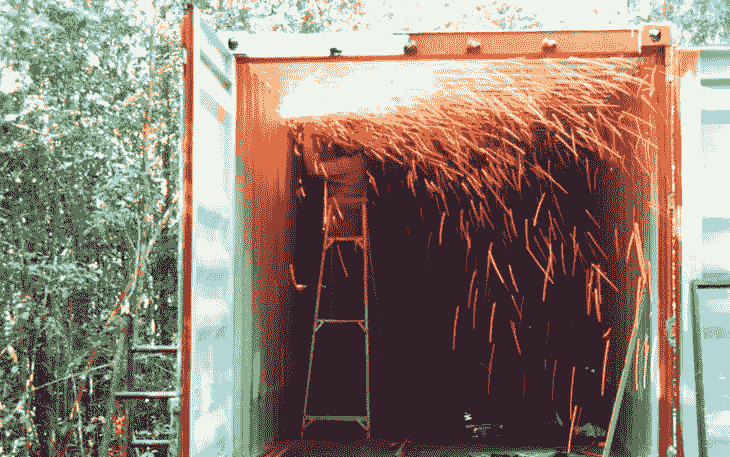

# Dart 微服务实验

> 原文：<https://itnext.io/experiments-with-dart-microservices-fa117aa408c7?source=collection_archive---------3----------------------->

## 减小容器尺寸的方法

# 从颤振到飞镖

像许多人一样，[我们](https://www.adaptant.io)是通过 Flutter 被引入 Dart 的，随着我们的应用程序复杂性的增长，我们逐渐发现有必要将应用程序端的逻辑剥离到热路径之外，这可以通过后端可用的专用微服务来更好地解决。

到目前为止，我们所有的后台微服务都是混合使用 Golang 和 Python 实现的。虽然我们知道 Dart 对服务器端应用程序开发的支持，但它并没有得到太多的关注。另一个挑战是，Flutter 和 Dart 之间的确切界限并不总是很明显(正如我们发现的那样， [pub](https://pub.dev/) 上的许多插件标榜自己是 Flutter 插件，并添加了显式的 Flutter 依赖关系——包括在 Flutter 中模拟应用程序示例，而底层插件逻辑对 Flutter 没有实际的依赖关系)。


最后，最惯用的方法似乎是:

1.  将相关的应用程序逻辑分离到一个库包中，该库包可由 Flutter 和 Dart 端应用程序直接使用；和
2.  开发一个小的服务垫片，将一个简单的 REST API 封装在库包中，并处理其他基本的服务供应和工具问题(服务发现和注册、日志记录、健康检查、公开抓取指标等)。).

# Dart 运行时和容器化

Google 提供了许多 Docker 基本映像，以开始服务器端 Dart 应用程序的容器化。这些包括 [google/dart-runtime](https://hub.docker.com/r/google/dart-runtime) 和 [google/dart-runtime-base](https://hub.docker.com/r/google/dart-runtime-base) 图像。

## 最初集装箱化

我们使用的初始 Dockerfile 只是对`google/dart-runtime`图像的扩展，允许参数传递到容器:

带有 JIT 编译和参数传递的服务器端 Dart 应用程序的 Dockerfile

我们的 [VIN 解码微服务](https://github.com/adaptant-labs/vin-decoder-service)的初始版本(包括 Dart 运行时)重达 220MB 与我们在 Golang 世界中习惯的大约 10MB 的容器映像相去甚远！


## 从 JIT 到 AOT

可以理解的是，JIT 编译环境(包括 Dart 运行时的整体)的容器大小还有待改进。幸运的是，AOT 编译已经被 Flutter 使用，并在 Dart 的早期版本中得到支持，从今年早些时候的 Dart 2.3 SDK 版本开始，它已经被重新使用并以`dart2aot`二进制文件的形式重新引入(在下面的 GitHub 问题中提到):

*   [https://github . com/dart-lang/SDK/issues/34343 # issue comment-490958724](https://github.com/dart-lang/sdk/issues/34343#issuecomment-490958724)

因此，第一步是从 JIT 转换到 AOT 编译，以便通过多阶段构建尽可能多地丢弃运行时。顺便提一下，我们并不是第一个有这种想法的人，我们在下面的 GitHub gist 中偶然发现了一个概念证明:

*   [https://gist . github . com/renatothaydes/10598 c 963 ba 10 e 48501795 e 8 E1 BDF 2 b 1](https://gist.github.com/renatoathaydes/10598c963ba10e48501795e8e1bdf2b1):

具有 AOT 编译的服务器端 Dart 应用程序的多级 docker 文件

使用这种方法，得到的容器映像降低到稍微容易接受的 75MB——这是一个好的开始，但仍然不够好。

## 从 AOT 到本土

剩下的运行时工件现在仅限于`server.aot`二进制文件、`dartaotruntime`二进制文件，以及由`bitnami/minideb`映像提供的一组最小的必需共享库:

```
$ ls -la server.aot
-rw-rw-r-- 1 pmundt pmundt 3838560 Oct  4 10:25 server.aot
$ ls -la `which dartaotruntime`
-rwxr-xr-x 1 root root 4781944 Sep 26 10:02 /usr/lib/dart/bin/dartaotruntime
```

许多人已经表达了对单一组合二进制文件的兴趣，下面的 GitHub 问题跟踪了这方面的进展:

*   [https://github.com/dart-lang/sdk/issues/36915](https://github.com/dart-lang/sdk/issues/36915)

这导致了编译的`dart2native`模式的发展，该模式能够产生集成的共享二进制文件，而不再依赖于 Dart 运行时环境:

```
$ dart2native bin/server.dart -o server
Generated: /home/pmundt/devel/git/vin-decoder-service/server
$ ls -la server
-rwxrwxr-x 1 pmundt pmundt 8622704 Oct  4 10:31 server
$ ldd server
    linux-vdso.so.1 (0x00007ffcb0de2000)
    libc.so.6 => /lib/x86_64-linux-gnu/libc.so.6 (0x00007ff826bb3000)
    /lib64/ld-linux-x86-64.so.2 (0x00007ff8273ff000)
    libm.so.6 => /lib/x86_64-linux-gnu/libm.so.6 (0x00007ff826a65000)
    libpthread.so.0 => /lib/x86_64-linux-gnu/libpthread.so.0 (0x00007ff826a44000)
    libdl.so.2 => /lib/x86_64-linux-gnu/libdl.so.2 (0x00007ff826a3e000)
```

虽然单二进制编译并没有为我们节省任何映像大小，但是对 Dart 运行时组件依赖性的放松意味着我们现在可以更积极地剥离最终的容器。

## 使用 Alpine 进一步减少集装箱



虽然`bitnami/minideb`基础图给了我们一个合理的开始基础，但最终的容器仍然太大。由于我们现在只有一个带`dart2native`编译的二进制文件，没有额外的依赖项，我们可以使用 Alpine 提供的一个最小的 glibc 环境来进一步降低这个要求:

使用 Alpine 为服务器端 Dart 应用程序提供多级 Dockerfile 和本机编译

我们现在的最终结果是一个只有 20MB 的容器——比我们开始时大了一个数量级。还不错！

## 后续步骤

现在剩下的最后一个障碍是:

*   由`dart2native`构建器生成静态链接的二进制文件，这将允许我们切换到`scratch`映像，并丢弃容器中剩余的支持库/二进制文件——这将缩小与 Golang 容器的大小差距；和
*   功能`strip` -ping 生成的原生 ELF 二进制文件——目前的实验是剥离调试符号、矮化 DWO 对象或`.eh_frame`破坏生成的二进制文件。理论上，Dart VM 中的堆栈展开在功能上不应该依赖于 DWARF CFI，尽管这无疑需要 Dart 内部更有能力的人进行进一步的调查。

## 性能呢？

虽然我们几乎主要关注大小，但我们还没有提到任何关于性能的内容，或者更具体地说，不同编译模式对应用程序运行时性能的影响。这是我们目前正在评估的事情之一，作为我们在[方钠石](https://sodalite.eu/)项目中工作的一部分，并计划在不久的将来有一个关于此事的后续博客。

## 结论

考虑到容器的大小，通过精心制作 docker 文件和剥离运行时环境，服务器端 Dart 应用程序可以以可管理的大小进入现实世界的部署。

这仍然是一个持续发展的领域，我们完全期待取得进一步的进展，特别是随着服务器端 Dart 的其他用例开始出现(例如，作为 FaaS 函数的语言运行时，这也是我们正在积极研究的领域)。