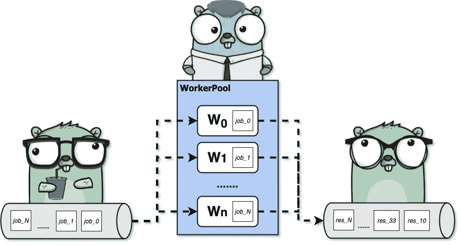
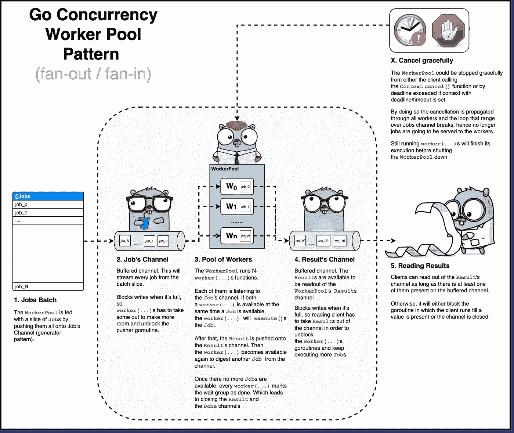

# 向我解释 Go 并发工作池模式，就像我五岁时一样

> 原文：<https://itnext.io/explain-to-me-go-concurrency-worker-pool-pattern-like-im-five-e5f1be71e2b0?source=collection_archive---------0----------------------->

## 简单解释一下这个模式的所有组件如何协同工作来并发处理一批作业。

并发工人池模式

## 介绍

> **【TL；DR]** *跳过简介，直接进入* [*实施细节*](#fe56) *如果你想。*

当我第一次接触 Go 语言时，我有点不喜欢它的语法和冗长。几个月后，我开始慢慢爱上了它的简单性、可读性、性能优势，以及比其他语言占用的内存少。

我对这种语言特别感兴趣，因为它有丰富的并发模型。但是，尽管有“新语言蜜月”之类的东西，我也努力想弄清楚这种模式是如何工作的。

因为我赶不上最后期限，所以我直接进入了模式实现的例子，而不是首先理解并发性的基础。 ***错了！***

所以我强烈建议你们去看看这些文档，作为起点。尽管 Go 简单地处理并发性并不意味着编程并发代码就那么容易掌握。

尽管如此，我会尽我所能在这里更口语化。我还为[***GitHub repo***](https://github.com/godoylucase/workers-pool)提供了该模式的实现，并测试了示例用法。

# 实施细节

> 在继续之前有一件事值得一提:*这是* ***不是*** *讲并发概念的帖子*，而是**并发原生如何被编排以实现一组定义的作业的并发执行。**

尽管如此，下图描述了这种模式的一般情况。下文将对幕后发生的事情进行更深入和详细的描述。(你也可以点击查看[的大图版本。为了更好的理解，我用我的爱为你做了这个！).](https://drive.google.com/file/d/1yiOu9V3T8FsXSd0RbQVCguF-5IIHJhEh/view?usp=sharing)

WorkerPool 组件编排

## 1.作业批次

我创建了一个名为`Job`的最小工作单元，由一个`ExecutionFn`组成，让我们为返回一个`Result`的`Job`编写定制逻辑。后者可能是一辆`value`或一辆`error`。

第二步，我使用`generator`并发模式将所有的`Job`流入`WorkerPool`。这是怎么回事？在一些客户定义的`Job` s 片上生成一个流，将它们推送到一个通道，即`Job` s 通道。其将用于同时进给`WorkerPool`。

## 2.作业的渠道

它是一个缓冲通道(workers count capped ),一旦它被填满，任何进一步的写操作都将阻塞当前的 goroutine(在这种情况下，流的生成器 goroutine 从 1 开始)。在任何时候，如果任何`Job`出现在通道上，将被`Worker`函数消耗，以便稍后执行。通过这种方式，通道将为来自前一点的`generator`的新的`Job`写入开放。

## 3.工人池

这是拼图的主要部分，这个实体由`Result`、`Job`和`Done`通道组成，加上池将托管的`Worker`的数量。它将在不同的 goroutines 上生成与工作线程数指示的一样多的`Worker` s，也称为 ***扇出*** 。

当`Worker`可用时，他们自己将负责从渠道获取`Job`。然后，他们执行`Job`并将`Result`发布到`Result` s 通道上。只要`cancel()`函数没有被`Context`调用，`Worker`就会执行前面提到的操作。否则，回路制动且`WaitGroup`标记为`Done()`。这和想到*《杀死*`*Worker*`*颇为相似。*

*在所有可用的`Job`从其通道中取出后，`WorkerPool`将通过关闭其自身的`Done`和`Result`通道来完成其执行。*

## *4.结果频道*

*如前所述，即使工人在不同的 goroutines 上运行，他们也通过将`Job`的执行`Result`复用到`Result`的通道上来发布它们，也就是 ***扇入*** 。`WorkerPool`的客户端可以从该源读取数据，即使通道因上述任何原因关闭。*

## *5.阅读结果*

*只要缓冲通道上至少有一个客户端存在，`WorkerPool`的客户端就可以读取`Result` s 通道。否则，从空的`Result` s 通道读取会阻塞客户端的 goroutine，直到出现一个值或通道关闭。*

*一旦关闭的`WorkerPool`的`Done`通道返回并向前移动，for 循环就会中断。*

## *X.优雅地取消*

*在任何情况下，如果客户端需要优雅地关闭`WorkerPool`执行，要么它可以根据给定的`Context`调用`cancel()`函数，要么已经配置了由 with `Context.WithTimeout`方法定义的超时持续时间。*

*无论一个或另一个选项发生(两者都结束调用`cancel()`函数，一个显式地，另一个在超时发生后),一个关闭的`Done`通道将从`Context`返回，该通道将被传播到所有的`Worker`函数。这使得`for select`循环中断，因此`Worker`停止消耗通道外的`Job` s。随后，`WaitGroup`被标记为完成。但是，运行的工人将在`WorkerPool`关闭之前完成他们的工作。*

# *总结*

*当我们利用这种模式时，我们将利用我们的系统来实现并发的执行，从而在作业执行中获得更高的性能和一致性。*

*乍一看，这种模式可能很难理解。但是，请花时间来消化它，尤其是如果您是 GoLang 并发模型的新手。*

*有一件事可能会有所帮助，那就是将信道视为管道，数据从一端流向另一端，可容纳的数据量是有限的。因此，如果我们想注入更多的数据，我们只需要在等待时先取出一些数据，为它腾出一些额外的空间。反过来说，如果我们想从管道中消费，就必须有一些东西，否则，我们就等着它发生。通过这种方式，我们使用这些管道在`goroutines`之间通信和共享数据。*

# *资源*

***【实现】**该模式在本[***GitHub repo***](https://github.com/godoylucase/workers-pool)***中完全实现。****

***【书】**如果你有兴趣阅读关于并发主题的更多内容，我可以推荐一本书:[Go 中的并发——OReilly](https://www.oreilly.com/library/view/concurrency-in-go/9781491941294/)
对我来说，当我面临这种使用并发方法解决的问题时，这是一个很好的资源。*

*感谢您的阅读，我希望您能发现这是有用的！*

****【更新】*** *我已经写了另一种实现这种模式的方法，但只是使用通道(没有更多的* `*sync.WaitGroup*` *)。你可以在这里找到:**

* [## [Refactor]Go Worker Pool——一种绕过同步包的方法

### 通过使用信号量模式而不是 sync.WaitGroup 来同步工作线程执行。

itnext.io](/refactor-go-worker-pool-a-way-around-to-the-sync-package-7d45b1afb768)*