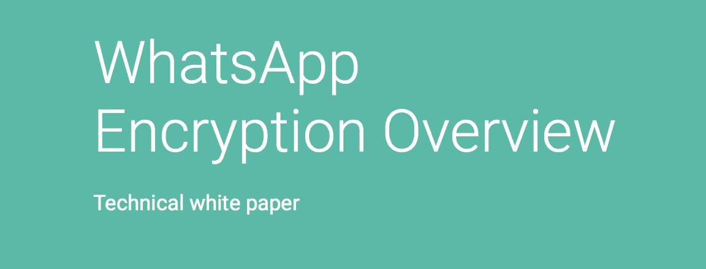
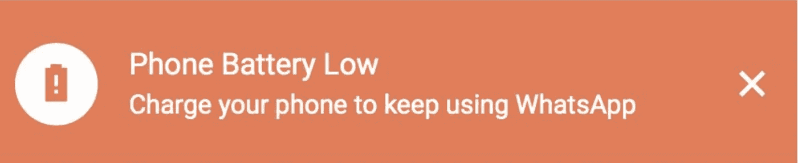

# 利用免费获取的 WhatsApp 数据或“WhatsApp web 为什么知道我手机的电池电量？”

> 原文：<https://itnext.io/exploiting-freely-accessible-whatsapp-data-or-why-does-whatsapp-know-my-battery-level-ddac224041b4?source=collection_archive---------0----------------------->


这一切都始于标题的简单问题。我知道桌面应用程序在初次握手后会与手机通信(在这一部分，你必须扫描二维码，以便它知道是你而不是其他人试图读取你的对话)，但我想知道到底发送了什么信息。

> 声明:我想先把这个发到 facebook 上，但是要报道一些事情，你需要一个 facebook 账户，而我没有。然后我想…这不值得报道，他们一定知道这件事，并认为它值得忽视。

我最初开始调查 xhr 呼叫的发送/接收，但是没有太多，我失去了兴趣并忘记了它。现在，几个月后，我开始厌倦我辞职后的空闲时间，和我的女朋友在地球的另一边旅行，兴趣又回来了。他们到底是如何传递数据的，哪些数据可以从桌面站点轻松读取和修改。

## 注意:如果您有正确的隐私设置，这将不允许其他人看到您的照片或上次看到的照片。这就是为什么我说“可自由访问的数据”，而不是“获得访问私人数据”之类的东西。

有一个 [**惊人的白皮书**](https://www.whatsapp.com/security/WhatsApp-Security-Whitepaper.pdf) 关于加密/解密过程的所有步骤的安全性，可从创作者自己那里获得，术语在我头上，但如果你想通读它，它就在那里。



[https://www . WhatsApp . com/Security/WhatsApp-Security-white paper . pdf](https://www.whatsapp.com/security/WhatsApp-Security-Whitepaper.pdf)

# 你提到了电池

电池最初引起了我的注意，因为当你的电池电量不足时，你会在桌面/网络客户端上收到警告，告诉你设备接近睡觉时间。



知道得太多的信息

当我找到信息的来源时，这是没有加密的**因为我猜这是 Whatsapp 与自己通信，我发现了比我预期的多得多的信息。桌面客户端知道设备的品牌和型号，不管它是否插电，它运行的操作系统版本，版本，以及其他一些东西，比如令牌和你的 id，它显然遵循`prefix+phone@c.us`格式。**

```
...
"wid": "[phone1@c.us](mailto:34622681988@c.us)",     
"battery": 99,
"plugged": false,
"platform": "android",
”phone”: {
   “wa_version”: “2.18.191”,
   “mcc”: “214”,
   “mnc”: “003”,
   “os_version”: “8.0.0”,
   “device_manufacturer”: “HUAWEI”,
   “device_model”: “HWVTR”,
   “os_build_number”: “VTR-L09 8.0.0.370(C432)”
 }
...
```

**我对这些信息没什么可做的了，所以我开始查看其他发送和接收的纯文本消息。**

# **我们怎样才能玩得开心**

**首先，我决定尝试修改代表我所理解的东西的数据，比如电话号码或状态，并看看它如何影响我的桌面应用程序。虽然您显然可以修改服务器响应，但这有什么意思呢？我实现的第一件事是获取某人的个人资料图片，而不将它们添加到您的地址簿中，如果我们拦截一个`profilePicThumb`的呼出电话并更改号码，我们将从服务器获得一个包含该用户个人资料图片 url 的响应。**

```
554\. — 377,,[“query”,”ProfilePicThumb”,”[phone1@c.us](mailto:34610252059@c.us)”]
```

**在这种情况下，用户是一个前缀为 34 的西班牙电话号码。注意，我不能保证每个人在`@`后面都有相同的后缀。出站消息的第一部分似乎被忽略了，其中一部分是自动递增的消息计数，另一部分有时是时间戳，有时…我不知道 554 是什么。**

# **但是，一切都应该是加密的！**

**嗯，对等消息*被*加密，群组消息*被*加密，但是仍然有一些来自设备的人类可读的纯文本查询。**

**通过 Websocket 发出的一个有趣的请求是`resumePic`调用，它发送一个 id 数组，您希望获得这些 id 的图片。问题是，你可以将任何人添加到你的电话簿中，而 Whatsapp 甚至不会在你的电话簿中检查他们的信息，因为你可能是收到消息的人，或者是你没有添加但仍想看到他们图像的人的一部分。**

```
##Sample input
165\. — 125,, 
[
   "query", 
   "resumePic", 
   [
      {
         "id": "[phone1@c.us](mailto:phone1@c.us)",
      }, 
      {
         "id": "[phone2@c.us](mailto:34622681989@c.us)"
      }
      ...
   ]
]##Sample response
[
   {
       "id": "[phone1@c.us](mailto:34622681997@c.us)",
       "tag": "1531075970",
       "eurl": "[https://pps.whatsapp.net/v/p](https://pps.whatsapp.net/v/t61.11540-24/35500467_207064533475645_6650758919440302080_n.jpg?oe=5B467060&oh=59e33a979093a0eb19d95a287981b1d8)hone1.jpg"
   }, 
   {
       "id": "[phone](mailto:34622681997@c.us)2[@c.us](mailto:34622681991@c.us)",
       "tag": "1442427544",
       "eurl": "[https://pps.whatsapp.net/v/p](https://pps.whatsapp.net/v/t61.11540-24/35500467_207064533475645_6650758919440302080_n.jpg?oe=5B467060&oh=59e33a979093a0eb19d95a287981b1d8)hone2.jpg"
}
```

**虽然这可能最初看起来无害，但我越想越担心。我可以获得我甚至没有添加到电话簿中的人的信息。如果我只拿回了`id`，我猜那个号码没有关联账户。然而，`tag`是我们在聊天界面中联系人姓名下方最后一次看到的时间戳。**

**我可以看到这被垃圾邮件发送者用来收集人数，让我多疑，得到一些有趣的信息。以编程方式监控大量用户的状态、最后一次看到时间和图片，可以为知道如何处理这些信息的人带来收益。**

**就数量而言，您可以向服务器发出的请求数量有限制吗？让我们尝试一些愚蠢的东西，我觉得很慷慨，因为没有人会看这个。**

**打开浏览器控制台，创建一个包含 100 个数字的数组，并将其导出为 JSON 字符串，以便在[打嗝](https://portswigger.net/burp)时播放。得到的数组可以插入到前面的调用语法中。**

```
JSON.stringify(
   [...Array(99||0)].map(
        (v,i)=>({id:("346651345"+i).substr(0,11)+"[@c](http://twitter.com/c).us"})
    )
)
```

**我有点害怕 WhatsApp 的工程师可能会阻止这一点，并禁止我滥用他们的服务，幸运的是，他们似乎有一些节流系统，因为应用程序只返回了 26 个结果，没有一个是无效的。不同数字的进一步测试达到了 35 个结果。所有人都直接链接到个人资料图片和他们最后出现的时间，所有人我都不知道。虽然有很多狗的照片，这很好。**

****等等！为什么是 26 岁，然后是 35 岁？我不知道！。我知道 9 的区别是因为我没有确保这个数字有足够的位数，但这仍然不能解释为什么是 35 而不是 91。****

> **所以我又打了一次电话，有一千个号码**

**我得到了 392 个结果。我预计最多 256 人，因为这是一个小组中参与者的极限，所以也许没有节流，也许没有限制，也许这不是一件小事。我所能做的是将这些图片进行一点拼贴，因为它们是公开的，但是我会添加一点模糊来遮盖我的背部。`curl $(printf ' -O %s' $(<urls.txt))`瞬间下载所有网址。**

****

**情侣，猫，狗，足球队，还有很多自拍**

**我还分析了所有“最后看到的”数据，但没有得出任何结论，有许多用户在过去 24 小时内一直活跃，也有许多用户不再使用该服务。归根结底，这是数据。**

# **这一切意味着什么**

**对我来说，只是一点点乐趣。对某些心怀不轨的人来说，好的*信息*也许，也许有人有能力通过增加一个简单的节流或禁止用户 id 请求大量图像来阻止这种情况。可能不会，但一个人可以做梦。**

```
https://pps.whatsapp.net/v/t61.11540-24/16488300_382216242151672_1005176703817203712_n.jpg?oe=5B468759&oh=a9f538f348acc056c4d874f1793f7c89
```

**为了不暴露任何人的照片，之前的网址被修改了。**

**剖析 url，我们看到两个参数，`oe`和`oh`，它们代表十六进制格式的时间戳，如`5B468759`(几天后，所以可能是有效时间戳，但我仍然可以在请求后超过 12 小时访问图像)，以及一个 32 字符十六进制字符串形式的 URL 签名，使他们的团队更容易找到谁在利用他们的数据。**

**在网址本身上`https://pps.whatsapp.net/v/t61.11540-24`似乎是不可改变的。**

**我敢肯定这只是冰山一角，当谈到可访问的数据时，我不想在这篇文章中过多地关注数据，如果它有任何接收，我可能会继续这条道路，如果没有…我有我的乐趣！。**

# **用户状态的额外费用**

**同样的方式，我们可以拦截一个传出的消息，并改变对服务器的查询，以获得所有以前的信息，我们也可以通过发送获得一个号码的状态，而不是链接到我们。**

```
#Input
170.--254,,[“query”,”Status”,”[phone1@c.us](mailto:306947434053@c.us)”]#Response
170.--254,{"status":"At work"}
```

**我把这个留到了最后，因为令人兴奋的是，如果可以称之为兴奋的话，文章的一部分是图像和最后看到的时间图的拼贴。这更…平凡。**