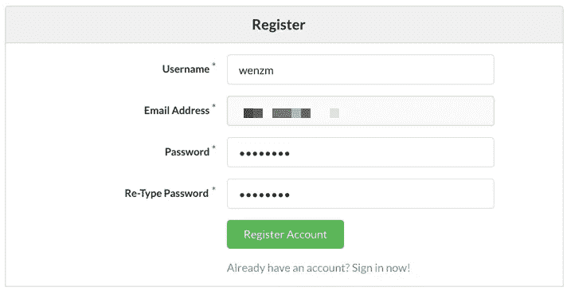
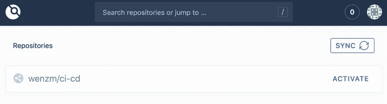
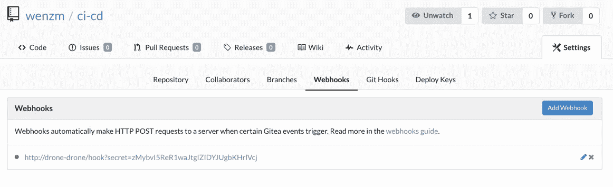
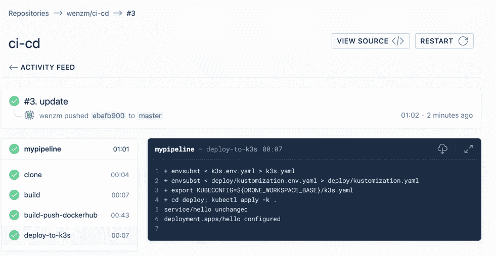

# 在 K3s 上探索 Gitea-Drone CI/CD

> 原文：<https://itnext.io/explore-gitea-drone-ci-cd-on-k3s-4a9e99f8b938?source=collection_archive---------1----------------------->


在周末，我探索了在 K3s 上运行的 [Gitea](https://github.com/go-gitea/gitea) 和 [Drone.io](https://drone.io/) 的 CI/CD 实现。目标是建立一个轻量级 CI/CD 实现，它可以在一台笔记本电脑上运行，以模拟本地环境。本文记录了该设置，以供将来参考。

假设 K3s 已在您的笔记本电脑上启动并运行。*关于如何在 Macbook 上运行 K3s，请参考我的论文“* [*在 Macbook 上使用 Multipass 运行 K3s*](https://medium.com/@zhimin.wen/running-k3s-with-multipass-on-mac-fbd559966f7c)*”。*

## Gitea 设置

Gitea 将成为源代码库。尽管库伯内特家的头盔库中没有图表，但多亏了 jfelten，这里有一张关于 https://github.com/jfelten/gitea-helm-chart 的图表。

Git 克隆存储库，通过运行

```
helm package gitea
```

将创建的软件包`gitea-1.6.1.tgz`上传到托管 K3s 的多通道虚拟机。将文件放到`/var/lib/rancher/k3s/server/static/charts`目录下

现在创建 Helmchart 部署 CRD，

```
apiVersion: k3s.cattle.io/v1
kind: HelmChart
metadata:
  name: gitea
  namespace: kube-system
spec:
  chart: https://%{KUBERNETES_API}%/static/charts/gitea-1.6.1.tgz
  targetNamespace: gitea
  valuesContent: |-
    service:
      http:
        serviceType: NodePort
        externalPort: 
        externalHost: 
    persistence:
      enabled: true
      accessMode: ReadWriteOnce
    config:
      secretKey: password
      disableInstaller: true
```

选择服务类型作为节点端口。将 externalPort 和 externalHost 设置为空以使用群集 IP；通过将 accessMode 设置为 ReadWriteOnce 来启用持久性，因为 hostPath 不支持 ReadWriteMany 模式；设置 secretKey，以便禁用初始安装程序弹出窗口。

一旦 pod 开始运行，找到服务的节点端口，转到 URL，然后注册用户，



## 无人机设置

有稳定的无人机舵图。下载舵图，以避免图表不同步的问题。使用以下内容部署它，

```
apiVersion: k3s.cattle.io/v1
kind: HelmChart
metadata:
  name: drone
  namespace: kube-system
spec:
  chart: https://%{KUBERNETES_API}%/static/charts/drone-2.0.0-rc.12.tgz
  targetNamespace: drone
  valuesContent: |-
    service:
      type: NodePort
    sourceControl:
      provider: "gitea"
      gitea:
        server: "[http://gitea-gitea-http.gitea:3000](http://gitea-gitea-http.gitea:3000)"
    server:
      adminUser: "wenzm"
```

将提供者设置为“gitea ”,并将服务器指向集群中 gitea 的服务名。分配给在 Gitea 中注册的 adminUser。

找到无人机的节点端口，进入网络控制台。使用 Gitea 中的用户名和密码登录。目前无人机中还没有显示任何存储库。

## Gitea webhook 设置

在 Gitea 中创建一个存储库。现在回到无人机控制台，点击“同步”按钮来同步存储库。Gitea 资源库出现在 Drone 中。



单击激活。然后，在 Gitea 中检查资源库的 settings/webhook，



webhook 已创建。然而，由于 drone 与 Gitea 不在同一个名称空间中，我们需要更新 URL 以包含名称空间。如下更新 webhook。

```
http://drone-drone.drone/hook?secret=xxxxxxxxxxxxxxxxxxxxxxxx
```

现在我们有了集成的 Gitea 和无人机。如果 Gitea 中有一个 push 事件，那么 Drone 就会拉开流水线执行的序幕。

## CI/CD 管道

像其他的一样，CI/CD 管道是在源代码中定义的。默认情况下，它被命名为`.drone.yml`，其中它定义了一个由不同步骤组成的管道。每个步骤都将运行一个容器，并相应地执行设计的任务/命令。

下面列出了这次勘探的管道。

```
kind: pipeline
name: mypipelinesteps:
- name: build
  image: golang
  environment:
    CGO_ENABLED: 0
  commands:
  - go build -o hello src/*.go- name: build-push-dockerhub
  image: plugins/docker
  settings:
    username:
      from_secret: dockerUser
    password:
      from_secret: dockerPass
    repo: zhiminwen/hello-by-drone
    tags:
       - "${DRONE_COMMIT_SHA:0:8}"- name: deploy-to-k3s
  image: zhiminwen/kubectl:v1.14
  environment:
    K3SSERVER:
      from_secret: k3sServer
    K3SCERT:
      from_secret: k3sCert
    K3SPASS:
      from_secret: k3sPass
    IMAGETAG: "${DRONE_COMMIT_SHA:0:8}"

  commands:
  - envsubst < k3s.env.yaml > k3s.yaml
  - envsubst < deploy/kustomization.env.yaml > deploy/kustomization.yaml
  - export KUBECONFIG=$${DRONE_WORKSPACE_BASE}/k3s.yaml 
  - cd deploy; kubectl apply -k .
```

## 1.步骤:构建

该应用程序只是一个简单的 golang hello world HTTP 处理程序。我们使用 golang 图像来构建应用程序。将环境变量`CGO_ENABLED`设置为 0，因为我们将使用 alpine base 构建 docker 映像。

## 2.步骤:构建-推送-dockerhub

当构建 docker 图像时，我们使用 Drone 插件来创建 docker 图像并将其推送到 Dockerhub 中。

在源存储库中创建 Dockerfile，如下所示，

```
FROM alpineRUN mkdir -p /app
ADD hello /app
RUN chmod a+rx /app/helloCMD ["/app/hello"]
```

在该步骤中，`repo`设置将图像名称默认设置为 dockerhub repo。如果需要不同的回购协议，请设置其全名，如`*mycluster.icp:8500/zhiminwen/hello-by-drone*`

对于这个构建，我们使用 commit SHA 值的前 8 个字符来设置 image 标记。

要推送至 dockerhub，需要登录凭据。使用无人机命令行工具创建无人机存储库机密，

```
export DRONE_SERVER=[http://192.168.64.5:30093](http://192.168.64.5:30093)
export DRONE_TOKEN=zlz8c26jRy0Vc14wXkSlv8ripVHkmdHTdrone secret add --name dockerUser --data xxxxxx --repository wenzm/cicd
drone secret add --name dockerPass --data yyyyyy --repository wenzm/cicd
```

## 3.步骤:部署到 k3s

我们将应用程序部署到 K3s 的映像构建中。

**构建 kubectl 映像**

用下面的 docker 文件创建一个 docker 映像来运行 kubectl 命令。请注意，我使用的是 1.14 版本，因此可以使用 Kustomize 功能。

```
FROM alpineRUN apk update && \
   apk add curl gettext && \
   curl -LO [https://storage.googleapis.com/kubernetes-release/release/$(curl](https://storage.googleapis.com/kubernetes-release/release/$(curl) -s [https://storage.googleapis.com/kubernetes-release/release/stable.txt)/bin/linux/amd64/kubectl](https://storage.googleapis.com/kubernetes-release/release/stable.txt)/bin/linux/amd64/kubectl) && \
   mv kubectl /usr/local/bin && \
   chmod a+rx /usr/local/bin/kubectl
```

同时，添加了 gettext 包，因为我需要运行`envsubst`命令来替换环境变量。

**准备 KUBECONFIG 文件**

工具准备好了，我需要与 K3s 服务器对话。将以下 k3s.env.yaml 文件添加到存储库中，

```
apiVersion: v1
clusters:
- cluster:
    certificate-authority-data: $K3SCERT
    server: $K3SSERVER
  name: default
contexts:
- context:
    cluster: default
    user: default
  name: default
current-context: default
kind: Config
preferences: {}
users:
- name: default
  user:
    password: $K3SPASS
    username: admin
```

为证书 CA、K3s 服务器、K3s 密码创建无人机机密。在管道步骤中，用这些秘密创建环境变量。

在 pipeline 命令中，我们首先通过替换环境变量来创建 k3s.yaml 文件，然后将 KUBECONFIG 导出到新创建的文件中，我们准备好对 k3s 服务器运行 kubectl 命令。

```
- envsubst < k3s.env.yaml > k3s.yaml
- export KUBECONFIG=$${DRONE_WORKSPACE_BASE}/k3s.yaml
```

*我用$$来转义 Drone 试图执行命令时变量展开。*

**使用 Kustomize 部署**

为了避免过度的模板化，我使用了嵌入在 kubectl 1.14 版本中的最新 Kustomize 特性。

在源存储库中，创建一个部署文件夹，保存下面的 deploy.yaml 和 service.yaml 文件，该文件不应被更改。

```
---
apiVersion: apps/v1
kind: Deployment
metadata:
  labels:
    app: hello
  name: hello
  namespace: demo
spec:
  replicas: 1
  selector:
    matchLabels:
      app: hello
  template:
    metadata:
      labels:
        app: hello
    spec:
      containers:
      - name: hello
        image: zhiminwen/hello-by-drone
```

服务 yaml 文件，

```
---
apiVersion: v1
kind: Service
metadata:
  labels:
    app: hello
  name: hello
  namespace: demo
spec:
  ports:
  - name: http
    port: 80
    protocol: TCP
    targetPort: 8080
  selector:
    app: hello
  type: NodePort
```

创建以下 Kustomization.env.yaml 文件，该文件将自定义部署的映像设置。

```
apiVersion: kustomize.config.k8s.io/v1beta1
kind: Kustomizationimages:
- name: zhiminwen/hello-by-drone
  newName: zhiminwen/hello-by-drone
  newTag: $IMAGETAGresources:
- resources/deploy.yaml
- resources/service.yaml
```

在 pipeline 命令中，我将首先使用`envsubst`命令创建 Kustomization.yaml 文件，以替换设置为“`${DRONE_COMMIT_SHA:0:8}`”的`$IMAGETAG`环境变量。这将使部署在当前构建中使用 image 标记。

```
- envsubst < deploy/kustomization.env.yaml > deploy/kustomization.yaml- cd deploy; kubectl apply -k .
```

然后，使用-k 选项应用 Kustomization。

**测试**

更新代码，提交更改，推送到回购。管道启动并成功运行。



可以毫无问题地访问应用程序。