# 探索 AWS 上无服务器开发的 OpenAPI/Swagger First 方法

> 原文：<https://itnext.io/exploring-an-openapi-swagger-first-approach-to-serverless-development-on-aws-d19f0e9ca257?source=collection_archive---------0----------------------->

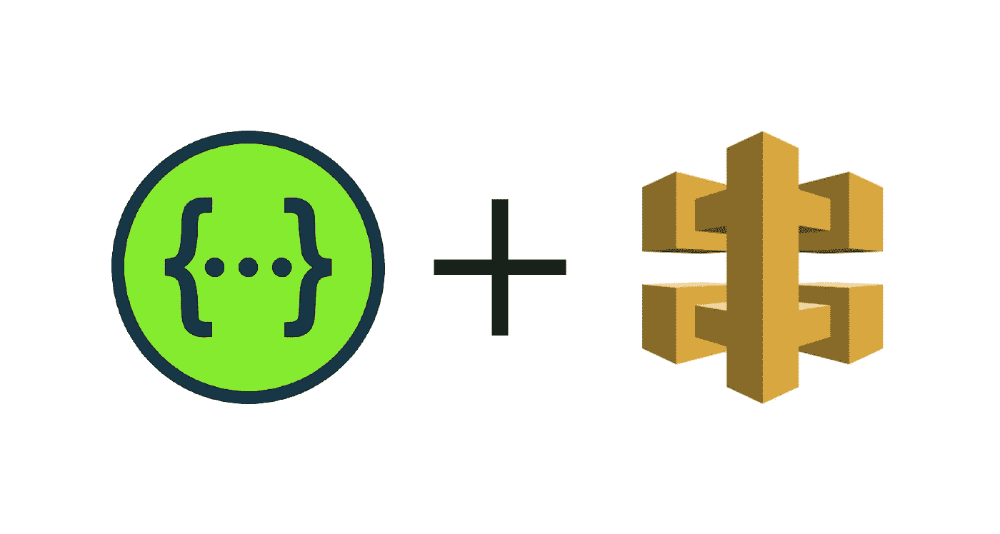

*注意:当我使用大写“S”的“无服务器”一词时，我指的是框架，而当我使用小写“S”的“无服务器”一词时，我指的是整体方法。*

自从 AWS 在 2014 年推出 Lambda 以来，接近零的停机时间、可扩展性和低维护开销使 Lambda 成为 API 开发的一个有吸引力的选择。如果你做过任何类型的无服务器开发，有两个框架你很可能听说过，并且可能用于开发无服务器 API。那就是由 T2 AWS 开发的 SAM-CLI T3 和 T4 的无服务器框架 T5。这些框架共享的是用 AWS 的 API 网关(以及其他 AWS 资源，但今天我们专注于 API)构建 API 的声明性方法。

如果您使用的是 SAM，您的部分配置可能如下所示(顺便说一下，此演示的所有代码可以在[这里](https://github.com/5t33/serverless-swagger-demo)找到):

然而，如果您使用无服务器，它可能看起来像这样:

这些配置使用较少的样板文件集合并简化了 API Gateway/Lambda 设置。最后，我们有了一个看起来更接近开发人员在构建 API 时可能习惯的东西:一个端点列表以及它们的方法类型和查询参数。然而，对于使用 API Gateway 声明 API，有一个许多开发人员已经熟悉的替代解决方案:OpenAPI。

# OpenAPI

如果您曾经使用过 OpenAPI(或以前称为 Swagger 的 API 规范)，您可能会注意到这些无服务器配置文件看起来与 OpenAPI 规范非常相似。[OpenAPI 的创造者 Swagger.io](https://swagger.io/) ，提供了各种基于 open API 规范生成 API 的有用工具，很像 Serverless/SAM 如何用 API Gateway 生成 API(Wow 这可能是“API”用了 2 句话的时间量的记录)。API Gateway 实际上也支持通过 OpenAPI 规范进行声明。

一个开放的 API 规范看起来像这样:

看起来很像前面的两个例子，对吗？在这种情况下，多种工具为了类似的目的进化成了类似的格式，这种现象在软件和生物学中都存在([这就是为什么一切都进化成了螃蟹](https://www.popsci.com/story/animals/why-everything-becomes-crab-meme-carcinization/))。然而，虽然无服务器配置和 OpenAPI 看起来很相似，但 OpenAPI 实际上是一种更好的 API 声明方式。使用 OpenAPI，您可以从广泛使用的规范以及内置的交互式文档中受益，除了名为 [swagger-editor](https://swagger.io/tools/swagger-editor/) 的配置编辑器之外，它还附带了一个名为 [swagger-ui](https://swagger.io/tools/swagger-ui/) 的类似 [Postman](https://www.postman.com/) 的运行器(顺便说一下，如果您愿意，您也可以将 OpenAPI 规范导入 Postman)。文档看起来像这样:

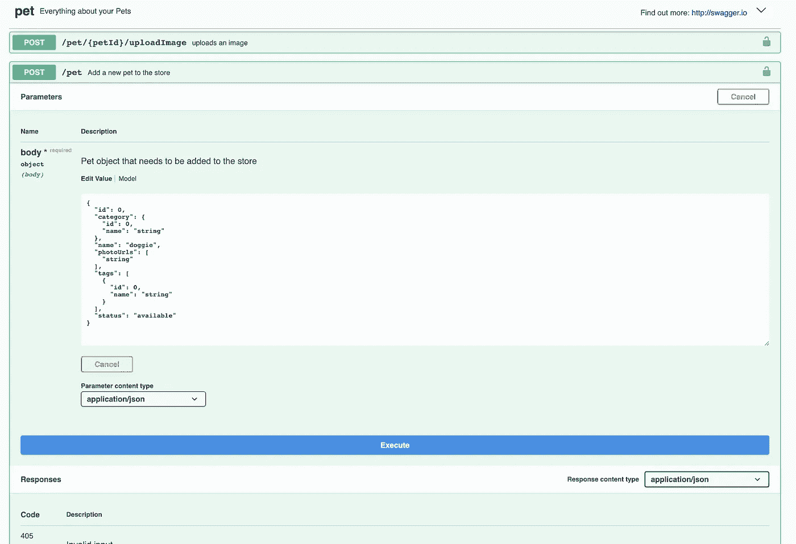

编辑器看起来有点像这样:

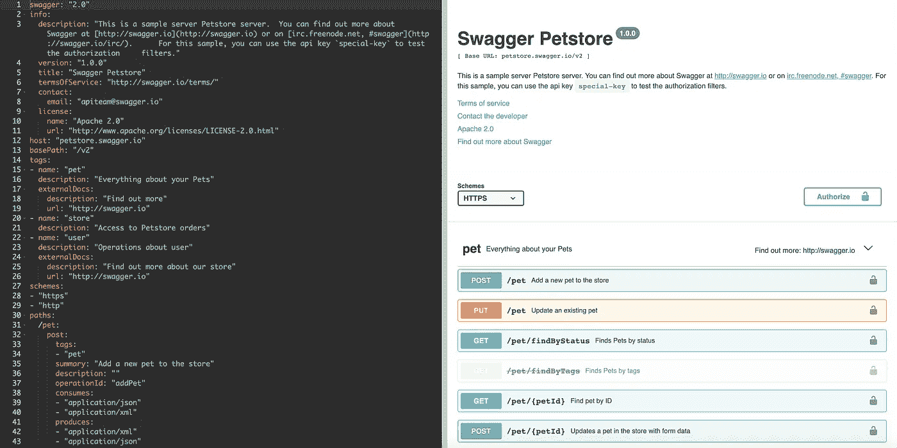

此外，OpenAPI 代码生成的许多实现都支持开箱即用的规范验证。这意味着文档和验证在同一个地方，还有上面概述的漂亮工具。我认为这是一个绝对的胜利。


因此，考虑到这一点，我将在接下来的几节中探索一种用于无服务器 API 开发的 OpenAPI 方法。

# API 设置

## 无服务器

经过一点试验后，很明显 SAM 和 Serverless 在 OpenAPI 方面都有局限性。Serverless 实际上并不完全支持用 OpenAPI 声明您的 API 网关。相反，您在无服务器配置中声明 OpenAPI 规范的一部分以及您的端点(使用[无服务器-AWS-文档](https://github.com/deliveryhero/serverless-aws-documentation)插件)，如下所示:

```
custom:
  documentation: ${file(serverless.doc.yml):documentation}

functions:
  myFunc:
    events:
      - http:
          path: getStuff
          method: get
          documentation: ${file(serverless.doc.yml):endpoints.myFunc}
```

虽然这不是最糟糕的，但它要求您重新声明您的端点，这正是我试图避免的。此外，它实际上并不像 API Gateway 那样使用无服务器离线在本地验证您的请求。有一个名为[serverless-req validator-plugin](https://github.com/RafPe/serverless-reqvalidator-plugin#readme)的包，但是它要求你在 server less 文件中声明你的验证器，而不是在 OpenAPI 中，这又一次违背了目的，并且不允许使用 swagger 工具。

## 地对空导弹

SAM 更好一点，它允许您用 OpenAPI 配置简单地声明整个 API，就像这样:

```
Resources:
  Api:
    Type: AWS::Serverless::Api
    Properties:
      Name:
        Fn::Sub: ${AppName}-api-${Stage}
        StageName: !Ref Stage
        DefinitionBody:
          Fn::Transform:
            Name: AWS::Include
            Parameters:
              Location: swagger.yml
```

这也适用于 SAM 的本地命令`start api`。您仍然必须在 SAM 配置中声明函数，但是没有太多的方法可以绕过它，所以我不认为这是太多的重复工作。然而，SAM 并不在本地验证您的输入，正如 2018 年 发布的这个[*所证明的。一旦他们开始考虑，我很高兴这能作为一个特性被包括进来。*](https://github.com/aws/aws-sam-cli/issues/364)

无论如何，在这篇文章的剩余部分，我将使用 SAM 来构建和部署我的 API。我希望能够通过编写针对 OpenAPI 验证器的测试来解决缺少本地验证的问题。考虑到我无论如何都会编写测试来反对我的验证，这没什么大不了的。虽然为了确保我的验证器符合 API Gateway(应该是这样，但是谁知道呢)，验收测试将是至关重要的，这也是我会做的事情，但是将这些测试从集成(针对验证器包)转换为验收(针对部署的 API)将需要一些逻辑。不管怎样，我们开始吧。

## OpenAPI 配置

这创建了一个名为`/testFunc`的端点，它接受一个必需的字符串参数。它还通过`x-amazon-apigateway-request-validator`设置请求验证。这种验证通常需要在另一个 CloudFormation 资源中进行设置。**这里需要注意的一点**是读取`POST`的`httpMethod`参数和读取`get:`的 OpenAPI 配置方法键之间的差异。这样做的原因是，当使用 lambda 函数与 API Gateway 集成时，您必须将 POST 列为 httpMethod，即使端点类型是 GET。这不会影响你调用 API 的方式，只会改变 API Gateway 与 lambda 的交互方式。我认为文档会更大声地喊出来，但是你可以在 OpenAPI 扩展文档的“httpMethod”属性[和这个](https://docs.aws.amazon.com/apigateway/latest/developerguide/api-gateway-swagger-extensions-integration.html)[例子](https://docs.aws.amazon.com/apigateway/latest/developerguide/integration-request-basic-setup.html)中找到它。

顺便说一下，关于 OpenAPI 扩展这个话题，`x-amazon-apigateway-request-validator`实际上是 AWS 提供的众多 [OpenAPI 扩展](https://docs.aws.amazon.com/apigateway/latest/developerguide/api-gateway-swagger-extensions.html)中的一个，用于声明 API 网关资源或配置，比如`x-amazon-apigateway-any-method-object`、`x-amazon-apigateway-auth`和`x-amazon-apigateway-cors`。这些应该给了你用 OpenAPI 声明 API 网关所需要的一切。

现在，SAM 配置将使用 OpenAPI 配置:

这个 SAM 配置将设置 API 和相应的启用 X 射线跟踪的函数(要了解更多关于 X 射线的信息，请查看[这个深度剖析](/a-deep-dive-into-serverless-tracing-with-aws-x-ray-lambda-5ff1821c3c70?source=your_stories_page-------------------------------------))。此外，该配置还设置了“MethodSettings”和 AccessLogSetting 配置值，这两个值分别打开 API 网关的日志记录并格式化登录到 JSON 的日志。

现在，运行`sam local start-api`:

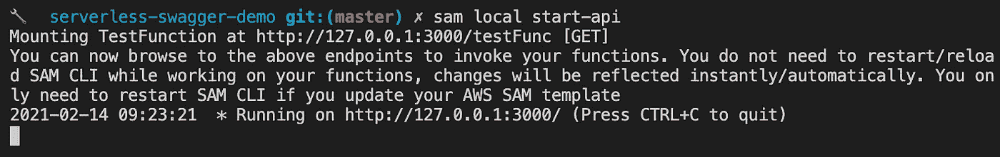

我可以弯曲我的端点:

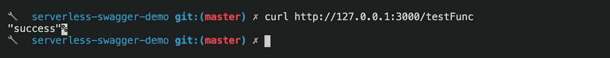

太好了，有用。这证明我们可以使用 OpenAPI 配置在本地运行 API 网关配置，但是，正如您所看到的，请求没有被验证(配置指定了一个名为 testQuery 的查询参数)。我前面提到的是 SAM 的一个当前问题，因此需要进行一些测试来填补空白。现在开始部署。

# 部署

要开始这个演示 API 的部署，运行:

```
sam deploy -t sam.yml --guided
```

初始部署后，您可以运行不带`--guided`标志的命令，假设您选择了将部署配置保存到默认的名为`samconfig.toml`的本地文件。

现在已经部署了 API，您应该能够在 AWS 中导航到 API 网关控制台的“dashboard”部分来找到您的端点，然后测试它:

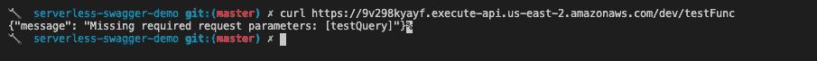

结果很好。我们可以看到，OpenAPI JSON-schema 验证虽然在 SAM 中本地不可用，但一旦部署，它就可以按预期工作。现在让我们看看，一旦提供了变量，它是否正确地连接到 Lambda:

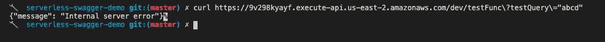

哈。这是不对的。让我们来看看可能是什么问题。在控制台中使用 API Gateway test 选项进行测试后，我看到了以下日志(这些日志是可用的，因为它们是在 SAM 配置中打开的):

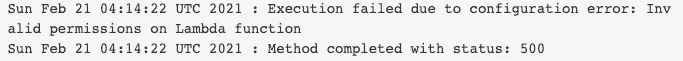

看起来 API 没有权限与 lambda 对话。经过一点试验，我注意到了用 SAM 声明 API 和用 OpenAPI 配置声明 API 之间的重要区别。当与 SAM 一起部署时，您的 lambdas 将被提供一个资源策略，看起来像这样:

```
{
  "Version": "2012-10-17",
  "Id": "default",
  "Statement": [
      {
        "Sid": "demo-swagger-sam-TestFunctionTestFucPermissionProd-1LLU5CLKO2NJ0",
        "Effect": "Allow",
        "Principal": {
          "Service": "apigateway.amazonaws.com"
        },
        "Action": "lambda:InvokeFunction",
        "Resource": "arn:aws:lambda:us-east-2:01234567890:function:demo-swagger-sam-test-func-dev",
        "Condition": {
        "ArnLike": {
          "AWS:SourceArn": "arn:aws:execute-api:us-east-2:01234567890:4gic1pfddb/*/GET/testFunc"
        }
      }
    }
  ]
}
```

然而，当使用 OpenAPI 配置进行部署时，lambda 资源策略(位于 Lambda 控制台的“permissions”选项卡下)是空的。这(再次)得到了 open API[x-Amazon-API gateway-integration](https://docs.aws.amazon.com/apigateway/latest/developerguide/api-gateway-swagger-extensions-integration.html)扩展文档的认可，在“凭证”部分:

对于基于 AWS IAM 角色的凭据，请指定适当 IAM 角色的 ARN。**如果未指定，凭证默认为基于资源的权限，这些权限必须手动添加，以允许 API 访问资源**。有关更多信息，请参见[使用资源策略授予权限](https://docs.aws.amazon.com/lambda/latest/dg/intro-permission-model.html#intro-permission-model-access-policy)。”

因此，我们的选择是要么给每个 lambda 添加一个资源策略，允许 API 网关资源调用它们，要么给 API 网关添加一个执行角色，允许调用我们的每个 lambda。我更喜欢第二个选项，因为它将被本地化为一个资源。为此，我将向 SAM 配置中添加以下 IAM 角色和策略资源:

它将通过 x-Amazon-API gateway-integration 选项在 OpenAPI 规范中使用，如下所示:

```
x-amazon-apigateway-integration:
  credentials:
    Fn::Sub: ${ApiRole.Arn}
```

现在，在重新部署 API 并使用预期的查询参数调用测试端点之后，我看到了预期的输出:

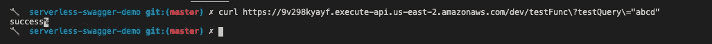

现在我们来看看这个大摇大摆的工具。

# 工具作业

## 招摇的编辑

要运行编辑器，这里有 docker 映像和 npm 包[的说明。我将使用 docker 图像。要启动并运行它，请运行以下命令:](https://swagger.io/docs/open-source-tools/swagger-editor/)

```
docker run -p 8080:8080 -v $(pwd):/tmp -e SWAGGER_FILE=/tmp/swagger.yml swaggerapi/swagger-editor
```

这个*应该*在端口 8080 上使用我的本地 OpenAPI 规范(swagger.yml)启动 swagger 编辑器。

祝成功！

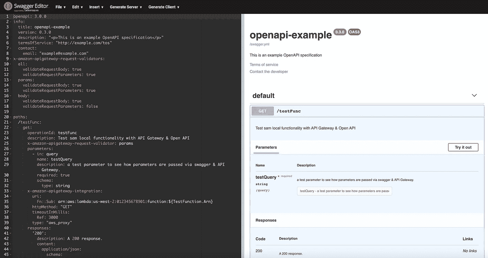

从上图可以看出，swagger 编辑器能够解释 OpenAPI 配置。而且，它甚至理解 API 网关扩展:

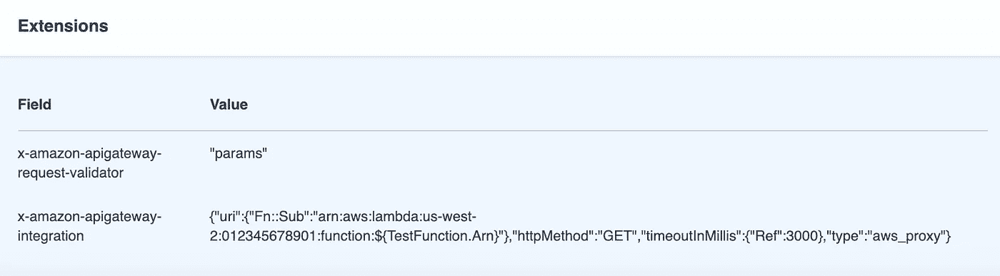

所以这很酷。为了说明这是如何工作的，我将通过 UI 更新 swagger 以包含一个新的端点。首先，单击“insert ”,弹出如下下拉菜单:

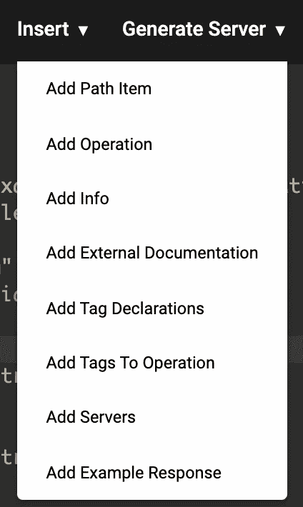

从中选择“添加路径项”，弹出一个对话框:

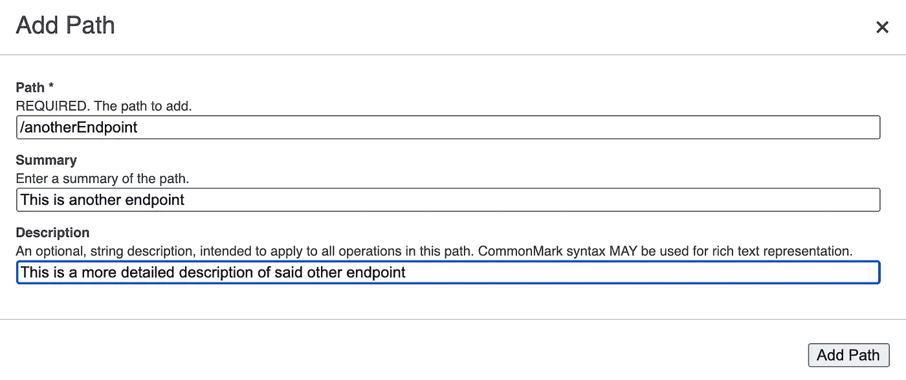

我可以填写它来插入一个新路径。在这之后，我将能够添加一个操作，信息等。我觉得奇怪的一点是，它没有给我添加任何模式的选项。“components”和“schemas”部分可能必须已经存在才能编辑，这很奇怪，所以我将尝试添加一些随机模式，如下所示:

这导致模式在右侧列出:

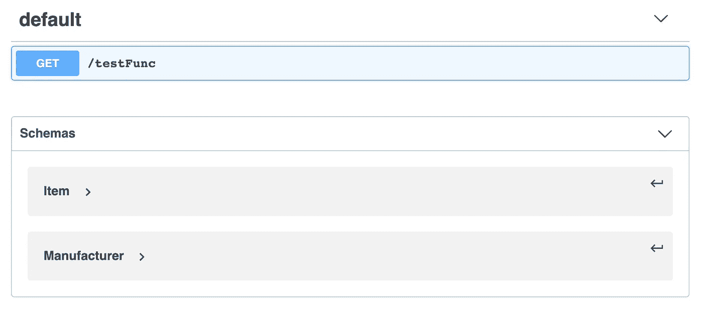

但是仍然没有通过“插入”按钮向 OpenAPI 规范添加组件和/或模式的选项。这有点烦人，但我可能只是打算手工编辑 swagger 规范，所以编辑器更像是一个“好东西”。也就是说，看起来 [swaggerhub](https://app.swaggerhub.com/) 给了你一个不同版本的编辑器，允许添加模式等(你可以看到左边“模式”旁边的小“+”开关):

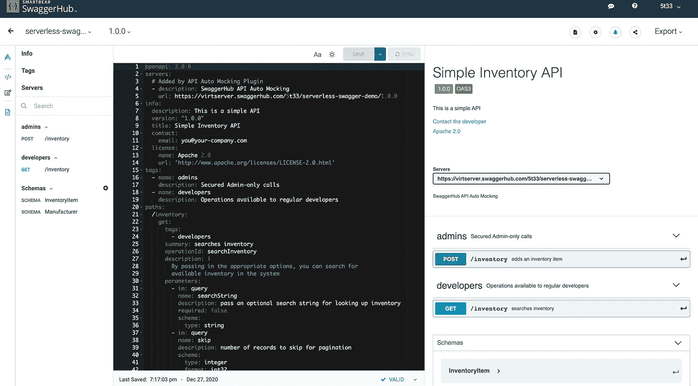

然而，出于某种原因，您不能使用 swaggerhub 编辑器添加端点。此外，图像实际上并不允许你保存到你的招摇规格的位置。所以看起来用 GUI 编辑文档是不可能的，所以从现在开始我将只手动编辑它。

现在，让我们来看看更重要的一点，大摇大摆的 UI:

## Swagger UI

swagger UI 比编辑器更重要一点，因为它将被用作实时文档。因此，与作为本地使用的实用程序启动的编辑器相反，UI 将需要与 API 一起部署。这在本地也有帮助，因为它将运行在同一个端口上，这将避免调用端点时的 cors 错误(这是可以解决的，但为什么要这么麻烦呢？).

为了部署 UI，我将使用 [express](https://www.npmjs.com/package/express) 以及 [swagger-ui-express](https://www.npmjs.com/package/swagger-ui-express) 包和[@ vendia/server less-express](https://www.npmjs.com/package/@vendia/serverless-express)(这是现已贬值的 [aws-serverless-express 包](https://www.npmjs.com/package/aws-serverless-express)的新位置)。λ会是这样的:

为了添加这个新函数，我将向我的 OpenAPi 配置添加两个额外的路径:

除了更新 swagger 配置以包含这个新功能之外:

并添加到 ApiRole 策略的“资源”部分，以包含两个 lambda ARNs:

现在，我可以运行`sam local start-api -t sam.yml`并访问`localhost:3000/docs`来查看输出:

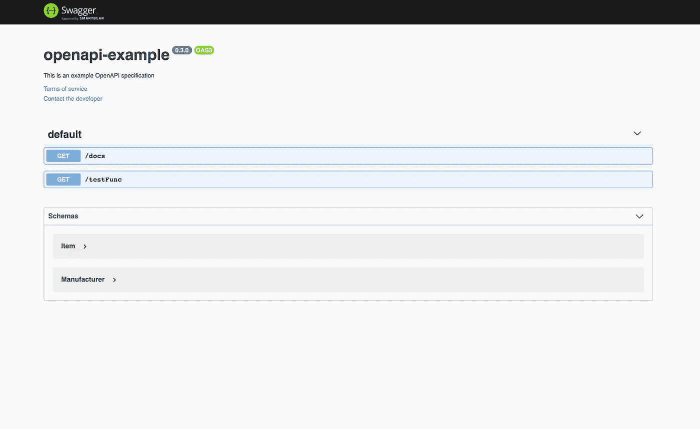

为了更好地理解这一点，`/docs`路径将把请求指向前面讨论过的 docs.js lambda 函数。然而，第二个选项列在名为`/{proxy+}`的`/docs`选项下。如果您以前没有看到过`{proxy+}`选项，这是一个针对全包路由的特定于 API 网关的配置(用于代理服务，例如 express)。原因是 swagger-ui-express 中间件实际上服务于一组静态资源，这些资源通过调用“/docs”来重定向。

正如您在网络输出中看到的:

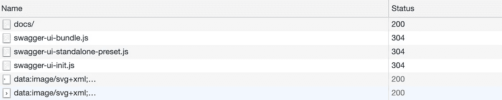

但是，由于这个代理选项会将所有请求发送到您的/docs 端点，如果它们没有明确地(没有双关的意思)匹配您的 API 网关的任何其他端点，那么将 404 catch-all 添加到 docs.js 将是一个好主意。我的印象是，人们可以像这样设置代理:`/docs/{proxy+}`，因此只有沿着某个路径的代理请求(以便 API 网关可以处理 404/403)，但是从测试来看，这似乎实际上是不可能的。

无论如何，在部署之后，我们应该能够从我们的 API 中得到同样的东西:

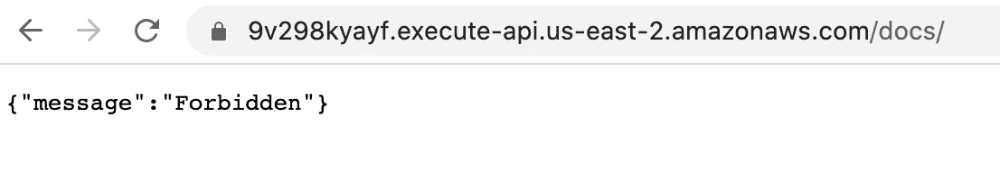

哎呀。我猜不会。

这是由于 API Gateway 和 Express 的交互作用。API Gateway 在 API 前面加上“/dev”，Express API 从“/dev/docs”重定向到“/docs/”来检索静态资产。因为“/dev”不是基本 url 的一部分，所以浏览器会将“/dev”作为重定向的一部分删除，如下所示:

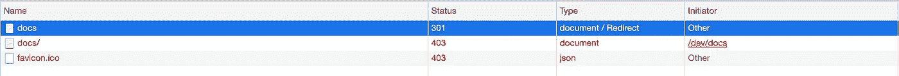

虽然这很烦人，但实际上这不是一个大问题，因为如果它作为一个真正的 API 运行，它可能会有一个自定义域名，所以这不会是一个问题。“/docs”重定向将导航到自定义域的基础，它不会在前面加上“dev”。为了解决这个问题，我将在 Route53 中创建一个快速域，在 ACM 中创建一个证书，然后将它们添加到 SAM API 资源配置中，如下所示:

```
Domain:
  CertificateArn: arn:aws:acm:us-east-2:0123456789012:certificate/<cert-id>
  DomainName: "serverless-swagger-demo.com"
  Route53:
    DistributionDomainName: serverless-swagger-demo.co
    HostedZoneId: <zone-id>
```

现在，我可以通过新域查看 docs 端点:

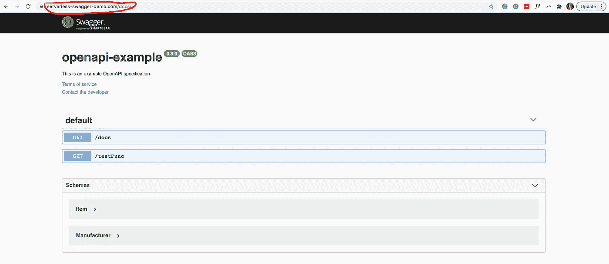

如果你一直跟着做，你会注意到裸域`[https://](https://serverless-swagger-demo)your-domain`不起作用。不幸的是，您需要实际包含`www.`。我确定我要么错误地配置了 SAM 配置(或者 SAM 配置不处理它，这不会让我吃惊)，要么我只需要添加一个 CNAME 来重定向到根`www.`记录。然而，这并不是这篇文章的真正目的，所以我不会为此担心。

文档发布后，您可以试用您的端点并从 UI 查看模式:

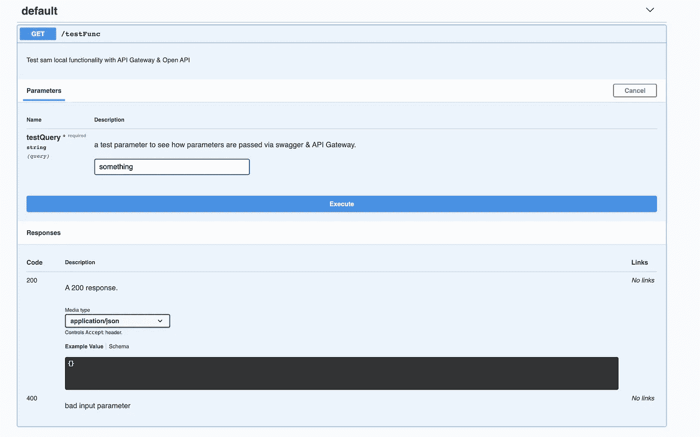

作为内务处理的最后一点，值得注意的是，您可能不希望这些文档公开，因此您可能希望使用 API Gateway 的[私有 API](https://docs.aws.amazon.com/apigateway/latest/developerguide/apigateway-private-apis.html) 选项。然而，API Gateway 不允许只公开 API 的一部分，所以您的文档必须由单独的 API 提供。这需要对 cors 进行一些调整，以便从文档中实际调用您的端点。或者，你可以在你的文档前面放置一个 cognito authorizer，就像这篇文章中的[所做的那样(作者决定部署到 s3，而不是为 SwaggerUI 使用 API Gateway，但这并没有太大的区别)。](https://betterdev.blog/serverless-swagger-ui-for-api-gateway/)

# 测试

正如我前面提到的，如果不能用`sam local start-api`手动测试验证，那么编写测试来检查验证是否正常工作就显得格外重要。为此，我将针对 express OpenAPI 验证器插件编写测试(具体来说就是[这个](https://www.npmjs.com/package/express-openapi-validator))并使用 [Supertest](https://www.npmjs.com/package/supertest) ，就好像我正在集成测试一个常规的 express API 一样。理论上验证 OpenAPI 模式只是 JSON 验证，所以 API Gateway 和任何验证器包应该返回相同的结果。也就是说，在部署 API 之后，运行与验收测试相同的测试将有助于确保这一点。

我用 [Jest](https://www.npmjs.com/package/jest) 快速拼凑的这段代码片段应该能让你大致了解它是如何工作的:

正如您所看到的，无论请求是针对本地 Supertest 还是带有 Axios 的远程 API，在“请求”函数中都进行了一些转换，以使输出正常化。通过这种方式，可以使用以下命令将它们作为集成测试在本地运行:

```
stage=dev_local jest ./test/integration/* --testTimeout 10000
```

或者可以使用以下命令对远程 api 运行相同的测试作为验收测试:

```
base_url=https://www.serverless-swagger-demo.com stage=dev jest ./test/integration/* --testTimeout 10000
```

像这样:

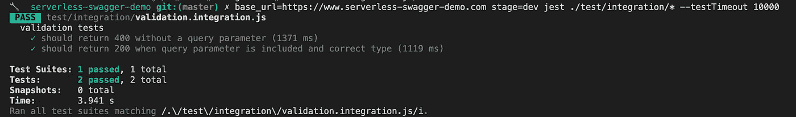

我添加了一个包罗万象的“200”响应，但是您可能需要添加额外的选项来模拟您将从实际 API 收到的响应，例如 201、301 等。

# 结论

我希望这篇文章让你考虑用 OpenAPI 声明你的无服务器 API，而不是使用 Severless/SAM 配置选项。通过添加 Swagger UI 和 API Gateway 的内置验证，这似乎是一种很有吸引力的方法。有一些 gotchyas，但没有一个看起来不方便，足以阻止我在未来走这条路。一旦 SAM CLI 实现了验证，编写测试和根据 OpenAPI 声明进行本地测试将变得更加容易。如果你对这篇文章的内容、无服务器开发或者软件开发有任何疑问，请随时通过 linkedin 联系我。