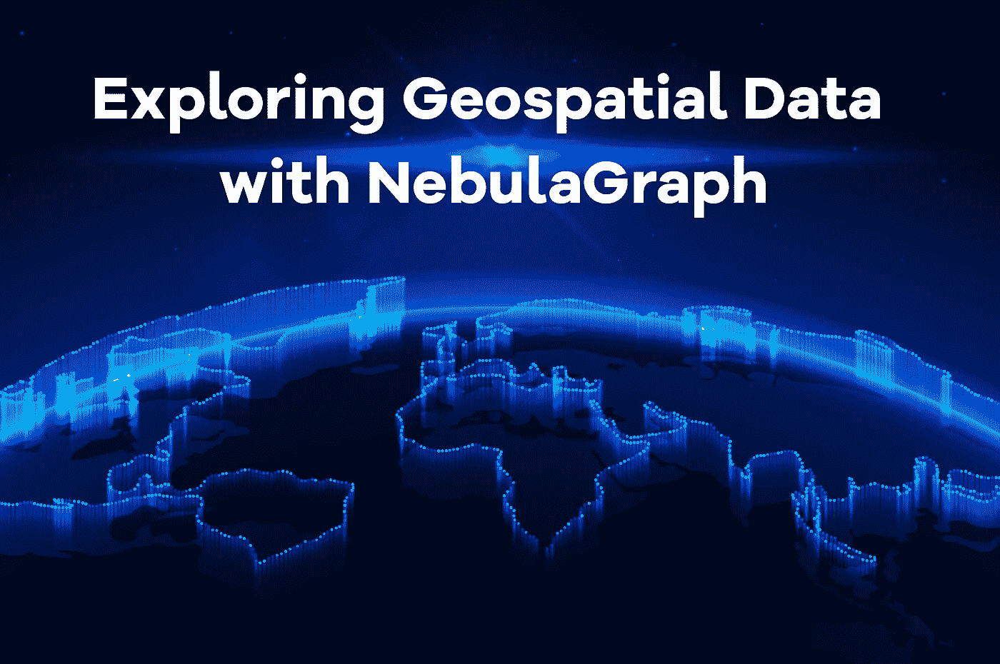
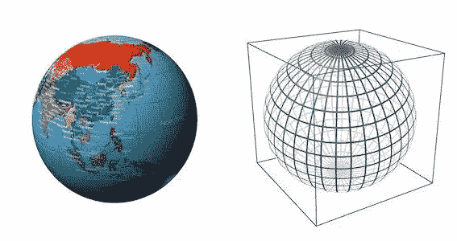

# 使用星云图数据库探索地理空间数据

> 原文：<https://itnext.io/exploring-geospatial-data-with-nebulagraph-database-f2ed2948b3a9?source=collection_archive---------1----------------------->



# 什么是地理空间数据？

地理空间数据是与地理空间实体(如点、线和多边形)相关的信息。

NebulaGraph 2.6 支持地理空间数据。您可以在 NebulaGraph 中存储、计算和检索地理空间数据。地理是 NebulaGraph 支持的数据类型。它由代表地理空间数据的纬度和经度组成。

# 如何在 NebulaGraph 中使用地理空间数据？

**创建模式**

以下示例显示了如何创建标记。您可以用相同的方式创建边类型。

NebulaGraph 目前支持三种类型的地理空间数据:点、线串和多边形。以下显示了如何创建地理类型和插入地理空间数据。

```
CREATE TAG any_shape(geo geography);
CREATE TAG only_point(geo geography(point));
CREATE TAG only_linestring(geo geography(linestring));
CREATE TAG only_polygon(geo geography(polygon));
```

当没有指定地理类型时，意味着可以存储任何类型的数据；指定了类型，就意味着只能存储该类型的地理空间数据，比如`geography (point)`，就意味着只能存储点的空间信息。

**插入数据**

在`any_shape`标签的`geo`列中插入数据。

```
INSERT VERTEX any_shape(geo) VALUES "101":(ST_GeogFromText("POINT(120.12 30.16)"));
INSERT VERTEX any_shape(geo) VALUES "102":(ST_GeogFromText("LINESTRING(3 8, 4.7 73.23)"));
INSERT VERTEX any_shape(geo) VALUES "103":(ST_GeogFromText("POLYGON((75.3 45.4, 112.5 53.6, 122.7 25.5, 93.9 28.6, 75.3 45.4))"));
```

在`only_point`标签的`geo`栏中插入数据。

```
INSERT VERTEX only_point(geo) VALUES "201":(ST_Point(120.12，30.16)"));;
```

在`only_linestring`标签的`geo`栏中插入数据。

```
INSERT VERTEX only_linestring(geo) VALUES "302":(ST_GeogFromText("LINESTRING(3 8, 4.7 73.23)"));
```

在`only_polygon`标签的`geo`栏中插入数据。

```
INSERT VERTEX only_polygon(geo) VALUES "403":(ST_GeogFromText("POLYGON((75.3 45.4, 112.5 53.6, 122.7 25.5, 93.9 28.6, 75.3 45.4))"));
```

当插入的数据不符合指定类型的要求时，数据插入会失败。

```
(root@nebula) [geo]> INSERT VERTEX only_polygon(geo) VALUES "404":(ST_GeogFromText("POINT((75.3 45.4))"));
[ERROR (-1005)]: Wrong value type: ST_GeogFromText("POINT((75.3 45.4))")
```

我们可以看到地理空间数据的插入方式比较奇特，与`int`、`string`、`bool`等基本类型的插入有很大不同。

以`ST_GeogFromText("POINT(120.12 30.16)")`为例，`ST_GeogFromText`是地理位置信息解析函数，接受 WKT(公知文本)标准格式的字符串类型的地理位置数据。

`POINT(120.12 30.16)`代表东经 120° 12′北纬 30° 16′的地理点；`ST_GeogFromText`函数从 WKT 参数解析并构造一个地理数据对象，然后`INSERT`语句将其存储在 WKB(众所周知的二进制)标准的 NebulaGraph 中。

# 地理空间功能

NebulaGraph 支持的地理空间功能可分为以下主要类别:

*   构造函数
*   `ST_Point(longitude, latitude)`:基于经纬度对构造一个`geography point`对象。
*   解析函数
*   `ST_GeogFromText(wkt_string)`:从 WKT 文本中解析`geography`对象。
*   `ST_GeogFromWKB(wkb_string)`:从 WKB 文本中解析`geography`对象。#尚不支持，因为 NebulaGraph 尚不支持二进制字符串。
*   格式设置功能
*   `ST_AsText(geography)`:以 WKT 文本格式输出`geography`对象。
*   `ST_AsBinary(geography)`:以 WKB 文本格式输出`geography`对象。#尚不支持，因为 NebulaGraph 尚不支持二进制字符串。
*   转换函数
*   `ST_Centroid(geography)`:计算`geography`物体的重心，该物体为`geography point`物体。
*   谓词函数
*   `ST_Intersects(geography_1, geography_2)`:判断两个`geography`对象是否相交。
*   `ST_Covers(geography_1, geography_2)`:判断第一个`geography`对象是否完全覆盖第二个对象。
*   `ST_CoveredBy(geography_1, geography_2)`:ST _ Covers 的逆。
*   `ST_DWithin(geography_1, geography_2, distance_in_meters)`:判断两个`geography`物体之间的最短距离是否小于给定距离。
*   度量函数
*   `ST_Distance(geography_1, geography_2)`:计算两个`geography`物体之间的距离。

这些函数接口遵循 OpenGIS 简单要素访问和 ISO SQL/MM 标准。详情见 [NebulaGraph 文档。](https://docs.nebula-graph.io/3.3.0/3.ngql-guide/6.functions-and-expressions/14.geo/)

# 地理空间索引

什么是地理空间索引？

地理空间索引是可用于基于谓词`ST_Intersects`和`ST_Covers`函数快速过滤数据的索引。

NebulaGraph 使用谷歌 S2 图书馆作为地理空间索引。

S2 图书馆将地球表面投影成一个相切的正方形，然后递归地将正方形的每个正方形表面翻四倍 n 次，并使用一条空间填充曲线，即希尔伯特曲线，来连接这些小正方形网格的中心。

当 n 无限大时，这条希尔伯特曲线几乎填满了正方形。

S2 图书馆使用 30 阶希尔伯特曲线。



下图显示地球上充满了希尔伯特曲线。


可以看出，地球表面是由这些希尔伯特曲线划分成单元的。对于地球表面的任何地理形状，如城市、河流或人的位置，我们可以使用几个这样的单元来完全覆盖地理形状。

每个单元由一个唯一的 int64 CellID 标识。因此，地理对象的空间索引是构造成完全覆盖地理形状的一组 S2 像元。

当构建地理空间对象的索引时，构建完全覆盖索引对象的不同 S2 单元的集合。基于空间谓词函数的索引查询通过找到覆盖被查询对象的一组 S2 单元和覆盖被索引对象的 S2 单元之间的交集来快速过滤掉大量不相关的地理对象。

## **创建地理索引**

```
CREATE TAG any_shape_geo_index on any_shape(geo)
```

对于类型为`point`的地理空间数据，可以用 30 阶的 S2 单元来表示，因此一个点对应一个索引条目；对于类型为`inestring`和`polygon`的地理空间数据，我们使用不同级别的多个 S2 单元来覆盖它，因此它将对应于多个索引条目。

空间索引用于加速所有地理谓词的查找，例如:

```
LOOKUP ON any_shape WHERE ST_Intersects(any_shape.geo, ST_GeogFromText("LINESTRING(3 8, 4.7 73.23)"));
```

当`any_shape`的`geo`列上没有空间索引时，该语句会先将`any_shape`的所有数据读入内存，然后用它来计算是否与点(3.0，8.0)相交，一般开销较大。当`any_shape`中的数据量较大时，计算开销将无法接受。

当`any_shape`的`geo`列有空间索引时，该语句将首先使用空间索引过滤掉与该行相交的大部分数据，但在读入内存时仍会有一些可能相交，因此仍有一个计算要做。这样，空间索引以较小的代价快速过滤掉大部分不太可能相交的数据，小部分被过滤掉，大大降低了计算开销。