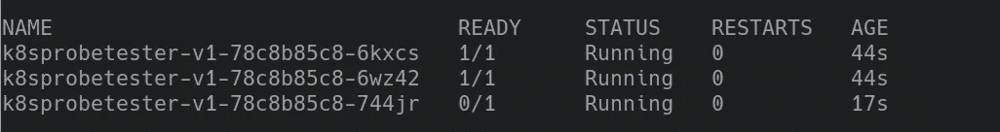

# 探索 Kubernetes 活性和就绪性探针

> 原文：<https://itnext.io/exploring-kubernetes-liveness-and-readiness-probes-e9bbc7d899be?source=collection_archive---------0----------------------->

*代号和事情:*[【https://github.com/trondhindenes/K8sProbeTester】](https://github.com/trondhindenes/K8sProbeTester)

不久前，我们的一个开发人员注意到他们的一个 rest apis 在部署期间宕机了几秒钟，尽管我们觉得我们调整了部署清单，添加了探测和延迟等等。这导致了一些来回，我从来没有时间坐下来好好想想。直到现在。我和我的两个最好的朋友(coffee 和 quiet)决定坐下来，弄清楚这些东西在激动人心但相对复杂的 Kubernetes 世界中究竟是如何工作的。

和往常一样，我试图通过建立一个环境来解决问题，这个环境允许我尽可能快地围绕一个问题进行迭代。我做的第一件事是创建一个超级简单的 Docker 映像，它具有一个可以从 Kubernetes 探测的健康端点，并添加一个可选的 START_WAIT_SECS 环境变量，我可以用它来模拟一个缓慢启动的应用程序。这是我最基本的 kubernetes 清单:

```
---
kind: Deployment
apiVersion: extensions/v1beta1
metadata:
  name: k8sprobetester-v1
  namespace: default
  labels:
    app: k8sprobetester
spec:
  replicas: 3
  selector:
    matchLabels:
      app: k8sprobetester
  template:
    metadata:
      labels:
        app: k8sprobetester
    spec:
      containers:
      - image: "trondhindenes/k8sprobetester:latest"
        name: k8sprobetester
        env:
          - name: START_WAIT_SECS
            value: '0'
```

正如你所注意到的，这非常简单，没有任何花哨的东西。我正在使用我的本地 minikube 实例，这意味着如果我添加一个服务定义，minikube 可以给我一个可到达的 url:

```
---
apiVersion: v1
kind: Service
metadata:
  name: k8sprobetester
  namespace: default
spec:
  selector:
    app: k8sprobetester
  type: NodePort
  ports:
  - name: http
    port: 80
    targetPort: 80
```

运行“minikube service k8sprobetester ”,我得到了一个可以用来测试它的 url(您的端口可能会不同):[http://192 . 168 . 99 . 100:32500/healthz](http://192.168.99.100:32500/healthz)。

不，我们有一个实验室来测试东西。我还将 START_WAIT_SECS 设置为 15 来模拟一个缓慢启动的应用程序。我们还需要一些东西来让 Kubernetes 相信需要调用一个更改，所以我添加了第二个随机环境变量，我只是不断地更改它的值。

此时，您可以使用以下命令查看从一个“版本”到下一个“版本”的展示(最好有 4 个控制台，每个控制台一个:

观看 kubectl 首次展示状态部署 k8sprobetester-v1
观看 kubectl get pods
观看 curl[http://192 . 168 . 99 . 100:32500/healthz](http://192.168.99.100:32500/healthz)

一个用于调用类似`kubectl apply.`的命令

在这个版本的部署中，没有进行探测，尽管我们有 3 个 pod 副本，但没有任何东西告诉 Kubernetes 在部署新版本时不应该同时拆除所有副本。这再加上等待时间，将导致我们的应用在部署期间停机 5-10 秒。我们不想那样。

我们能做的第一件事，是告诉 Kubernetes 应该如何部署我们的应用程序。我们可以通过“部署策略”来实现这一点，它可能看起来像这样:

```
---
kind: Deployment
apiVersion: extensions/v1beta1
metadata:
  name: k8sprobetester-v1
  namespace: default
  labels:
    app: k8sprobetester
spec:
  replicas: 3
  selector:
    matchLabels:
      app: k8sprobetester
  strategy:
    type: RollingUpdate
    rollingUpdate:
      maxUnavailable: 10%
  template:
    metadata:
      labels:
        app: k8sprobetester
    spec:
      containers:
      - image: "trondhindenes/k8sprobetester:latest"
        name: k8sprobetester
        env:
          - name: START_WAIT_SECS
            value: '15'
          - name: SOME_OTHER_VAR
            value: yasssd
```

在这里，我们指定在滚动更新期间，最多有 10%的资源不可用。Kubernetes 有一些内置的智能，可以计算出 10%在吊舱数量方面意味着什么。现在的问题是，即使移除我们的一个吊舱也会使我们下降到 10%以下，所以部署根本无法开始。让我们将其调整到 40%，这允许单个 pod 关闭(根据 kubernetes 参考文档，您也可以使用常规数字而不是百分比，默认为“1”)。

就其本身而言，这对我们的部署没有太大影响，因为 Kubernetes 没有办法知道 pod 是否真正启动了，所以它假设一旦 pod 达到“运行”状态，一切都好。当然，我们的慢启动容器不是这样的。所以，我们需要一些东西来通知它，为此我们可以使用探针。探针有不同的形状和形式，但是因为我们在这里使用的是 rest api，所以我们使用“http”探针类型。

下面是添加了 LivenessProbe 的部署。请注意，我已经将 initialDelaySeconds 设置为 20，因为我们知道我们的应用程序使用了 15 秒来启动:

```
---
kind: Deployment
apiVersion: extensions/v1beta1
metadata:
  name: k8sprobetester-v1
  namespace: default
  labels:
    app: k8sprobetester
spec:
  replicas: 3
  selector:
    matchLabels:
      app: k8sprobetester
  strategy:
    type: RollingUpdate
    rollingUpdate:
      maxUnavailable: 40%
  template:
    metadata:
      labels:
        app: k8sprobetester
    spec:
      containers:
      - image: "trondhindenes/k8sprobetester:latest"
        name: k8sprobetester
        env:
          - name: START_WAIT_SECS
            value: '15'
          - name: SOME_OTHER_VAR
            value: yasss
        livenessProbe:
          httpGet:
            path: /healthz
            port: 80
            httpHeaders:
              - name: Host
                value: KubernetesLivenessProbe
          initialDelaySeconds: 20
```

当开发人员带着一个 WTF 来到我面前时，这与我们正在运行的配置差不多。为什么 Kubernetes 在第一个开始之前就拆掉了正在运行的吊舱？答案是:我们需要另一种类型的探针: *readinessProbe。*事实证明，Kubernetes 有两种不同的方法来跟踪 pod 的健康状况，一种是在部署期间，另一种是在部署之后。LivenessProbe 是导致 Kubernetes 用一个新的 pod 替换一个失败的 pod 的原因，但它在应用程序的部署过程中绝对没有影响。另一方面，Kubernetes 使用就绪探测来确定 pod 是否成功启动。让我们添加一个，使用与实时 nessprobe 相同的设置:

现在进行新的部署，您应该看到“READY”列在达到“1”之前需要一段时间，这意味着尽管 pod 已经启动，但 Kubernetes 并不认为 pod 已经准备好:



此时，您应该能够在部署过程中持续点击服务，并且永远不会出现任何错误。

但是如何跟踪启动过程中的实际故障呢？让我们看看 Kubernetes 是如何处理这个问题的。我在我的图像中添加了另一个标志，允许我在一定百分比的实例化中崩溃 pod(如果你看代码，它不是非常精确，但是已经足够好了)。

新的部署如下所示:

```
---
kind: Deployment
apiVersion: extensions/v1beta1
metadata:
  name: k8sprobetester-v1
  namespace: default
  labels:
    app: k8sprobetester
spec:
  replicas: 5
  selector:
    matchLabels:
      app: k8sprobetester
  strategy:
    type: RollingUpdate
    rollingUpdate:
      maxUnavailable: 30%
  template:
    metadata:
      labels:
        app: k8sprobetester
    spec:
      containers:
      - image: "trondhindenes/k8sprobetester:latest"
        name: k8sprobetester
        env:
          - name: START_WAIT_SECS
            value: '15'
          - name: CRASH_FACTOR
            value: '30'
          - name: SOME_OTHER_VAR
            value: yassf
        livenessProbe:
          httpGet:
            path: /healthz
            port: 80
            httpHeaders:
              - name: Host
                value: KubernetesLivenessProbe
          initialDelaySeconds: 20
        readinessProbe:
          httpGet:
            path: /healthz
            port: 80
            httpHeaders:
              - name: Host
                value: KubernetesLivenessProbe
          initialDelaySeconds: 20
```

正如你所看到的，我们将崩溃因子设置为 30(这意味着应用程序在启动时大约有 30%的时间会崩溃)，并将副本的数量增加到 5 个。

部署时，您应该看到 Kubernetes 注意到一些 pod 崩溃，并不断重试，直到所有 5 个 pod 都处于“就绪”状态，这可能需要几分钟时间。您还应该看到，我们对“healthz”URL 的“ping”实际上从未停止过，因此我们在部署期间经受住了多次应用程序故障。

最后一点:把这些事情做好从来都不容易，这可能需要 Kubernetes 的“所有者”和应用/服务所有者共同努力，在逐个服务的基础上进行调整。关于开始轮询的速度(例如，您可以更快地开始探测，但要增加一些容错能力)和其他设置也有很多需要调整的地方，但多亏了令人敬畏的 Kubernetes api 文档，所有这些东西都可供您阅读。

对于 RiksTV 的我们来说，这是紧张学习的一年，因为我们已经开始在 Kubernetes 上提供真正面向客户的服务，一些事情告诉我，我们还有很长的路要走。

我鼓励您深入研究 Kubernetes 提供的有关部署的选项，DeploymentSpec 类型的参考文档是一个非常好的起点:[https://Kubernetes . io/docs/reference/generated/Kubernetes-API/v 1.11/# deployment spec-v1-apps](https://kubernetes.io/docs/reference/generated/kubernetes-api/v1.11/#deploymentspec-v1-apps)

愿你的部署永不失败，愿你的探测器保护你。