# 探索流行的开源流处理技术:第 1 部分，共 2 部分

> 原文：<https://itnext.io/exploring-popular-open-source-stream-processing-technologies-part-1-of-2-31069337ba0e?source=collection_archive---------0----------------------->

## Apache Spark 结构化流、Apache Kafka 流、Apache Flink 和 Apache Pinot 与 Apache 超集的简短演示

根据[TechTarget](https://www.techtarget.com/searchdatamanagement/definition/stream-processing),*流处理是一种数据管理技术，涉及* ***摄取连续的数据流，以实时快速分析、过滤、转换或增强数据*** *。处理后，数据被传递给应用程序、数据存储或另一个流处理引擎。* " [Confluent](https://www.confluent.io/learn/batch-vs-real-time-data-processing/) ，一家完全管理的 Apache Kafka 市场领导者，将流处理定义为"*一种软件范例，它在连续的数据流还在运动的时候* ***接收、处理和管理它们*** *。*

# 批处理与流处理

同样，根据[汇流](https://www.confluent.io/learn/batch-vs-real-time-data-processing/)，*批处理是指对一组已经存储了一段时间的数据进行处理和分析。*“批处理示例可能包括每日零售数据，这些数据在每夜商店关门后汇总并制成表格。相反，“*流数据处理发生在数据流经系统时。这导致事件发生时的分析和报告。*“举一个类似的例子，销售数据流不是在夜间进行批处理，而是全天连续处理、汇总和分析——实时跟踪销量、购买趋势、库存水平和营销计划绩效。

# 有界与无界数据

根据 Packt 出版社的书，[学习 Apache Apex](https://subscription.packtpub.com/book/big-data-and-business-intelligence/9781788296403/1/ch01lvl1sec8/unbounded-data-and-continuous-processing) ，*有界数据是有限的；它有始有终。无界数据是一个不断增长的、本质上无限的数据集。批处理通常在有界数据上执行，而流处理通常在无界数据上执行。*

# 流处理技术

有许多技术可用于执行流处理。其中包括专有定制软件、商业现货(COTS)软件、由软件即服务(或 SaaS)提供商、云解决方案提供商(CSP)、商业开源软件(COSS)公司提供的完全托管服务，以及来自 [Apache 软件基金会](https://www.apache.org/)和 [Linux 基金会](https://www.linuxfoundation.org/)的流行开源项目。

这篇由两部分组成的博文和在 [YouTube](https://youtu.be/m2IjTPjKbUk) 上的视频演示探索了四个流行的开源软件(OSS)流处理项目: [Apache Spark 结构化流](https://spark.apache.org/docs/latest/structured-streaming-programming-guide.html)、 [Apache Kafka 流](https://kafka.apache.org/documentation/streams/)、 [Apache Flink](https://flink.apache.org/) 和 [Apache Pinot](https://pinot.apache.org/) 与 [Apache 超集](https://superset.apache.org/)。

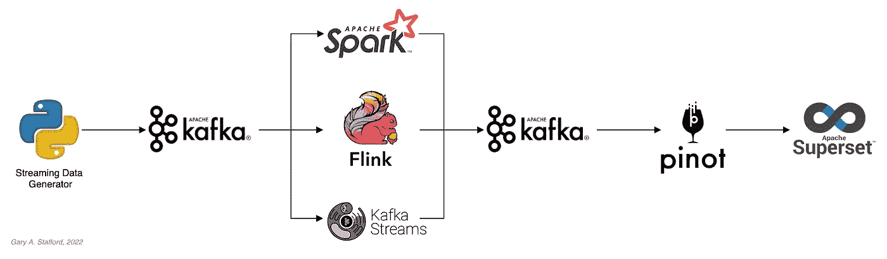

这篇文章使用了开源项目，使得跟随演示变得更加容易，并且将成本保持在最低。然而，您可以很容易地用开源项目替代您喜欢的 SaaS、CSP 或 COSS 服务产品。

## Apache Spark 结构化流

根据 Apache Spark [文档](https://spark.apache.org/docs/latest/structured-streaming-programming-guide.html)，*结构化流(Structured Streaming)是建立在*[*Spark SQL*](https://spark.apache.org/sql/)*引擎之上的一个可扩展的容错流处理引擎。您可以像表达静态数据上的批处理计算一样表达您的流计算。**此外，使用微批处理引擎来处理结构化流查询，该引擎将数据流作为一系列小批量作业来处理，从而实现低至 100 毫秒的端到端延迟以及一次容错保证。*“在这篇文章中，我们将使用一系列用 [PySpark](https://pypi.org/project/pyspark/) 编写的 Apache Spark 结构化流作业来检查批处理和流处理。

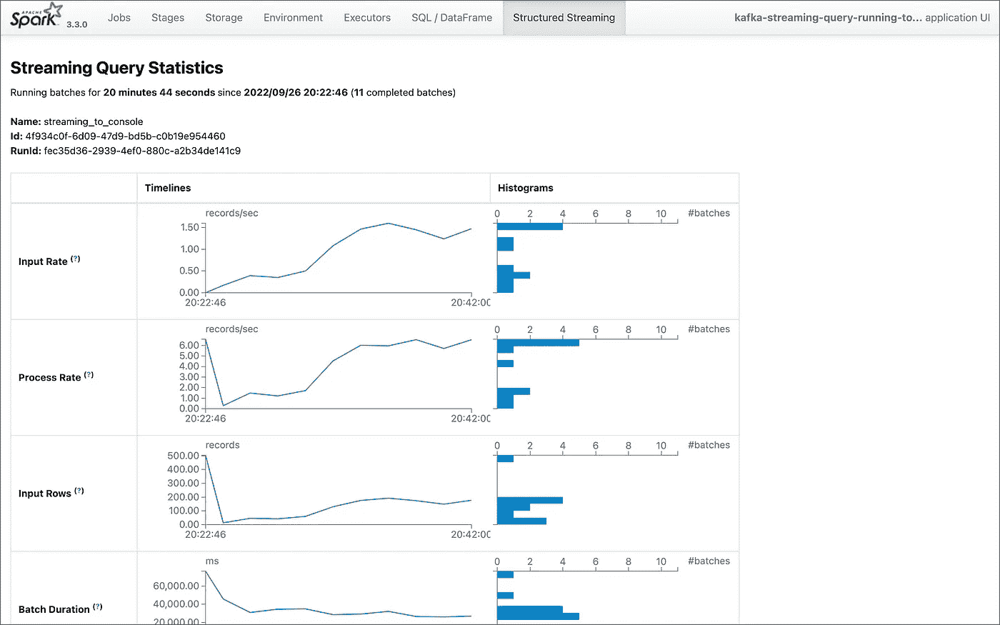

从 Spark UI 看到的 Spark 结构化流作业统计

## 阿帕奇卡夫卡溪流

根据 Apache Kafka [文档](https://kafka.apache.org/documentation/streams/),*Kafka Streams[aka KStreams]是一个用于构建应用程序和微服务的客户端库，其中的输入和输出数据存储在 Kafka 集群中。它结合了在客户端编写和部署标准 Java 和 Scala 应用程序的简单性和 Kafka 服务器端集群技术的优势。*“在本文中，我们将研究一个用 Java 编写的 KStreams 应用程序，它执行流处理和增量聚合。

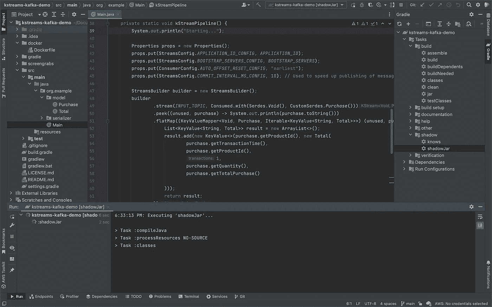

在 JetBrains IntelliJ IDEA 中构建 KStreams 应用程序的 uber JAR

## 阿帕奇弗林克

根据 Apache Flink [文档](https://flink.apache.org/flink-architecture.html)， *Apache Flink 是一个框架和分布式处理引擎，用于无界和有界数据流上的有状态计算。Flink 设计用于在所有常见的集群环境中运行，以内存速度和任意规模执行计算。*“进一步来说， *Apache Flink 擅长处理无界和有界数据集。对时间和状态的精确控制使 Flink 的运行时能够在无界流上运行任何类型的应用程序。有界流由专门为固定大小的数据集设计的算法和数据结构在内部处理，从而产生出色的性能。“在本文中，我们将研究一个用 Java 编写的 Flink 应用程序，它执行流处理、增量聚合和多流连接。*

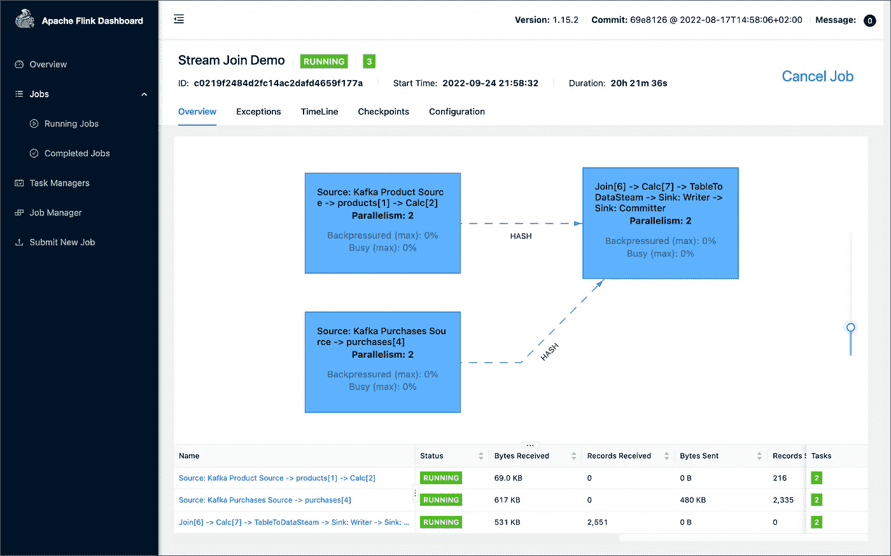

阿帕奇 Flink 仪表盘显示了本文演示的 Flink 管道

## 阿帕奇皮诺

根据 Apache Pinot 的文档，“ *Pinot 是一个实时分布式 OLAP 数据存储，旨在提供超低延迟分析，即使在极高的吞吐量下也是如此。它可以直接从流数据源(如 Apache Kafka 和 Amazon Kinesis)获取数据，并使事件可以立即进行查询。它还可以从诸如 Hadoop HDFS、亚马逊 S3、Azure ADLS 和谷歌云存储等批量数据源中获取数据。*“在帖子中，我们将使用 [SQL](https://docs.pinot.apache.org/users/user-guide-query/querying-pinot) 从[Apache Flink 生成的](https://kafka.apache.org/)Apache Kafka 中查询无界数据流。

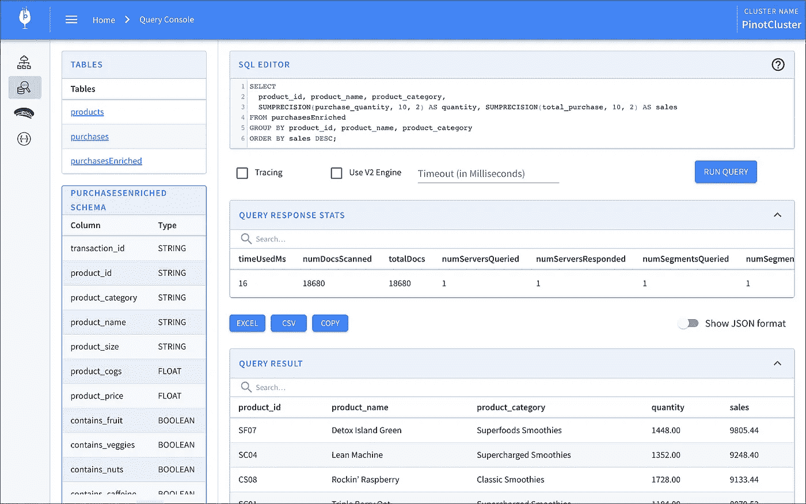

Apache Pinot 查询控制台显示了本文中演示的表格

# 流式数据源

我们必须首先找到一个良好的无界数据源来探索或演示这些流技术。理想情况下，流数据源应该足够复杂，以允许多种类型的分析，并使用商业智能(BI)和仪表板工具可视化不同的方面。此外，流式数据源应该具有一定程度的一致性和可预测性，同时显示合理水平的可变性和随机性。

为此，我们将使用开源的[流式合成销售数据生成器](https://github.com/garystafford/streaming-sales-generator)项目，该项目由我开发，并在 GitHub 上提供。该项目的高度可配置的、基于 Python 的合成数据生成器为一系列 Apache Kafka 主题生成一个无界的产品列表、销售交易和库存补货活动流。

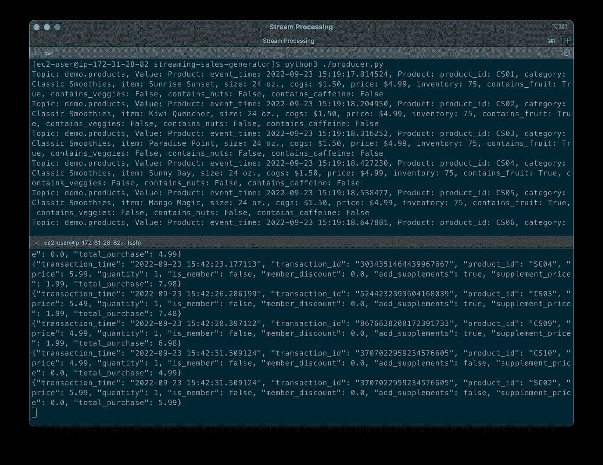

流式合成销售数据生成器向 Apache Kafka 发布消息

# 源代码

这篇文章中展示的所有源代码都是开源的，可以在 [GitHub](https://github.com/garystafford/) 上获得。有三个独立的 GitHub 项目:

# 码头工人

为了便于跟随演示，我们将使用 Docker Swarm 来提供流工具。或者，您可以使用 Kubernetes(例如，创建一个掌舵图)或您首选的 CSP 或 SaaS 管理的服务。本演示不要求您使用付费服务。

两个 Docker Swarm 堆栈位于[流式合成销售数据生成器](https://github.com/garystafford/streaming-sales-generator)项目中:

1.  [流堆栈—第 1 部分](https://github.com/garystafford/streaming-sales-generator/blob/main/docker/spark-kstreams-stack.yml) : [Apache Kafka](https://kafka.apache.org/) ， [Apache Zookeeper](https://zookeeper.apache.org/) ， [Apache Spark](https://spark.apache.org/) ，[Apache Kafka 的 UI](https://github.com/provectus/kafka-ui)，以及 [KStreams 应用](https://github.com/garystafford/kstreams-kafka-demo)
2.  [流栈—第二部分](https://github.com/garystafford/streaming-sales-generator/blob/main/docker/flink-pinot-superset-stack.yml) : [阿帕奇卡夫卡](https://kafka.apache.org/)，[阿帕奇动物园管理员](https://zookeeper.apache.org/)，[阿帕奇弗林克](https://flink.apache.org/)，[阿帕奇皮诺](https://pinot.apache.org/)，[阿帕奇超集](https://superset.apache.org/)，阿帕奇卡夫卡的[UI](https://github.com/provectus/kafka-ui)，以及[项目 Jupyter](https://jupyter.org/) (JupyterLab)。*

** Jupyter 容器可用作运行 PySpark 作业的 Spark 容器的替代物(遵循与 Spark 相同的步骤，如下)*

# 演示#1: Apache Spark

在四个演示的第一个中，我们将研究两个用 [PySpark](https://pypi.org/project/pyspark/) 编写的 [Apache Spark 结构化流](https://spark.apache.org/docs/latest/structured-streaming-programming-guide.html)作业，演示批处理(`[spark_batch_kafka.py](https://github.com/garystafford/streaming-sales-generator/blob/main/apache_spark_examples/spark_batch_kafka.py)`)和流处理(`[spark_streaming_kafka.py](https://github.com/garystafford/streaming-sales-generator/blob/main/apache_spark_examples/spark_streaming_kafka.py)`)。我们将从 Kafka 主题`demo.purchases`的单个数据流中读取数据，并写入控制台。

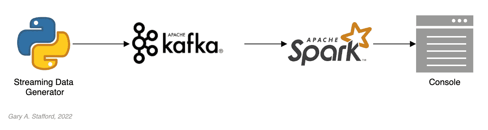

Apache Spark 演示的高级工作流

## 部署流式堆栈

首先，部署包含 [Apache Kafka](https://kafka.apache.org/) 、 [Apache Zookeeper](https://zookeeper.apache.org/) 、 [Apache Spark](https://spark.apache.org/) 、Apache Kafka 的[UI](https://github.com/provectus/kafka-ui)和 [KStreams 应用程序](https://github.com/garystafford/kstreams-kafka-demo)容器的第一个 [streaming Docker Swarm 堆栈](https://github.com/garystafford/streaming-sales-generator/blob/main/docker/spark-kstreams-stack.yml)。

堆栈将需要几分钟才能完全部署。完成后，堆栈中应该总共有六个容器在运行。

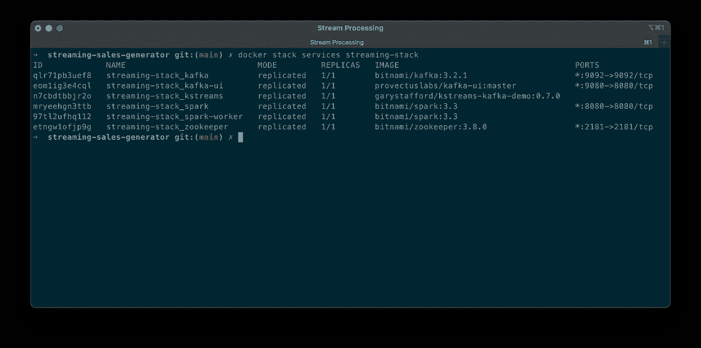

查看 Docker 流堆栈的六个容器

## 销售生成器

启动流数据发生器之前，确认或修改`[configuration/configuration.ini](https://github.com/garystafford/streaming-sales-generator/blob/main/configuration/configuration.ini)`。特别是三个配置项将决定流数据生成器运行多长时间以及它产生多少数据。出于测试目的，我们将设置相对快速地生成事务事件的时间。我们还将设置足够高的事件数量，以便有时间探索 Spark 作业。使用下面的设置，生成器应该平均运行大约 50-60 分钟:(((5 秒+ 2 秒)/2)*1000 个事务)/60 秒=平均大约 58 分钟。如有必要，您可以再次运行生成器或增加事务的数量。

来自项目`configuration.ini file`的代码片段

作为后台服务启动流数据生成器:

流数据生成器将开始向三个 Apache Kafka 主题写入数据:`demo.products`、`demo.purchases`和`demo.inventories`。我们可以通过登录 Apache Kafka 容器并使用 Kafka CLI 来查看这些主题及其消息:

下面，我们看到一些来自`demo.purchases`主题的示例消息:

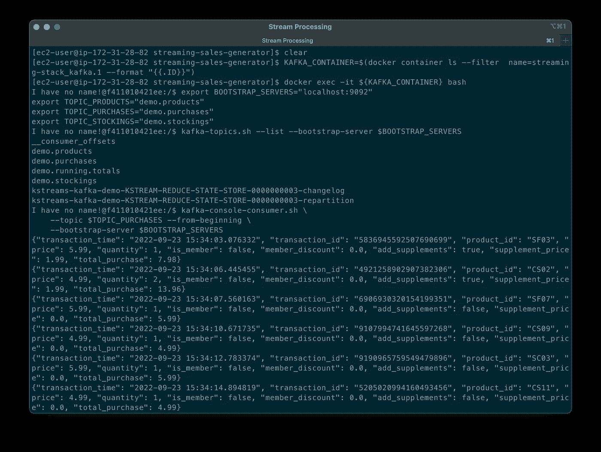

消费来自卡夫卡`demo.purchases`主题的信息

或者，您可以使用 Apache Kafka 的 UI，可以在端口 9080 上访问。

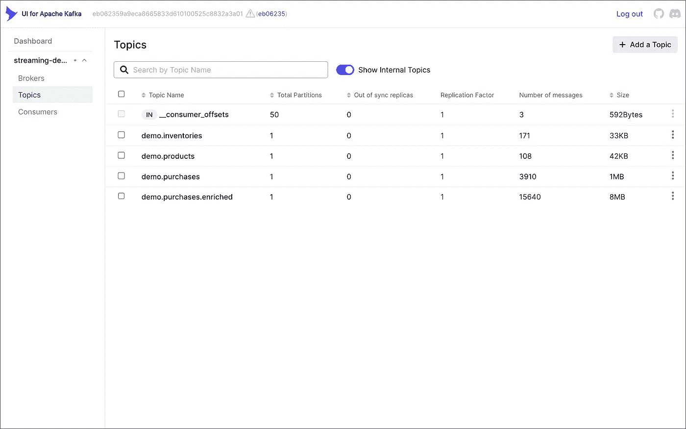

查看 Apache Kafka 用户界面中的主题

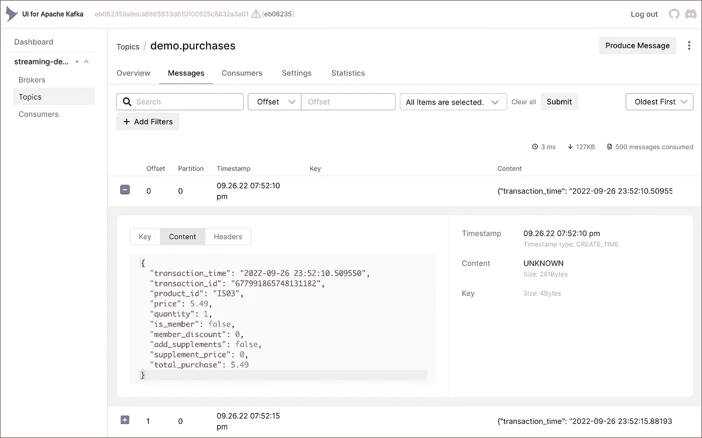

使用 Apache Kafka 的用户界面查看`demo.purchases`主题中的消息

## 准备火花

接下来，准备 Spark 容器来运行 Spark 作业:

作为根用户准备 Spark 容器实例

## 运行 Spark 作业

接下来，将作业从项目复制到 Spark 容器，然后执行回容器:

## 用 Spark 进行批处理

第一个 Spark 作业`[spark_batch_kafka.py](https://github.com/garystafford/streaming-sales-generator/blob/main/apache_spark_examples/spark_batch_kafka.py)`，根据从`demo.purchases`主题消费的现有消息，聚合售出的商品数量和每种产品的总销售额。我们在第一个例子中使用了 [PySpark DataFrame](https://spark.apache.org/docs/latest/structured-streaming-programming-guide.html) 类的`read()`和`write()`方法，从 Kafka 读取数据并写入控制台。我们可以很容易地把结果写回给卡夫卡。

批处理 Spark job 的`summarize_sales()`方法片段

批处理作业对结果进行排序，并按总销售额将前 25 项输出到控制台。作业应该运行完成并成功退出。

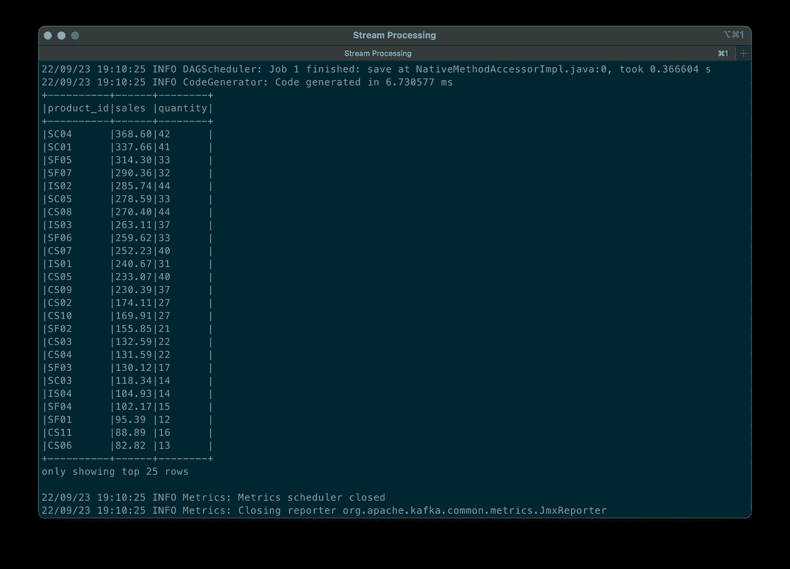

按总销售额列出的前 25 个项目的批结果

要运行批处理 Spark 作业，请使用以下命令:

运行批处理 Spark 作业

## 用 Spark 进行流处理

流处理 Spark 作业`[spark_streaming_kafka.py](https://github.com/garystafford/streaming-sales-generator/blob/main/apache_spark_examples/spark_streaming_kafka.py)`还根据从`demo.purchases`主题消费的消息，汇总售出的商品数量和每件商品的总销售额。但是，如下面的代码片段所示，该作业不断聚合来自 Kafka 的数据流，显示任意十分钟的[滑动窗口](https://spark.apache.org/docs/latest/structured-streaming-programming-guide.html#types-of-time-windows)内的前十个产品总数，有五分钟的重叠，并每分钟更新控制台的输出。我们使用 [PySpark DataFrame](https://spark.apache.org/docs/latest/structured-streaming-programming-guide.html) 类的`readStream()`和`writeStream()`方法，而不是第一个例子中面向批处理的`read()`和`write()`方法。

流处理 Spark job 的`summarize_sales()`方法片段

较短的事件时间窗口更容易进行演示，在生产中，每小时、每天、每周或每月的窗口更适合进行销售分析。

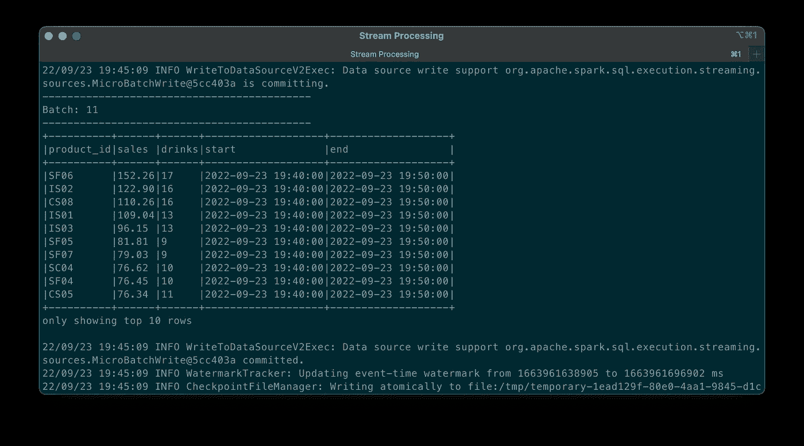

微批处理表示当前十分钟窗口的实时总数

要运行流处理 Spark 作业，请使用以下命令:

运行流处理 Spark 作业

我们可以很容易地计算滑动事件时间窗口内销售数据流与聚合的运行总数(项目中包含的*示例作业)。*

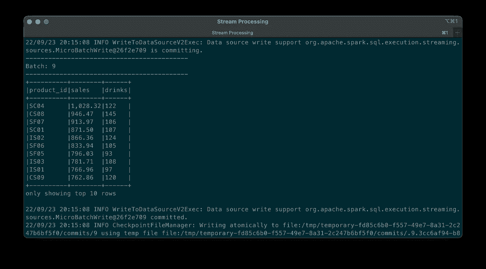

微批处理表示数据流的运行总数，而不是使用事件时间窗口

完成后，一定要终止流处理 Spark 作业，否则它们会继续运行，等待更多数据。

# 演示#2:阿帕奇卡夫卡流

接下来，我们将检查[阿帕奇卡夫卡流](https://kafka.apache.org/documentation/streams/) ( *又名 KStreams* )。在本文的这一部分，我们还将使用三个 GitHub 资源库项目中的第二个项目`[kstreams-kafka-demo](https://gist.github.com/garystafford/77b5edf9d8fb150ca1311e9cdbb8cc91)`。该项目包含一个用 Java 编写的 KStreams 应用程序，它执行流处理和增量聚合。

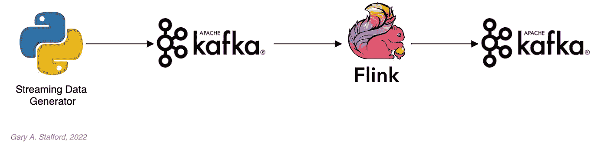

KStreams 演示的高级工作流

## KStreams 应用程序

KStreams 应用程序使用`[StreamBuilder()](https://kafka.apache.org/32/javadoc/org/apache/kafka/streams/StreamsBuilder.html)`类的一个实例不断地使用来自`demo.purchases` Kafka 主题(*源*)的消息流。然后，它汇总售出商品的数量和每件商品的总销售额，维护运行总数，然后将它们流式传输到新的`demo.running.totals`主题( *sink* )。所有这些都使用了`[KafkaStreams()](https://kafka.apache.org/32/javadoc/org/apache/kafka/streams/KafkaStreams.html)` Kafka 客户端类的一个实例。

KStreams 应用程序的`kStreamPipeline()`方法片段

## 运行应用程序

对于这个演示，我们至少有三种选择来运行 KStreams 应用程序:1)从我们的 IDE 本地运行，2)从命令行本地运行编译后的 JAR，或者 3)将编译后的 JAR 复制到 Docker 映像中，作为 Swarm 堆栈的一部分进行部署。你可以选择任何一个选项。

在本地编译和运行 KStreams 应用程序

我们将继续使用用于 Apache Spark 演示的相同的[流 Docker Swarm 堆栈](https://github.com/garystafford/streaming-sales-generator/blob/main/docker/spark-kstreams-stack.yml)。我已经使用项目源代码中的 [OpenJDK 17](https://openjdk.org/projects/jdk/17/) 和 [Gradle](https://gradle.org/) 编译了一个单独的 [uber JAR](https://plugins.gradle.org/plugin/com.github.johnrengelman.shadow) 文件。然后我创建并发布了一个 Docker 映像，它已经是运行堆栈的一部分。

用于构建 KStreams 应用程序 Docker 映像的 Docker 文件

因为我们之前为 Spark 演示运行了销售生成器，所以在`demo.purchases`主题中有现有数据。重新运行销售生成器(`nohup python3 ./producer.py &`)以生成新的数据流。查看 KStreams 应用程序的结果，该应用程序自使用 Kafka CLI 或 Apache Kafka 的 UI 部署堆栈以来一直在运行:

下面，在顶部的终端窗口中，我们看到了 KStreams 应用程序的输出。使用 KStream 的`[peek()](https://kafka.apache.org/32/javadoc/org/apache/kafka/streams/kstream/KStream.html)`方法，应用程序在处理`Purchase`和`Total`实例并将其写入 Kafka 时，将它们输出到控制台。在下方的终端窗口中，我们看到新消息作为连续流发布到输出主题`demo.running.totals`。

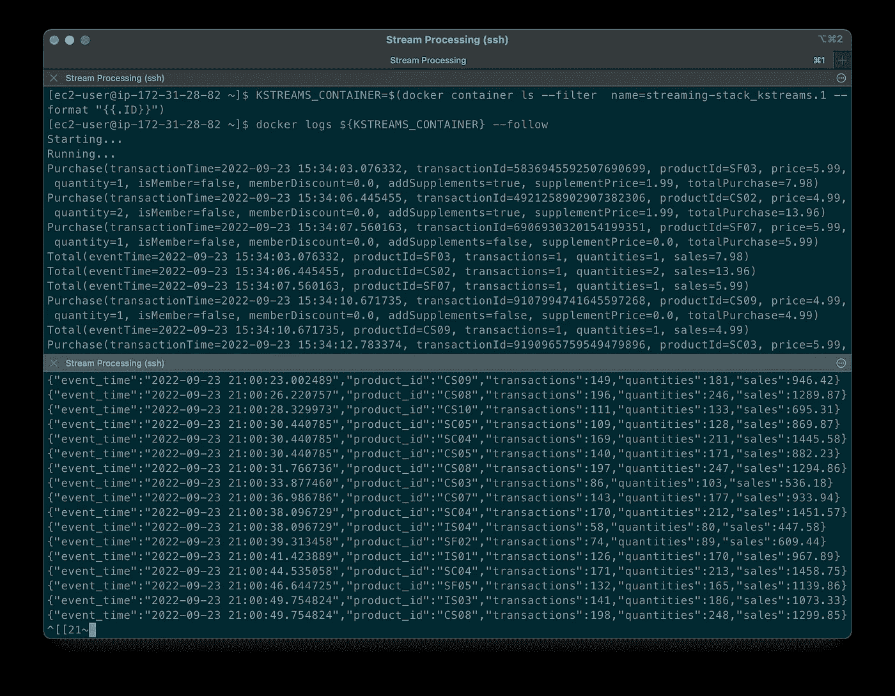

KStreams 应用程序执行流处理和结果输出流

# 第二部分

在这篇由两部分组成的文章的第二部分中，我们继续探索四个流行的开源流处理项目。我们将介绍[阿帕奇弗林克](https://flink.apache.org/)和[阿帕奇皮诺](https://pinot.apache.org/)。此外，我们将把 [Apache 超集](https://superset.apache.org/)合并到演示中，构建一个实时仪表板来可视化我们的流处理结果。

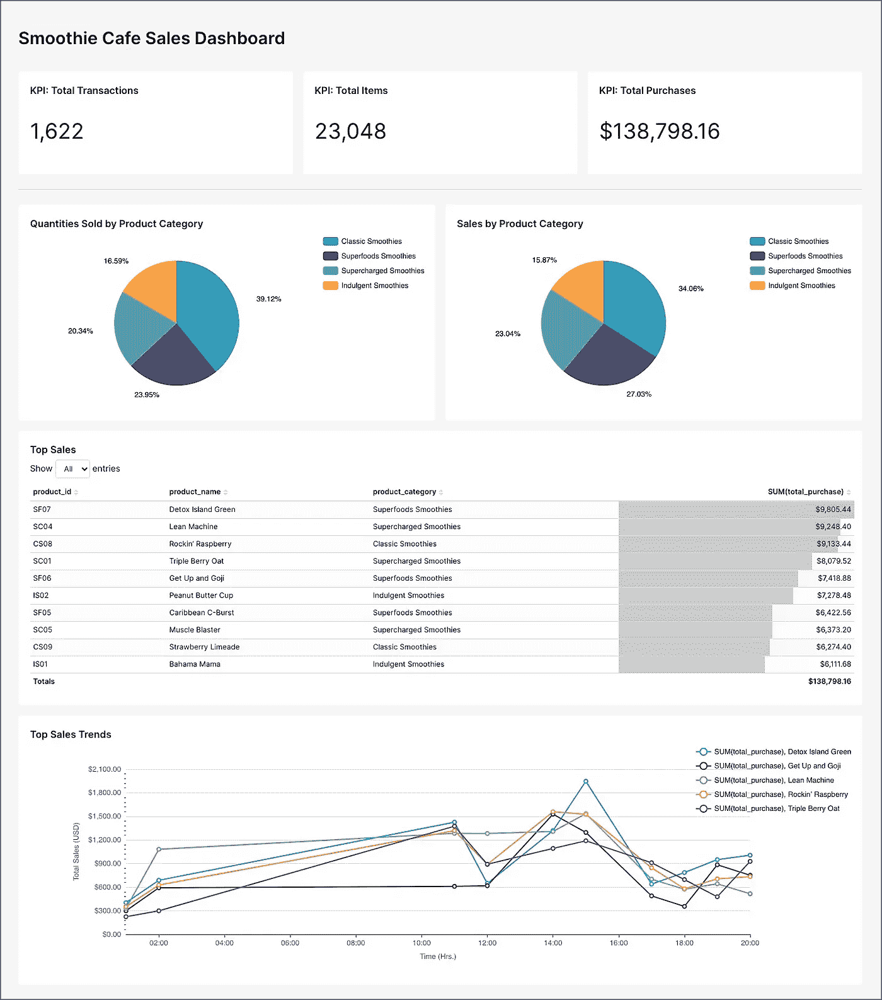

Apache 超集仪表板显示来自 Apache Pinot 实时表的数据

这篇博客代表我的观点，而不是我的雇主亚马逊网络服务公司(AWS)的观点。所有产品名称、徽标和品牌都是其各自所有者的财产。除非另有说明，所有图表和插图都是作者的财产。