# 探索作为创造性编程媒介的 Go 语言

> 原文：<https://itnext.io/exploring-the-go-language-as-a-medium-for-creative-programming-ef0fd4372b61?source=collection_archive---------0----------------------->

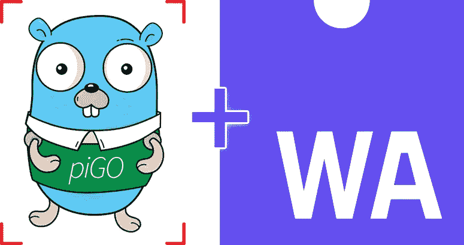

他的文章是关于探索 Go 语言及其在生成性和创造性编码、可视化编程、web 汇编、人脸检测和图像处理等领域的能力，这些领域对于普通的 Go 开发者来说可能看起来很奇怪或不寻常；考虑到大多数 Go 开发人员选择使用这种语言是因为它的简单性、对并发原语的广泛支持，这些因素使得它对于云计算和 DevOps 相关的工作非常方便。这些都是围棋擅长的领域，但我们正试图证明相反的情况，即。这种语言可以作为一种通用语言使用，也可能吸引有创造力的头脑，尽管围绕它构建的有限的创造性框架和库可能需要更多的工作和毅力。

这将是非常技术性的写作，这意味着除了了解 Go 语言之外，还需要了解一些 HTML5 Canvas API，一些 Webassembly 概念，以及最基本的 Javascript 知识。在此过程中，我们将展示一些实时演示，并附有一些代码摘录，以便更好地理解。所以让我们开始吧。

## **在 Go 中使用 web assembly**

作为 [Pigo](https://github.com/esimov/pigo) 计算机视觉库的作者，我需要证明它的实时能力，但不幸的是，围棋生态系统缺少一个用于访问网络摄像头的跨平台库。还有 [GoCV](https://gocv.io/) ，它是 OpenCV 的包装器，和大多数 C 绑定一样，它带来了不可忽视的性能代价。Pigo 是 100%用 go 编写的，基于像素强度比较的物体检测纸([https://arxiv.org/pdf/1305.4537.pdf](https://arxiv.org/pdf/1305.4537.pdf))，速度很快。因此，为了访问网络摄像头，我选择将其移植到 Webassembly。对于不知道什么是 Webassembly(缩写 Wasm)的人来说，*它是一种基于堆栈的虚拟机的二进制指令格式。Wasm 被设计为 C/C++/Rust* 等高级语言编译的可移植目标。

由于所有的现代网络浏览器已经集成了 WASM，这也意味着我们可以访问网络摄像头。让我们看看如何在 Go 中访问它。请记住，在使用生成的 wasm 二进制文件之前，我们需要使用一些针对 Webassembly 的特定 Go build 指令来构建程序。一方面，在每个 Go 文件的顶部，我们必须提供`// +build js,wasm` 指令，另一方面，在构建应用程序时，我们应该指定目标操作系统和架构。常规的构建命令应该如下所示:

> `$ GOOS=js GOARCH=wasm go build -o lib.wasm main.go`

为了简化构建过程，我们可以创建一个 *Makefile* ，通过一个简单的命令，我们就可以构建 wasm 文件，生成一个新的 web 服务器，并在浏览器中运行 web 应用程序。

执行 make 命令将把`wasm_exec.js`文件从 Go source 目录复制到我们本地的 js 文件夹。这一点很重要，因为我们必须确保我们使用的是最新版本的`wasm_exec.js`文件(当我们运行 web 服务器时将提供该文件)，否则，由于不同版本之间的代码变更，一些功能可能会过时。

现在让我们看看如何在一个简单的 Webassembly 程序中访问网络摄像头。由于这是一个独立的 web 应用程序，一些静态资产需要通过 web 服务器提供服务。这些静态资产中的一些是上面提到的 *wasm_exec.js* 文件和生成的 *wasm* 二进制文件。因此，提供这些文件就像将它们包含在静态 html 文件中一样简单。

现在，每次我们执行 *make* 命令时，它都会构建 wasm 文件，并在特定的 IP 地址和端口上运行 web 服务器。这是示例应用程序的基本框架，但是如果您现在运行它，应该不会发生任何事情。我们需要创建主要的 Go 应用程序，以便有一个全功能的程序来访问网络摄像头和处理提供的原始数据。

**main.go** 文件的 API 非常直观:我们正在创建一个新的 Canvas，它在下面访问 HTML5 Canvas API。一旦发现一个摄像头，我们就调用`Render`方法，这个方法产生一个新的 goroutine 并运行，直到它没有被`cancelAnimationFrame` JS 方法终止。这看起来很容易，但现实要复杂一点。

正如我在文章的第一部分提到的，我的意图是探索 Go 作为创造性编程的媒介，所以给你一个关于用于 WASM 集成的 [syscall/js](https://pkg.go.dev/syscall/js) 包的技术描述不在本文的范围之内。因此，让我们继续前进，发现一些真实的用例。

## **人脸检测**

所有将在下一节展示的演示都有一个共同点:它们需要在处理提供的原始数据之前检测人脸。 **Pigo** 人脸检测库只是为了以一种非常轻量级的方式来做这件事，因为它不需要任何第三方模块或外部库。它可以检测人脸，但也能够检测瞳孔/眼睛和面部标志点。因此，我们已经具备了制作一些令人惊叹的创意作品所需的所有要素。

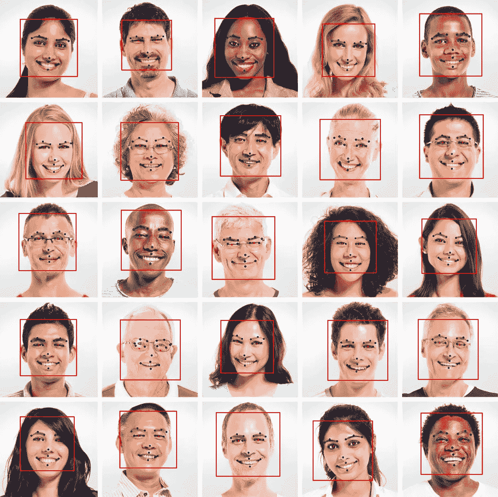

使用 Pigo 库进行面部检测、瞳孔/眼睛定位和面部标志点检测。

## 在 Go 中使用 HTML5 画布 API

作为第一个演示，我们希望模糊检测到的面部，但由于 Pigo 只返回检测坐标和尺寸(通常是正方形)，我们需要将其转换为椭圆，因此我们必须在获得的矩形上应用椭圆公式。期望的最终结果应该是一个椭圆形状的模糊面具，层叠在检测到的人脸上，边缘逐渐变得透明。下面是我们想要达到的效果的快照。

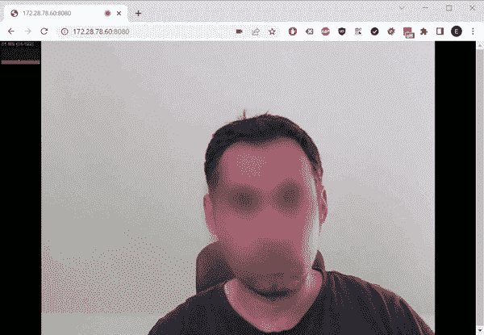

为了达到预期的效果，计划很简单:检索检测到的人脸的坐标，减去图像，并在其上应用模糊蒙版。我们有 Pigo 用于人脸检测， [stackblur-go](https://github.com/esimov/stackblur-go) 用于模糊检测到的人脸区域，但问题是我们应该只模糊人脸(自然是椭圆形的)而不是整个区域。下面是一步一步的可视化过程。

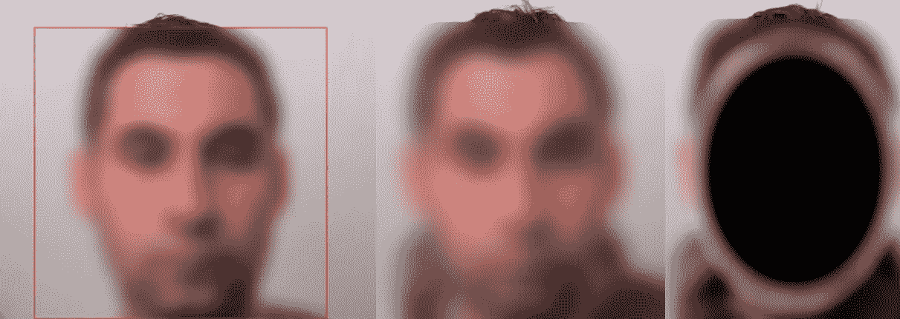

第一步:检测人脸。第二步:模糊脸部区域。步骤 3:应用椭圆渐变叠加蒙版检测到的脸。

## **初试**

作为一个起点，我选择在 Go 中直接整合椭圆公式，然后应用渐变叠加。事实证明，这是完全低效的，因为在每个帧速率上，我们必须将检测到的面部区域减去到子图像，将像素数据转换为图像，并在减去的图像上绘制椭圆梯度掩模。罪魁祸首不一定是图像减法，而是我们必须在每一帧上创建一个新的渐变遮罩的想法。

但是，为什么我们需要一个覆盖掩模呢？答案是因为 [image/draw](https://pkg.go.dev/image/draw) 包的 Draw 方法可以通过将绘制在图像顶部的遮罩作为输入，对源图像应用复合操作，以创建所需的最终图像。下面这篇文章将对此进行更详细的解释:[https://go.dev/blog/image-draw](https://go.dev/blog/image-draw)。

> 合成是按照 Plan 9 图形库和 X Render 扩展的样式逐像素执行的。该模型基于波特和达夫的经典论文“合成数字图像”，增加了一个遮罩参数:`*dst = (src IN mask) OP dst*`。对于完全不透明的掩模，这简化为原始的波特-达夫公式:`*dst = src OP dst*`。
> 
> Porter-Duff 的论文提出了 12 种不同的复合操作符，但是有了显式掩码，实际上只需要其中的两种:source-over-destination 和 source。

因为`draw.Drawmask`方法需要一个`[image.Image](https://pkg.go.dev/syscall/js)`作为第三个参数，而且这是一个 ***接口*** ，这也意味着我们可以编写自己的图像类型，唯一的条件是实现由`Image`接口定义的方法。

椭圆公式的 Go 实现。

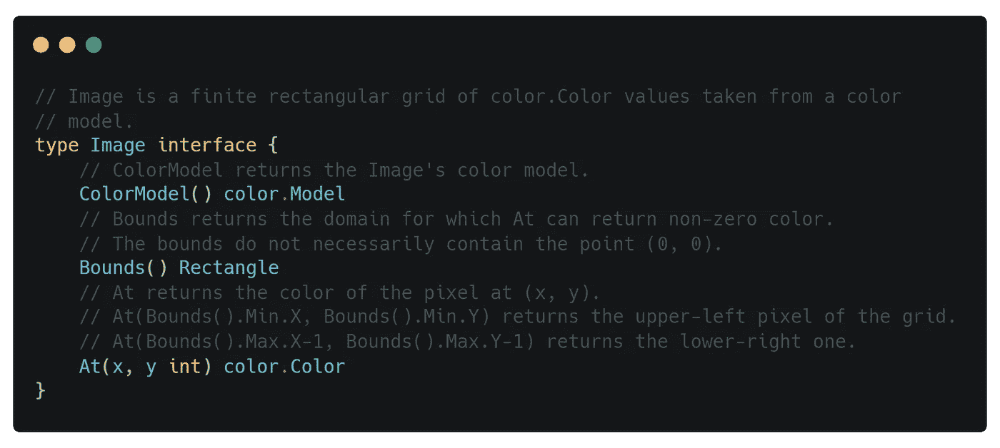

图像所需的方法。图像界面。

因此，我们有了由椭圆公式定义的自定义图像类型，我们可以将它作为第三个参数应用于`draw.DrawMask`方法。

将定义为自定义图像的椭圆公式应用到减去的面区域。

但不幸的是，结果并不是我们所期望的:椭圆渐变遮罩并没有向边缘淡出。我们得到的是一个统一的，简单模糊的面具，看起来有点尴尬。

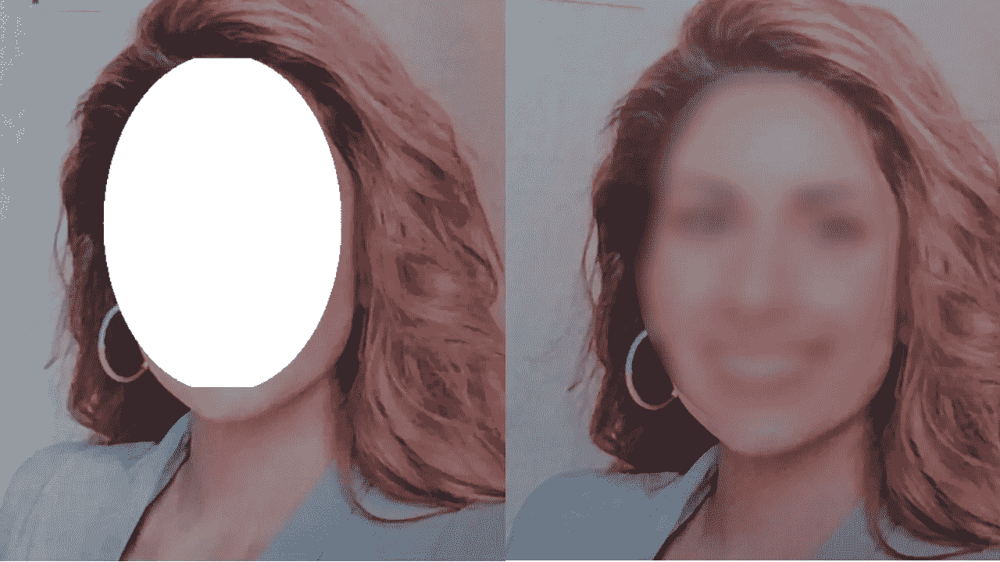

椭圆遮罩边缘不会淡出。

下一步是创建一个渐变叠加，并用它作为椭圆遮罩的填充。我这里不贴升级后的渐变椭圆蒙版的实现，但是你可以在这里找到[，在这里](https://github.com/esimov/pigo-wasm-demos/blob/833c0dba2e15840d96a63d9bb975559fe14c99cf/draw/gradient.go)找到[。表演完全令人失望，所以我也放弃了这个版本。我们还能尝试什么来获得令人满意的表现呢？](https://github.com/esimov/pigo-wasm-demos/blob/833c0dba2e15840d96a63d9bb975559fe14c99cf/draw/ellipse.go)

## 另一种尝试:使用 Javascript Canvas API

HTML5 Canvas API 有一个`[globalCompositeOperation](https://developer.mozilla.org/en-US/docs/Web/API/CanvasRenderingContext2D/globalCompositeOperation)`属性，它的作用与上面介绍的`draw.Draw`函数完全相同:它对一个形状应用合成操作。使用来自`syscall/js`包的[调用](https://pkg.go.dev/syscall/js#Value.Call)方法，我们可以调用本地 Javascript 方法。这是我们的营救计划。

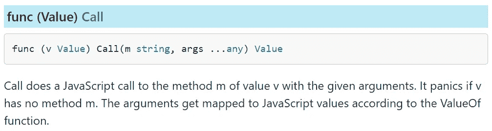

现在让我们来看看如何应用渐变叠加蒙版在减去的面部区域。首先，我们需要创建椭圆径向梯度。有一个`[createRadialGradient](https://developer.mozilla.org/en-US/docs/Web/API/CanvasRenderingContext2D/createRadialGradient)` HTML5 Canvas 方法，创建径向渐变，但不是椭圆形。HTML5 标准中没有本地椭圆渐变方法，但是我们可以很容易地创建一个。我们只需要把椭圆公式代入这种方法。该方法按以下方式定义:

```
createRadialGradient(x0, y0, r0, x1, y1, r1)
```

其中`(x0,y0)`是起点圆的`x`和`y`坐标，`r0`是半径，`(x1,y1)`是半径为`r1`的终点圆。

在椭圆渐变代码中，渐变的中心放在位置`(cx, cy)`，渐变的大小由两个半径定义:`rx`和`ry`。

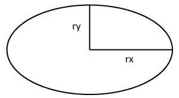

椭圆

我们可以将其转换成如下所示的真实代码:

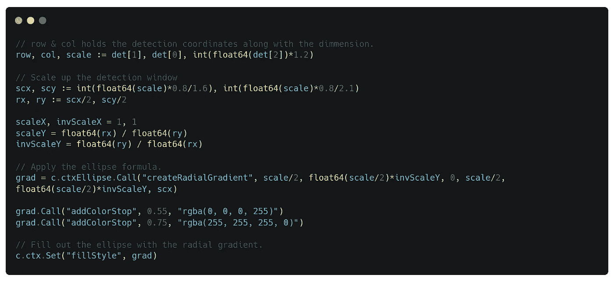

酷，我们得到了一个好看的渐变叠加椭圆，但是从下面的图片中可以看出，它缺少了一些东西。解决方案非常简单:我们必须将`globalCompositeOperation` canvas 属性设置为`destination-atop`。

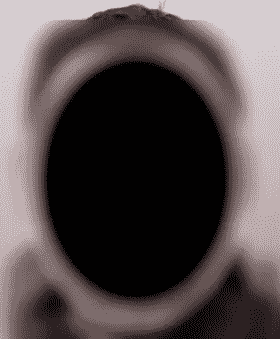

## 其他有趣的实验

接下来的演示遵循相同的概念，只是有些不同。创建一个类似缩放的背景模糊效果怎么样？

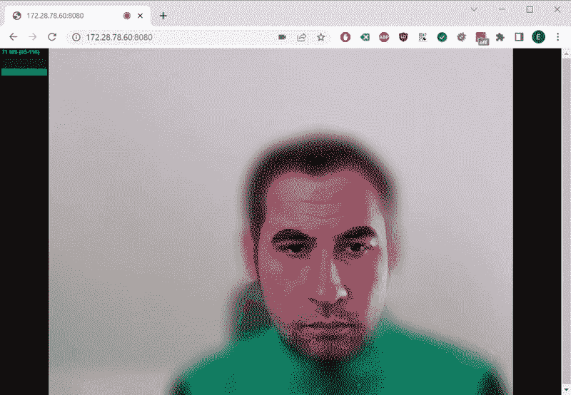

类似背景模糊效果的缩放

这可能看起来与早期的实验完全相同，但它有一个主要的技术差异:在模糊背景之前，我们需要将网络摄像头帧的原始像素数据绘制到一个单独的画布上下文中，然后才调用人脸检测算法。一步一步的过程如下:

1.  将网络摄像头帧绘制到屏幕外的画布环境中。
2.  获取转换为图像的原始像素数据。这是必需的，因为 Pigo 人脸检测库处理的是图像而不是像素值。我们可以很容易地将图像转换成像素阵列，反之亦然(见下文)。
3.  减去检测到的人脸区域下的图像，并将其转换为前面给出的椭圆。
4.  模糊画在屏幕外画布上的摄像头画面。这些是作为原始像素数据存储的，因此需要将其转换为图像。
5.  将模糊的画布与存储检测到的面部区域的画布合并在一起。
6.  使用`destination-in`作为值应用`globalCompositeOperation`。

将图像转换为像素阵列，反之亦然。

## 关键要点

当我们与 **syscall/js** 包和**html 5 Canvas API**:**`getImageData`Canvas 方法返回的值属于`Uint8ClampedArray`类型时，有一件重要的事情我们需要记住。这些需要被转换成`Uint8Array`，以便通过`[js.CopyBytesToGo](https://pkg.go.dev/syscall/js#CopyBytesToGo)`方法从 JS 转换到 Go。否则会恐慌。**

**Uint8ClampedArray 到 Uint8Array 的转换。**

**另一方面，`putImageData` Canvas 方法要求第一个参数是类型`Uint8ClampedArray`，这意味着类型`Uint8Array`的像素数组需要转换成所请求的类型。我们可以通过以下方式轻松做到这一点:**

**Uint8Array 到 Uint8ClampedArray 的转换。**

**再来看最后一个例子:人脸三角剖分。这个例子使用了 [▲三角形](https://github.com/esimov/triangle)库。**

**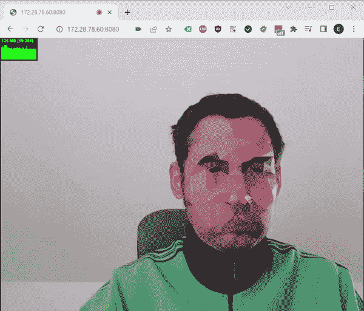**

**这个演示的范围是对检测到的人脸进行三角测量，给它们一些很酷的美学外观，同时也匿名化一个人的脸。和其他演示一样，有些部分可以重用，我们只需要插入图像三角测量过程。**

**一旦我们减去检测到的面部区域，我们称之为[三角形。Draw](https://pkg.go.dev/github.com/esimov/triangle/v2#Image.Draw) 方法，该方法返回三角化的图像以及一个错误和一些其他值，这些对于我们的例子并不重要。**

**作为最后一个操作，我们需要将生成的图像转换成一个像素数组(使用前面介绍的实用函数)，因为我们必须将这些像素拉回画布上下文，并对保存三角化图像的椭圆渐变应用相同的复合操作。**

## **最终注释**

**如您所见，整个过程看起来可能很复杂，但实际上可以简化为几件事:**

*   **图像到像素的转换。**
*   **使用不同的画布层，并使用复合操作将它们合并在一起。**
*   **以 **syscall/js** 包请求的方式使用 Javascript 和 HTML5 Canvas API。**
*   **将 Javascript 数组转换成 Go 字节片，反之亦然:将字节片转换成 Javascript 数组。**

**你可以通过以下链接查看 Github 上演示的源代码:[https://github.com/esimov/pigo-wasm-demos](https://github.com/esimov/pigo-wasm-demos)**

## **有用的资源**

*   **[https://github.com/esimov/pigo](https://github.com/esimov/pigo)**

**如果你感兴趣，下面是一些关于 Pigo 人脸检测库的文章和演示。**

*   **[https://www . infoq . com/news/2020/02/go-wasm-port-face-detection/](https://www.infoq.com/news/2020/02/go-wasm-port-face-detection/)**
*   **[https://esimov.com/2019/07/pigo-face-detection-library](https://esimov.com/2019/07/pigo-face-detection-library)**
*   **[https://ESI mov . com/2019/11/pupilseyes-localization-in-the-pigo-face-detection-library](https://esimov.com/2019/11/pupilseyes-localization-in-the-pigo-face-detection-library)**
*   **[https://esimov.com/2020/01/pigo-wasm](https://esimov.com/2020/01/pigo-wasm)**
*   **[https://www.youtube.com/watch?v=S7TzgIpAZLU](https://www.youtube.com/watch?v=S7TzgIpAZLU)**
*   **https://www.youtube.com/watch?v=bdwNM8gbIGg**