# 使用 Sigmetic 探索您的软件团队的趋势

> 原文：<https://itnext.io/exploring-the-trends-of-your-software-team-with-sigmetic-20b211be20ea?source=collection_archive---------8----------------------->

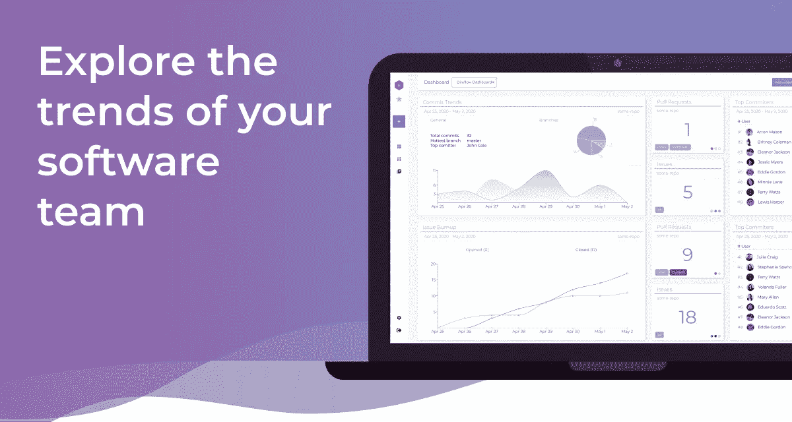

在现代软件开发的世界中，人们对我们使用的软件产品的期望越来越高，对团队软件开发过程的要求也成比例地增加。

现在比以往任何时候都更重要的是，我们更快地、持续地发布，同时确保投入生产的代码的高标准。

因此，现代软件开发团队进行大量的监控和跟踪就不足为奇了！我们有 Datadog、Prometheus、Kibana、Elastic Search、Log Rocket、Track.js 和一系列其他有用的工具来监控我们软件的性能。

但是软件团队的另一个非常重要的方面是我们！人类。团队中的工程师、经理和产品负责人。
如果我们真的想保证我们交付的产品的质量，我们需要在团队的开发过程中投入与监控软件性能同样的精力。

在一个分布式团队和远程工作长期存在的世界里，保持开发周期开放、透明并允许团队中更紧密的协作也是至关重要的。

# 持续改进始于洞察力

请允许我介绍:

在我的软件开发职业生涯中，我注意到团队似乎是如何与相同的重复出现的问题作斗争的:永无休止的代码审查，由于缺少来自其他分支的依赖性而无法合并的 PRs，恢复 bug 的时间几乎是荒谬的，以及缺少对发布新功能所需的交付时间的概述。
总的来说，完全不理解为什么要花很长时间来发布哪怕是很小的，应该很简单的新功能和错误修复。

这些问题正是激发我创建[sigmetic . io](https://sigmetic.io)来深入了解这些过程的原因。因为，本质上，这是我们开始改进的唯一方法！

# 一种新的生产力工具诞生了

好像我们还不够多，对吗？😜

然而，我真诚地相信这个工具可以给很多软件团队带来不可思议的改变。

Sigmetic.io 仍处于测试阶段。但是我将使用这篇文章来展示到目前为止该平台的核心特性。

# Sigmetic.io

我们先在 [app.sigmetic.io](https://app.sigmetic.io) 上登录平台。如果你还没有账户，就去注册吧。

接下来，你需要链接你的 GitHub 账户。
目前，Sigmetic 只与 GitHub 集成，但当然，Sigmetic 也将与吉拉和 GitLab 集成。

# **Sigmetic KPI 小工具**

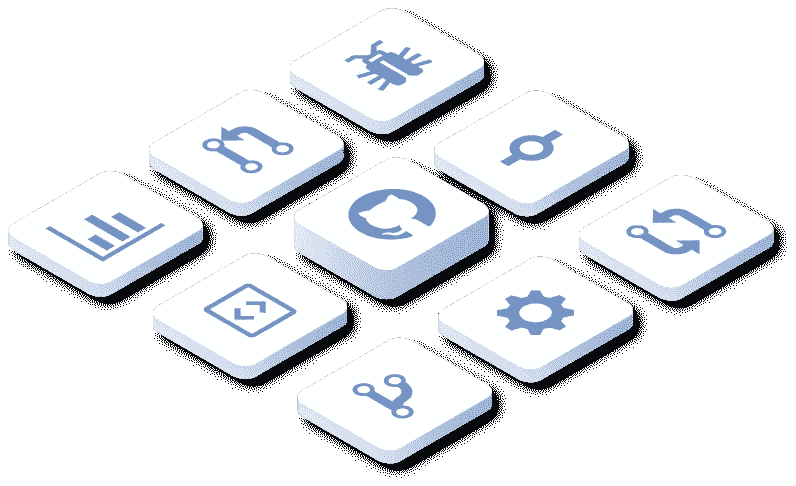

构成 Sigmetic 的构件是您在小部件库中找到的各种 KPI 小部件。

*您可以使用这些小部件，按照对您和您的团队有意义的方式构建自己的仪表盘。*

登录后，我们首先看到的是一个仪表板。
创建用户时，Sigmetic 将为我们创建一个示例仪表板，包括三个小部件。

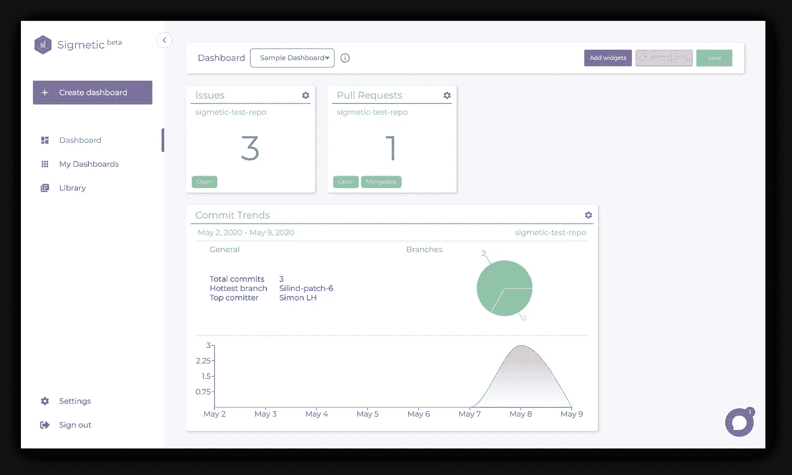

这可能看起来不多，但我们可以通过点击右上角的“添加小部件”来轻松地向仪表板添加新的小部件。

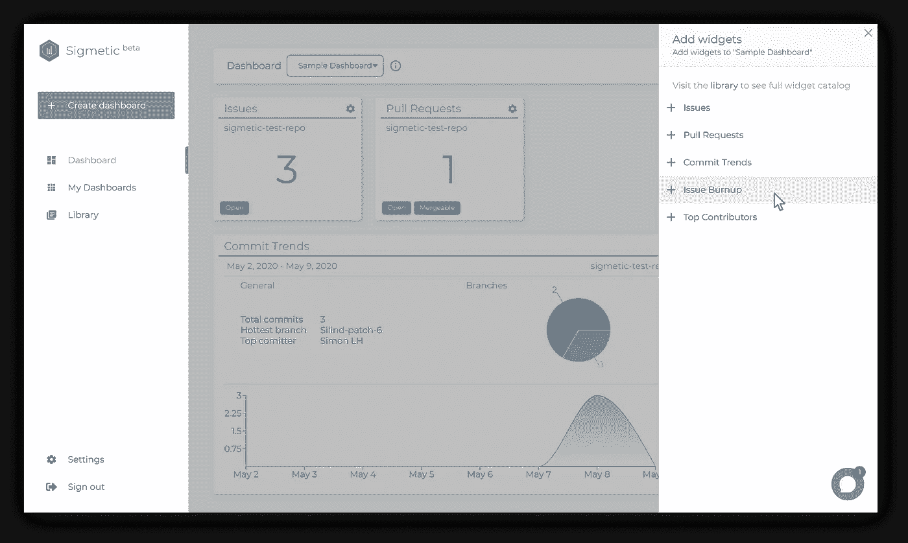

只需几次点击，我们现在就有了一个完全填充的仪表板😎

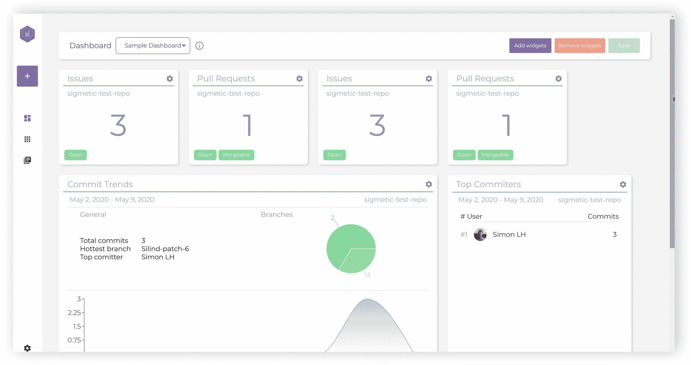

我们可以通过单击每个小部件右上角的小“齿轮”图标来配置每个小部件。
这将提示我们小工具的设置。

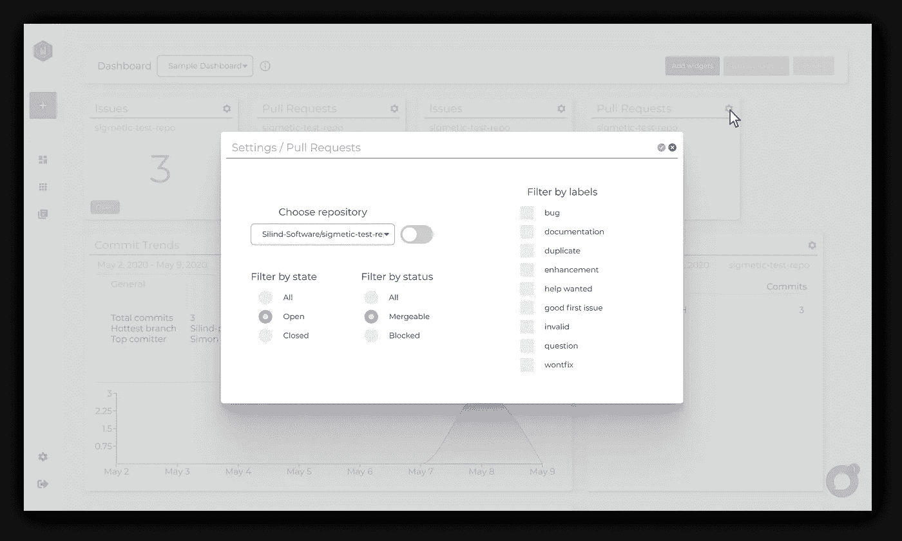

通过一点点添加小部件和配置，我们很快就会有一个成熟的、功能齐全的仪表盘，里面装满了有用的数据🤩

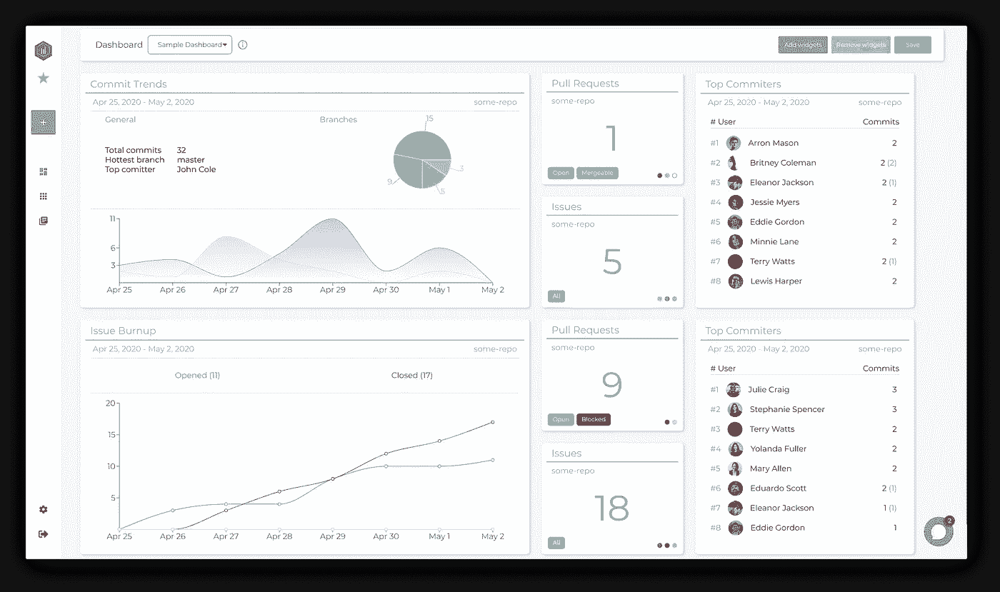

不要担心，我们将一会儿浏览每个单独的小部件，它们是如何工作的，以及如何配置它们。

但是首先，让我们试着从头开始创建一个新的仪表板。

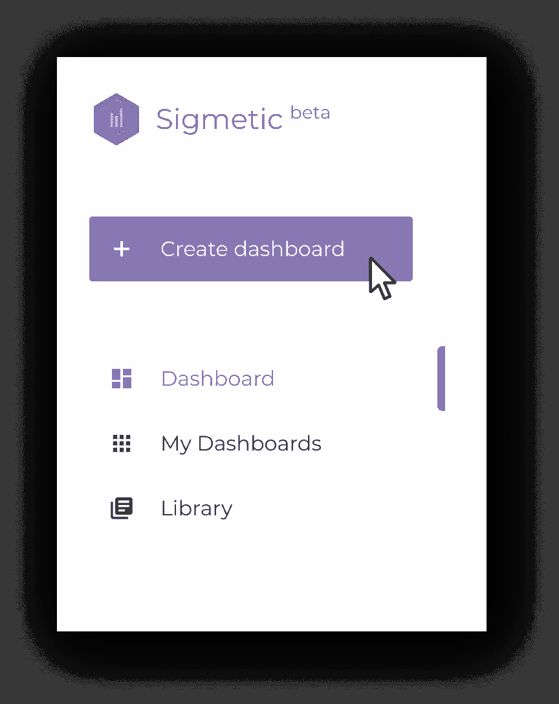

让我们点击菜单中的“创建仪表板”按钮。

这将把我们带到一个新页面，我们可以在这里创建一个新的仪表板。

我们将被引导通过三个步骤。

*   仪表板的名称
*   选择仪表板计划
*   配置仪表板计划

我们开始吧！😎

我们需要做的第一件事是为我们的新仪表板命名。它可以是你想要的任何东西。

接下来，我们需要选择一个仪表板计划。

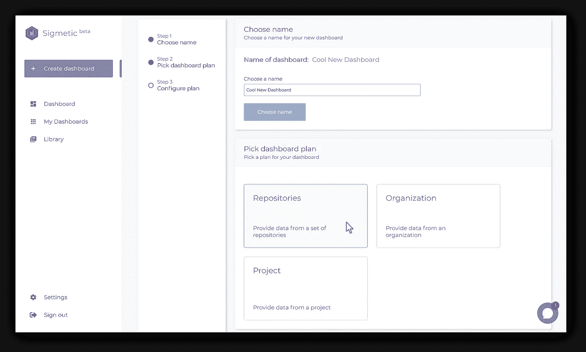

仪表板计划定义了我们如何向仪表板提供数据。

目前，有 3 个仪表板计划可供选择，但'*项目*计划仍在开发中，因此我们可以在'*存储库*或'*组织*之间进行选择。

**存储库仪表板计划**

假设您有一个项目，它有三个相关联的存储库。
一个用于前端，一个用于后端，一个用于一些云功能。
在这种情况下，‘*存储库*’仪表板计划将是一个显而易见的选择。

有了这个计划，我们可以选择一组我们将接收反馈的存储库。然后，我们可以配置一个小部件来观察集合中的任何存储库，或者我们可以选择从所有存储库中聚合数据。

**组织仪表板计划**

“组织”仪表板计划相当于“存储库”仪表板计划。这组存储库只是成为该组织拥有的所有存储库。

让我们继续选择“存储库”计划，然后我们将进入最后一步，在这里我们将配置该计划。在这种情况下，我们将选择使用哪些存储库。

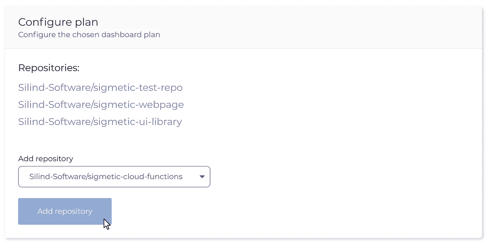

要将存储库添加到集合中，只需从下拉列表中选择存储库，然后按“添加存储库”按钮。

为您的新仪表板所需的多个存储库执行此操作。

就是这样！继续并按左边的“创建仪表板”按钮。您将进入“我的仪表板”页面，您的新仪表板将会出现。很简单，对吧？✌️

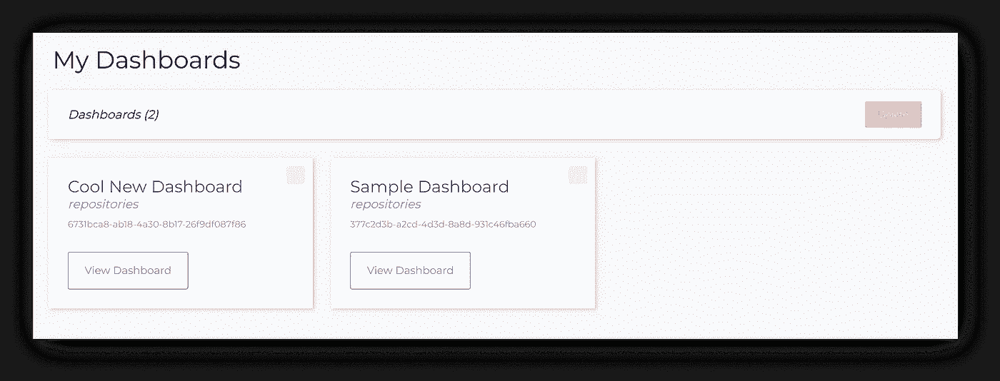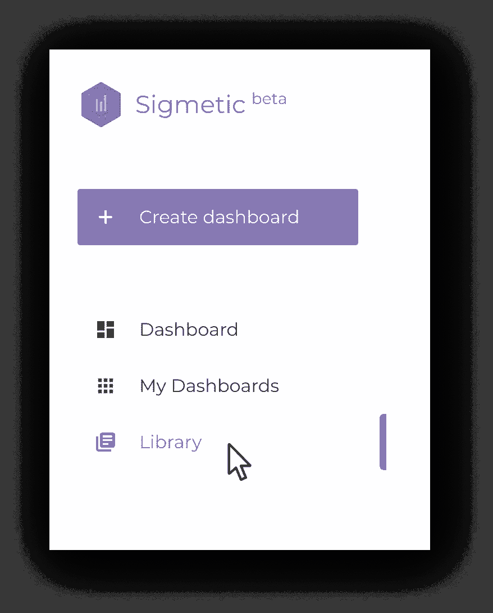

好了，现在我们知道了如何创建一个仪表板以及如何向其中添加小部件，让我们快速浏览一下当前的小部件，以及它们是如何工作的。

前往“图书馆”页面。

在这里，我们将看到所有可用的小部件。

它们将被填充演示数据，这样我们就可以看到它们的样子。

# “问题”和“拉式请求”小部件

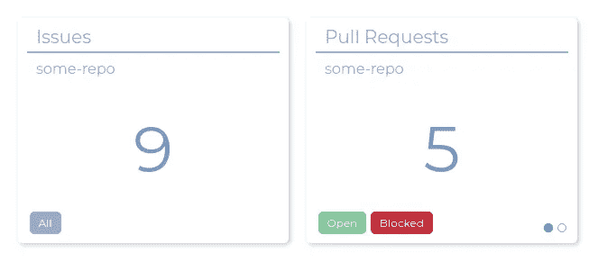

我们看到的前两个小部件是“问题”和“拉请求”。
这些小部件是*状态小部件*，它们提供了对一个存储库(或一组存储库)当前状态的洞察。

更具体地说，这些小部件将向我们显示我们的存储库中当前存在的问题/拉请求的数量。

当我们配置这些状态小部件时，我们可以选择一个存储库来获得反馈，或者我们可以选择*从集合中的所有存储库中聚集*数据。如果我们在仪表板计划中选择了多个存储库，我们会在存储库下拉列表旁边看到一个“聚合”开关。

您还可以选择根据状态来过滤数据:“打开”、“关闭”或“全部”。
对于“Pull Requests”小部件，您还可以选择按状态进行过滤:“Mergeable”、“Blocked”或“All”。

对于这两个小部件，我们可以通过标签进行过滤。列表中的标签是您的存储库(或一组存储库)上可用的标签。

# “提交趋势”小部件

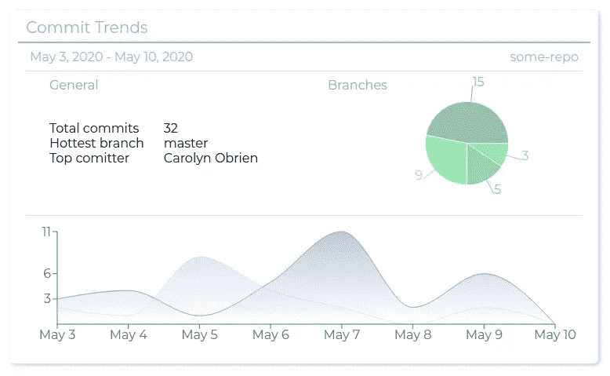

我们可以选择的下一个小部件是“提交趋势”小部件。
这是一个*趋势部件*，对于这些类型的部件，我们必须指定一个我们想要观察的时间范围。我们通过指定日期范围来做到这一点。

“提交趋势”小部件为我们提供了在指定时间范围内提交的概述。
我们可以看到不同存储库和分支上的小部件明细，并且可以看到每天提交了多少。
我们还可以快速获得一些关于提交总数的信息，哪个分支收到的提交最多，哪个提交者提交的最多。

与状态小部件一样，我们可以选择一个存储库来获取反馈，或者我们可以选择从所有存储库中*聚集*数据。
使用趋势小部件，我们还可以选择将给定时间范围与指定时间段之前的时间段进行比较。
我们通过选中“与过去比较”复选框来实现。

# **‘问题燃耗’部件**

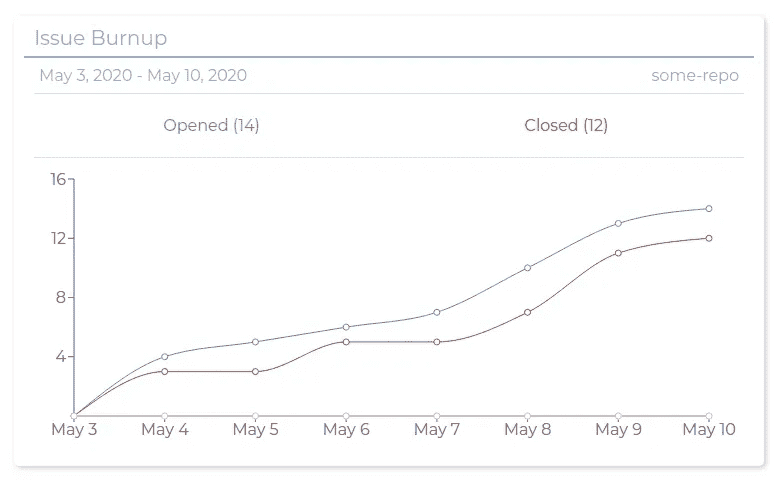

“问题燃耗”微件也是一个*趋势微件*，其配置类似于“提交趋势”微件。

使用“问题烧完”小部件，我们可以看到问题的开始和结束是如何随着时间的推移而累积的，这使得我们可以很容易地确定给定时间范围内的进度。

# “最佳贡献者”小部件

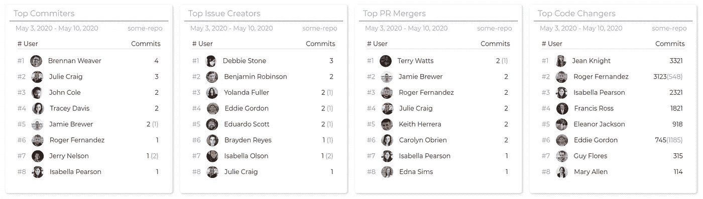

我们可以选择的最后一个小部件是“Top Contributor”小部件。这些是*活动窗口小部件*，对于这些类型的窗口小部件，我们需要指定一个时间范围，就像我们对趋势窗口小部件所做的那样。

activity 小部件告诉我们关于我们的存储库(或一组存储库)上的活动的一些信息，而‘Top Contributor’小部件可以显示各种参数上的 Top Contributor。

在配置这个小部件时，我们注意到在设置窗口的底部有一个分页(蓝点)。
设置的第一页将类似于趋势小部件的页面，但是如果我们导航到第二页，我们将看到这里有一些附加设置。

在这个页面上，我们可以指定我们希望在列表中看到多少个前 n 名贡献者，并且我们可以指定我们希望观察哪种类型的贡献。

目前支持的贡献类型有:

*   承诺
*   产生的问题
*   合并的 PRs
*   复习
*   代码行

# 更多部件即将推出

这是目前部件库中所有可用的部件，但更多的部件将很快出现！

如前所述，Sigmetic 目前处于测试阶段，我们非常渴望听到**您的**反馈！

如果你发现有一个特定的部件非常适合你的团队，或者你只是对这个产品有一点好奇，那么**现在是影响 Sigmetic 并帮助它成为一个更好的产品的绝佳时机**！

你可以在 [sigmetic.io](https://sigmetic.io) 上完全免费注册，如果你有任何反馈，无论是什么，请不要犹豫，在 Twitter 上联系。

 [## Sigmetic

### Sigmetic 的最新推文(@sigmetic)。💡探索您的软件团队的发展趋势，免费开始…

twitter.com](https://twitter.com/sigmetic) 

暂时就这样吧！
我希望你有一个高效的开发周期，将大量高质量的代码交付到产品中😎✌️