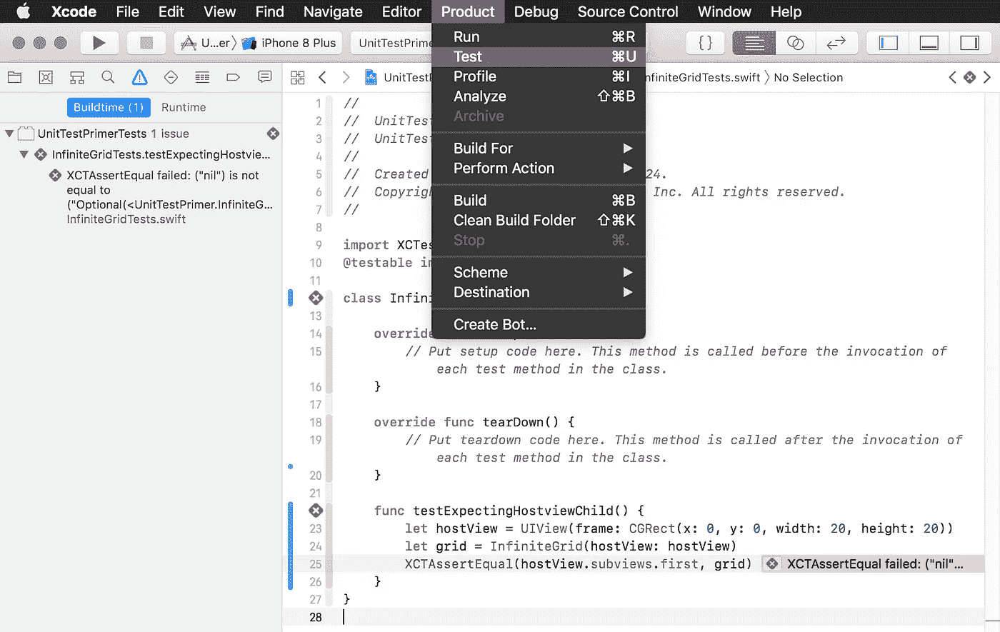
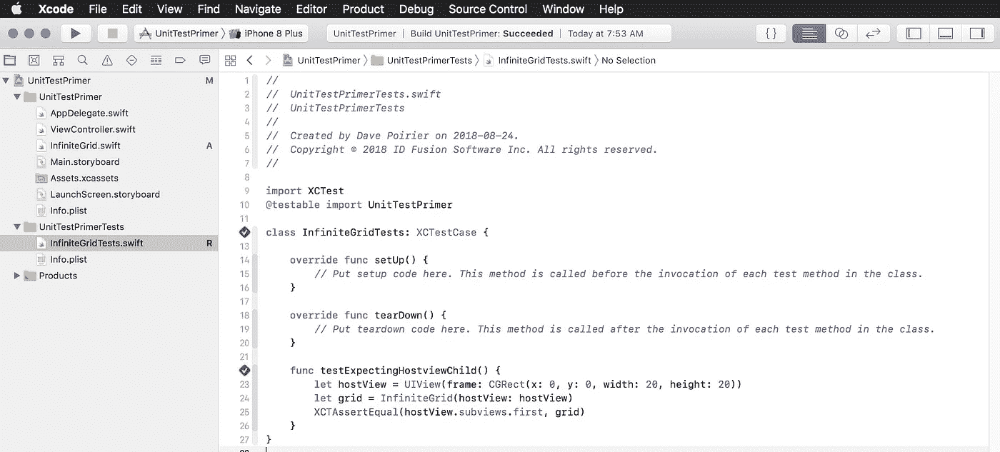
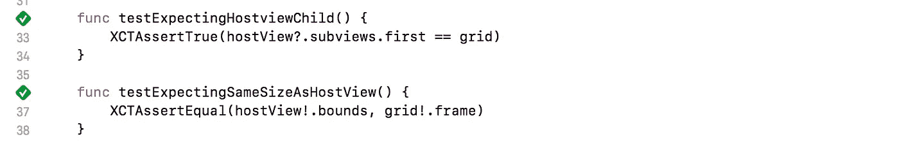
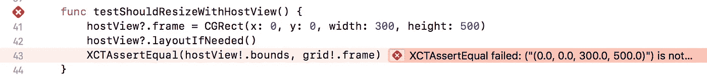
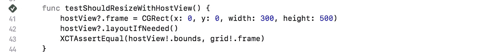
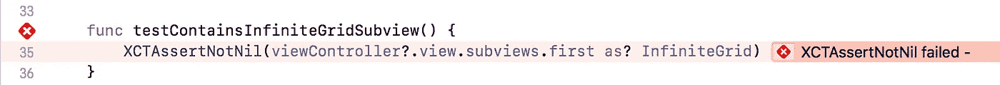

# 探索 TDD 的宇宙

> 原文：<https://itnext.io/exploring-the-universe-of-tdd-14ffc41a6e76?source=collection_archive---------5----------------------->

我从事软件开发已经超过 20 年了，不知何故，在这段时间里，我参与了一些项目，由于这样或那样的原因，测试驱动开发不是不受欢迎，就是根本不可能(你知道，就像在 x86 汇编中编写内核组件)。

但是我终于有机会探索这个宇宙，同时，像有些人说的那样，重新学习如何编程..《正当途径》。

在本教程中，我将重新实现我在[https://it next . io/infinite-grid-using-uicollectionview-155801 E4 f 7 f 4](/infinite-grid-using-uicollectionview-155801e4f7f4)上的教程中的一些代码

我已经跳过了创建项目的基本步骤，我假设你们大多数人都知道如何做这件事，以及如何检查标有“单元测试”的小方框。让我们开始吧！

# 规则 1:首先编写你的测试

是的，你不允许写任何实际的代码，除非你有一个失败的测试，证明你写代码通过测试。一旦你通过了测试，就停下来。

因此，我们的教程首先创建一个函数，将 UICollectionView 实例化到主机视图中。让我们创建类的存根，然后停止，直到我们写测试。

infinite grid . swift——编译最少的代码

现在我们的第一个测试应该会失败，这样我们就可以正确地实现我们的函数了:

我们的第一个测试

理论上，当我们运行我们的测试时，它应该失败，所以它证明我们添加足够的代码是正确的，所以它通过了。而现在…

Xcode 屏幕截图—运行单元测试的菜单选项

成功！或者说……失败！现在我们有一个失败的测试，我们可以实现足够的代码来通过测试。

# 规则 2:编写代码通过的最小值

让我们更新 InfiniteGrid.swift，如下所示:

InfiniteGrid.swift —通过第一个单元测试的最少代码

添加一行代码后，我们的测试通过了:

Xcode 截图—通过第一个单元测试

到目前为止一切顺利。在我们继续编写第二个测试之前，让我们使用 setUp()和 tearDown()函数，这样我们就不必为每个测试重复网格初始化代码。

InfiniteGridTests.swift —使用 setUp()和 tearDown()函数

使用⌘+U 将重新运行我们的测试，并确认一切仍然正常:

Xcode 截图——通过我们更新的第一个单元测试

请随意注释掉我们之前所做的 InfiniteGrid.swift 更改，并确认测试失败；那么在继续下一步之前，一定要取消注释。

# 规则 3:尝试打破你现有的代码

在您考虑编写更多代码之前，后退一步，想一想我们可以编写一个使当前代码失败的测试的方法。

在我们的初始化器中，我们将网格的框架设置为 CGRect.zero，忽略了 hostView 的大小。但是我们没有任何测试失败！让我们通过编写第二个测试来解决这个问题:

infinitegridtests . swift——我们的第二个单元测试

重新运行我们的测试(⌘+U)我们可以确认它失败了:

Xcode 截图——我们第二次失败的单元测试

然后我们可以修复代码，使其通过:

InfiniteGrid.swift —更新后通过了第二次单元测试

然后确认我们的测试通过(⌘+U):

Xcode 截图—通过两个单元测试

# 规则 4:坚持下去，直到你再也无法打破它

我们还能测试什么？如果你能想到一种方法使你现有的代码失败，那么你应该为此写一个测试。

如果你在团队中工作，这部分实际上可能是一个有趣的挑战，一个人写测试，另一个人写代码，当你在代码中前进时，一天中不断地挑战彼此；每隔几个小时或者甚至在每一次测试/代码迭代之后，交替进行以保持事情的趣味性！

想想我们的 InfiniteGrid，如果 hostView 调整了大小，InfiniteGrid 不也应该调整大小吗？让我们写一个测试:

InfiniteGridTests.swift —第三个单元测试

确认失败(⌘+U):

Xcode 截图——第三次单元测试失败

现在来修复它:

InfiniteGrid.swift —通过第三单元测试的代码

确认它现在通过(⌘+U):

Xcode 截图——通过我们的第三个单元测试

满意吗？不，我需要我的 InfiniteGrid 有一个清晰的背景…另一个测试:

我们的第四个单元测试

确认失败…更新代码…

InfiniteGrid.swift —更新后通过了所有四项测试，最终与演示代码匹配

确认它通过…重复这个过程，直到你满意你的代码被很好地覆盖，并且尊重你能想到的所有标准。

# 回顾我们的进展

到目前为止，我们有大约 5 行代码，以及 4 次测试来确认代码的行为符合预期。您可以查看 Xcode 控制台日志，了解所执行测试的摘要:

当您的测试设置正确时，更改您的类的行为应该会导致其中一个测试失败。例如，如果我们要更新 InfiniteGrid.swift 来替换。高度灵活。flexibleTopMargin，其中一个测试应该会失败。

如果你可以改变代码的行为，并且没有测试失败，那么你就会错过一些测试用例。立即停止修改代码，去写一个失败的测试，然后再继续开发。永远不要忘记**规则 1:首先编写你的测试。**

# 继续查看控制器

对我们在 InfiniteGrid 上的工作感到满意后，让我们继续我们在 ViewController.swift 中创建的代码——在 viewDidLoad 中，我们实例化了一个 InfiniteGrid。

规则#1…首先测试。让我们为这个新类创建一个新的测试文件。

viewcontrollertests . swift—setUp()、tearDown()和第一个单元测试

确认失败(⌘+U):

Xcode 截图——第一次 ViewController 单元测试失败

更新 ViewController.swift 以通过..

ViewController.swift —通过第一个单元测试的代码

确认它通过(⌘+U):

Xcode 截图—通过我们的 ViewController 第一个单元测试

终于！我们已经用单元测试完全覆盖了教程的第一部分。

# 目前我们了解到的是:

1.  总是先写测试
2.  只写最少的代码来通过你的测试
3.  在编写更多代码之前，尝试破坏现有的代码
4.  坚持下去，直到你再也无法打破它

当您开发代码和测试时，您最终需要重新分解或重新组织您的类，以保持代码的整洁和可读性。您应该努力尽早这样做，因为更改您的代码将意味着也必须重写您的测试！如果你等太久才重新考虑，你只会给自己带来更多的痛苦，因为你将不得不重写更多的测试。

尽早重构，经常重构。

# XCAssert？

你可能已经注意到我们在测试中使用了 XCAssertNotNil 和 XCAssertEqual 函数。有许多功能可供您测试:

*   XCAssert()
*   XCAssertEqual()
*   XCAssertNotEqual()
*   …

虽然您可以使用 XCAssert 来执行大多数验证，但是在使用一个更显式的函数时，更容易确认预期的测试。例如:

XCAssertEqual(x，y)

更明确的是:

XCAssert(x == y)

虽然两者是等价的，但很明显，第一个测试的目的是验证相等性。当只使用 XCAssert 并且测试失败时，您会怀疑错误是在测试中还是在您正在测试的代码中。是测试的目的！=而不是==或者也许应该是> =？

同样，使用 XCAssertTrue、XCAssertFalse、XCAssertNil()或 XCAssertNotNil()明确定义了意图。你应该尽量少用基本的 XCAssert()函数。

你可以在:[https://developer.apple.com/documentation/xctest](https://developer.apple.com/documentation/xctest)找到 XCTest 函数的完整列表

# 异步方法呢？

您将想要使用“期望”来管理您的异步测试。同样，XCTest 上的文档(见上一节的链接)将为您提供您需要的所有不同的测试。XCTWaiter 允许你等待一组异步期望完成，你甚至可以设置键值观察者期望。最重要的是，期望可以是有时间限制的，因此如果异步操作没有在指定的时间限制内完成，测试将被视为失败。

# 想了解更多？

太好了！有许多资源可以了解更多关于 TDD 最佳实践以及如何使用 Xcode 和 Swift 专门进行 TDD 的信息。

Yvette 的一个可爱的(虽然有点过时)教程特别有意思:[https://medium . com/@ ynzc/getting-started-with-TDD-in-Swift-2 fab3 e 07204 b](https://medium.com/@ynzc/getting-started-with-tdd-in-swift-2fab3e07204b)—这是一个有趣的项目，包含一些小的挑战，很容易理解，大多数内容应该可以在 Swift 4 中使用。

比较正式？lynda.com 有一个不错的 2 小时教程，可以在[https://www . Lynda . com/iOS-tutorials/iOS-App-Development-Test-Driven-Development/672254-2 . html](https://www.lynda.com/iOS-tutorials/iOS-App-Development-Test-Driven-Development/672254-2.html)找到

多动手？查看这个充满 TDD 之爱的伟大 GitHub 库:[https://github.com/luontola/tdd-tetris-tutorial](https://github.com/luontola/tdd-tetris-tutorial)

# 关于作者

戴夫·普瓦里耶是一名高级软件开发人员，目前正在 [ID Fusion 软件公司](http://idfusion.com)开发一些真正有趣的 iOS 应用程序。

您的移动应用软件开发需要帮助吗？访问我们在 http://idfusion.com[的网站](http://idfusion.com)