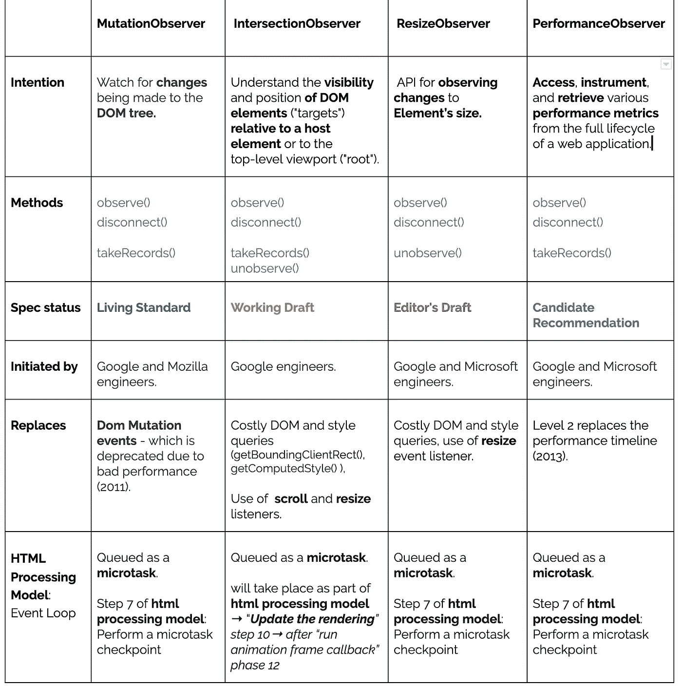

# 探索 web APIs 观察者——解释真实生活中的例子！

> 原文：<https://itnext.io/exploring-web-apis-observers-real-life-examples-explained-ed194477314?source=collection_archive---------5----------------------->


如果你喜欢一头扎进 [mdn](https://developer.mozilla.org/en-US/docs/Web/API) 的话，你很可能认识一些以“观察者”结尾的 web APIs。

这些观察器是相对较新的 web APIs(除了变异观察器之外)，**它们中的一些并不被所有的浏览器**支持，通常用于**观察**目标元素**的某个状态**，并在检测到该状态时采取行动(通过运行观察回调)，一些解决了 web 传统的知道何时发生变化的方法(例如，元素/树的变化，元素在视口中的可见性等)..)由于[计算](https://gist.github.com/paulirish/5d52fb081b3570c81e3a)会影响性能(例如，通过触发回流/重绘)，因此成本可能很高。

## 不同观察者共享的相似性/惯例:

所有都以相同的方式构造——构造函数排除观察回调，并返回观察器的实例，以便在需要时开始观察。都有" **observe()** "和" **disconnect()** "方法，但是它们不共享同一个接口，各自实现自己的接口。

## 基于 W3C/标准规范的快速概述:



# 交叉观测器

理解元素(HTML/SVG)相对于其宿主元素(或顶级根)的**可见性的现代异步方式。**

mdn 中提到的常见使用案例:

*   页面滚动时图像或其他内容的延迟加载。
*   实现“无限滚动”网站，当你滚动的时候，越来越多的内容被加载和呈现，这样用户就不需要翻页了。
*   报告广告的可见性，以便计算广告收入。
*   根据用户是否会看到结果来决定是否执行任务或动画过程。

以下是我在一个用于加载和播放特效动画的角度库上使用它的方法。([一个洛蒂网包装器](https://github.com/Sentinel-One/lottie)

```
**private** playAnimationOnlyWhenElementAppears() {
  **if** (!(**'IntersectionObserver' in *window***)) {
    **return**;
  }
  **if** (**this**.**options**.**loop**) {
    **this**.**observer** = **new *IntersectionObserver***((entries) => {
      **for** (**const** entry **of** entries) {
        **if** (entry.**intersectionRatio** !== 0) {
          **this**.**animationInstance**.play();
        } **else** {
          **this**.**animationInstance**.pause();
        }
      }
    });
    **this**.**observer**.observe(**this**.**lottieContainer**.**nativeElement**);
  }
}ngOnDestroy(): **void** {
  **this**.**animationInstance** && **this**.**animationInstance**.destroy();
  **this**.**observer** && **this**.**observer**.disconnect();
}
```

**仅供参考，如果您熟悉 Angular，您可能知道它使用 zone.js 修补了一些 web API，因此它可以拦截异步操作并触发对它的更改检测，Angular 还修补了 **IntersectionObserver** 。

# 突变观察者

让我们观察对 [DOM](https://developer.mozilla.org/en-US/docs/DOM) 树所做的改变，DOM 突变将被报告给观察者的`callback.`

用户可以指定他想要向回调报告哪些变更(类型为`**MutationObserverInit)** e.g. childList`、`attributes`和/或`characterData.`)

下面是 [***变异观察器***](https://developer.mozilla.org/en-US/docs/Web/API/MutationObserver)*在 [vscode 编辑器](https://github.com/microsoft/vscode/blob/6cc1cdba5b6a9c391275e357b82cc208fff034d2/src/vs/workbench/contrib/terminal/browser/terminalWidgetManager.ts#L36)中的使用方法:*

```
***private** _initTerminalHeightWatcher(terminalWrapper: ***HTMLElement***) {
  *// Watch the xterm.js viewport for style changes and do a layout if it changes* **this**.**_xtermViewport** = <HTMLElement>terminalWrapper.querySelector(**'.xterm-viewport'**);
  **if** (!**this**._xtermViewport) {
    **return**;
  }
  **const** mutationObserver = **new *MutationObserver***(() => **this**._refreshHeight());
  mutationObserver.observe(**this**._xtermViewport, { **attributes**: **true**, **attributeFilter**: [**'style'**] });
}*
```

*   *分配**的结果。xterm-viewport** 元素查询 to _xtermViewport。*
*   *实例化一个新的 mutationObserver，向其传递 _refreshHeight()回调。*
*   *调用 mutationObserver.observe()方法，将 _xtermViewport 作为更改的目标，并将 option 对象配置为观察属性更改，特别是监视“style”属性。*

*所以基本上当 _xtermViewport.style 发生变化时，就会调用 _refreshHeight()。请注意，本例中的实例只能在该函数中引用，因此实际上观察者总是观察变化，不需要断开它(基本清理..).*

# *resize 观察者*

*用于观察元素大小变化的 API。*

> *ResizeObserver 可以观察不同种类的 CSS 大小:*
> 
> *`[border-box](https://drafts.csswg.org/resize-observer/#dom-resizeobserverboxoptions-border-box)`:CSS2 中定义的[框边界区域](https://www.w3.org/TR/CSS21/box.html#box-border-area)的大小。*
> 
> *`[content-box](https://drafts.csswg.org/resize-observer/#dom-resizeobserverboxoptions-content-box)`:CSS2 中定义的[内容区](https://drafts.csswg.org/css-box-3/#content-area)的大小。*

*与其他观察器类似，resize 也由接受观察**回调**的构成。用 [resizeObserver](https://developer.mozilla.org/en-US/docs/Web/API/ResizeObserver) 。observe(target)方法我们可以开始跟踪目标的尺寸变化。*

*因为它还在草案中，并不是所有的浏览器都支持它，所以我看过的开源项目的“ToDo”注释或自述文件中经常提到它。*

*一个以很酷的方式使用 resizeObserver 来检测组件调整大小的项目的例子是: [react-resize-detector](https://github.com/maslianok/react-resize-detector) ，它公开了一个将被用作客户端组件宿主的组件，用户应该将检测到调整大小时运行的回调传递给它:*

```
***const** handle = getHandle(refreshMode);
**this**.**resizeHandler** = handle
  ? handle(**this**.createResizeHandler, refreshRate, refreshOptions)
  : **this**.createResizeHandler;

**this**.**resizeObserver** = **new** ResizeObserver(**this**.resizeHandler);*
```

*   *将 resizeObserver 分配给一个新实例，传递一个处理程序*

```
*toggleObserver = type => {
  **const** element = **this**.getElement();
  **if** (!element || !**this**.resizeObserver[type]) **return**;

  **this**.resizeObserver[type](element);
};*
```

*   *ToggleObserver()用于在元素存在时开始和停止观察元素。*

```
*componentDidMount() {
  **this**.toggleObserver(**'observe'**);
}

componentWillUnmount() {
  **this**.toggleObserver(**'unobserve'**);

  **this**.rafClean();

  **this**.cancelHandler();

  **this**.**unmounted** = **true**;
}*
```

*   *观察器将在组件启动时开始观察变化，并在组件终止时暂停观察。*

# *性能观察者*

> *`**PerformanceObserver**`界面用于*观察*性能测量事件，并在新的[性能条目](https://developer.mozilla.org/en-US/docs/Web/API/PerformanceEntry)记录在浏览器的*性能时间线*中时得到通知*

*[performanceObserver](https://developer.mozilla.org/en-US/docs/Web/API/PerformanceObserver) 的不同之处在于，我们不会使用它来帮助开发更好的“产品智能”UI 组件，它将在 UI 逻辑的“外部”使用，以监控/测试/测量性能指标来改进我们的应用程序，我们可能希望通过发送到分析工具(如 google analytics)来实时跟踪这些指标，就像这篇[帖子](https://developers.google.com/web/fundamentals/performance/user-centric-performance-metrics)中所建议的那样。*

```
***const** observer = **new *PerformanceObserver***((list) => {
  **for** (**const** entry **of** list.getEntries()) {
    *// `entry` is a PerformanceEntry instance.* ***console***.log(entry.**entryType**);
    ***console***.log(entry.**startTime**); *// DOMHighResTimeStamp* ***console***.log(entry.**duration**); *// DOMHighResTimeStamp* }
});

*// Start observing the entry types you care about.* observer.observe({**entryTypes**: [**'resource'**, **'paint'**]});*
```

*   *在上面的代码片段中，我们可以看到 observer 的用法与其他类似，不同之处在于没有元素目标，而是我们观察`[**PerformanceEnties**](https://developer.mozilla.org/en-US/docs/Web/API/PerformanceEntry)**.**`*

```
***const** observer = **new *PerformanceObserver***((list) => {
  **for** (**const** entry **of** list.getEntries()) {
    ga(**'send'**, **'event'**, {
      **eventCategory**: **'Performance Metrics'**,
      **eventAction**: **'longtask'**,
      **eventValue**: ***Math***.round(entry.**startTime** + entry.**duration**),
      **eventLabel**: ***JSON***.stringify(entry.attribution),
    });
  }
});

observer.observe({**entryTypes**: [**'longtask'**]});*
```

*   *在上面的代码片段中，我们看到了一个检测 longtask 并将其报告给分析工具的尝试，[entry . attribute](https://w3c.github.io/longtasks/#sec-TaskAttributionTiming)将告诉我们哪个帧上下文负责长任务(“`iframe`”、“`embed`”或“`object`”)。*

*就这样，我希望你喜欢这篇文章，*

*欢迎大家分享，并在 stackblitz:)或 [git repo](https://github.com/LironHazan/dom-apis-typed/blob/master/dom-observers-apis/combined-observers.ts) 中玩转以下可运行的例子。*

*干杯，勒荣。*