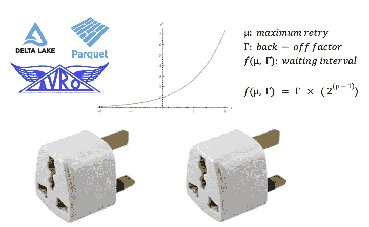
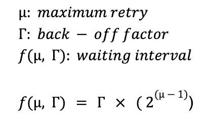
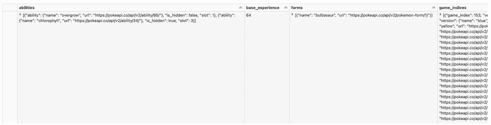

# 以 API 挂载适配器类的形式实现的指数后退

> 原文：<https://itnext.io/exponential-back-off-implemented-in-the-form-of-an-api-mount-adapter-class-9f1e5d735807?source=collection_archive---------5----------------------->

一个可重用/可扩展的实用程序类，使用控制理论自动将 API 接收到大规模的数据湖中

数据工程中最常见的工作流之一是将数据从第三方 API 接收到数据湖的原始层中。在规模上，随着速率限制的出现，这个问题开始变得更加复杂。因此，当向 API 发出数百万个请求时，需要一种智能的方法。
在本文中，我将分享我的工具类来自动完成这项任务。您可以随意使用这里的代码，对其进行扩展，并添加特定于您的工作流的新功能，如处理不同形式的身份验证或发送定制的 POST 请求。事不宜迟，下面是适配器挂载类:

完整的连接器类

使用 PokeAPI 的连接器类的用法示例

**HTTP 响应状态列表**

理想情况下，我们希望重试以下 HTTP 错误响应:

*   429:用户在给定的时间内发送了太多的请求(“速率限制”)。
*   500:服务器遇到了一个它不知道如何处理的情况。
*   502:此错误响应意味着服务器在作为网关获取处理请求所需的响应时，得到了无效的响应。
*   503:服务器未准备好处理请求。常见原因是服务器停机维护或过载。请注意，除了这个响应之外，还应该发送一个解释问题的用户友好页面。这个响应应该用于临时情况，如果可能的话,`Retry-After` HTTP 头应该包含服务恢复之前的估计时间。网站管理员还必须注意与该响应一起发送的与缓存相关的头，因为这些临时条件响应通常不应该被缓存。
*   504:当服务器充当网关，不能及时得到响应时，给出此错误响应。

**带重试算法的指数回退**

API mount 适配器的逻辑利用来自控制理论的算法，在接收到来自端点的错误响应后，智能地重试发送请求。为了不耗尽 API，我们希望增加每次失败后发送请求的时间间隔，而不是以线性间隔无限重试。这个概念被称为“重试指数后退”。数学上它可以表示为:

“带重试次数的指数后退”公式

一个示例配置是:

*   最大重试次数= 4
*   后退因子= 2

那么等待时间将是:
第一次重试 2 秒，第二次重试 4 秒，第三次重试 8 秒，最后第四次重试 16 秒。如果请求仍然不成功，重试机制将停止。

**该类的其他功能**

从 write to bronze 方法中可以看出，这个类既可以输出增量表，也可以输出 parquet、Avro、JSON 或 CSV 等格式的文件。这使得它可以针对不同的工作流进行高度配置，并允许您利用每种格式的不同优势，在这种情况下，您可能更喜欢 parquet 以获得压缩优势，或者 JSON 以获得动态模式读取优势。

最终增量表的摘录

最后，该类还使您能够将一个基本 URL 挂载到 HTTP 和 HTTPS URL，而不是在每次发送请求时都完全重写您的特定资源路径。该适配器还有一个重置方法，可以从一个端点上拔下它并从头开始。

总而言之，我认为有一个可扩展的单个类作为主要参考点，可以让数据工程师在处理不同的工作流时不重复工作，并有效地协作和共享知识。希望你喜欢这篇文章，下次见！

来源:

*   [https://developer . Mozilla . org/en-US/docs/Web/HTTP/Status # client _ error _ responses](https://developer.mozilla.org/en-US/docs/Web/HTTP/Status#client_error_responses)
*   【https://en.wikipedia.org/wiki/Exponential_backoff 号