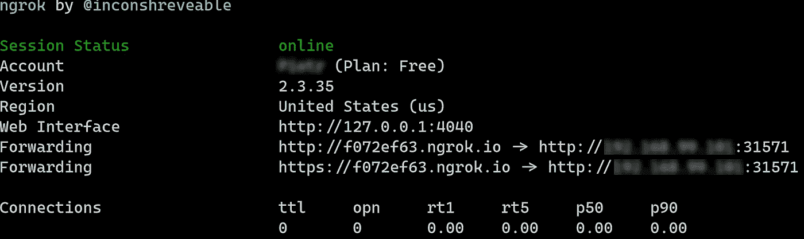

# 使用 ngrok 在互联网上公开本地 Kubernetes 服务

> 原文：<https://itnext.io/expose-local-kubernetes-service-on-internet-using-ngrok-2888a1118b5b?source=collection_archive---------1----------------------->


[产品学院](https://unsplash.com/@productschool?utm_source=unsplash&utm_medium=referral&utm_content=creditCopyText)在 [Unsplash](https://unsplash.com/s/photos/office?utm_source=unsplash&utm_medium=referral&utm_content=creditCopyText) 上的照片

使用本地 Kubernetes 集群，如 minikube、k3s、microk8s 或其他集群，对于测试新功能、试验和运行 POC 非常有用。一旦你准备好一个很酷的新功能，或者只是想与同事或客户快速分享你的工作成果，那么你必须将一切都推到一个在线集群。如果您有良好的 CI/CD 管道设置，这可能不是一个问题，但大多数时候，对于一个简单的一次性演示来说，这实在是太费力了。

Ngrok 是一个在线的免费服务，它可以让你(除了别的以外)创建一个 SSL 隧道来将你的本地 http 流量暴露给互联网，并且只需要几分钟就可以设置好！你可以在他们的[主页](https://dashboard.ngrok.com/get-started)上阅读更多关于 ngrok 的内容，这是一个很棒的产品，不仅在我们现在看到的场景中非常有用，在更广泛的范围内也非常有用。

## 设置和先决条件

为了跟随教程，你需要一些先决条件。

一个本地的 Kubernetes 集群(我在 Windows 10 上用的是 minikube，通过 WSL 访问)。我推荐的易于安装的本地安装有:

*   Minikube:Kubernetes 仓库的一部分
*   K3D :帮助者二进制文件，用于一个被称为 k3s 的牧场主的小而快速的分发
*   [Microk8s](https://github.com/ubuntu/microk8s) :由 Ubuntu 维护

按照 ngrok 页面中的[安装步骤](https://dashboard.ngrok.com/get-started)设置 cli(您需要创建一个免费帐户)。

您将需要 **kubectl cli** 。遵循 Kubernetes 主页上的官方指南，或者你也可以使用我的 docker 镜像，它拥有 kubectl cli、bash/zsh 补全和一些有用的别名。

## 设置

一旦安装了所有的先决条件，就该在您的 Kubernetes 集群中创建一些资源了，我们稍后将通过 ngrok 在互联网上公开这些资源。

我们将创建一个简单的 nginx pod，并通过 nodePort 类型的服务在 Kubernetes 中公开它。Kubernetes 服务为它们的目标 pod 创建内部负载平衡层。你可以在官方的 Kubernetes 文档页面中阅读更多关于服务的信息。一旦我们在本地公开了服务，我们将使用 ngrok 在本地服务和自动生成的互联网地址之间创建一个隧道。

## 逐步说明

1.将 **kubectl** 的别名设置为更容易运行的命令。这一步是可选的。

```
alias k=kubectl
```

2.在本地集群中创建 nginx pod。

```
k run nginx — image nginx — restart Never
```

3.通过节点端口服务公开 nginx pod。

```
k expose pod nginx — port 80 — target-port 80 — type NodePort — name nginx-service
```

4.用服务的节点端口创建变量。这里我们使用的是 **jsonpath** ，它是 kubectl 的特性，允许从 api-server 中选择任意值。我们正在检查 Kubernetes 为我们的服务自动分配了什么节点端口。

```
NODE_PORT=$(k get svc nginx-service -o=jsonpath=”{$.spec.ports[0].nodePort}{‘\n’}”)
```

5.使用 curl 检查 nginx 在主机的端口上是否可用。您应该会看到 nginx 默认欢迎页面的 HTML 内容。

如果您在 minikube 中运行 Kubernetes:

```
curl [http://{minikube](/{minikube) ip}:$NODE_PORT
```

提示:您可以通过运行 **mikikube ip** 来检查主机 ip

如果您正在运行支持本地主机的本地 Kubernetes 安装，只需输入

```
curl [http://localhost:$NODE_PORT](http://localhost:$NODE_PORT`)
```

6.使用 ngrok 在互联网上公开您的服务。Ngrok 将为我们生成 http 和 https 地址，以便我们能够访问我们的服务。

如果您在 minikube 中运行 Kubernetes:

```
ngrok http [http://{minikube](/{minikube) ip}:$NODE_PORT
```

如果您正在运行支持本地主机的本地 Kubernetes 安装，只需输入

```
ngrok http [http://localhost:$NODE_PORT](http://localhost:$NODE_PORT`)
```

这将打开 ngrok 会话，显示生成的地址:



继续前进，按照“Web Interface”地址查看 ngrok 的仪表板: [http://127.0.0.1:4040](http://127.0.0.1:4040) 并探索界面。点击其中一个自动生成的链接，您应该会看到 nginx 欢迎页面！

## 结论

我们已经看到使用 ngrok 公开 Kubernetes 服务是多么容易。不需要部署到任何在线集群，只需使用您知道有效的本地 Kubernetes 设置，并能够与任何人分享您的工作成果。

当然，这仅用于测试/演示目的，不适合运行生产级工作负载。