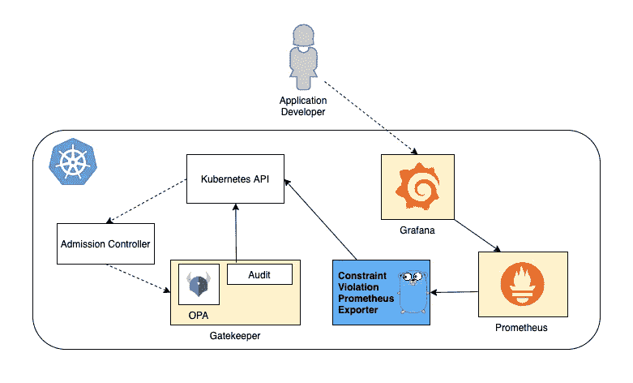
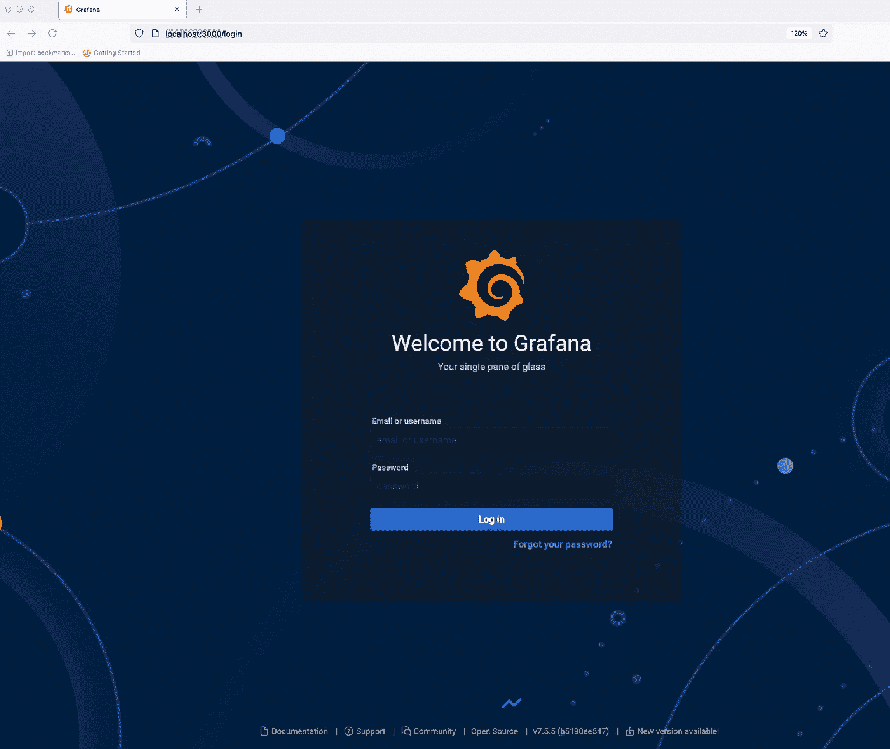
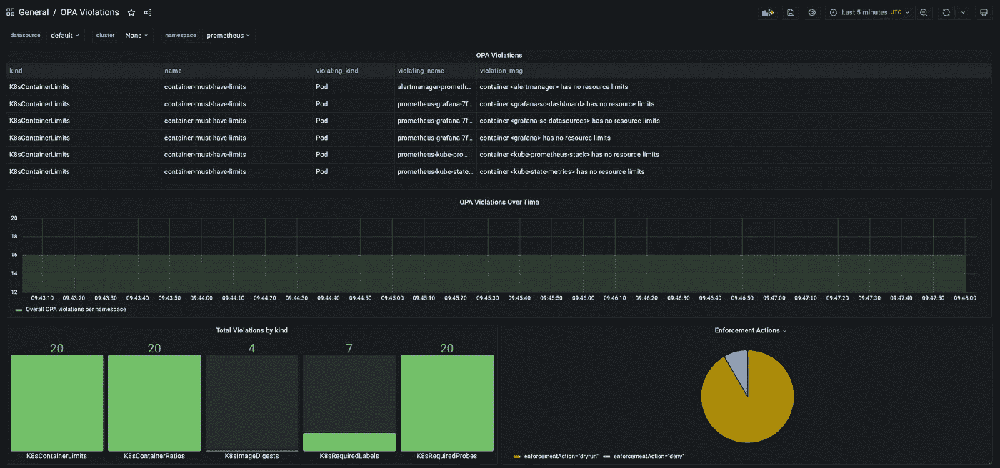

# 使用 Prometheus 和 Grafana 揭露 Kubernetes 应用程序违反开放策略代理/网关守护设备约束的情况

> 原文：<https://itnext.io/expose-open-policy-agent-gatekeeper-constraint-violations-with-prometheus-and-grafana-6b7ac92ea07f?source=collection_archive---------1----------------------->

*TL；DR:在这篇博文中，我们讨论了一个解决方案，它给平台用户一个简洁的视图，显示使用 Prometheus & Grafana 违反了哪些网守约束。*

[**安迪·纳普**](https://www.linkedin.com/in/andy-knapp-6a72b6108/) **和** [**穆拉特·塞莱普**](https://www.linkedin.com/in/muratcelep/) **曾在这篇博文中合作。**

*本文使用的文件/脚本可以在这里找到:*[*https://github.com/mcelep/opa-scorecard*](https://github.com/mcelep/opa-scorecard)

刚开始使用 Kubernetes 的应用团队可能会觉得有点难，因为 Kubernetes 是一个安静复杂的大型生态系统(参见 [CNCF 生态系统景观](https://landscape.cncf.io/))。此外，虽然 Kubernetes 开始成熟，但它仍在非常积极地开发中，并且它以比其他企业软件更快的速度不断获得新功能。最重要的是，Kubernetes 平台部署到公司生态系统的其余部分(认证、授权、安全、网络、存储)是根据集成要求为每个公司量身定制的。因此，即使对于一个经验丰富的 Kubernetes 专家来说，在部署一个应用程序时，通常也要考虑很多事情，以满足安全性、弹性和性能需求。您如何确保运行在 Kubernetes 上的应用程序能够满足这些需求？

## 输入 OPA/看门人

[开放策略代理](https://www.openpolicyagent.org/) (OPA)及其 Kubernetes 目标组件[看门人](https://github.com/open-policy-agent/gatekeeper)为您提供了在 Kubernetes 集群上实施策略的方法。这里我们所说的策略，是您希望在贵公司的 Kubernetes 集群中看到的规则&最佳实践&行为的正式定义。当使用 OPA 时，你使用一种叫做[减压阀](https://www.openpolicyagent.org/docs/latest/policy-language/)的领域特定语言来编写策略。这样，如果你试图在公司的内部 wiki 上用自由文本解释某项政策，你就不会有误解的空间。

此外，在使用网关守护设备时，不同的策略可以有不同的执行操作。可能有某些政策被视为**必须**，而其他政策被视为**必须**。一个**必须**策略将阻止一个 Kubernetes 资源被接纳到一个集群中，而一个**好到拥有**策略只会导致平台用户应该注意的警告消息。

在这篇博文中，我们将讨论如何:

*   对 K8S 集群应用示例 OPA 策略，即所谓的网关守护设备约束
*   暴露违反关守约束的普罗米修斯度量
*   创建 Grafana 仪表板以显示有关违规的关键信息

如果你想了解更多关于在 Kubernetes 中执行政策的内容，请查看这篇文章。

## 设计



我们构建该系统的目的是为开发人员和平台用户提供有关 OPA 约束的见解，他们的应用程序可能会在给定的名称空间中违反这些约束。我们使用 Grafana 创建一个示例仪表板。Grafana 从 Prometheus 获取创建仪表板所需的数据。我们已经编写了一个小的 Go 程序——在上图中描述为“违反约束的 Prometheus Exporter”——来查询 Kubernetes API 是否违反约束，并以 Prometheus 格式公开数据。在我们的设置中，网关守护设备/OPA 用于[审核](https://open-policy-agent.github.io/gatekeeper/website/docs/audit)模式，我们不利用网关守护设备的功能来拒绝不符合策略预期的 K8S 资源。

## OPA 约束

每个公司对于在 Kubernetes 上运行的应用程序都有自己的一套要求。您可能听说过*生产就绪清单*的概念(简单地说，您希望在平台用户将应用程序部署到生产环境之前，为他们创建一个项目清单)。您希望拥有自己的基于减压阀的*生产准备清单*，以下链接可能会为您创建自己的清单提供一个良好的起点:

*   [Tanzu 开发者中心应用就绪清单](https://tanzu.vmware.com/developer/guides/kubernetes/app-enhancements-checklist/)
*   [关于 learnk8s.io 的生产最佳实践](https://learnk8s.io/production-best-practices)
*   [生产中的 Kubernetes:关于 replex.io 的准备情况清单和最佳做法](https://www.replex.io/blog/kubernetes-in-production-readiness-checklist-and-best-practices)

请记住，您将需要根据您的生产准备清单创建一个 OPA 策略，并且您可能无法使用 OPA/减压阀涵盖清单中的所有问题。目标是关注基于 Kubernetes 资源定义容易提取的内容，例如 K8S 部署的副本数量。

对于我们的博文，我们将使用开源项目 [gatekeeper-library](https://github.com/open-policy-agent/gatekeeper-library) ，它包含了一组很好的示例约束。此外，项目结构在提供一个如何为你的公司管理 OPA 约束的例子的意义上是很有帮助的:用于创建 OPA 策略的减压阀语言应该进行彻底的单元测试，在 [src 文件夹](https://github.com/open-policy-agent/gatekeeper-library/tree/master/src/general)中，你可以找到纯 Rego 文件和单元测试。[库文件夹](https://github.com/open-policy-agent/gatekeeper-library/tree/master/library/general)最终包含了从 src 文件夹中的 rego 文件创建的 Gatekeeper 约束模板。此外，每个模板都有一个示例约束，以及一些目标数据，这些数据会对约束产生积极和消极的结果。基于减压阀的策略可能会变得相当复杂，所以在我们看来，必须进行减压阀单元测试，涵盖愉快的和不愉快的路径。我们建议继续进行这个项目，并按照整个项目结构删除和添加代表贵公司需求的策略。使用这种方法，您可以实现代码的合规性，可以轻松地应用于各种环境。

如前所述，可能有一些您不想直接实施的约束(必须或最好有):例如，在一个开发集群上，您可能不想实施 **> 1 副本**，或者在实施一个特定的约束之前，您可能想给平台用户足够的时间来采取必要的预防措施(而不是立即阻止他们的更改)。您可以使用`[enforcementAction](https://open-policy-agent.github.io/gatekeeper/website/docs/violations#dry-run-enforcement-action)`来控制这种行为。默认情况下，`enforcementAction`被设置为`deny`，这就是我们所说的**必须**条件。在我们的例子中，我们将使用`enforcementAction: dryrun`属性安装所有带有**美好拥有**条件的约束。这将确保我们不会直接影响 K8S 集群上运行的任何工作负载(对于这个场景，我们也可以使用`[enforcementAction: warn](https://open-policy-agent.github.io/gatekeeper/website/docs/violations#warn-enforcement-action)`)。

## 普罗米修斯出口商

我们决定使用 [Prometheus](https://prometheus.io/) 和 [Grafana](https://grafana.com/) 来收集约束违反度量并显示它们，因为这些都是很好且流行的开源工具。

为了导出/发出普罗米修斯指标，我们用 golang 编写了一个小程序，使用了[普罗米修斯 Golang 库](https://github.com/prometheus/client_golang)。这个程序使用 Kubernetes API 来发现应用于集群的所有约束，并导出某些指标。

下面是一个衡量标准示例:

```
opa_scorecard_constraint_violations{kind="K8sAllowedRepos",name="repo-is-openpolicyagent",violating_kind="Pod",violating_name="utils",violating_namespace="default",violation_enforcement="dryrun",violation_msg="container <utils> has an invalid image repo <mcelep/swiss-army-knife>, allowed repos are [\"openpolicyagent\"]"} 1
```

标签用于表示每个约束违反，我们稍后将在 Grafana 仪表板中使用这些标签。

Prometheus exporter 程序默认监听 tcp 端口`9141`，并公开路径`/metrics`上的度量。只要您的主文件夹中有一个有效的 Kubernetes 配置，它就可以在您的开发机器上本地运行(也就是说，如果您可以运行 kubectl 并且拥有正确的权限)。在集群上运行时，会传入一个`incluster`参数，以便它知道在哪里查找集群凭证。导出程序每 10 秒钟连接到 Kubernetes API，从 Kubernetes API 中抓取数据。

我们用[这篇](https://medium.com/teamzerolabs/15-steps-to-write-an-application-prometheus-exporter-in-go-9746b4520e26)博客文章作为代码的基础。

## 演示

让我们继续准备我们的组件，这样我们就有一个 Grafana 仪表板来显示违反了哪些约束，以及违反的数量是如何随时间变化的。

## 0)所需工具

*   [Git](https://git-scm.com/downloads) :需要一个 git cli 来检查回购协议
*   [Kubectl](https://kubernetes.io/docs/tasks/tools/) 和一个工作中的 K8S 集群
*   Ytt :这是一个非常强大的 yaml 模板工具，在我们的设置中，它用于动态覆盖所有约束中的键/值对。它类似于 Kustomize，比 Kustomize 更灵活，在一些 [Tanzu](https://tanzu.vmware.com/tanzu) 产品中大量使用。
*   Kustomize :看门人——图书馆依赖于 Kustomize，所以我们也需要它。
*   头盔:我们将使用头盔安装普罗米修斯和格拉法纳
*   可选: [Docker](https://www.docker.com/products/docker-desktop) : Docker 只是可选的，因为我们已经在 dockerhub 上发布了所需的图像。

## 1) Git 子模块更新

运行`git submodule update --init`下载网关守护设备-库依赖关系。该命令将把[网关守护设备库](https://github.com/open-policy-agent/gatekeeper-library)的依赖性下载到文件夹`gatekeeper-library/library`中。

## 2)安装运算放大器/网守

如果你的 K8S 集群没有预装网守，你可以按照这里的说明[安装它。如果您熟悉 helm，最简单的安装方法如下:](https://open-policy-agent.github.io/gatekeeper/website/docs/install/)

```
helm repo add gatekeeper https://open-policy-agent.github.io/gatekeeper/charts
helm install gatekeeper/gatekeeper --generate-name
```

我们已经使用[Tanzu Mission Control(TMC)](https://tanzu.vmware.com/mission-control)来供应 Kubernetes 测试集群，TMC 为我们提供了一个开箱即用的带有网关守护设备的集群，我们无需自己安装网关守护设备。

## 3)安装网关守护设备示例约束

脚本[gate keeper-library/apply _ gate keeper _ constraints . sh](https://github.com/mcelep/opa-scorecard/blob/390957c2564a1b9bbe8733c21a7a43acd0581ca3/gatekeeper-library/apply_gatekeeper_constraints.sh)使用 kustomize 创建约束模板，然后在集群上应用它们。因此，请确保 k8s cli 配置了正确的上下文。之后 [Ytt](https://carvel.dev/ytt/) 用于注射`spec.enforcementAction: dryrun`以进行[干运转](https://open-policy-agent.github.io/gatekeeper/website/docs/violations/#dry-run-enforcement-action)的强制动作。

使用以下命令运行脚本:

```
cd gatekeeper-library && ./apply_gatekeeper_constraints.sh
```

## 4)安装普罗米修斯导出器

在文件夹 [exporter-go](https://github.com/mcelep/opa-scorecard/tree/master/exporter-go) 中，有以 Prometheus 数据格式导出约束违反信息的程序的源代码。同一个文件夹还包含一个名为 [build_docker.sh](https://github.com/mcelep/opa-scorecard/blob/390957c2564a1b9bbe8733c21a7a43acd0581ca3/exporter-go/build_docker.sh) 的脚本，它构建一个容器并将其推送到[MC elep/opa _ score card _ exporter](https://hub.docker.com/r/mcelep/opa_scorecard_exporter)。容器图像已经公开了，所以你唯一需要做的就是应用文件夹 [exporter-k8s-resources](https://github.com/mcelep/opa-scorecard/tree/master/exporter-k8s-resources) 中的资源。我们为部署 K8S 资源选择的目标名称空间是`opa-exporter`。我们想要创建的 K8S 资源具有以下功能:

*   `clusterrole.yaml` & `clusterrolebinding.yaml` - >这些资源创建一个集群角色来访问组`constraints.gatekeeper.sh`的所有资源，并为该集群角色创建一个绑定
*   `deployment.yaml` - >将运行容器映像的部署`mcelep/opa_scorecard_exporter`
*   `service.yaml` - >一个带有注释`prometheus.io/scrape-slow: "true"`的服务，以确保该服务被 Prometheus 获取

要应用这些 K8S 资源:

```
kubectl create namespace opa-exporter && kubectl -n opa-exporter apply -f exporter-k8s-resources
```

## 安装 kube-prometheus-stack

为了安装普罗米修斯&格拉夫纳，我们将使用一个名为[的舵图表。文件夹](https://github.com/prometheus-community/helm-charts/tree/main/charts/kube-prometheus-stack) [kube-prometheus-stack](/kube-prometheus-stack) 包含该步骤的相关文件。

除了 Prometheus 和 Grafana，我们还想安装一个定制的 Grafana 仪表板，显示关于约束违反的有用指标。文件[kube-Prometheus-stack/cm-custom-dashboard . YAML](https://github.com/mcelep/opa-scorecard/blob/master/kube-prometheus-stack/cm-custom-dashboard.yaml)包含了我们想要安装的仪表板配置，注意这个文件中的标签`grafana_dashboard: "1"`。此标签用作 Grafana 的指令，以将此 ConfigurationMap 的内容作为仪表板源。文件[grafana-opa-dashboard . json](https://github.com/mcelep/opa-scorecard/blob/master/kube-prometheus-stack/grafana-opa-dashboard.json)是从 Grafana 导出的原始 JSON，我们使用该文件的内容将其嵌入到键`opa-dashboard.json`下的 configmap 中。

安装脚本[kube-prometheus-stack/install . sh](https://github.com/mcelep/opa-scorecard/blob/master/kube-prometheus-stack/install.sh)从文件[cm-custom-dashboard . YAML](https://github.com/mcelep/opa-scorecard/blob/master/kube-prometheus-stack/cm-custom-dashboard.yaml)创建一个配置图，然后使用 helm 将 kube-Prometheus-stack 图表安装到名称空间`prometheus`中。

运行以下命令安装 Prometheus & Grafana:

```
cd kube-prometheus-stack && ./install.sh
```

过了一会儿，所有 Prometheus 组件和 Grafana 都应该启动并运行了。

## 6)登录 Grafana

我们还没有为我们的 Grafana 安装提供入口或服务`type: LoadBalancer`,所以访问我们的 Grafana 仪表板的简单方法是使用 kubectl 的端口转发。

执行以下命令启动到 Grafana 的端口转发会话:

```
kubectl -n prometheus port-forward $(kubectl -n prometheus get pod -l app.kubernetes.io/name=grafana -o name |  cut -d/ -f2)  3000:3000
```

你现在可以用你的浏览器点击下面的网址:`http://localhost:3000`，你应该会看到一个类似下面截图的欢迎界面。



截至本文撰写时，Grafana 的默认用户名/密码是`admin / prom-operator`。如果这些凭据不起作用，您也可以通过以下命令发现它们:

```
kubectl -n prometheus get secrets prometheus-grafana -o jsonpath='{.data.admin-user}' | base64 -d
kubectl -n prometheus get secrets prometheus-grafana -o jsonpath='{.data.admin-password}' | base64 -d
```

登录 Grafana 后，您可以通过[http://localhost:3000/d/ybgrzg 6 mz/OPA-violations 直接进入 OPA Dasboard。orgId=1](http://localhost:3000/d/YBgRZG6Mz/opa-violations?orgId=1) (或者通过此链接搜索 OPA 仪表板:[http://localhost:3000/dashboards？query=opa](http://localhost:3000/dashboards?query=opa) )。

下面是我们创建的 Grafana OPA 仪表板的屏幕截图:



您可以从仪表板上部的下拉菜单中选择一个目标命名空间。我们让仪表板变得非常简单，显然你可以无限扩展，并通过向[这个回购](https://github.com/mcelep/opa-scorecard)发出拉取请求来随意共享你的仪表板。