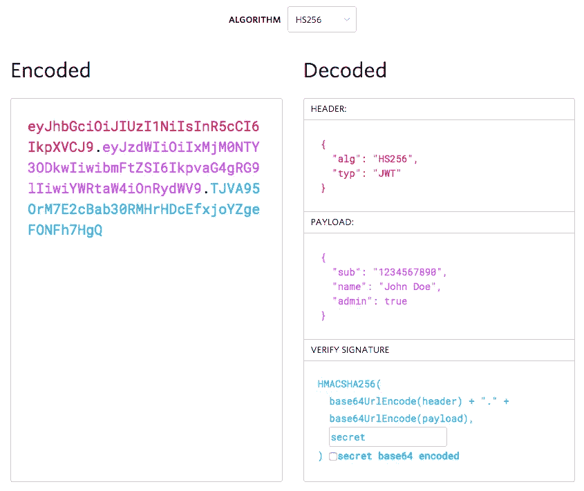
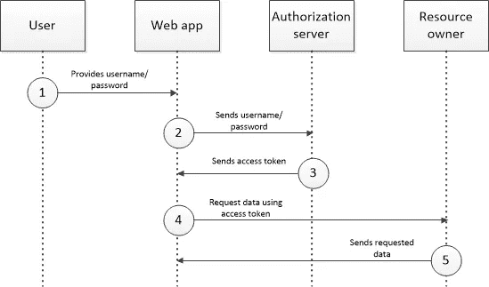

# 使用 OAuth 风格的授权公开外部系统 REST 服务

> 原文：<https://itnext.io/exposing-an-outsystems-rest-service-with-an-oauth-style-authorization-fded258cbe14?source=collection_archive---------6----------------------->

*这是一篇关于用* [*OutSystems 平台*](https://www.outsystems.com/) *开发的文章。如果您还没有使用 OutSystems 进行开发，您应该:)。*

# 前言

当使用 OutSystems 平台(此后简称为“OutSystems”)公开 REST 服务时，没有开箱即用的安全性:任何有权访问端点的人都可以调用该服务。OutSystems 允许为基本认证设置用户名和密码，但这是全局的，即每个调用 REST 服务的人都必须使用该用户名和密码。显然，这不够灵活和安全，所以我怀疑这个选项是否经常使用，除了可能在应用程序之间内部使用。

任何将被多个用户(或应用程序)使用的现代 REST 服务都必须具有按用户认证，以便调用的 REST 方法可以验证用户是有效用户(否则通过返回 [403](https://developer.mozilla.org/en-US/docs/Web/HTTP/Status/403) 拒绝访问)，并根据用户的权限返回结果(或允许更新)。

认证的现代行业标准是 [OAuth 2.0](https://oauth.net/2/) ，如 [RFC 6749](https://datatracker.ietf.org/doc/html/rfc6749) 中所述。这个标准描述了认证和授权的流程，涉及一个*资源所有者*(公开 REST 方法的那个)和一个*授权服务器*(提供授权的那个)。像所有现代行业标准一样，它相当复杂，但基本要点是资源所有者检查您的凭证，如果正确，提供一个*授权许可*，它可以与授权服务器一起使用，为您提供一个*访问令牌*。然后，当您对资源所有者进行后续调用时(即，当调用 REST 方法来检索或存储信息时)，访问令牌被用作授权的证明。

当我在寻找一种方法来适当地保护我们的客户门户和我们的后端服务器之间的 REST 服务时(最初它是基于仅仅在头中交换用户名/密码)，我查看了 OAuth 2.0，但是发现它太复杂而不能完全实现。然而，它的基本前提吸引了我，所以我开始自己实现类似的东西，而不完全遵循 OAuth 2.0，如上述 RFC 中所描述的。

# JSON Web 令牌

OAuth 2.0 [描述了所谓的*承载令牌*的使用](https://datatracker.ietf.org/doc/html/rfc6750)，这是向资源所有者提供上述接入令牌的技术方式。然而，OAuth 2.0 没有描述接入/承载令牌的确切格式。接下来是 JSON Web 令牌，简称 JWT。JWT 是访问令牌的一种格式(在 [RFC 7519](https://datatracker.ietf.org/doc/html/rfc7519) 中定义)，但是它提供了许多方便的功能。它是:

*   自包含:资源提供者检查令牌有效性所需的所有信息都嵌入在令牌本身中；
*   安全:令牌用授权服务器的证书签名。它可以用公钥解密(这样任何有权访问 JWT 的人都可以阅读它的内容)，但不能用中间人攻击来调节，因为它不能再次加密。


JWT 标志。这一次，一个没有谷歌颜色的标志(我正看着你，Slack)。

一个 JWT 包含三个不同的部分:一个*报头*、一个*有效载荷*和一个*签名*。顾名思义，信息是使用 JSON 存储的。完整的 JWT 有三个 Base64 编码的部分，每个部分由一个点(“.”分隔).

**头**是一个所谓的 JOSE 头(JSON 对象签名和加密，在 [RFC 7515](https://datatracker.ietf.org/doc/html/rfc7515) 中定义),包含关于所使用的签名和加密的信息。它具有以下属性:

*   `typ` —“媒体类型”，总是`JWT`；
*   `alg` —使用的加密算法。可以是`RS256`，是带 SHA-256 的 RSA 数字签名算法(非对称)，也可以是`HS256`，是 HMAC·SHA-256(对称)。RS256 是 API 的必由之路，因为你不想与任何使用你的 API 的人共享一个秘密的加密密钥；
*   `kid` —密钥标识符，一个可选属性，指示加密使用什么密钥。它没有预定义的结构。我使用这个属性来存储证书的指纹，这样我就可以验证是否使用了正确的证书来创建它。我后来了解到,`x5t`属性正是为此而提供的，但是我没有费事去改变它。

可能有更多的属性，但这是我使用的三个。

**有效载荷**是最有趣的部分。它包含所谓的*声明*，这些声明(我引用 jwt.io)是“关于一个实体(通常是用户)和附加数据的声明”。索赔有三种类型:

*   注册声明—可选的预定义声明，如发布者、到期时间、主题和受众(见下文)；
*   公共声明——应来自[预定义列表](https://www.iana.org/assignments/jwt/jwt.xhtml)或被定义为 URI 的声明。我没有使用任何公开声明；
*   私有声明—交换数据的双方同意的任何自定义声明。我没有使用任何私人声明。

我只使用注册声明，因为我不需要任何其他声明。我用的是:

*   `iss` —签发人，签发方的名称。这可能是你的公司名称，或应用程序的名称等。我使用了公司名称和应用程序的组合；
*   `sub` —主题，标识其他声明所涉及的资源。通常这是一个用户标识符。在我的例子中，我使用了公司 Id 和用户 Id 的组合，因为我可以在 JWT 的验证中使用这些值；
*   `aud` —受众，确定 JWT 的接受者，如你所针对的 REST 服务或应用。在我的例子中，我使用应用程序代码和我公司的域名组成了一个伪 URL，但任何事情都可以；
*   `exp` —过期时间，令牌过期的 UTC 日期/时间，指定为自 1970–01–01 00:00:00(UNIX 纪元)以来的秒数。过了这个时间，令牌不再有效，必须被拒绝。由于该平台不能很好地处理 UTC(至少在服务器端不能)，我只选择了本地时间，因为我不需要跨越时区；
*   `iat` —颁发于，颁发令牌的 UTC 日期/时间，指定为自 1970–01–01 00:00:00 以来的秒数。我再次编码了本地时间，而不是 UTC。

您可能会放弃其中的一些声明，但是我发现它们对于验证令牌很有用，并且可以确保我的单个令牌提供者可以用于多个应用程序，而不是一个令牌对所有应用程序都有效。此外，出于安全原因，最好使用只在有限时间内有效的令牌。

JWT 的最后一部分是签名。签名采用前两部分，用分隔点进行 Base64 编码，并使用加密算法对结果字符串进行加密。加密的结果也是 Base64 编码的，并添加到前两部分，同样使用点作为分隔符。



JWT 及其零件的示例(来自 [jwt.io)](https://jwt.io/introduction) 。

# 认证流程

如上所述，认证涉及三方:*用户*(可能是 app)*资源所有者*和*授权服务器*。首先，用户需要通过提供用户名和密码来登录。这些被发送到验证用户名和密码的授权服务器，并返回一个*授权许可*，或者更常见的称为*访问令牌*，在我们的例子中是一个 JWT。每次调用资源所有者时，都会发送访问令牌，但不会发送用户名/密码。资源所有者负责验证访问令牌，如果有效，则执行所请求的任何动作(例如，数据更新或检索)。

以下流程图显示了该程序(模仿 auth0.com 的[程序):](https://auth0.com/docs/authorization/flows/resource-owner-password-flow)



可视化表示的身份验证流程

1.  用户在登录屏幕上键入他们的用户名/密码；
2.  web 应用将用户名/密码发送到授权服务器；
3.  授权服务器验证用户名/密码，如果有效，则发送访问令牌；
4.  web 应用程序向资源所有者请求数据，同时发送访问令牌进行授权；
5.  资源所有者验证访问令牌，如果有效，则发送数据。

# 实施 JWT

至少有一个[JWT 组件](https://www.outsystems.com/forge/component-overview/1853/jwt)在酝酿中，但是它似乎倾向于消费外部服务，而不是自己提供授权服务。因此，我决定从头开始写一切。

首先，我创建了一个用于验证 JWT 的扩展。该扩展具有以下功能:

*   CertificateGet —根据证书主题、存储名称和存储位置从 Windows 证书存储中检索证书，并返回证书(作为对象)、主题的全名和证书的指纹。
*   JwtCreate —基于 JOSE 标头、JWT 声明和证书创建 JWT。它通过对标头和声明进行 Base64 编码，用证书加密结果，然后连接加密的部分(也是 Base64 编码的)来实现这一点。这里唯一棘手的部分是将输入分段，因为加密是在最大块大小上进行的。
*   JwtGetParts —检索和解码(从 Base64)JOSE 头和 JWT 声明，并返回它们(作为 JSON)。这也可以在使用 BinaryData 扩展的外部系统中完成，但是我发现在扩展中更容易做到。
*   JwtVerify —通过用提供的证书描述签名并将其与标头和声明进行比较，来验证给定输入是否为有效的 JWT。

接下来，我创建了一个包含授权服务器和资源所有者使用的实际操作的模块。这些行动是:

*   JsonWebTokenGet —由授权服务器使用，它根据提供的 JOSE 头、JWT 声明和证书返回一个 JWT。到期时间戳也是一个输入参数；如果提供了 JWT 声明的到期时间值(即自 1970 年 1 月 1 日起的秒数),则该操作会计算该值(否则，它会假定已经设置了到期时间)。它使用扩展中的 CertificateGet 和 JwtCreate 操作。
*   JsonWebTokenVerify —由资源所有者使用，它通过从扩展调用 CertificateGet、JwtGetParts 和 JwtVerify 来验证 JWT，并输出 JOSE 头和 JWT 声明。

# 实现授权服务器

实现授权服务器相当简单。我用 TokenGet POST 方法(相对路径/认证)公开了一个 REST 服务。它具有以下参数:

*   Authorization —应该设置为有效的基本身份验证字符串的标头参数。
*   应用程序—因为我们对多个应用程序使用同一个授权服务器，所以应用程序代码用于避免令牌允许访问所有应用程序。它是 HTTP 头中编码为 X-Application 的头参数。

如果用户名和密码对于给定的应用程序有效，则返回一个 JWT。下列索赔包含在 JWT 索赔中:

*   issuer——标识我们的后端服务器的固定字符串；
*   受众——标识应用程序的代码；
*   主题——如上所述，公司 Id 和用户 Id 的组合；
*   到期时间——用固定的持续时间计算(通过站点属性配置),因为我们不需要动态持续时间；
*   颁发时间—颁发令牌的时间。

# 发送令牌

当用户登录我们的客户门户时，用户名和密码会发送到身份验证服务器，如上所述。当访问令牌被返回时，它被存储在一个会话变量中(我们的客户门户仍然使用传统的 web，因为它已经存在了几年)。处理登录的模块公开了一个从该会话变量返回令牌的操作。

当客户门户需要从后端服务器请求数据时，它使用载体认证。与基本身份验证一样，它使用授权头参数，但不是“基本”，而是“载体”一词，后跟一个空格和 JWT。我们决定将 Authorization 头参数添加到所有方法中，尽管回想起来，我们可能已经在 On Before 请求中将它添加到了头中。

# 令牌验证

当后端接收到来自客户门户的请求时，它首先通过调用前面提到的 JsonWebTokenVerify 操作来验证 JWT。然后，它对令牌中包含的数据执行有效性检查，方法是验证:

*   颁发者声明—颁发者必须等于授权服务器颁发的颁发者；
*   受众声明—应用程序必须等同于处理请求的应用程序；
*   主题声明—客户 Id 和用户 Id 必须有效，并且用户必须能够访问公司的数据；
*   过期时间—如果令牌过期，则请求为 denied⁴.

如果一切正常，后端将返回请求的数据。

# 包装它

尽管 OAuth 和 JWT 是复杂的主题，但是我已经使用 JWTs 通过 OAuth 风格的身份验证方案成功地保护了我们的客户门户通信。我希望它能启发您在公开自己的 REST 服务时使用类似的认证。

# 密码在哪里？

我故意不把我写的任何代码放进熔炉，有两个原因:

1.  我最初计划将一些代码与现有的 JWT 库集成在一起(最终没有成功)；
2.  我的代码是面向我们的客户门户的，Forge 组件需要一个更灵活的解决方案，例如关于所做的检查。

然而，由于扩展是最难编写的代码，我将在这里分享一些我编写的 C#代码。

## 从证书存储中检索证书

不是 JWT 特有的，但很有用:

```
public void MssCertificateGet(string ssSubjectNamePart, string ssStoreName, string ssStoreLocation, out bool ssIsFound, out object ssCertificate, out string ssSubjectNameFull, out string ssThumbprint)
        {
            ssIsFound = false;
            ssCertificate = null;
            ssSubjectNameFull = "";
            ssThumbprint = "";var storeName = ssStoreName.Equals("M") ? StoreName.My : StoreName.TrustedPeople;
            var storeLocation = ssStoreLocation.Equals("C") ? StoreLocation.CurrentUser : StoreLocation.LocalMachine;X509Store store = new X509Store(storeName, storeLocation);
            store.Open(OpenFlags.ReadOnly | OpenFlags.OpenExistingOnly);X509Certificate2Collection collection = store.Certificates.Find(X509FindType.FindBySubjectName, ssSubjectNamePart, true);if (collection.Count == 1)
            {
                ssIsFound = true;
                ssCertificate = collection[0];
                ssSubjectNameFull = collection[0].Subject;
                ssThumbprint = collection[0].Thumbprint;
            }
        } // MssCertificateGet
```

## 创造一个 JWT

```
public void MssJwtCreate(string ssJoseHeader, string ssJwtClaims, object ssCertificate, out string ssJwt)
        {
            var cryptoProvider = ((X509Certificate2)ssCertificate).PrivateKey as RSACryptoServiceProvider;
            if (cryptoProvider == null)
            {
                throw new Exception("Cannot access private key");
            }AsymmetricCipherKeyPair kp = DotNetUtilities.GetKeyPair(cryptoProvider);var encryptEngine = new Pkcs1Encoding(new RsaEngine());
            encryptEngine.Init(true, (RsaKeyParameters)kp.Private);string textToEncrypt = Base64UrlEncoder.Encode(ssJoseHeader) + "." + Base64UrlEncoder.Encode(ssJwtClaims);
            byte[] bytesToEncrypt = new UTF8Encoding().GetBytes(textToEncrypt);var blockSize = encryptEngine.GetInputBlockSize();List<byte> output = new List<byte>();for (int i = 0; i < bytesToEncrypt.Length; i += blockSize)
            {
                var size = 
                    bytesToEncrypt.Length < blockSize ? bytesToEncrypt.Length :
                    i + blockSize > bytesToEncrypt.Length ? bytesToEncrypt.Length - i :
                    blockSize;output.AddRange(encryptEngine.ProcessBlock(bytesToEncrypt, i, size));
            }

            ssJwt = textToEncrypt + "." + Base64UrlEncoder.Encode(output.ToArray());
  } // MssJwtCreate
```

## 验证 JWT

```
public void MssJwtVerify(string ssJwt, object ssCertificate, out string ssJoseHeader, out string ssJwtClaims, out bool ssIsVerified)
        {
            string[] parts = ssJwt.Split('.');
            if (parts.Length != 3)
            {
                throw new Exception("Invalid JWT: doesn't contain three parts");
            }ssJoseHeader = Base64UrlEncoder.Decode(parts[0]);
            ssJwtClaims = Base64UrlEncoder.Decode(parts[1]);var c = DotNetUtilities.FromX509Certificate((X509Certificate)ssCertificate);var encryptEngine = new Pkcs1Encoding(new RsaEngine());
            encryptEngine.Init(false, (RsaKeyParameters)c.GetPublicKey());var blockSize = encryptEngine.GetInputBlockSize();byte[] bytesToDecrypt = Base64UrlEncoder.DecodeBytes(parts[2]);
            string output = "";UTF8Encoding ue = new UTF8Encoding();for (int i = 0; i < bytesToDecrypt.Length; i += blockSize)
            {
                var size =
                    bytesToDecrypt.Length < blockSize ? bytesToDecrypt.Length :
                    i + blockSize > bytesToDecrypt.Length ? bytesToDecrypt.Length - i :
                    blockSize;output += ue.GetString(encryptEngine.ProcessBlock(bytesToDecrypt, i, size));
            }ssIsVerified = output.Equals(parts[0] + "." + parts[1]);} // MssJwtVerify
```

定义了更多的算法，但这些算法是目前最常用的。

我们在本地安装了该平台，可以访问运行该平台的 Windows 服务器。因此，我们将证书存储在 Windows 证书存储中。当然，这是不可取的，例如，当您有云基础架构时，有其他方法来提供证书。

一个[基本认证](https://en.wikipedia.org/wiki/Basic_access_authentication)字符串以单词“basic”开头，后面是一个空格，再后面是一个 Base64 编码的用户名和密码字符串，并以冒号(“:”)作为分隔符。如果您允许在用户名和/或密码中使用冒号，您将需要以某种方式对它们进行编码，否则您将无法安全地确定分隔符在哪里。我使用了反斜杠(" \ ")来转义冒号。

⁴Note:目前，我们还没有为过期的代币做准备。理想情况下，当令牌过期时，客户门户会自动请求新令牌，然后重试它发出的呼叫。但是不幸的是，除了为每一个被调用的方法实现这样的功能，使用外部系统是不容易做到的。