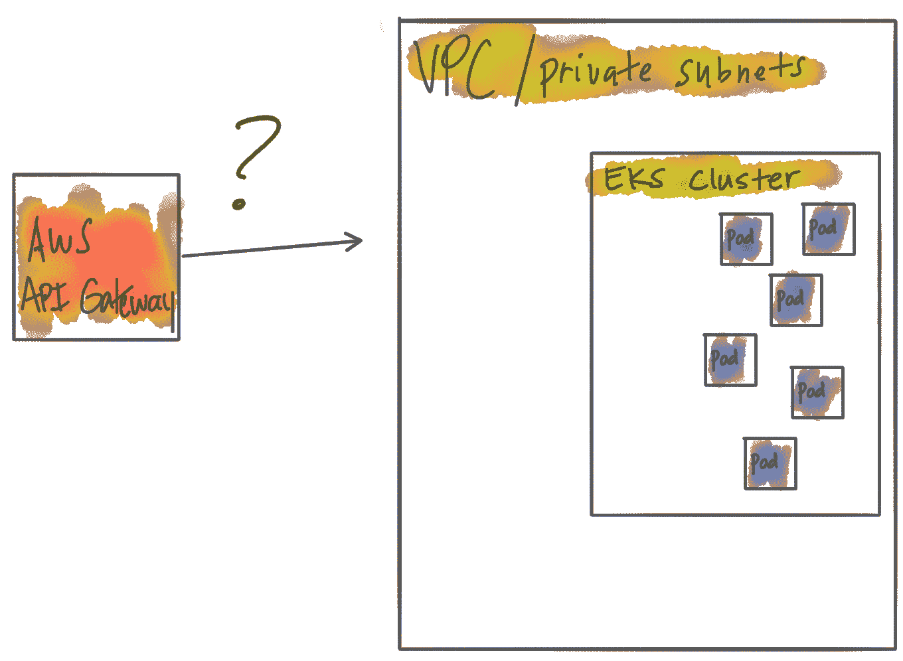
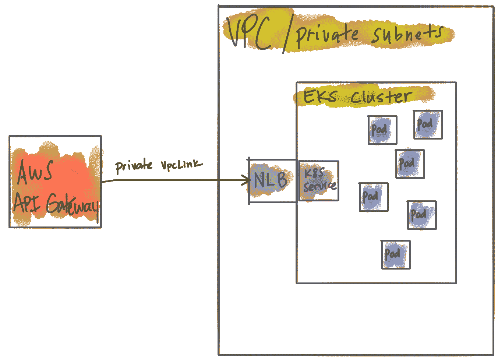
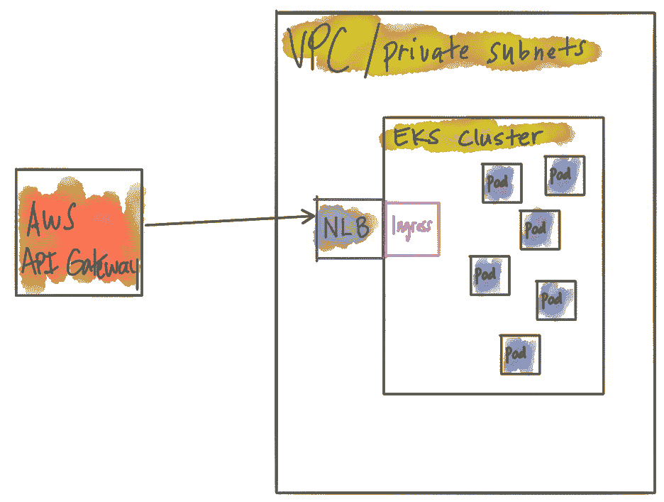
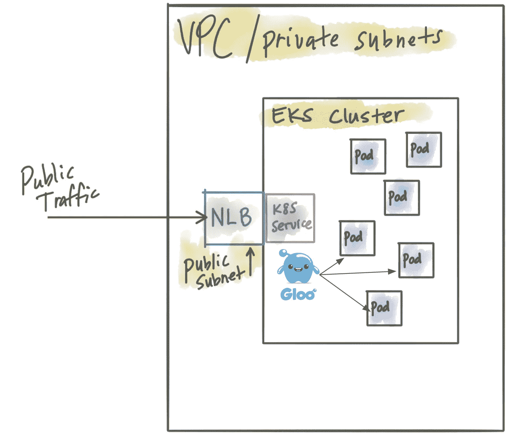
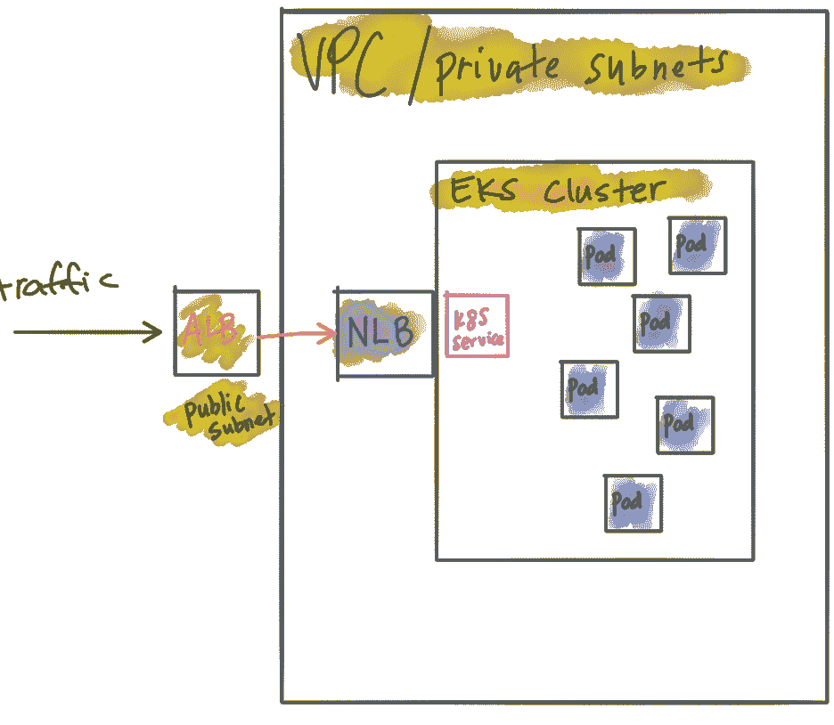
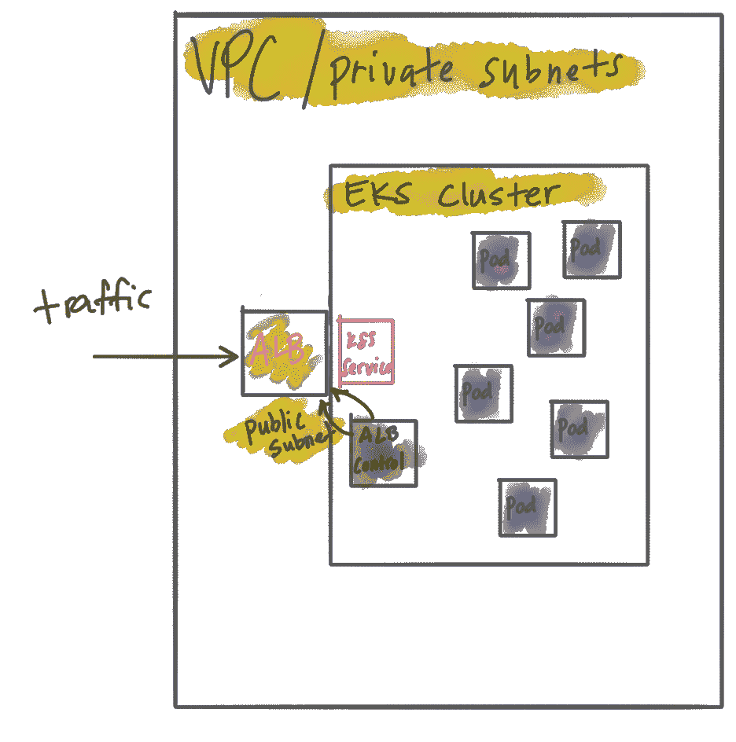

# 通过微服务/API 网关公开在 AWS EKS 中运行的微服务

> 原文：<https://itnext.io/exposing-microservices-running-in-aws-eks-with-a-microservices-api-gateway-5753f068e26c?source=collection_archive---------5----------------------->

所以您决定在 AWS 中运行 Kubernetes 工作负载。[正如我们之前看到的](https://medium.com/solo-io/easy-aws-eks-cluster-provisioning-and-user-access-5e3cdc01dfc6)建立 [AWS EKS](https://docs.aws.amazon.com/eks/latest/userguide/getting-started.html) 需要很多耐心和麻烦。你也许能让它工作。对于其他人，您应该查看来自 Weaveworks 的`eksctl` [工具。](https://github.com/weaveworks/eksctl)

现在您已经有了一个 Kubernetes 集群，您希望开始向它部署您的微服务，并开始向您的客户端和组织的其他部分公开和集成 API 和服务。在 [Solo.io](https://www.solo.io/) 我们已经[开源了一个微服务网关](https://medium.com/solo-io/announcing-gloo-the-function-gateway-3f0860ef6600)构建在[特使代理](https://www.envoyproxy.io/)之上，名为 [Gloo](https://github.com/solo-io/gloo) 。 [Gloo](https://github.com/solo-io/gloo) 是一个平台不可知的控制平面，专为理解“函数”级调用(考虑 HTTP 路径/方法/头、gRPC 调用或 Lambda 函数的组合)而构建，目的是组合它们并为南北和东西流量构建更丰富的 API。Gloo 是像 Istio 这样的服务网格技术的高度补充。


微服务的功能网关

Gloo 的功能包括:

*   函数路由(HTTP/1、HTTP/2、gRPC 函数、Lambda/Cloud 函数)
*   细粒度的流量转移(功能金丝雀、功能加权路由等)
*   请求/内容转换(隐式和显式)
*   授权/认证
*   限速
*   gRPC
*   WebSockets
*   肥皂/ WSDL
*   深度指标收集
*   聚合数据 API 的 GraphQL 引擎
*   强大的平台无关的发现机制

Gloo 拥有非常深厚的 Kubernetes 原生支持，可以作为您的 Kubernetes 集群的集群入口运行。顺便提一下，对于入口、API 网关、API 管理(甚至服务网格)的一些急需的澄清，看看博客文章“ [API 网关正在经历一场身份危机](https://medium.com/solo-io/api-gateways-are-going-through-an-identity-crisis-d1d833a313d7)

在帮助人们在 AWS EKS 使用 Gloo 的过程中，我们不得不在选择和公开运行在 Kubernetes 中的服务的相当复杂的选择中导航。这些选项对于其他 Kuberentes 是相同的——本地入口、API 或函数网关。由于 AWS EKS 是 Kubernetes，我们可以通过以下方式公开类似 Gloo 的微服务/API 网关:

*   一个 Kubernetes [入口资源](https://kubernetes.io/docs/concepts/services-networking/ingress/)
*   带有负载平衡器类型的 Kubernetes [服务](https://kubernetes.io/docs/concepts/services-networking/service/#loadbalancer)
*   Kubernetes [服务作为节点端口](https://kubernetes.io/docs/concepts/services-networking/service/#nodeport)(不推荐用于生产)

在 Gloo 上，我们也在致力于[原生 OpenShift 支持](https://docs.openshift.com/container-platform/3.9/install_config/router/index.html)，应该很快就会有了。

与此同时，如果您在 AWS EKS 上运行工作负载，您可能会有一些关于如何利用微服务网关的问题，或者您是否应该只使用 AWS 管理的 [AWS API 网关](https://aws.amazon.com/api-gateway/)？

让我们在这里探讨一下这些选项。

AWS EKS 实际上是 Kubernetes 的托管控制平面，您自己运行您的工作节点。典型的设置是让您的工作节点(EC2 主机)位于专用 VPC 中，并使用所有内置的 VPC 隔离、安全组、IAM 策略等。一旦您开始将工作负载/微服务部署到您的 Kubernetes 集群，您可能希望公开它们和/或向您的客户/顾客/合作伙伴等提供一个良好解耦的 API。你的第一个问题可能是“嗯，既然我在使用 AWS，在我的 Kubernetes 集群前面使用 [AWS API 网关](https://aws.amazon.com/api-gateway/)应该非常容易”。



随着您开始深入研究，您会意识到将 AWS API 网关连接到您的 EKS 集群并不是那么简单。你会发现 AWS API Gateway 在它自己的 VPC 中运行，并且是完全托管的，所以你看不到它的基础设施的任何细节。幸运的是，有了 AWS API Gateway，您*可以*进行[“私有集成”来连接到在您自己的 VPC](https://docs.aws.amazon.com/apigateway/latest/developerguide/set-up-private-integration.html) 中运行的 HTTP 端点。


私有集成允许您在您的私有 VPC 中公开一个[网络负载平衡器(NLB)](https://docs.aws.amazon.com/elasticloadbalancing/latest/network/introduction.html) ，它可以终止您的 API 网关到 VPC 集成的流量。所以基本上 AWS API 网关会创建一个 [VpcLink](https://docs.aws.amazon.com/apigateway/api-reference/resource/vpc-link/) 到运行在你的 VPC 中的 [NLB。](https://aws.amazon.com/about-aws/whats-new/2017/11/amazon-api-gateway-supports-endpoint-integrations-with-private-vpcs/)

所以那太好了！网络负载平衡器是一个[非常强大的负载平衡器](https://docs.aws.amazon.com/elasticloadbalancing/latest/network/introduction.html)，但是即使它在您的 VPC 中运行，它也不知道或理解在您的 Kubernetes 集群(即 Kubernetes Pods)中运行的工作负载。让我们改变这一点。此时，我们需要部署某种类型的 [Kubernetes Ingress](https://kubernetes.io/docs/concepts/services-networking/ingress/#ingress-controllers) 端点，它知道如何路由到 pod。在这一点上，有些人可能倾向于使用原生的 Kubernetes 入口资源，或者您真的可以只使用一个公开为“负载平衡器”的 Kubernetes 服务。事实上，我们可以更进一步。当您在 EKS 的 Kubernetes 服务中指定*负载平衡器*时，创建的默认负载平衡器是一个[经典负载平衡器](https://docs.aws.amazon.com/elasticloadbalancing/latest/classic/introduction.html)。这样做的问题是 API 网关不能路由到传统的负载平衡器。我们需要在 EKS 内部运行的 Kubernetes 服务来创建一个网络负载平衡器。例如，此配置将创建一个经典的负载平衡器:

```
apiVersion: v1
kind: Service
metadata:
 name: gloo
 namespace: default
 annotations: {}
spec:
 ports:
 - name: http
 port: 80
 protocol: TCP
 targetPort: 80
 selector:
 app: gloo
type: LoadBalancer
```

当我们在 EKS 创建这个服务时，添加注释`[service.beta.kubernetes.io/aws-load-balancer-type](http://service.beta.kubernetes.io/aws-load-balancer-type): "nlb"`将导致 AWS 创建一个网络负载平衡器:

```
apiVersion: v1
kind: Service
metadata:
 name: gloo
 namespace: default
 labels:
 app: gloo
 annotations:
 [service.beta.kubernetes.io/aws-load-balancer-type](http://service.beta.kubernetes.io/aws-load-balancer-type): "nlb"
spec:
 externalTrafficPolicy: Local
 ports:
 - name: http
 port: 80
 protocol: TCP
 targetPort: 80
 selector:
 app: gloo
type: LoadBalancer
```

至此，我们已经正确配置了负载平衡器(私有 VPC 中的 NLB)和 AWS API 网关的正确组合。我们甚至可以在 AWS API 网关上启用 [AWS web 应用防火墙(WAF)](https://docs.aws.amazon.com/waf/latest/developerguide/how-aws-waf-works.html) 。唯一的问题是，我们在边缘拥有 AWS API 网关的能力(和成本)，但它仍然不理解我们在 Kubernetes 集群中运行的工作负载。



当我们想做 canary 发布、API 聚合、函数路由和内容转换之类的事情时，我们需要在 Kubernetes 集群中完成。Gloo 解决了这个问题。那么你真的需要 API 网关-> NLB -> API 网关吗？在这种情况下，您可以将您的网络负载平衡器提升到一个公共子网，让 Gloo 处理所有的 API 网关路由、流量整形、速率限制，而不会失去 AWS API 网关的任何功能(Lambda 路由、AuthZ/N、Websockets 等)。


我们在上一节开始时假设，在使用 EKS 时，AWS API 网关比其他解决方案更容易与我们的 Kubernetes 集群集成。我们发现事实并非如此。然而，我们还有其他选择。如果你使用 EKS，你将需要某种 API 网关或者微服务网关[，在 Kubernetes](https://kubernetes.io/docs/concepts/services-networking/ingress/#ingress-controllers) 中运行。但是我们如何让流量到达我们的 EKS 集群呢？如果我们想利用 AWS Web 应用防火墙(WAF)之类的东西呢？

鉴于各种类型的负载平衡器和在 AWS EKS 运行微服务/API 网关的权衡，我们的选择可归结为以下几点:



这与上一节类似，但是您没有使用 Gloo 这样强大的微服务网关，而是选择在 Kubernetes 中使用基本的入口控制器。在这种情况下，您可以利用 AWS API Gateay，拥有像 AWS Web 应用程序防火墙这样的好东西，但是您失去了在 EKS (pods)中运行的工作负载的保真度


这是上一节的用例。现在，您已经获得了更接近 EKS 工作负载的微服务网关的强大功能，但您的优势是一个冗余且昂贵的网关。这里的好处是您仍然可以利用 AWS web 应用程序防火墙(WAF)。



在这种情况下，我们避开了 AWS API 网关，只使用位于公共子网中的网络负载平衡器。微服务/API 网关的所有功能现在都位于您在 EKS 的工作负载附近，但您失去了 web 应用防火墙(不能应用于 NLB)。如果您有自己正在使用 WAF，这可能是一个不错的权衡。



您可以使用应用程序负载平衡器(可以应用 AWS WAF)更好地控制面向公众的网络请求，同时仍然保持您的 EKS 流量私有，并通过私有 NLB 进行控制。使用这种方法，您还可以通过 CloudFormation 集中管理您的所有 TLS 证书



您可以使用带有应用程序负载平衡器的第三方插件 [Kubernetes Ingress 来管理您在 Kubernetes 中的 ALB。此时，您可以在 EKS 集群中本地和私有地运行 API Gateweay，并且仍然可以利用 WAF，因为我们使用的是 ALB。缺点是这个功能是由一个第三方插件提供的，而且](https://aws.amazon.com/blogs/opensource/kubernetes-ingress-aws-alb-ingress-controller/)[你不能通过云形式集中管理你的证书](https://www.sentialabs.io/2018/10/21/Integrating-EKS-with-other-AWS-services.html#fifth-challenge-deploying-api-gateway-in-front-of-eks)。也就是说，你必须使用[入口注释来管理那些](https://kubernetes-sigs.github.io/aws-alb-ingress-controller/guide/ingress/annotation/#ssl)。

在 AWS EKS 有几个运行微服务/API 网关的选项。每种组合都有利弊，应该仔细考虑。我们专门构建了 [Gloo](https://github.com/solo-io/gloo) 作为一个强大的跨平台、跨云微服务 API 网关。这意味着在 AWS、内部或任何其他云上运行时，您有更多的选择。每个组织都有自己独特的约束、观点和选择。我们相信，有一些很好的选择可以让整体微服务器或内部混合部署到公共云获得成功。如果您对此用例有其他建议，[请在 twitter 上联系我@ Christian posta](http://www.twitter.com/christianposta)或在本博客的评论中。

*原载于 2019 年 2 月 8 日 medium.com*[](https://medium.com/solo-io/exposing-microservices-running-in-aws-eks-with-a-microservices-api-gateway-like-solo-gloo-263651e309f8)**。**