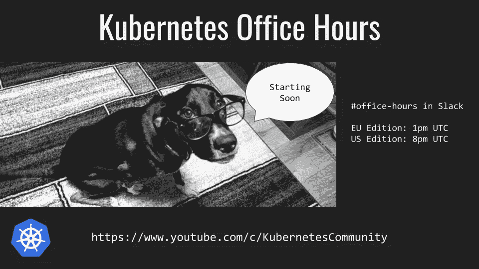

# 在 Kubernetes 中公开状态集

> 原文：<https://itnext.io/exposing-statefulsets-in-kubernetes-698730fb92a1?source=collection_archive---------0----------------------->



杰弗里·西卡

到目前为止，我们在 Kubernetes 每月的[办公时间](https://github.com/kubernetes/community/blob/master/events/office-hours.md)中收到的最常见的问题之一是:*“你如何恰当地对外公开一组声明？”*通常这个问题以这样的形式提出:*“我如何允许从集群外部连接到 Mongo 或 Postgres 的特定实例？”*

不要害怕！这并不像看起来那么有挑战性。如果你喜欢 TL；博士回答，直接跳到本帖底部就可以了。如果你想要更多的解释，请继续阅读。

当您想要直接查询一个特定的实例时，按照常规的做法，让一个服务点指向应用程序的所有实例是行不通的。这已经由您在 StatefulSet 旁边创建的 [Headless 服务](https://kubernetes.io/docs/concepts/services-networking/service/#headless-services)在内部处理了。创建的服务将**而不是**被赋予一个`clusterIP`，而是简单地包含一个`Endpoints`列表。然后，这些`Endpoints`被用来以`<StatefulSet>-<Ordinal>.<Service>.<Namespace>.svc.cluster.local`的形式生成特定于实例的 DNS 记录，例如`app-0.myapp.default.svc.cluster.local`。

现在，当您想将它作为`LoadBalancer`服务对外公开时，如何复制它呢？Kubernetes 的开发者已经想到了这一点。；)StatefulSet 中的每个 Pod 都有自己的标签，其中包括其[生成的 Pod 标识](https://kubernetes.io/docs/concepts/workloads/controllers/statefulset/#pod-identity) : `statefulset.kubernetes.io/pod-name`。你知道这意味着什么吗？这意味着我们可以在服务选择器中使用它！

```
apiVersion: v1
kind: Service
metadata:
  name: app-0
spec:
  type: LoadBalancer
  **selector:**
    **statefulset.kubernetes.io/pod-name: app-0**
  ports:
  - protocol: TCP
    port: 80
    targetPort: 80
```

虽然 headless 服务可能无法满足我们的所有需求，但是我们可以创建额外的服务，指向 StatefulSet 的各个 pod。一般来说，如果没有仔细的计划，StatefulSets 是不会被放大或缩小的，所以值得花费少量的额外努力来创建一些额外的服务。

这样，我们将能够单独公开我们的实例，但是我们实际上可以在这一点上有所改进。

当一个外部 Kubernetes 服务(`NodePort`和`LoadBalancer`)被创建时，它将在集群中的**所有**节点上打开一个端口，该端口可用于到达我们公开的服务。一般来说，当您将流量分散到同一个 Pod 的多个实例中时，这很好，但是当您希望将流量定向到单个实例时，这就不太好了。如果我们能够将流量直接导向运行 StatefulSet 的特定实例的节点，那就更好了。谢天谢地，开发人员也想到了这个场景！

通过将服务属性`[externalTrafficPolicy](https://kubernetes.io/docs/tutorials/services/source-ip/#source-ip-for-services-with-type-loadbalancer)` [设置为](https://kubernetes.io/docs/tutorials/services/source-ip/#source-ip-for-services-with-type-loadbalancer) `[Local](https://kubernetes.io/docs/tutorials/services/source-ip/#source-ip-for-services-with-type-loadbalancer)`，可以将流量直接路由到该节点。这将强制服务仅代理本地端点的流量。也就是说，群集中任何运行 Pod 特定实例的**而非**节点将**而非**代理流量，因此将无法通过任何外部健康检查。

```
apiVersion: v1
kind: Service
metadata:
  name: app-0
spec:
  type: LoadBalancer
  **externalTrafficPolicy: Local**
  selector:
    statefulset.kubernetes.io/pod-name: app-0
  ports:
  - protocol: TCP
    port: 80
    targetPort: 80
```

这可能看起来有点奇怪，但这是一个非常有用的通用方法，可以很好地与各种云提供商及其负载平衡器配合。通过不代理流量，节点将自动从该外部服务的负载平衡器池中移除，从而强制流量仅流向运行该特定实例的节点。

这样，您应该能够在外部公开 StatefulSets，并在将流量路由到单个实例时删除不必要的额外跃点。

# 奖金:

如果您不想为 StatefulSet 的每个 Pod 创建一个额外的服务，那么可以使用一个强大的集群自动化工具来实现自动化，这个工具叫做[元控制器](https://metacontroller.app/)。它允许您创建自己的简单控制器，您可以在其中触发附加的脚本或动作。他们的一个例子是使用他们的`[DecoratorController](https://github.com/GoogleCloudPlatform/metacontroller/tree/master/examples/service-per-pod)`为 StatefulSet 实例自动创建服务。

# TL；博士:

*   StatefulSet Pods 具有标签:`statefulset.kubernetes.io/pod-name`，其中包含它们生成的名称(`<StatefulSet Name>-<Ordinal>`)。您可以为每个使用该标签作为选择器的实例创建单独的服务，以公开 StatefulSet 的单独实例。
*   要删除潜在的额外跳，创建属性为`externalTrafficPolicy`的服务，并将其设置为`Local`。
*   你可以用一个漂亮的集群自动化工具[元控制器](https://metacontroller.app/)来自动化这个过程。