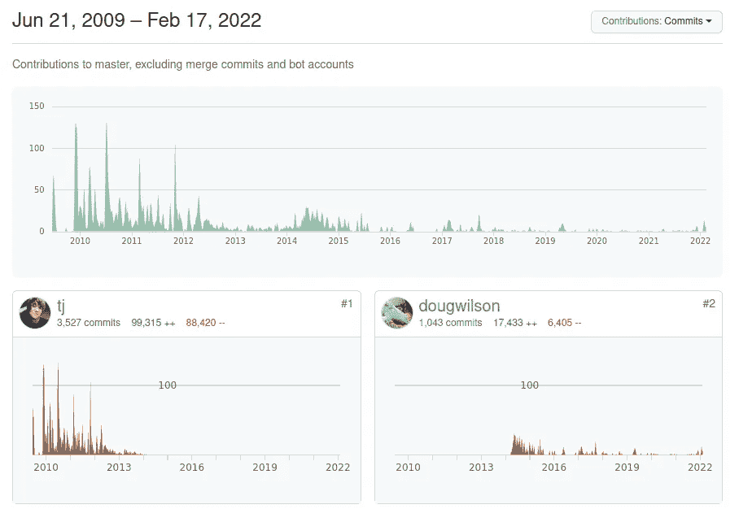

# Express 进入 Beta 1，证明项目仍然存在

> 原文：<https://itnext.io/express-enters-beta-1-proving-the-project-is-still-alive-64b86a5274a7?source=collection_archive---------2----------------------->

## 期待已久的 ExpressJS 更新已经进入测试版，允许我们最终使用异步路由处理函数


图片由作者在 Canva 的帮助下提供

**Express 是 Node.js 最受欢迎的 web 应用程序框架，尽管它的开发已经停滞多年。Express 存储库的工作非常缓慢，Express 5.x 版本已经承诺了多年；比如*5α1*在 2014 年 11 月发布。但是，如果你看看下面，在快速子项目中有重要的工作发生。**

2022 年 2 月 14 日，Express 团队(主要是 Doug Wilson)发布了版本 5.0.0-beta-1，发布到 npm/yarn 资源库，标记为*下一个*版本。这个标签是为了告诉我们这些想尝试下一个最好的 Express 版本的人应该尝试 5-beta-1 版本。

Express v5 承诺提供期待已久的对异步处理函数的支持，以及其他变化。

需要注意的是，在 5.0-beta-1 发布的同时，4.x 分支也开始有活动了。就在今天发布了 4.17.3，两个月前发布了 4.17.2。考虑到之前的 4.x 分支版本(4.17.1)是三年前的，而之前的 5.x 分支版本(5.0-alpha-8)是两年前的，这些版本一起是一个不错的改变。

根据其在`npmjs.com`上的页面，Express 包的下载流量持续/增长。每周下载量超过 2400 万次，并在稳步增长，4.17.2 (9，865，506 次下载)和 4.17.1 (12，526，431 次下载)的活跃度最高。

这个故事，即 Express 项目进展缓慢，但尽管如此仍被大量使用，证明了 Express 是多么坚实、可靠和有用。

快速浏览一下其他 web 框架的下载统计数据(如`npmjs.com`所报道的),显示 Express 的下载量是最接近的竞争对手的 5-10 倍。

关于状态—第 5 版何时完成— [参见拉取请求(已于 2014 年 7 月开始)](https://github.com/expressjs/express/pull/2237)。看起来没什么可做的了。这个拉动式发布在 2022 年 1 月下旬开始收到很多活动，看起来像是为发布做准备。如果你正在看的话，[Wesley Todd](https://github.com/expressjs/express/pull/2237#issuecomment-570058548)在 2020 年 1 月的一篇评论是对项目状态的恰当描述——项目团队很久以前就想完成 Express v5，但是没有人拿工资在 Express 上工作，他们都很忙。


[XKCD #2347 —(在知识共享协议下)](https://xkcd.com/2347/)

这一形象是千真万确的——有数百个关键的开源项目，它们获得的资金很少，是一个或几个人热爱的劳动，大公司将其用于获取巨额利润的应用程序。

为了更好地理解这意味着什么，从[快速知识库主分支的提交图](https://github.com/expressjs/express/graphs/contributors)开始



这表明“TJ”(TJ Holowaychuk)在 10 多年前开始了 Express，并做了大量工作，然后在 2014 年，他的贡献逐渐减少，而道格·威尔逊的贡献开始增加。但是，这也表明，在过去的几年中，除了最近似乎为 v5 版本做准备的一阵忙乱之外，总体贡献是最小的。

但是，这只是 Express 的表面情况。这里的图表是给*大师*分部的。例如， [5.0 分支](https://github.com/expressjs/express/commits/5.0)正在接收持续的活动。但是，等等，这还不是全部。

存储库只是 Express 项目的一部分。还涉及其他模块，这些模块正在接收持续的活动:`[express/body-parser](https://github.com/expressjs/body-parser/graphs/contributors)`、`[express/session](https://github.com/expressjs/session/graphs/contributors)`、`[express/serve-static](https://github.com/expressjs/serve-static/graphs/contributors)`、`[express/multer](https://github.com/expressjs/multer/graphs/contributors)`、`[express/cors](https://github.com/expressjs/cors/graphs/contributors)`、`[express/cookie-session](https://github.com/expressjs/cookie-session/graphs/contributors)`、`[express/cookie-parser](https://github.com/expressjs/cookie-parser/graphs/contributors)`、`[express/morgan](https://github.com/expressjs/morgan/graphs/contributors)`、`[express/serve-index](https://github.com/expressjs/serve-index/graphs/contributors)`、`[express/compression](https://github.com/expressjs/compression/graphs/contributors)`...等等...在某些情况下，Express 的某些部分源自 PillarJS 保护伞下的项目——参见[http://pillarjs.github.io/](http://pillarjs.github.io/)——这些项目存储库也正在接受持续的活动，其中许多由 Doug Wilson 维护。

换句话说，如果你只关注 Express 包的发布活动，那么 Express 项目看起来是停滞的。但是，这是一个更大的软件包生态系统，而不仅仅是 Express 项目，子项目正在受到持续的关注。

另一件需要注意的事情是 Doug Wilson 是大多数这些包的主要贡献者。如果道格·威尔逊不处理事情，快递会在哪里？鉴于其高人气，为什么没有更多的人为 Express 投稿？

# 快速 v5 入门

理论上,“Beta”标签意味着 Express v5 已经可以由 Express 团队之外的人进行测试了。产品开发中的“Alpha”或“Beta”阶段有一个传统的含义。也就是说，Alpha 版本主要面向项目团队和选定的合作伙伴组织，Beta 版本仍然用于测试，但是面向更广泛的人群。

因此，使用 Express 的 web 应用程序作者应该振作起来，用 Express v5 尝试他们的应用程序。

迁移指南中描述了如何尝试 Express V5:[https://expressjs.com/en/guide/migrating-5.html](https://expressjs.com/en/guide/migrating-5.html)

首先，将您的 Express 依赖项切换为使用`5.0.0-beta-1`，例如:

```
$ npm install express@>=5.0.0-beta.1 --save
```

然后，您运行您的测试并修复任何错误。

除了迁移指南，还有 API 文档:[https://expressjs.com/en/5x/api.html](https://expressjs.com/en/5x/api.html)

粗略地看一下，该 API 似乎与 Express v4 基本相同。但是，该网站明确表示 Express v5 文档是一项正在进行的工作。

有一个很大的变化似乎不会破坏兼容性，但给了我们一个非常需要的期待已久的功能。如果仔细观察 Express 5 pull 请求，有一个问题(已经解决)是所有处理程序都要支持承诺。这是在

[发布 2259](https://github.com/expressjs/express/issues/2259) 并通过`[pillarjs/router](https://github.com/pillarjs/router/)`库发布。这证明了 Express 上的重要工作正在`expressjs/express`库之外进行。

根据`pillarjs/router`上的文档(针对 2.0 分支)，中间件功能现在可以处理 Promise 的:

> *该函数可以选择返回一个 Promise 对象。如果从函数中返回一个 promise 对象，路由器将使用. then 附加一个 onRejected 回调。如果 Promise 被拒绝，将使用被拒绝的值调用 next，如果值为 falsy，则返回一个错误。*

这是一件大事，因为 Express 长期以来缺乏对`async` / `await`功能的支持。虽然我们可以使用这样的函数，但我们必须跳过额外的关卡。这种新行为消除了这些束缚。

这似乎意味着我们现在可以做出这种改变:

```
// OLD CODE
router.get('/error_route', async function (req, res, next) {
    try {
        // run some async code
    } catch (e) {
        next(e);
    }
});

// NEW CODE
router.get('/error_route', async function (req, res, next) {
    // run some async code
});
```

作为一个`async`函数，它返回一个触发这里描述的行为的承诺。这样，`router`对象将`.then(onRejected)`和`.catch(errorHandler)`附加到承诺上，巧妙地将任一条件传递给路由系统。这意味着我们的处理函数现在可以执行异步操作，以自然的方式抛出错误，并且 Express 路由器将自动处理状态，无论是错误还是成功。

# 关于作者

[***大卫·赫伦***](https://davidherron.com) *:大卫·赫伦是一名作家和软件工程师，专注于技术的明智使用。他对太阳能、风能和电动汽车等清洁能源技术特别感兴趣。David 在硅谷从事了近 30 年的软件工作，从电子邮件系统到视频流，再到 Java 编程语言，他已经出版了几本关于 Node.js 编程和电动汽车的书籍。*

*原载于*[*https://techsparx.com*](https://techsparx.com/nodejs/news/2022/express-5.html)*。*