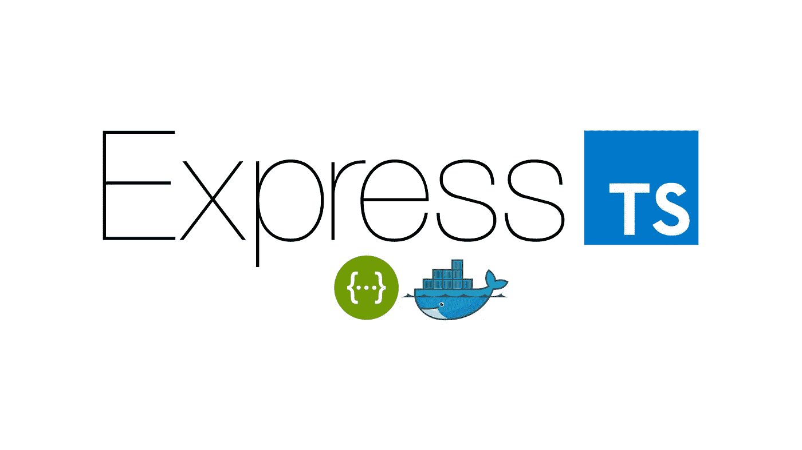

# 带有 TypeScript、Swagger UI 和 Docker 编写的 Express.js 后端

> 原文：<https://itnext.io/express-js-backend-with-typescript-swagger-ui-and-docker-compose-f77143860bc8?source=collection_archive---------0----------------------->

这是一个详尽的教程，用来创建一个简单的符合 OpenAPI 规范的后端应用程序。



# 创建简单的 Express.js 应用程序

*你可以从* [*这个资源库*](https://github.com/aerabi/simple-express) *下载 simple Express.js app 模板，直接跳转到下一节“添加 TSOA”。*

从一个空白项目开始。在项目的根目录下创建一个文件夹`src`，并在其中创建一个名为`main.ts`的文件。用下面的代码填充`main.ts`，这是 Express.js 的[标准 Hello World 代码](https://expressjs.com/en/starter/hello-world.html):

用节点包管理器安装`express`，编译代码，并运行它:

```
$ npm install express
$ npm install typescript
$ tsc src/main.ts
$ node src/main.js
```

## 结构化项目

如您所见，编译后的版本(`.js`文件)生成在与您的 TypeScript 文件相同的文件夹中。我们希望将源文件从编译的 JS 中分离出来。此外，我们希望更好地跟踪我们的第三方软件包。

对于后者，我们应该创建一个`package.json`文件，放在项目的根文件夹中。运行下面的命令就可以了，我们只需要回答相应的问题:

```
$ npm init
```

初始化软件包后，所有已安装的软件包将作为[生产]依赖项列出。以下命令将把`typescript`移动到开发依赖项中:

```
$ npm install typescript --save-dev
```

在我的例子中，产生的`package.json`文件如下所示:

现在，在`src`下创建一个 TypeScript 配置文件，即`tsconfig.json`，并填充以下内容:

使用下面的命令将编译`src`下的所有 TypeScript 文件，并将它们放在`dist`文件夹下。

```
$ tsc -p src
```

现在，要运行服务器，请执行以下操作:

```
$ node dist/main.js
```

在添加了定制的`package.json`脚本、TSLint 规则和`.gitignore`之后，项目看起来会像[这个](https://github.com/aerabi/simple-express)。

# 添加 TSOA

[**TSOA**](https://github.com/lukeautry/tsoa)(**T**type**S**script**O**pen**A**PI)是一款开源工具，用于生成兼容 OpenAPI 的 REST 端点和生成 Swagger 配置文件，以及用于 Express.js 等中间件的路由器

首先将包添加到我们的项目中:

```
$ npm install tsoa --save-dev
$ npm install @types/node --save-dev
```

## 创建控制器并生成路线

创建`src/controllers/index.controller.ts`并用以下代码填充它:

将`"experimentalDecorators": true`选项添加到`src/tsconfig.json`文件中，为 TypeScript 启用 decorators:

将配置文件`tsoa.json`添加到项目根目录:

生成路线并放入`src/routes`:

```
$ mkdir -p src/routes
$ tsoa routes
```

从生成的 routes 文件中导入`RegisterRoutes`,并通过向其传递 Express.js 应用程序来调用它:

现在，用户可以启动服务器并访问端点:

```
$ npm run server
```

端点的 URL 是`/api/v1/`和`/api/v1/msg/`:

```
$ curl localhost:3000/api/v1/
$ curl localhost:3000/api/v1/msg/
```

## 生成 Swagger 配置

创建文件夹`api/dist`并使用 TSOA 生成 Swagger 配置:

```
$ mkdir -p api && mkdir -p api/dist 
$ tsoa swagger
```

现在可以使用 Docker 启动 Swagger UI 了:

```
$ docker run -p 8080:8080 -v ${PWD}/api/dist:/swagger -e SWAGGER_JSON=/swagger/swagger.json swaggerapi/swagger-ui
```

在浏览器上打开 [localhost:8080](http://localhost:8080) 看霸气的 UI。端点被正确列出(至少，这是预期的行为)，但是如果您尝试它们，Swagger UI 会说:

```
TypeError: Failed to fetch
```

打开浏览器的控制台，人们会发现原来的错误是:

```
GET [https://localhost:3000/api/v1/](https://localhost:3000/api/v1/) net::ERR_CONNECTION_REFUSED
```

这是因为 Swagger UI 正在尝试使用 HTTPS，这是目前不可用的。

## 支持 HTTPS

要使用 HTTPS，您必须拥有 SSL 证书。请在本地创建它们，或者从像[让我们加密](https://letsencrypt.org/)这样的网站下载它们。假设您已经准备好了证书，将`crt`文件和私钥放在一个子文件夹中，比如说`cert`。那么您的`main.ts`将变成如下:

## 添加 TSOA 构建脚本

为了更容易地生成路由器和 Swagger 配置，应该在`package.json`中创建自定义脚本。将以下脚本添加到您的`package.json`文件中:

现在，我们可以使用以下命令构建路由、进行配置和编译:

```
$ npm run build:all
```

# 添加 Docker

为了更容易部署，建议使用 Docker-Compose。但是，要做到这一点，我们首先需要为我们的 web 应用程序构建一个图像。

## 为 Express.js 应用程序添加 Dockerfile

将以下内容作为`Dockerfile`添加到项目根:

使用构建映像，并使用以下命令运行它:

```
$ docker build -t aerabi/exptress-ts .
$ docker run -p 3000:3000 aerabi/express-ts
```

## 添加 Docker-撰写配置

现在我们可以使用 web 应用程序 Docker 映像在根上创建一个 Docker-Compose 配置，即`docker-compose.yaml`:

现在，可以使用以下命令运行整个包:

```
$ docker-compose up
```

# 结论

演示了使用 Express.js 和 TypeScript、TSOA 和 Swagger UI 的分步教程。最终项目的一个版本可以在[的 Github 库](https://github.com/aerabi/express-ts-swagger-docker)中找到。