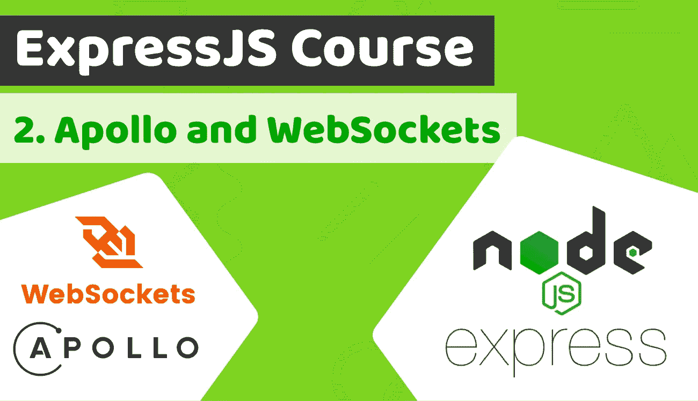

# Express.js 课程和 TypeScript 第 2 课— Apollo 和 WebSockets

> 原文：<https://itnext.io/express-js-course-with-typescript-lesson-2-apollo-websockets-7eb2063186bf?source=collection_archive---------5----------------------->



[Duomly —编程在线课程](https://www.duomly.com)

本文原载于[https://www . blog . duomly . com/Apollo-web sockets-tutorial-express-js-course-lesson-2/](https://www.blog.duomly.com/apollo-websockets-tutorial-express-js-course-lesson-2/)

# Apollo 和 WebSockets 简介教程

欢迎来到 Express.js 课程的第二课，在这里我们将重点关注面向初学者的 Apollo & WebSockets 教程。

在上一课中，我们用 Expres.js 构建了一个简单的 GraphQL API。

在这里，您可以找到第 1 课:如何构建 GraphQL API 教程的 URL:

[https://www . blog . duomly . com/how-to-build-graph QL-API-tutorial-express-js-course-lesson-1/](https://www.blog.duomly.com/how-to-build-graphql-api-tutorial-express-js-course-lesson-1/)

我们将在 Express.js 课程中构建的代码应该用作我的朋友 Anna 在 React.js 课程中构建的前端的后端。

通过完成这两项，您将能够构建完整的个人理财应用程序。

以下是 React.js 课程第 1 课:GraphQL 教程的 URL:

[https://www . blog . duomly . com/graph QL-tutorial-react js-course/](https://www.blog.duomly.com/graphql-tutorial-reactjs-course/)

在这里你可以做整个 React.js 互动课程:

[https://www.duomly.com/course/javascript-course/](https://www.duomly.com/course/javascript-course/)

在今天的课程中，我将教你如何创建 Apollo 服务器，通过 WebSockets 提供实时订阅服务。

我们将创建新的模式，并了解什么是 GraphQL 变体以及如何使用它们。

开始吧！

如果你喜欢视频，这是 youtube 的版本:

Apollo & WebSockets 教程

# 如何安装 graph QL-订阅

作为最初的几个步骤，我们需要安装必要的依赖项，我们将在今天使用。

像第一个一样，我们应该安装 npm 包，它将允许我们创建 GraphQL 订阅。

在项目目录中打开您的终端，并键入:

```
npm i -S graphql-subscriptions
```

# 如何安装 HTTP

我们需要安装的下一个包是“HTTP”。

这一点非常重要，因为它将让我们创建一个合适的服务器。

打开终端并键入:

```
npm i -S http
```

# 什么是 GraphQL 阿波罗，如何安装阿波罗服务器

Apollo server 是一个开源的 GraphQL 包，它让我们可以轻松地在您的后端创建一个 GraphQL 服务器。

使用这个包是一个很好主意，特别是如果我们想在前端使用 Apollo 客户端，因为它们可以流畅地协同工作。

要安装这个包，我们需要安装“Apollo-server-express”NPM 包。

打开您的终端并键入:

```
npm i -S apollo-server-express
```

# 如何卸载 express-graphql

我们已经完成了新的依赖项的安装，但是我们确定我们所有的都是必需的吗？

如果没有，我们肯定应该删除它们，以免弄乱我们的 package.json 文件。

其中一个我们不再需要的包是“express-graphql ”,所以我们需要卸载它。

打开终端并键入:

```
npm uninstall express-graphql
```

# 在 schema.ts 中用 gql 替换 buildSchema

恭喜，所有的依赖项都完成了。

现在，我们可以进入正确的编码，这将更加有趣。

作为第一步，我们应该进入“schema.ts”文件，用“gql”替换“buildSchema”。

不要忘记删除不必要的进口和进口的“gql”。

```
import { gql } from 'apollo-server-express';const schema = gql`
```

# 什么是 GraphQL 突变以及如何向模式中添加突变

GraphQL 变异是一种返回数据的 GraphQL 查询，应该在我们想要修改数据时使用。

我们在创建、更新或删除数据的情况下使用 GraphQL 变异。

我们需要创建一个新的费用，所以 GraphQL 变体是这里使用的最佳方法。

Mutation 看起来有点像 Query，但是应该有允许的参数，我们可以将这些参数放在括号中以请求数据。

```
type Mutation {
  newExpense(id: Int, date: String, amount: Int, type: String, category: String): Expense
}
```

# 什么是 GraphQL 订阅以及如何向模式添加订阅

GraphQL 订阅是一个 GraphQL 特性，它允许我们在订阅的事件被触发时立即发送信息。

这有点类似于我们在 Javascript 中使用的 eventListener。

GraphQL 订阅是将数据实时发送到前端的 WebSockets 服务器的一个好主意。

我们需要创建名为“newExpenseCreated”的订阅，它将在 schema.ts 中返回“Expense”

```
type Subscription {
  newExpenseCreated: Expense
}
```

# 在解析器中导入发布订阅

模式看起来已经完成了，祝贺你！

现在，我们应该进入 resolvers.ts 并在那里开发一些代码。

我们将需要使用 pubsub，因此，作为第一步，我们需要导入该依赖项。

导入后，我们需要将“new PubSub()”赋给名为“PubSub”的变量。

```
import { PubSub } from 'graphql-subscriptions';
const pubsub = new PubSub();
```

# 如何给解析器添加变异

现在，我们需要重新构建解析器。

作为第一步，我们应该将费用放入名为“Query”的对象中。

在下一步中，我们应该创建一个名为“Mutation”的对象，并创建名为“newExpense”的变异，它应该以“root”和“args”作为参数。

在函数内部，我们需要创建 Expense，通过 pubsub 发布事件“expense ”,并返回创建的对象。

```
Query: {
  expenses: () => {
    return getExpenses();
  },
},
Mutation: {
  newExpense: (root, args) => {
    const expense = createExpense(args);
    pubsub.publish('expense', { newExpenseCreated: expense });
    return expense;
  }
},
```

# 如何向解析程序添加订阅

订阅是 resolvers.ts 中我们应该关注的下一点。

像前面的步骤一样，我们应该创建一个对象“Subscription ”,并在里面创建“newExpenseCreated”对象。

接下来，我们应该订阅名为“expense”的事件。

为此，请使用“pubsub.asyncIterator”。

```
Subscription: {
  newExpenseCreated: {
    subscribe: () => pubsub.asyncIterator('expense')  // subscribe to changes in a topic
  }
}
```

# 在 resolvers.ts 中创建 createExpense 函数

作为 resolvers.ts 中的最后一步，我们应该创建一个返回费用数据的函数。

将其命名为“createExpense ”,并返回具有相同主体的对象，正如我们在模式中定义的那样。

```
const createExpense = (args) => {
  return { id: args.id, date: args.date, amount: args.amount, type: args.type, category: args.category };
}
```

# 在 server.ts 中导入依赖项

厉害！

现在，我们可以进入服务器。ts，这将是我们需要编码的最后一个文件。

这里，我们应该从将要导入的必要依赖项开始。

保持 express、schema 和 resolvers 不变。

并且导入“http”，以及 server.ts 上面的“apollo-server-express”

接下来，您可以删除文件的全部内容，不包括“app”变量。

```
import * as express from 'express';
import schema from './graphql/schema';
import { createServer } from 'http';
import { ApolloServer } from 'apollo-server-express';
import resolvers from './graphql/resolvers';var app = express();
```

# 如何创建阿波罗服务器

如果我们删除了以前的服务器，我们需要从头开始创建新的服务器。

创建 apolloServer，并将其赋给“Apollo”变量。

```
const apollo = new ApolloServer({
  typeDefs: schema,
  resolvers: resolvers,
  playground: {
    endpoint: `http://localhost:4000/graphql`,
  }
});
```

# 如何添加阿波罗中间件

下一步，我们需要将 apollo 中间件应用于 node.js express。

这是一个小交易，因为我们只需要在“apollo”变量上触发 applyMiddleware，并将我们的应用程序传入。

```
apollo.applyMiddleware({ app: app });
```

# 如何创建 WebSocket 服务器

这是我们在今天的课程中需要执行的编码的最后一步，我们就要完成了。

我们需要创建一个服务器，应用 subscriptionHandler，并监听 HTTP 和 WebSockets。

让我们看看下面的例子是如何做到的:

```
const ws = createServer(app);
apollo.installSubscriptionHandlers(ws);ws.listen({ port: 4000 }, () =>{
  console.log(`GraphQL API URL: http://localhost:4000/graphql`)
  console.log(`Subscriptions URL: ws://localhost:4000/graphql`)
});
```

# 测试

你已经完成了代码，祝贺你！

现在，我们可以开始测试了。

首先，我们需要通过以下方式运行应用程序:

```
npm run
```

接下来，我们需要在两个浏览器窗口中打开该 URL:

```
[http://localhost:4000/graphql](http://localhost:4000/graphql)
```

在第一个窗口中，我们需要开始监听订阅:

```
subscription newExpenseCreated {
  newExpenseCreated {
    id,
    amount,
    type
  }
}
```

在第二个示例中，我们需要应用查询变量:

```
{
  "id": 1, "date": "today", "amount": 10, "type": "Outcoming", "category": "Food"
}
```

并进行适当的突变:

```
mutation newExpense(
$id: Int
$date: String
$amount: Int
$type: String
$category: String
){
  newExpense(id: $id, date: $date, amount: $amount, type: $type, category: $category) {
    id,
    amount,
    category
  }
}
```

# 结论

现在，你已经学会了如何用 WebSockets 和 Express.js 创建 Apollo 服务器，恭喜你！

这些知识非常强大，你可以用 WebSockets 和 GraphQL 构建很多应用程序。

例如，您可以稍微修改一下代码，然后构建一个实时聊天或实时通知系统。

我希望你能建立许多好的项目来发展你的编码组合和掌握你的技能。

让我们在评论中知道你已经建立了什么！

以下是今天课程的代码:

[https://github . com/Duomly/Express-js-with-graph QL-and-web sockets/tree/Express-js-course-Lesson-2](https://github.com/Duomly/express-js-with-graphql-and-websockets/tree/Express-js-course-Lesson-2)


[Duomly —编程在线课程](https://www.duomly.com/?code=lifetime-80)

感谢阅读，

Duomly 的 Radek