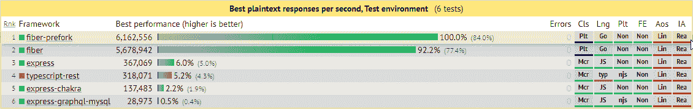
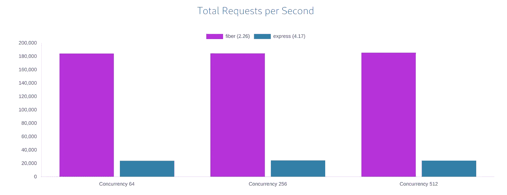
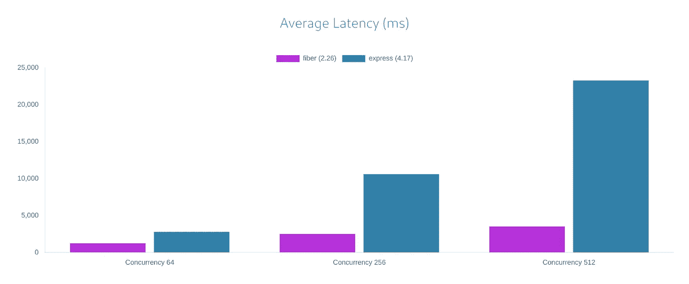
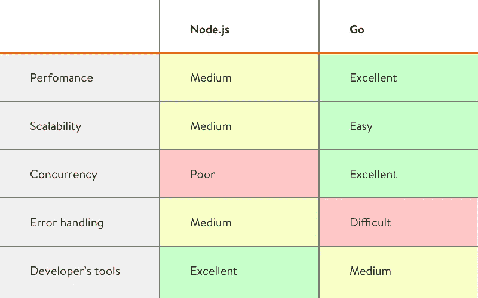

# 为什么您应该选择光纤而不是 expressjs

> 原文：<https://itnext.io/express-js-vs-fiber-go-96731ba829fd?source=collection_archive---------3----------------------->

## 如果你喜欢 express，那么这个框架会让你心动

# 什么是快递？

Express 是 NodeJS 中最受欢迎的 web 框架之一，每个人都喜欢它

## 为什么它如此受欢迎？

因为它的**简单**，**快速**，**极简**所以**好玩**来编码！

因此..如果`express`有那么好，为什么还要换成`fiber`？

## 现在来说说纤维。

# 什么是纤维？

Fiber 是一个受 Express 启发的 web 框架，用 Go 编写

它看起来非常类似于 express，但是为我们提供了更多的性能(感谢`golang`)

你也可以认为它就像 RPG 中的+9 快递物品

我们谈论的是哪种性能改进？

## 让我们来谈谈基准

**Fiber** — **每秒 6162556 个**响应，平均延迟 **2.0** 毫秒 **Express** — **每秒 367069 个**响应，平均延迟 **354.1** 毫秒。

快速与光纤

越高越好

越低越好

纤维在互联网上有如此多的基准。

对于详细的基准测试，您可以通过本文底部的链接访问它们。

## 为什么光纤比快递快很多？

因为`fiber`用的是`golang`(编译的)，`express`用的是`javascript`(解释的)语言。

`Golang`是一种非常简单并且非常快速的编程语言，由 Google 开发。

它使用更少的 CPU 和内存，速度更快

但是有一点阻碍`golang`

相对于`nodejs/javascript`来说，学习和查找资源有点难

`javascript`为您提供了如此多的灵活性和简单的学习曲线，但却窃取了我们一些重要的东西

go vs nodejs

# 快递转光纤值得吗？

## 简短回答

IMHO，绝对值得！

## 长回答

看情况。

*   如果你的 API 工作得很好，你也能接受。何必呢？继续开快车。
*   如果您需要更高的 API 性能和效率，但又不想改变太多的编码风格。你绝对应该尝试一下！

## 说够了吗？让我们来看看一些代码！！

# 最佳实践

## 你好世界

# 要求

## 获取(带参数)

## 张贴(带正文)

删除、上传、修补..用法是一样的，我不会在他们身上浪费你的时间

## 通配符

## 再直接的

# 一些中间件

## 确认

## 克-奥二氏分级量表

## 压缩

## 静态

# 遗言

我想这足以让你对`fiber`有所了解

如你所见，`fiber`与`express`相似，速度极快。这使得它非常迷人。

我刚换了(我喜欢)。我不是后端专家，所以暂时不知道`fiber`的阻碍。如果你有任何建议让我知道！

如需了解更多信息，您可以点击查看[的文档。(这是有据可查的)](https://docs.gofiber.io)

对于好奇的人来说，这里还有一些基准

## 基准源:

 [## Web 框架基准测试

### Web 框架基准测试。有许多框架，每一个都有自己的优点和缺点。目的…

web-框架-benchmark.netlify.app](https://web-frameworks-benchmark.netlify.app/compare?f=fiber,express)  [## TechEmpower Web 框架性能比较

### 这是许多执行基本任务的 web 应用程序框架的性能比较，例如 JSON…

www.techempower.com](https://www.techempower.com/benchmarks/#section=data-r20&hw=ph&test=composite)  [## 基准

### 这些基准旨在比较 Fiber 和其他 web 框架的性能。

docs.gofiber.io](https://docs.gofiber.io/extra/benchmarks)  [## go vs Node js——哪些程序最快？(基准游戏)

### 一定要看源代码。这些只是最快的程序。如果它们是手动矢量化的 SIMD，是否…

benchmarksgame-team.pages.debian.net](https://benchmarksgame-team.pages.debian.net/benchmarksgame/fastest/go-node.html) 

## 感谢您的阅读！

那是一篇很长的文章，而你大老远跑来这里！你太棒了！请不要忘记鼓掌(也可能你不知道鼓掌可以达到 50 次，只是在你走的时候点击)