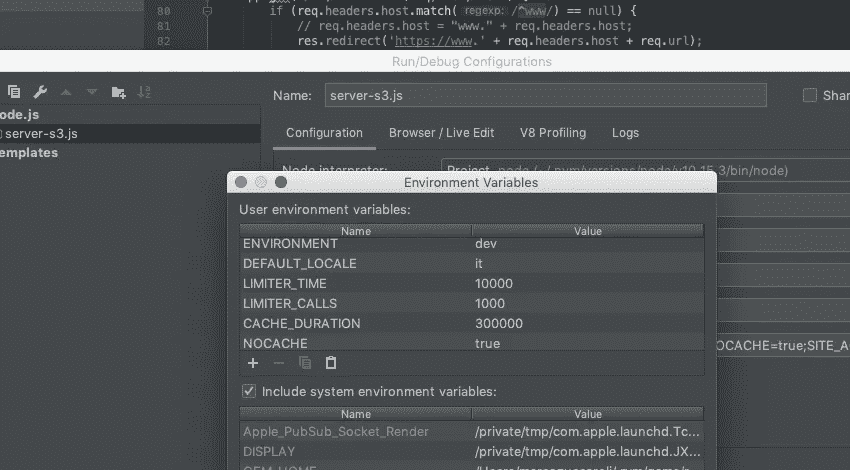

# Angular 应用程序的快速服务器第 4 部分:将 http 重定向到 https 请求

> 原文：<https://itnext.io/express-server-for-an-angular-application-part-4-redirect-http-to-https-requests-d4f6e7ed7e93?source=collection_archive---------4----------------------->

Express.js 是为构建 web 应用程序而设计的 Node.js 的 web 应用程序框架，在这一系列文章中，我将一步一步地解释我是如何实现一个具有一些高级功能的 Express 服务器的，我将这些功能用于我用 Angular 7 制作的单页面应用程序。

我将讨论我在不同文章中解决的 7 个主要问题:

1.  [入门](https://medium.com/@marcozuccaroli/express-server-for-an-angular-application-part-1-getting-started-2cd27de691bd?fbclid=IwAR0FqPoqKeBps4QUM3E09aSGKDwjUNKcoZHxPKAB5iBt8dwUbuEol3b7IZ8)
2.  [从桶里取文件](https://medium.com/@marcozuccaroli/express-server-for-an-angular-application-part-2-serve-files-from-a-bucket-ae14d23e7cde)
3.  [将一些呼叫重定向到外部服务](https://medium.com/@marcozuccaroli/express-server-for-an-angular-application-part-3-redirect-routes-to-an-external-service-d4658ed575cb)
4.  [将 http 重定向到 https 请求](https://medium.com/@marcozuccaroli/express-server-for-an-angular-application-part-4-redirect-http-to-https-requests-d4f6e7ed7e93)
5.  [将非 www 请求重定向到 www 请求](https://medium.com/@marcozuccaroli/express-server-for-an-angular-application-part-5-redirect-non-www-to-www-requests-b81a7794a4d7)
6.  [限制连接并阻止 DDoS](https://medium.com/@marcozuccaroli/express-server-for-an-angular-application-part-5-limit-connections-and-prevent-ddos-e27902cc702b)
7.  [处理一些缓存](https://medium.com/@marcozuccaroli/express-server-for-an-angular-application-part-7-add-cache-f11e8060a2e3)

在第四篇文章中，我将讨论如何将 http 重定向到 https 请求。

# 参考知识库

该项目的一个工作示例可从以下网址获得:

[https://github . com/mzuccaroli/express _ server _ for _ angular _ example](https://github.com/mzuccaroli/express_server_for_angular_example)主分支包含最终的完整项目，但每篇文章都有一个专用分支，对于这一篇文章，引用是:[https://github . com/mzuccaroli/express _ server _ for _ angular _ example/tree/feature/http _ to _ https _ redirects](https://github.com/mzuccaroli/express_server_for_angular_example/tree/feature/http_to_https_redirects)

# 关于环境的快速说明

处理 https 请求和重定向 http 请求是现代应用程序的必备功能**，但是在您的**本地机器**上开发应用程序时，处理 https 可能会很棘手。我用一些环境变量解决了这个问题:用 node 你可以很容易地处理**环境变量**并设置一个“_ 环境”变量，然后你可以取消本地开发的重定向选项。
您可以通过如下方式运行您的应用程序来手动设置环境变量:**

> 环境=dev 节点 server.js

然后通过添加以下内容在代码中使用该变量:

> const _ environment = process . env . environment；

你可以通过 docker 处理这些变量或者在你的 IDE 中设置它们，下图是我的 webstorm 设置。

# 将 http 请求重定向到 https

一旦决定了环境变量，就可以将以下代码添加到服务器中:

注意，您需要在您的应用程序中启用信任代理，然后您将能够**区分 https 请求和 http** 。

这是一个简单的改进，您可以将它添加到您的服务器中，不必再担心不安全的请求。

在下一篇文章中，我将讨论一个类似的改进，**如何处理 www 和非 www 的 URL。**