# ExpressJS & GraphQL —认证和访问控制

> 原文：<https://itnext.io/expressjs-graphql-authentication-access-control-c5c8fe360b07?source=collection_archive---------2----------------------->

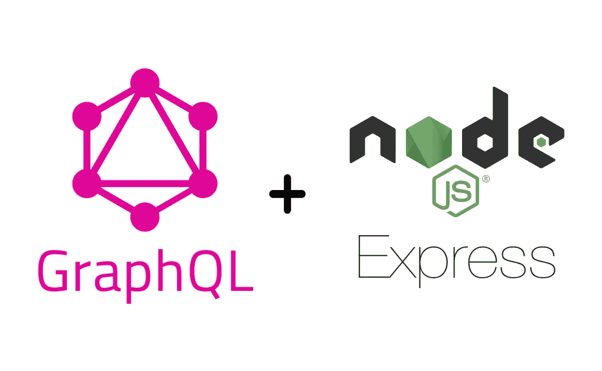

# 介绍

在本文中，我将向您展示一个如何在模式生成级别、中间件和访问控制上实现身份验证的示例。如果您已经熟悉 GraphQL 和 Express，并且有一些 API 开发经验，那么这篇文章就是为您准备的。

# 应用规格

我将创建一个小的库应用程序。
这个应用程序将有两种类型的数据:用户和书籍。
为了获得图书列表或单本图书，用户应该被认证并具有“查看”角色。
如果用户想从系统中删除图书，他需要通过身份验证，并拥有“查看”和“删除”角色。

# 用户认证

> 用户身份验证策略是一个过程，用于验证试图访问服务和应用程序的人是否是他们所声称的人。

# 授权(用户访问控制)

> 授权是一种安全机制，用于确定与系统资源(包括文件、服务、计算机程序、数据和应用程序功能)相关的访问级别或用户/客户端权限。这是授予或拒绝访问网络资源的过程，允许用户根据其身份访问各种资源。

# 项目设置

我不会描述和展示配置 Typescript、Nodemon 和编写接口之类的东西的过程。你将能够在 Github 库上看到整个应用程序代码。
回购的链接将在本文末尾。

项目结构

如果你看一下 **graphql** 文件夹，你会注意到两个文件夹:**授权** & **未授权。**我对授权和未授权模式的解析器、查询、类型和变异进行了物理拆分。
根据用户身份验证状态，我们的应用程序将知道应该为最终用户提供哪种模式。

通过这种拆分，我们又多了一个安全级别。
当未经认证的用户从服务器获取 GraphQL 模式时，他将无法看到需要认证的查询和变异列表。

类型定义生成器- src/graphql/type.generator.ts

我将创建解析器寄存器，在这里我们将能够控制哪些解析器应该包含在授权和未授权的模式中。

解析器寄存器—src/graph QL/resolver . register . ts

基于用户身份验证状态的模式生成器—src/graph QL/schema . generator . ts

生成 GraphQL Express 中间件—src/middleware/graph QL-Express/graph QL-Express . middleware . ts

现在我将设置认证和访问控制中间件。
认证中间件将在整个 GraphQL 端点上运行。
访问控制中间件将在解析器级别运行。

认证中间件—src/middleware/auth/auth . middleware . ts

访问控制中间件—src/middleware/access-control/access-control . middleware . ts

现在我将在解析器级别设置运行中间件的助手。

中间件检查助手—src/middleware/middleware . check . ts

**注意**:在真实世界的场景中，我会使用真实的数据库和真实的认证标准，比如 JWT。但是在这篇文章中，我伪造了数据库和认证系统。

在这个假数据库中，用户对象被分配了不同的角色和令牌，这些角色和令牌将用于身份验证和授权。
代币将模拟不记名代币。

fake DB—src/helpers/fake-DB . helper . ts

身份验证查询服务—src/graph QL/unauthorized/auth/auth . query . service . ts

身份验证解析程序—src/graph QL/unauthorized/auth/auth . resolver . ts

身份验证查询类型—src/graph QL/unauthorized/query . graph QL

图书突变服务—src/graph QL/authorized/book/book . mutation . service . ts

图书查询服务—src/graph QL/authorized/book/book . query . service . ts

下面你可以在《解析器》一书中看到如何在解析器层面使用中间件:

图书解析器—src/graph QL/authorized/book/book . resolver . ts

授权突变—src/graph QL/authorized/mutation . graph QL

授权查询—src/graph QL/authorized/query . graph QL

现在让我们总结一下:

服务器— src/server.ts

让我们用 **npm start** 命令运行服务器

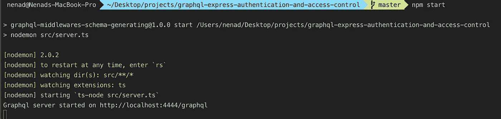

当服务器启动时，让我们尝试以未经身份验证的用户身份从失眠症患者那里获取模式。

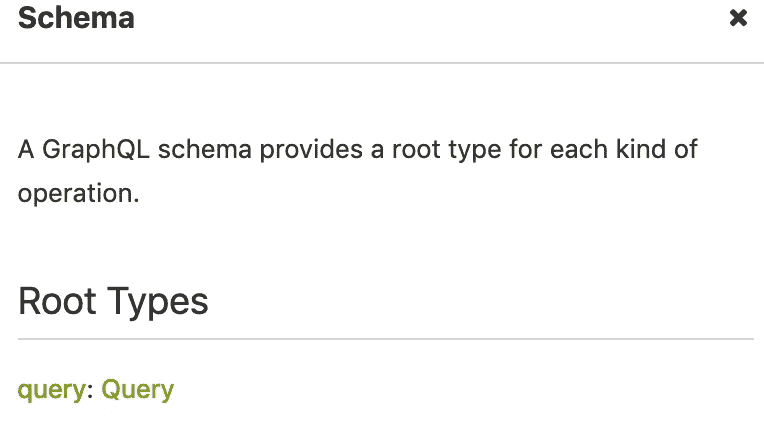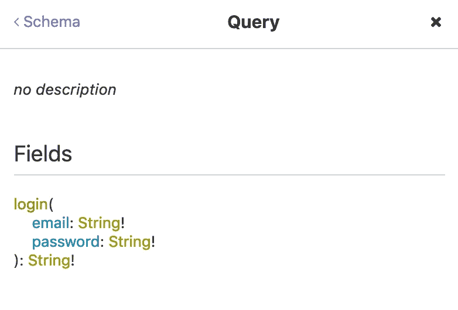

以未经验证的用户身份获取了架构。

正如您在上面看到的，作为未经验证的用户，我们只能使用登录查询。
让我们以认证用户的身份登录并尝试获取模式。

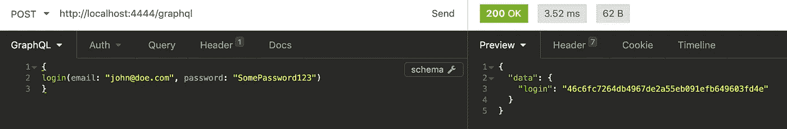

成功登录

成功登录后，我们得到了应该作为**授权**头值的值在请求中发送的散列。

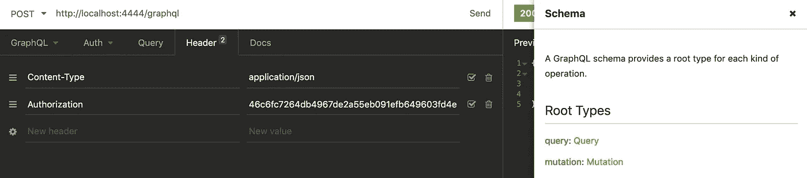

以授权用户身份获取模式

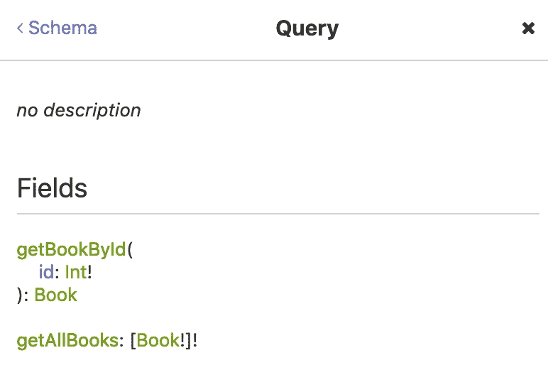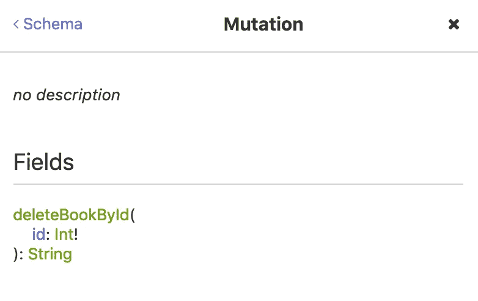

授权用户的模式

由于当前登录的用户只有“查看”角色，让我们尝试获取所有书籍的列表。

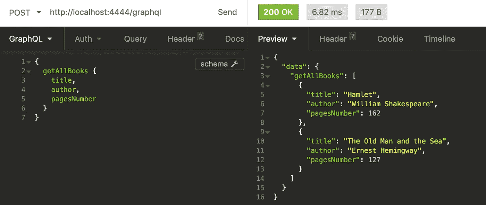

获得所有书籍

现在，让我们以一个不具备该操作所需权限的用户身份尝试删除图书。

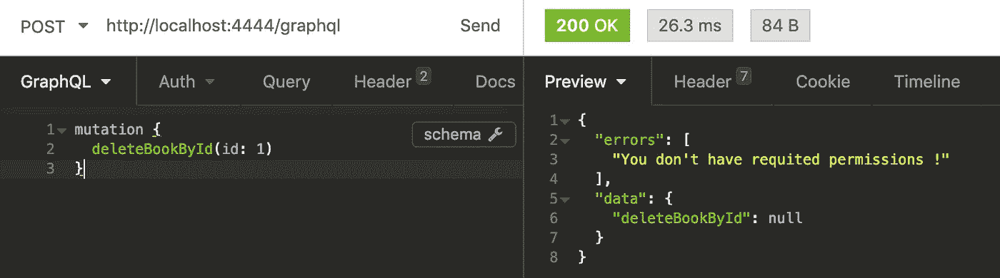

删除操作失败，因为用户不被允许

正如预期的那样，服务器不允许我们在没有所需权限的情况下执行删除操作。
我将以被允许的第二用户(jane@doe.com 的身份登录，替换授权头哈希，并尝试删除图书。

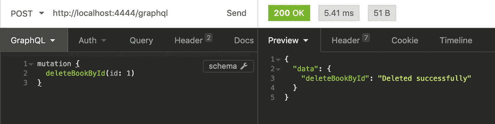

作为许可用户成功删除操作

应用程序正在工作。我们成功删除了一本书作为许可用户！

感谢阅读！

[Github 资源库。](https://github.com/nenadb97/graphql-express-authentication-and-access-control)