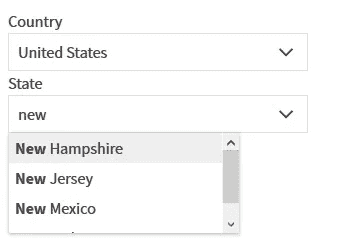
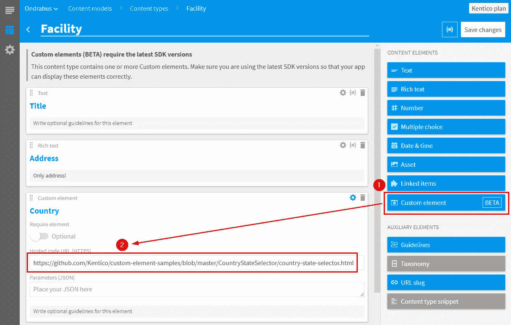

# 使用自定义元素扩展 CaaS Kentico 云

> 原文：<https://itnext.io/extending-caas-kentico-cloud-with-custom-elements-76a999f4553e?source=collection_archive---------8----------------------->


在对内容进行建模时，您经常会遇到以特定结构存储数据的需求，这种结构超出了字符串、数字或选项列表等传统类型。典型的例子是国家和州。除非你想给编辑自由的空间，否则你不能使用自由文本域。那么，如何扩展内容即服务系统并存储这些数据呢？

为什么不应该使用自由文本字段？除了编辑不得不每次都写国家名称的事实之外，你最终会得到一堆非结构化的数据、许多重复和错别字。因为不是世界上所有的国家都有州，所以在选择器中还需要一点业务逻辑。因此，简单的下拉菜单也不是理想的解决方案。

# 自定义元素

首先我要强调的是，自定义这个词并不意味着你需要实现它。您甚至不必下载、编译或安装它。不，要在 [Kentico Cloud](https://kenticocloud.com) 中使用自定义元素，您只需复制并粘贴它的 URL。但我稍后会讲到。首先，让我解释一下什么是定制元素。

自定义元素是一个独立的 web 应用程序，即一个网站，托管在互联网上的某个地方。它不是在 Kentico Cloud 中实现的，而是使用 iframes 集成到 UI 中。因此，它可以位于很远很远的服务器上(不过最好不要太远——延迟仍然适用)。Kentico Cloud 将通过 JavaScript 与 iframe 中的自定义元素进行通信，为其提供初始化数据，并侦听数据更改以确保它们是持久的。自定义元素负责其余的工作。它显示数据、处理数据、转换数据并将其返回给 Kentico Cloud 的方式是在其实现中进行编排的。



那么国家和州选择器会是什么样子呢？这是一个带有两个下拉选择器的空白页面。如果所选国家有任何州，则会显示第二个显示州的下拉列表。它还没有保存任何更改，因为没有要与之通信的父窗口(Kentico Cloud)。

如果您对使用现有的自定义元素感兴趣，请随意跳到“使用自定义元素”一节。

# 构建自定义元素

国家和州选择器涵盖了与国家相关的内容项的一个用例。可能是你公司的办公室，你国家的大使馆或者你最喜欢的旅行社的旅行。所有这些项目都与特定的国家/州相关。

您看，当您的数据结构超出标准数据类型时，您可能需要一个自定义元素。寻找它的最佳地点是我们的 [GitHub 库](https://github.com/kentico/custom-element-samples/issues)。如果你找不到一个符合你要求的，你很幸运！你可以享受建造一个的所有乐趣:-)，所以只要跟随我的国家和州选择器的故事。

# 我该如何开始？

每个自定义元素都是一个独立的应用程序，所以由你来选择你最喜欢的平台。然而，与 Kentico Cloud 的通信是通过 JavaScript 进行的，因此基于 Node.js 或您最喜欢的 JavaScript 框架的实现将会工作得最好。

虽然你可以只用记事本在一片绿地上开始，但我们为你准备了一个 [DevKit](https://github.com/Kentico/custom-element-devkit) 来加速不太有趣的任务，比如最小化资产，包括 Kentico 云样式等等。DevKit 可以在 [GitHub](https://github.com/Kentico/custom-element-devkit) 上获得，您可以从克隆它的存储库开始:

```
git clone [https://github.com/kentico/custom-element-devkit](https://github.com/kentico/custom-element-devkit)
```

和安装缺失的节点模块:

```
npm install
```

要创建新的自定义元素，导航到`/client/custom-elements`文件夹并为其创建一个新文件夹。您还需要创建两个文件:

*   **index . Pug**T11[Pug](https://pugjs.org/api/getting-started.html)中你的自定义元素的视图。
*   **code . tsx**带有自定义元素逻辑的 JavaScript 代码文件。

注意，JS 文件有一个 TypeScript 扩展名，所以如果您对 TS 更熟悉的话，您可以使用它，但是您也可以坚持使用标准的 JavaScript 代码。该文件应该以您的定制元素命名—在我的例子中，它是`selector.tsx`。

# 我应该使用哪个框架？

devkit 适用于任何 JS 框架，所以可以随意使用您最喜欢的框架或普通 JS。最近我经常使用 React.js，所以我决定使用它。我需要在 devkit 根目录下安装两个额外的包:

```
npm install react react-dom — save
```

# 自定义元素如何与 Kentico Cloud 通信？

每一个组件，哪怕只是一个简单的文本字段，都需要和 Kentico Cloud 进行通信。他们需要在内容项目打开或更新时交换数据，以确保编辑人员看到正确的值，并且他们的工作得以持续。该组件还需要防止对已经发布的内容项进行更新，并告诉 Kentico Cloud 它需要多少空间才能正确呈现。

Kentico Cloud 定制元素 API 为所有这些情况提供了方法。看一看我在`code.tsx`中对国家选择器的(简化)实现:

```
CustomElement.init((element, _context) => {
  const data = element.value ? JSON.parse(element.value) : null;
  const components = (<CountrySelector data={data} disabled={element.disabled} customElementApi={CustomElement} />);
  ReactDom.render(components, document.querySelector('#reactapp'));
});
CustomElement.setHeight(250);
```

Kentico Cloud 通过调用`CustomElement.Init`并提供`element`和`_context`对象中的所有数据来启动定制元素。我用那个事件用数据(`element.value`)和标志来初始化我的组件，这些数据和标志描述了组件是否应该允许编辑者更改值(`element.disabled`)。

我的选择器使用两个数据字段——`countryCode`和`stateCode`——来保存编辑器的选择。因此，`element.value`对象将为空(没有值或全新的内容项)或如下所示:

```
{countryCode: “US”, stateCode: “NH”}
```

最后一个参数(`customElementApi`)使我的 React 组件能够调用自定义元素 API 的方法`setValue()`，该方法将数据保存在 Kentico Cloud 中。每当用户更改国家或州时，我的选择器都会调用它，以确保他或她的选择得到保留。

由于选择器目前对所有用例使用相同的高度，因此使用方法`setHeight()`将其设置为 250px。

有关可用方法的完整列表，请查看 Kentico Cloud 文档中的 [API 参考。](https://developer.kenticocloud.com/v1/reference#custom-elements-api)

# 构建和部署自定义元素

当你完成实现后，你应该先奖励自己一两杯啤酒。之后，是时候构建和部署它，让全世界都看到。实现这一目标的第一步是构建自定义元素:

```
npm start — -cjsm
```

这些标志确保自定义元素将在单个 HTML 文件中被编译、样式和 JavaScript 缩小和内联。该过程完成后，查看`\built\custom-elements\{element name}`。您应该会看到两个文件— `index.html`和带有 Kentico 图标的字体文件(`woff`)。

因为自定义元素由一个 HTML 文件表示，所以你可以在任何地方托管它(Heroku，Surge，你的托管空间，等等。).然而，我决定将它托管在 GitHub 上的 [Kentico 定制元素示例库](https://github.com/Kentico/custom-element-samples)中，因为它已经托管了一些定制元素，并且是与其他开发人员共享的最佳位置。这样，任何人都可以快速找到我的选择器，并在他们的项目中使用它。该存储库也使用 GitHub 页面，因此所有托管在那里的元素都可以使用 URL 直接引用。

# 使用自定义元素

所以定制元素被部署并可以在线访问(我们有它的 URL)。酷，那是最难的部分。现在让我们使用 Kentico Cloud 中的自定义元素。



当您打开内容类型定义时，您可以将通用自定义元素拖放到字段列表中。在新字段的配置中，有一个用于定制元素 URL 的文本框。因为我的国家和州选择器是托管在 GitHub 上的，所以 URL 看起来像这样:

```
[https://kentico.github.io/custom-element-samples/CountryStateSelector/country-state-selector.html](https://kentico.github.io/custom-element-samples/CountryStateSelector/country-state-selector.html)
```

请注意，定制元素始终需要通过 HTTPS 访问，以确保 Kentico Cloud 和定制元素之间的安全通信。

就是这样。不需要其他步骤。继续操作，打开任何基于更新内容类型的内容项目并进行尝试。

同样，您也可以利用我们的[每日增长列表](https://github.com/kentico/custom-element-samples)中的任何自定义元素，并在处理特定数据结构时为您的编辑带来出色的用户体验。

# 为您的自定义元素获得 150 美元

在处理内容时，国家和州的选择很常见。那么，让每个开发人员为它创建自己的定制选择器有意义吗？大概不会。因为我已经创建了一个，所以其他人很容易使用它——只需在自定义元素配置中引用它的 URL。

我们喜欢开发人员互相帮助，共享定制元素会节省你的开发人员大量的时间。我们也喜欢玩。这就是为什么我们在 2019 年 3 月组织了一场比赛，奖励自定义元素贡献者。规则很简单——创建一个定制元素，并将其贡献给 GitHub 上的示例库。我们将用 150 美元的亚马逊代金券奖励前 10 名最佳定制元素！这样你就能买到亚马逊 Echo、Apple Pencil 或 20x USB 连接线(这足以支付我一年的 USB 连接线消费)！

要了解更多信息并报名参加，请访问 www.kenticocloud.com/blog/custom-elements-contest。

***更新:大赛截止日期已延至 4 月 14 日***

*原载于*[*kenticocloud.com*](https://kenticocloud.com/blog/extending-custom-elements)*。*