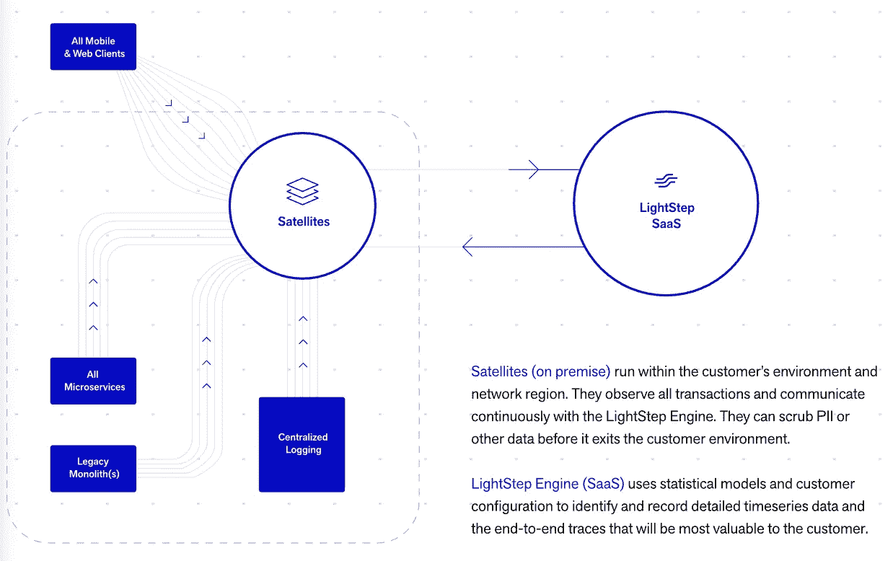
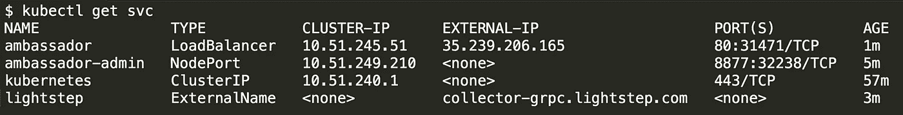
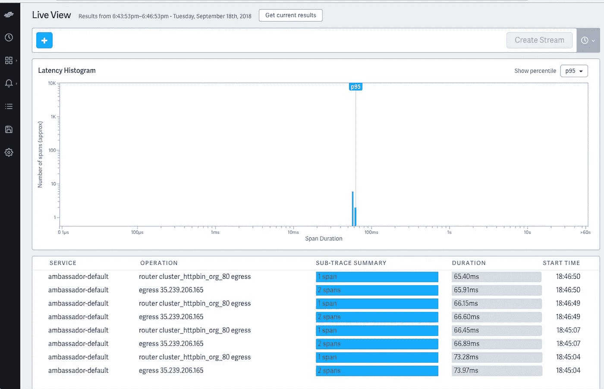
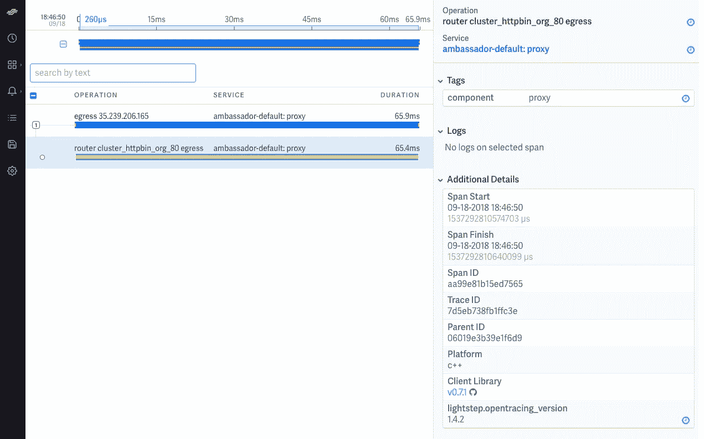
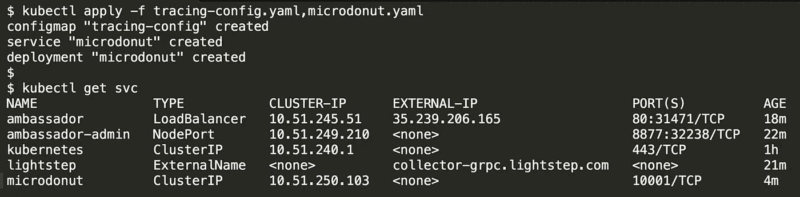
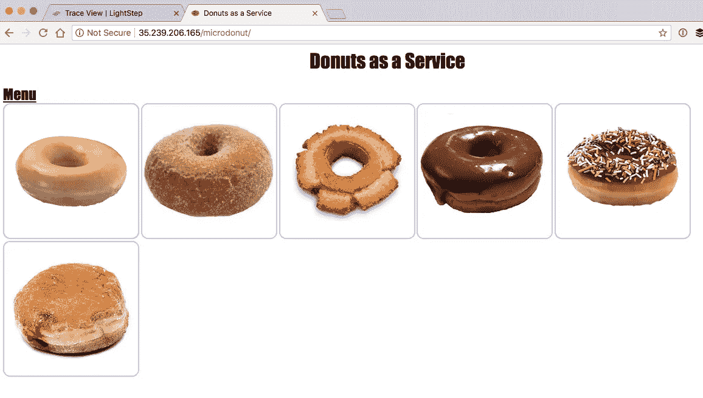
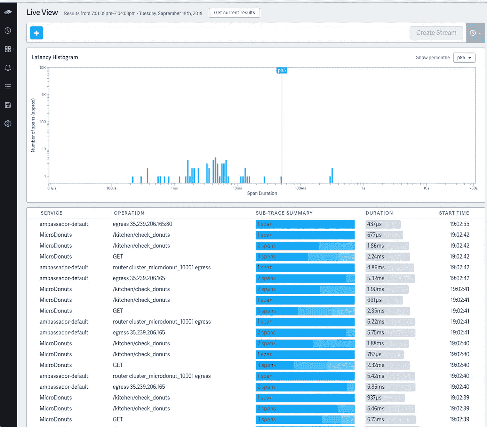

# 用 LightStep 扩展 Ambassador/Java 分布式跟踪

> 原文：<https://itnext.io/extending-the-ambassador-java-distributed-tracing-with-lightstep-40b7fc574c7?source=collection_archive---------2----------------------->

上个月，我发表了一篇关于如何使用[kubernet-native Ambassador API gateway 和 Java open tracing‘micro donuts’](https://blog.getambassador.io/distributed-tracing-with-java-microdonuts-kubernetes-and-the-ambassador-api-gateway-ace15b62a89e)应用程序实现基于 Zipkin 的分布式跟踪的教程，在一些请求之后，我想现在返回并为此添加 LightStep 支持。

# 介绍 LightStep [x]PM

对于那些刚刚接触 [LightStep](https://lightstep.com/product/) 的人来说，它是一个基于 SaaS 的分布式跟踪平台(以及更多)，旨在提供下一代应用程序性能监控(APM)——【x】PM。如果你感兴趣，我最近在 InfoQ 上的分布式跟踪和 APM 空间中写了一些关于[的历史。LightStep 平台基于卫星的架构很有趣，提供的 UI 和诊断工具也很有趣，我鼓励感兴趣的读者查看他们的](https://www.infoq.com/articles/distributed-tracing-microservices)[综合文档](https://docs.lightstep.com/)。



本质上，LightStep [ *x* ]PM 数据处理管道有两个主要组件:卫星*、*和 *LightStep 引擎，*SaaS 组件。由被检测的客户端和服务器生成的所有跨度被发送到卫星池，在跟踪组装期间，它们在卫星池中被处理和临时存储。LightStep 引擎查询卫星，记录跨度的综合信息，指导装配过程，并持久存储轨迹。

您可以通过 [LightStep 网站](https://go.lightstep.com/Try-xPM.html)试验 SaaS 平台，您将需要创建一个帐户并获得一个访问令牌，以便以编程方式向 LightStep 发送 span 数据。

# 配置 OpenTracing Java“微节点”应用程序

如果您克隆我的 GitHub repo 的分支并列出目录内容，您应该会看到类似下面的内容:

```
$ git clone [git@github.com](mailto:git@github.com):danielbryantuk/java-opentracing-walkthrough.git
...
$ cd java-opentracing-walkthrough
$ ls
Dockerfile                      README.md                       kubernetes-ambassador           microdonuts
LICENSE                         client                          kubernetes-ambassador-lightstep
```

大部分内容和我原来的教程是一样的，如果你想了解更多细节，你可以看看这个。LightStep 集成的主要附件位于`kubernetes-ambassador-lightstep`文件夹中。如果您导航到此处并列出内容，您应该会看到类似如下的内容:

```
cd kubernetes-ambassador-lightstep/
$ ls
ambassador-rbac.yaml    ambassador-service.yaml lightstep-config.yaml   lightstep-tracing.yaml  microdonut.yaml         tracing-config.yaml
```

光步跟踪配置位于`lightstep-tracing.yaml`文件中。如果你在你最喜欢的编辑器中打开这个 YAML 文件，你会看到:

```
---
apiVersion: v1
kind: Service
metadata:
  name: lightstep
  annotations:
    getambassador.io/config: |
      ---
      apiVersion: ambassador/v0
      kind: TracingService
      name: tracing
      service: "my-collector-grpc.mydomain.com:443"
      driver: lightstep
      config: {
          access_token_file: /config/lightstep_api_key.txt
      }
spec:
  type: ExternalName
  externalName: my-collector-grpc.mydomain.com
```

您将会从上一教程中认出 Ambassador 注释和大多数 TracingService 细节，但是您还会注意到，除了将驱动程序从`zipkin`更改为`lightstep`之外，我还定义了 TracingService 以向外部 URI(my-collector-grpc . mydomain . com，这是我的 LightStep 跟踪收集器在 Kubernetes 集群之外运行的地方)报告跟踪，并在 TracingService 配置中指定了一个`access_token_file`属性。

你们当中善于观察的人很可能会思考，“我们如何将`/config/lightstep_api_key.txt`文件提交给大使？问得好。Ambassador 只是作为 pod 中的一个容器运行，而 pod 又是在部署中定义的，就像任何其他 Kubernetes 服务一样。因此，您可以将 ConfigMap 作为一个卷装载到包含相关数据的大使容器中。

让我们首先定义一个[配置映射](https://kubernetes.io/docs/tutorials/configuration/)，您可以在`lightstep-config.yaml`文件中找到它的一个例子:

```
---kind: ConfigMap
apiVersion: v1
metadata:
    name: lightstep-config
data:
    lightstep_api_key.txt: <your key here>
```

如果你正在跟进，并且有一个 LightStep 账户，那么用你实际的密钥文本替换`<your key here>`。定义了 ConfigMap 之后，现在可以将它映射到大使容器中。如果您回头看一下`ambassador-rbac.yaml`文件，您可以在配置的底部看到定义的`volumeMounts`和`volumes`(注意`…`显示了我在哪里截断了配置以提高可读性):

```
---
apiVersion: extensions/v1beta1
kind: Deployment
metadata:
  name: ambassador
spec:
  replicas: 3
  template:
    ...
    spec:
      serviceAccountName: ambassador
      ...
        volumeMounts:
        - name: lightstep-config-volume
          mountPath: /config
      restartPolicy: Always
      volumes:
      - name: lightstep-config-volume
        configMap:
          name: lightstep-config
```

完成所有这些拼图后，现在您可以将带有 LightStep Tracing 的 Ambassador 部署到 Kubernetes 中。我将使用谷歌托管的 GKE 服务(有可抢占的虚拟机，只是为了保持低成本)，但你可以使用任何适合你的 Kubernetes 风格。

```
$ gcloud container clusters create ambassador-tracing-demo --preemptible
...
Creating cluster ambassador-tracing-demo...done.
...$ kubectl create clusterrolebinding cluster-admin-binding-new \
--clusterrole cluster-admin --user < my GCP user name>clusterrolebinding "cluster-admin-binding-new" created$ kubectl apply -f lightstep-config.yaml,ambassador-rbac.yaml
configmap "lightstep-config" created
service "ambassador-admin" created
clusterrole "ambassador" created
serviceaccount "ambassador" created
clusterrolebinding "ambassador" created
deployment "ambassador" created
```

现在让我们继续部署 LightStep 跟踪配置:

```
$ kubectl apply -f lightstep-tracing.yaml 
service "lightstep" created
```

现在，您可以向集群部署一个简单的`httpbin`服务，它指示大使代理从`/httpbin/`路由到外部`httpbin.org`网站的请求。

```
$ kubectl apply -f ambassador-service.yaml 
service "ambassador" created
```

现在，您可以向 Kubernetes 查询大使服务负载平衡器的外部 IP 地址。以下是我所看到的:



我可以看到 Ambassador 暴露在 35.239.206.165 的外部 ip 上，因此我可以向我的`httpbin`服务发出请求，通过在 httpbin API 中指定“IP”端点来查询 IP，如下所示:

```
$ curl 35.239.206.165/httpbin/ip
{
  "origin": "146.148.98.46"
}
```

您可以将 Ambassador httpbin 端点卷曲几次，以确保您已经创建了一些跟踪。如果您现在登录您的 LightStep 帐户并导航到 LiveView，您应该会看到类似于以下内容的内容:



此视图很好地概述了当前跟踪，包括页面上半部分的直方图中的延迟，以及页面下半部分的其他单个跟踪信息。您可以单击单个跟踪来获取有关跟踪的其他信息:



现在，让我们部署 MicroDonut 应用程序以及与我们的配置跟踪相关的 ConfigMap。现在您会注意到，我已经更新了 Java 应用程序的跟踪配置，以将其跟踪数据发送到 LightStep，这与我们已经完成的配置 Ambassador 的工作是分开的。`tracing-config.yaml`文件现在包含以下内容:

```
---kind: ConfigMap
apiVersion: v1
metadata:
    name: tracing-config
data:
    tracer_config.properties: |
        public_directory=../client// Selector for the below config blocks
        tracer=**lightstep**// Jaeger config
        jaeger.reporter_host=localhost
        jaeger.reporter_port=5775// Zipkin config
        zipkin.reporter_host=zipkin
        zipkin.reporter_port=9411// LightStep config
        **lightstep.collector_host=< your lightstep collector host >
        // The collector_protocol value is either "http" or "https"
        lightstep.collector_protocol=http
        lightstep.collector_port=8081
        lightstep.access_token=< your access token >**
```

如果你跟着做，你需要用你实际的文本令牌替换`<your access token >`。

让我们将它部署到 Kubernetes 中:



现在，您应该能够通过 Ambassador 外部 IP 和路线`/microdonut/`通过您的网络浏览器访问 MicroDonut 应用程序，例如:



在你太饿之前，你可以通过点击图片，并按下显示在图片下方的“订购”按钮来订购一些虚拟甜甜圈。重复几次以生成一些轨迹，并导航到 LightStep LiveView:



就是这样！现在，您可以探索和试验大使、LightStep 和微点。

# 结论

您可以通过 https://www.getambassador.io，了解更多关于大使的信息，并在大使文档中了解[大使分布式追踪](https://www.getambassador.io/reference/services/tracing-service.html)功能。今天就去 https://go.lightstep.com/Try-xPM.html[试试轻盈舞步吧！如果你有任何问题，请加入我们的](https://go.lightstep.com/Try-xPM.html) [Slack](http://d6e.co/slack) ，在下面的评论中给我们留言，或者在 Twitter 上发 [@getambassadorio](https://www.twitter.com/getambassador.io) 。

## 鸣谢(非常感谢！)

我想对 AppDirect 的 Alex Gervais 在这项工作中给予的所有帮助表示衷心的感谢。Alex 不仅提供了指导，而且他之前已经完成了开源大使跟踪贡献的大部分工作，并且还修复了最近集成的一个 bug。非常感谢 LightStep 团队，他们给了我们一个试用账户，并在文章撰写过程中提供了有用的反馈。

*这篇文章是之前发表在 getambassador.io 博客* *上的* [*。*](https://blog.getambassador.io/extending-the-ambassador-java-distributed-tracing-with-lightstep-89377b5c1f59)