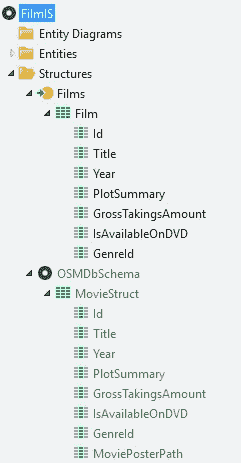
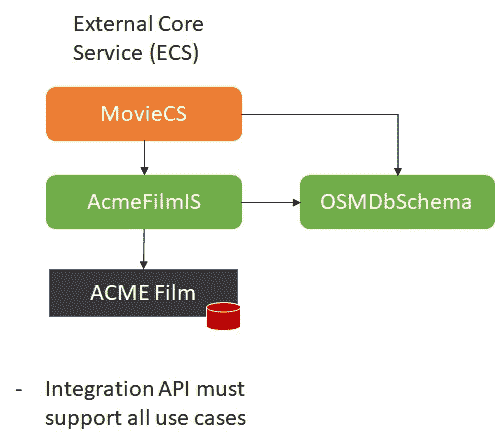
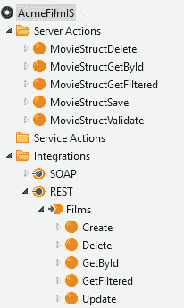
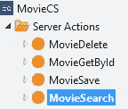
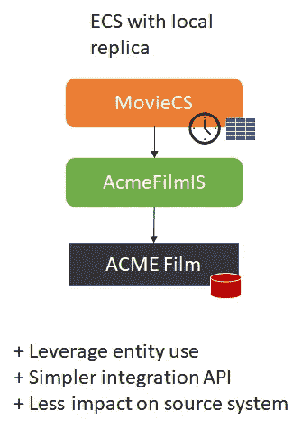
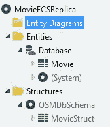
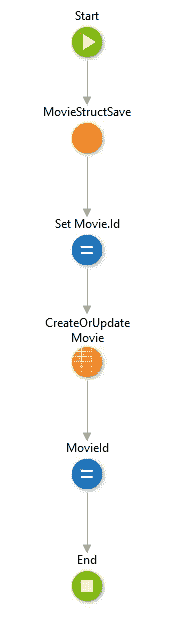
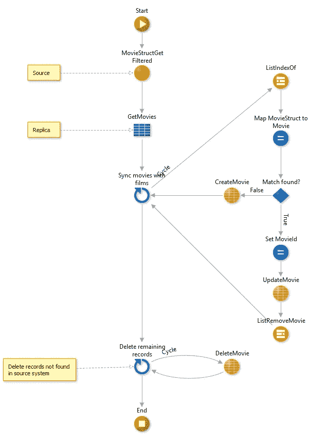
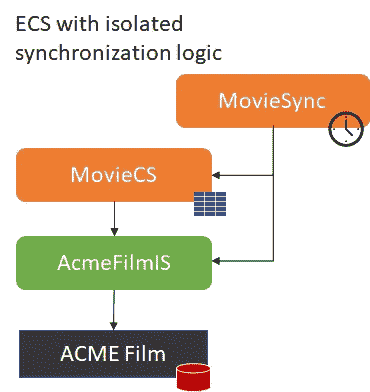
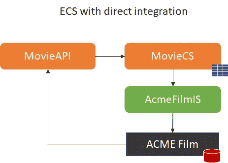

# 外部核心服务模式在实践中的变化

> 原文：<https://itnext.io/external-core-services-pattern-variations-in-practice-bdcb1da07b5b?source=collection_archive---------2----------------------->

当在企业架构中安装外部系统时，您面临着如何将企业数据与外部系统应用程序集成的挑战。如 OutSystems 在线培训中的 [*架构模式所述，来自外部系统的实体被称为**外部核心实体**，我们可以使用**外部核心服务模式**来消费该实体。本文通过示例解释了外部核心服务(ECS)的变化。*](https://www.outsystems.com/learn/courses/68/architecture-patterns-in-outsystems/)

外部实体可能暴露给具有以下模式的外部系统:

*   **扩展**模式:使用扩展来包装外部库或包装外部数据库中的实体
*   **连接器模式:**为消费者创建一个包装器模块和一个扩展来封装外部 API。
*   **服务外观**模式:为消费者创建一个包装器模块和一个集成服务模块来消费服务。

## 示例简介

为了说明这些模式，我使用了 OSMDb 的一个变体，我们都从如何成为一名 web 开发人员的培训中了解到了这个变体。电影数据现在的来源是 ACME 的外部系统，该系统通过电影 API 公开电影记录。我们使用集成服务(AcmeFilmIS)来使用电影 API。

在 OSMDb 中，电影的概念被称为 Movie，因此我们引入 MovieStruct 作为 OSMDb [规范模式](http://soapatterns.org/design_patterns/canonical_schema) (OSMDbSchema)的一部分。这使得该结构可以在任何(未来)集成中重用。为了启用[服务松耦合](http://serviceorientation.com/serviceorientation/service_loose_coupling)，Films API 数据结构被映射到 MovieStruct。

# 外部核心服务模式

外部系统提供了一个必须支持所有用例的集成 API。例如 CRUD 服务。

这里使用 [*服务外观模式*](http://soapatterns.org/design_patterns/service_facade) 为消费者提供一个包装器模块。Films rest 方法映射到 MovieStruct 服务器操作:

模块 MovieCS 使用 FilmIS 中的公共操作，并公开集中创建/更新业务逻辑的服务器操作。

这种模式的优点是易于实现。缺点是它没有利用实体的使用。例如，没有聚合、查询、脚手架等。

# 具有本地副本的 ECS

第一种变化是“创建外部实体的本地副本”。这不是外部实体的精确副本，而是标准化的业务概念。

在这个场景中，MovieCS 包含映射到 MovieStruct 的实体 Movie。服务器操作现在作用于电影实体，而不是电影结构。

电影保存动作现在更新外部数据和电影

电影保存逻辑

此外，MovieCS 现在还包含一个计时器和逻辑，用于将外部系统中的任何更改同步到副本。

电影同步逻辑

# 带隔离同步逻辑的 ECS

另一种变化是将同步逻辑与先前的模式隔离开来。

这种模式的优点是:

*   代码独立性
*   CS 的消费者不受同步的影响
*   Sync 可以协调几个(相关的)CS

# 具有直接集成和发布/订阅功能的 ECS

当要求数据必须总是同步时，我们可以使用直接积分来代替同步。

在这种模式中，副本的 API 被构建到外部系统中，因此更改可以立即反映出来。在 ACME Film 中更新记录时，会调用 MovieAPI 来更新电影记录。

如果企业服务总线(ESB)可用，这种模式也可以通过发布/订阅机制来实现。

这种模式的优点是外部系统副本和外部实体中的变化总是同步的。

如果在外部系统中删除了记录，并且存在对副本的引用，则必须提供特殊处理。对于更复杂的数据同步问题，您可以查看这篇文章。

# 总结和结论

这里描述的每种 ECS 变体都有其优点和缺点。在选择最适合您需求的 ECS 变体时，请慎重考虑。

## 参考

*   [外部系统的架构模式](https://www.outsystems.com/learn/courses/68/architecture-patterns-in-outsystems/)
*   [SOA 服务设计原则](https://www.arcitura.com/book/soa-principles-of-service-design/overview/)
*   [SOA 设计模式](https://www.arcitura.com/book/soa-design-patterns/overview/)