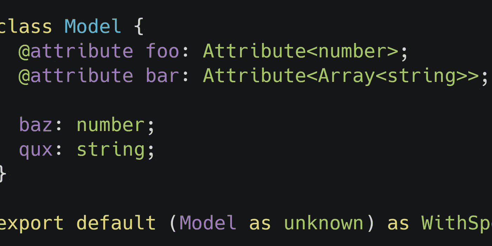

# 从 TypeScript 中的类提取修饰属性

> 原文：<https://itnext.io/extracting-decorated-properties-from-classes-in-typescript-caf24aabcb59?source=collection_archive---------2----------------------->



这是一篇关于我对一个有趣的打字稿问题的复杂而粗糙的答案的旅程的帖子。我不确定这是不是你应该使用的方法，但我认为这是一个有趣的方法。如果有一个更简单的解决方案，我确信(正如坎宁安定律所建议的)它会出现在评论中👇

注意:这个故事进入了一些高级打字稿。我假设你知道什么是装饰器、类型别名和泛型。

# 这个问题

> 如何创建一个映射类型，只提取已经被我的属性装饰器注释的属性？

这个问题有点抽象，让我们通过一个例子来看一下。

## 我们的特别装潢师🐟

让我们想象一下，我们有一个非常重要的名为“特殊”的装饰者:

```
/* special.ts */

function special(target: Object, propertyName: string) {
  🐟(target)(🚀, 💯, 🙌, propertyName);
}
// I have no clue what this does, but it looks very important.
```

我们有一些使用装饰器的类:

```
/* SomeModel.ts */

import special from "./special";

export default class SomeModel {
  @special foo: number;
  @special bar: Array<string>;

  baz: number;
  qux: string;
}

export const model = new SomeModel();
```

> **关于代码片段的说明**:本文中曾经嵌入了 CodeSandbox，允许你查看来自 TypeScript 编译器的反馈。不幸的是，由于中等嵌入的问题，我不得不暂时用简单的代码片段替换它们。不过，你仍然可以通过[这个链接](https://codesandbox.io/s/tspropertydecorators-0ht2s?file=/src/SomeModel.ts)在沙盒里摆弄代码。

## getSpecialProperty 实用程序

现在我们想创建一个实用函数，从一个对象中获取这些@special 属性之一:

```
/* getSpecialProperty.ts */

import { model } from "./SomeModel";

function getSpecialProperty<TModel, TKey extends keyof TModel>(
  model: TModel,
  key: TKey
) {
  return model[key];
}

/* TESTING */
// ✅ works! it even correctly infers type 'number'
const fooValue = getSpecialProperty(model, "foo");

// ❌ this gives an error, as we expected
const imaginaryValue = getSpecialProperty(
  model,
  "imaginary" /* ERROR: Argument of type '"imaginary"' is not assignable to parameter of type '"foo" | "bar" | "baz" | "qux"'. */
);

// 👎 whoops. it allows 'qux', even though it's not special
getSpecialProperty(model, "qux");
```

正如你在最后一行看到的，我们的函数有问题。它还将接受一个没有用我们的特殊装饰器注释的`key`。这就是我们试图解决的问题:以这样一种方式定义`TKey`,它只匹配我们特殊的修饰属性。

# 第 1 部分:非解决方案

让我们快速地认识到，有一个简单的方法可以将这些@special 属性分离出来。只是把他们放在一个单独的类上:

```
/* SomeModel.easy.ts */

import special from "./special";

class Special {
  @special foo: number;
  @special bar: Array<string>;
}

class SomeModel {
  special = new Special();

  baz: number;
  qux: string;
}

function getSpecialProperty<TSpecial, TKey extends keyof TSpecial>(
  model: { special: TSpecial },
  key: TKey
) {
  return model.special[key];
}
```

然而，这不是我试图解决的问题的解决方案。我想把我的“@special”属性和其他属性放在同一个对象上。毕竟，如果我也必须将我所有的属性移动到一个单独的对象中，那么使用 decorators 还有什么意义呢？

# 第 2 部分:通过值类型获取键

## 查找所有数字

让我们先解决一个“更简单”的问题:从我们的类`TModel`中获取所有值为类型`number`的键。我在这里将“更容易”放在引号中，因为这样做的类型别名看起来仍然有点令人生畏:

```
/* SomeModel.easy.ts */

/* THIS IS THE TYPE ALIAS */
type NumberKeys<T> = {
  [K in keyof T]: T[K] extends number ? K : never
}[keyof T];

/* BROKEN DOWN EXPLANATION + EXAMPLE */
type ExampleInput = { a: number; b: string; c: number };

// this will convert key-value pairs into key-key pairs
type MapValuesToKeys<T> = { [K in keyof T]: K };
// MapValuesToKeys<ExampleInput> = { a: "a"; b: "b"; c: "c"; }

// this will do the same, but map non-numbers to 'never'
type MapNumbersToKeys<T> = {
  [K in keyof T]: T[K] extends number ? K : never
};
// MapNumbersToKeys<ExampleInput> = { a: "a"; b: never; c: "c"; }

// the last step is to take the above, and get a union of the values
// (note that 'never' gets stripped from union types)
type FinalStep<T> = MapNumbersToKeys<T>[keyof T];
// FinalStep<ExampleInput> = "a" | "c"
```

## 使其更加通用

我们可以一般化我们的`NumberKeys`类型别名来获得任何给定类型的键:

```
type KeysOfType<TTarget, TValue> = {
  [K in keyof TTarget]: TTarget[K] extends TValue ? K : never
}[keyof TTarget];
```

太好了！所以现在我们所需要的就是使用这个类型别名来过滤我们特殊属性的类型，我们就完成了！🥳

嗯……这就是问题所在😟。我们的属性`foo`和`bar`可能有`special`装饰器，但是它们的类型只是普通的`number`和`Array<string>`。而且(在编写的时候)TypeScript 不允许你用装饰器改变某些东西的类型。它在 Github 上有一个[冗长的问题](https://github.com/Microsoft/TypeScript/issues/4881)，看起来这个问题不会很快得到解决。这让我们别无选择，只能显式地改变我们的修饰属性的类型。

# 第 3 部分:创建“特殊”类型

让我们创建一个新的类型`Special`,它具有一些属性，可以与其他类型区分开来。我们可以编造一些东西，因为我们在运行时并不真的要使用它🤷‍♂️.让我们也修改一下我们的@special 装饰器，这样它就不能再用于不是`Special`的属性

```
/* SpecialType.ts */

export interface IsSpecial {
  __imAUniqueSnowflake: true;
}

// I guess you could say this is my specialty
export type Special<T> = T & IsSpecial;

// By typing our @special decorator like this,
// decorated property need type 'IsSpecial'
export function special<
  TKey extends string,
  TTarget extends { [K in TKey]: IsSpecial }
>(target: TTarget, propertyName: TKey) {
  // implementation here
}
```

这是一个使用我们新类型的模型:

```
/* SpecialTypeClass.ts */

import { special, Special } from "./SpecialType";

class SomeModel {
  @special foo: Special<number>;
  @special bar: Special<Array<string>>;

  baz: number;
  qux: string;
}

/* TESTING */
const model = new SomeModel();

logNumber(model.foo); // ✅ OK
model.foo = 5; // ❌ ERROR: Type '5' is not assignable to type 'Special<number>'. Type '5' is not assignable to type 'IsSpecial'.ts(2322)
model.bar = ["abc"]; // ❌ ERROR Type 'string[]' is not assignable to type 'Special<string[]>'. Property '__imAUniqueSnowflake' is missing in type 'string[]' but required in type 'IsSpecial'.

function logNumber(n: number) {
  console.log(n);
}
```

不幸的是，我们引入了一个新问题😩。我们仍然可以将`model.foo`和`model.bar`传递给需要`number`和`Array<string>`的函数，但是我们不能再用没有被转换为`Special`的值来更新`foo`和`bar`。当您在类上定义初始值时，这可能是一个可接受的折衷，但是当在整个应用程序中使用该模型时，这就不太实际了。

> 这看起来像是一个第 22 条军规:我们想要改变@special 修饰属性的类型，这样我们就可以提取它们，但是每一次改变都会使它们与我们的原始类型不兼容。

# 第 4 部分:回到绘图板

## 无法接受？

因此，我们从一个不合适的方法开始:将属性放在一个单独的对象上。然后我们开始尝试使用特殊类型提取我们的属性。这似乎使我们的课变得毫无用处。但是，如果我们把这些方法组合成一个弗兰肯斯坦式的黑客大师会怎么样呢？🤔当然，这将解决我们的问题。

🦹‍♂ ️Here 是我们邪恶的总计划:

1.  用一个`Special`类型定义我们类的`@special`修饰属性
2.  使用`Special`类型提取类的修饰属性
3.  创建一个**新类型**，它将所有的修饰属性转换回它们的原始类型*，而且*还添加了一个单独的对象，只包含修饰属性
4.  欺骗 typescript 认为我们的原始类实际上是这种新类型👌

## 我们的最终模型

这是我们最终模型的样子:

```
/* FinalModel.ts */

import { special, Special } from "./SpecialType";
import WithSpecial from "./WithSpecial";

class FinalModel {
  @special foo: Special<number>;
  @special bar: Special<Array<string>>;

  baz: number;
  qux: string;
}

export default (FinalModel as unknown) as WithSpecial<
  typeof FinalModel
>;
```

注意，最后一行已经包含了我们邪恶计划的 4️⃣步骤。它导出了`FinalModel`，但稍加修改。首先，它通过将 TypeScript 强制转换为未知的类型来忘记它所知道的关于这个类的一切。🕶

"未知"

第二，我们用自己的解释替换类型。这就是`as WithSpecial<typeof FinalModel>`的作用。我喜欢这个最终解决方案的原因是，我们的模型看起来非常清晰易读。当然，我们必须在类声明中加入一些`Special`类型，但是我们的 decorator 签名将确保我们不会忘记这一点。尽管如此，我们仍然必须写`WithSpecial`，这是所有肮脏的黑客攻击发生的地方。所以让我们把它藏在一个单独的模块里，这样就没人会发现它了。🤫

## 转换类定义

那么我们如何转换一个类定义呢？这归结为两件事:映射静态属性并转换构造函数以使它返回我们修改过的实例类型:

```
/* WithSpecial.ts */

import TransformSpecial from "./TransformSpecial";

// type that will match any class (constructor)
type AnyConstructor = new (...args: Array<any>) => any;

// extract the type of the arguments of a constructor function
type ConstructorArgs<T> = T extends new (...args: infer A) => any
  ? A
  : never;

type WithSpecial<T extends AnyConstructor> = {
  // include any static properties on the class
  [K in keyof T]: T[K]
} & {
  // type a constructor with the original arguments,
  // but return a transformed instance
  new (...args: ConstructorArgs<T>): TransformSpecial<
    InstanceType<T>
  >;
};

export default WithSpecial;
```

## 转换类实例

现在让我们定义新的实例类型。所有的`Special`属性将被映射回它们原来的类型。此外，我们创建了一个名为`__special`的新属性。这在运行时并不真正存在，但 TypeScript 会认为它存在。我们可以利用这一点来访问所有的`Special`属性名称，即使属性本身现在恢复正常。

```
/* TransformSpecial.ts */

import { Special } from "./SpecialType";

// leftover from previous experiment
// gets all keys of 'TTarget' where the value has type 'TValue'
type KeysOfType<TTarget extends object, TValue> = {
  [K in keyof TTarget]: TTarget[K] extends TValue ? K : never
}[keyof TTarget];

type TransformSpecial<T extends object> = {
  // map over all properties. If they are special, transform them back
  [P in keyof T]: T[P] extends Special<infer A> ? A : T[P]
} & {
  // define a new property, __special
  // this will only contain all the Special properties
  __special: Pick<T, KeysOfType<T, Special<unknown>>>;
};

// we can use this to extract Special properties from our transformed class
export type HasSpecial = { __special: object };
export type SpecialKeys<T extends HasSpecial> = keyof T["__special"];

export default TransformSpecial;
```

## 新的和改进的 getSpecialProperty

现在我们有了一个类，其中我们的属性有普通类型，我们有一个 util 来提取所有修饰属性，我们最终可以创建我们的改进版本的`getSpecialProperty`😀

```
/* getSpecialProperty.fixed.ts */

import FinalModel from "./FinalModel";
import { SpecialKeys, HasSpecial } from "./TransformSpecial";

function getSpecialProperty<
  TModel extends HasSpecial,
  TKey extends SpecialKeys<TModel>
>(model: TModel, key: TKey): TModel[TKey] {
  return model[key];
}

/* TESTING */
const model = new FinalModel();

// ✅ still works
const fooValue = getSpecialProperty(model, "foo");
// ❌ Gives an error now, because "qux" is not special!
const quxValue = getSpecialProperty(
  model,
  "qux" /* Argument of type '"qux"' is not assignable to parameter of type '"foo" | "bar"'. */
);
```

而随着`qux`上的那个错误，我们的寻找也走到了尽头。🎉🎈🎊👯‍♂️

我们已经实现了对修饰属性进行类型检查的目标，现在终于可以休息了。😴

# 问与答(Question and Answer)

> 有没有更简单的方法来实现这一点？

可能

> 我应该用这个黑客吗？

可能不会

> 我能组织我的代码，这样我就不会遇到这个问题了吗？

明确地

> 这值得吗？

**绝对**

> 我只是滚动到底部，因为我不想阅读你的长篇大论。我可以有一个复制粘贴通用版本，能够注释和提取任何一组属性吗？就算我不用装修工？

给你:

```
/* generic.ts */

// use this to test if a class is transformed or if a property is a special attribute
type WithAttribute<TAttr extends string> = { [K in TAttr]: object };
// a generic version of the special attribute type
type AttributeType<TAttr extends string = string, TVal = unknown> = {
  value: TVal;
} & WithAttribute<TAttr>;
// extract all the special attributes of a transformed class
type AttributeKeysOf<
  TAttr extends string,
  TModel extends WithAttribute<TAttr>
> = keyof TModel[TAttr];

// transform a class with typed attributes

// prettier-ignore
type WithAttributes<TModel extends new (...args: Array<any>) => any, TAttr extends string> = {
  [K in keyof TModel]: TModel[K] 
} & {
  new (...args: TModel extends new (...args: infer A) => any ? A : never): {
    [P in keyof InstanceType<TModel>]: InstanceType<TModel>[P] extends AttributeType<TAttr, infer A> ? A : InstanceType<TModel>[P]
  } & {
    [K in TAttr]: Pick<InstanceType<TModel>, {
      [K in keyof InstanceType<TModel>]: InstanceType<TModel>[K] extends AttributeType<TAttr, any> ? K : never
    }[keyof InstanceType<TModel>]>
  };
};

/* EXAMPLE USAGE -- creating an Ultra special attribtue */

// create our special attribute type 'Ultra'
// it doesn't really matter what string you put here, as long as it's unique
type UltraId = "__ultra";
type Ultra<T> = AttributeType<UltraId, T>;
type UltraKeysOf<T extends WithAttribute<UltraId>> = AttributeKeysOf<
  UltraId,
  T
>;

/* EXAMPLE USAGE -- create a setter to set Ultra special attributes */
function setSpecialProperty<
  TModel extends WithAttribute<UltraId>,
  TKey extends UltraKeysOf<TModel>
>(model: TModel, key: TKey, value: TModel[TKey]) {
  model[key] = value;
}

/* EXAMPLE USAGE -- creating a model with Ultra special attributes */
// don't use this one -- this is the base model
class BaseModel {
  ultraNumber: Ultra<number>;
  ultraString: Ultra<string>;

  regularNumber: number;
  someArray: Array<string>;
}
// use this one
const Model = (BaseModel as unknown) as WithAttributes<
  typeof BaseModel,
  UltraId
>;
type Model = InstanceType<typeof Model>;

/* TESTING THE EXAMPLE */
const model: Model = new Model();

setSpecialProperty(model, "ultraNumber", 5); // ✅ compiles
setSpecialProperty(model, "ultraNumber", "5"); // ❌ Error, value should be number
setSpecialProperty(model, "ultraString", "5"); // ✅ compiles
setSpecialProperty(model, "ultraString", 5); // ❌ Error, value should be string
setSpecialProperty(model, "regularNumber", 5); // ❌ Error, regularNumber is not Ultra
setSpecialProperty(model, "someArray", ["abc"]); // ❌ Error, someArray is not Ultra

const logNumber = (n: number) => console.log(n);
logNumber(model.ultraNumber); // ✅ ultraNumber is still of type number
model.ultraNumber = 5; // ✅ still able to assign numbers to ultraNumber

/* EXAMPLE USAGE - limiting a decorator to Ultra typings */
function ultra<
  TKey extends string,
  TTarget extends { [K in TKey]: Ultra<unknown> }
>(target: TTarget, propertyName: TKey) {
  // decorator implementation here
}

class DecoratedModel {
  @ultra someProperty: number; // ❌ Error, property has to have Ultra type
  @ultra anotherOne: Ultra<number>; // ✅ compiles
}
```