# Kubernetes 中具有自动缩放功能的类似 FaaS 的 Spring 微服务

> 原文：<https://itnext.io/faas-like-spring-microservices-with-autoscaling-in-kubernetes-1dcd21c5d06f?source=collection_archive---------4----------------------->

本教程展示了如何创建一个基本的应用程序，演示了编写简单的“基于功能的微服务”的方法。它解释了如何创建这样的微服务，以及如何部署它们、设置自动伸缩、收集指标和跟踪。

这种方法对于进行大规模事件处理可能非常强大，同时在基础架构的所有权和部署的复杂性之间提供了很好的平衡。

项目代码:

[https://github.com/oleksiyp/faas-like-services-example](https://github.com/oleksiyp/faas-like-services-example)

# Java 函数

为了运行事件流微服务，我们将使用 Spring Cloud Stream 框架。

Spring Cloud Stream 基于 Spring Cloud Function framework——一种将业务逻辑构建为 Java“函数”并在无服务器平台上独立运行或使用 PaaS 运行的框架统一方式。

Spring Cloud Stream 通过增加将功能绑定到消息代理的能力，扩展了 Spring Cloud 的功能。支持以下消息代理:

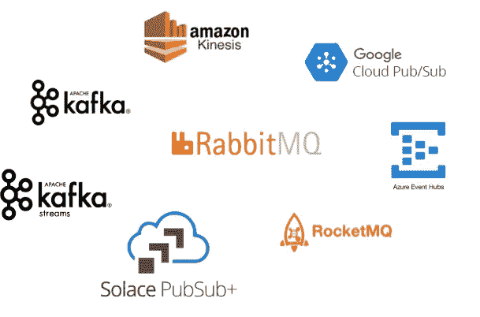

另外，Spring Cloud Stream 可以作为 Spring Cloud 数据流的一部分。但是这篇文章的目的是要表明，在 Kubernetes 中建立基础设施来运行这样的微服务**是很容易的，而不需要像 Spring Cloud Data Flow 这样的数据处理框架，这大大增加了部署的复杂性，并将 Kubernetes 的功能隐藏在它自己的部署适配器之后。**

# 技术选择

要构建演示解决方案，将使用以下堆栈:

*   [流行！_OS](https://pop.system76.com/) 基于 Linux 的机器
*   [k3s](https://k3s.io/) —易于设置 Kubernetes 集群(可以使用任何其他 Kubernetes)
*   [RabbitMQ 集群操作员](https://www.rabbitmq.com/kubernetes/operator/operator-overview.html)—部署 RabbitMQ 消息代理的操作员
*   [Spring Cloud Stream](https://spring.io/projects/spring-cloud-stream) —一个将函数绑定到 RabbitMQ 的框架
*   [Spring Cloud Sleuth](https://spring.io/projects/spring-cloud-sleuth) —追踪消息的框架
*   [Spring Boot 执行器](https://docs.spring.io/spring-boot/docs/current/reference/html/actuator.html) —一种提供指标和活性&就绪信息的方式
*   [KEDA](https://keda.sh/)—Kubernetes auto scaler 基于各种现成的指标
*   [Gradle](https://gradle.org/install/) — Java 构建工具
*   [ska fold](https://skaffold.dev/)—一个向 Kubernetes 集群执行快速本地部署的工具
*   [Helmfile](https://github.com/roboll/helmfile) —定制和部署舵图的工具
*   [Wavefront](https://tanzu.vmware.com/observability) —收集指标和跟踪信息的商业监控工具

# 演示应用程序的概念

[演示应用](https://github.com/oleksiyp/faas-like-services-example)由 4 个微服务组成:

*   `streaming-producer` —每秒发出一次消息的微服务
*   `streaming-processor1` —微服务，增加 2 秒的延迟，同时稍微修改消息
*   `streaming-processor2` —微服务，增加 3 秒的延迟，同时稍微修改消息
*   `streaming-consumer` —使用消息并将它们转储到标准输出，不应用延迟。

这个想法是处理器比生产者慢，而且慢的速度不同。这为自动缩放设置创造了一个很好的测试。

我们将看到，自动伸缩将根据处理速率和生产率自动调整处理负载的处理器实例数量。

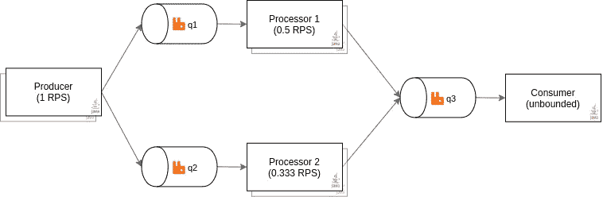

生产者、加工者和消费者

生产者微服务代码如下:

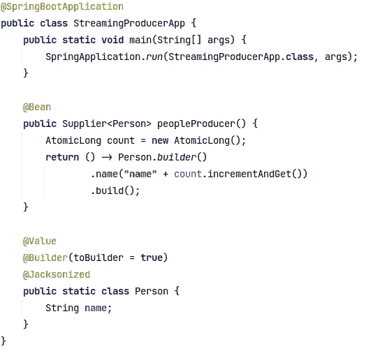

基本上，这创建了一个微服务，该微服务产生一个消息，该消息的名称字段包含递增的计数器。消息速率可通过 Spring Cloud Stream 属性进行配置，默认情况下等于每秒一条消息。

处理器#1 微服务代码如下:

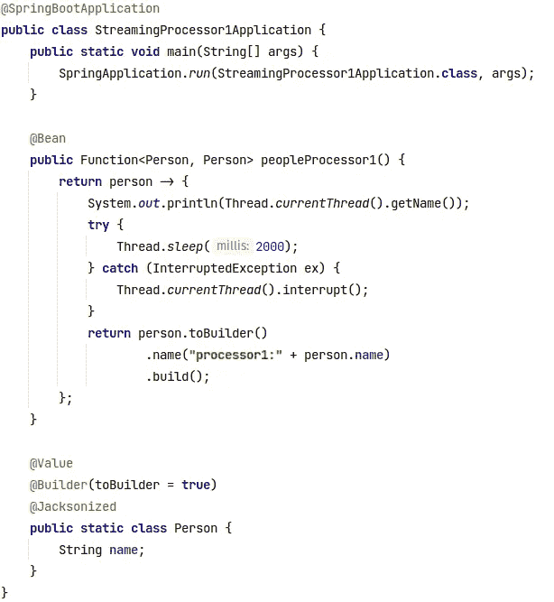

它在“name”字段前面加上“processor1:”字符串，并增加了 2 秒的延迟。

处理器#2 微服务的代码与处理器#1 微服务的代码相同，但使用 3 秒延迟和其他前置字符串“处理器 2:”。

消费者微服务代码如下:

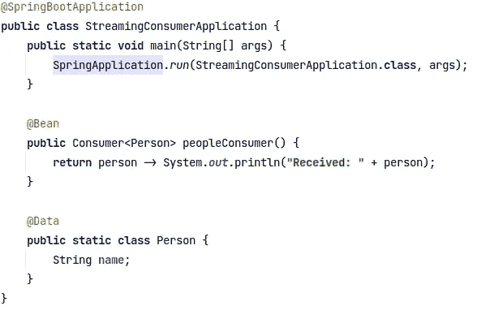

它唯一做的事情是将收到的每条消息发布到标准输出。

Spring stack 将处理将基于 lambdas 的“函数”、“供应商”和“消费者”绑定到消息队列、数据格式转换(JSON)、重试逻辑、死信队列处理等所有复杂问题。唯一需要的是正确配置这种微服务。

演示应用程序存储库包含:

*   `build.gradle` — Gradle 项目文件，打造 Spring 微服务
*   `helmfile.yaml` —用于部署整个应用程序的文件
*   `skaffold.yaml`—ska fold 工具在手表环路中部署的配置
*   `helm/rabbitmq-cluster` —通过 RabbitMQ 集群操作员部署 RabbitMQ 集群的舵图
*   `helm/streaming-service` —部署 Spring 微服务的舵图

# 使用 KEDA 自动缩放

KEDA 允许根据收集的指标扩展微服务实例。

对于 RabbitMQ，Kubernetes 的定义如下:

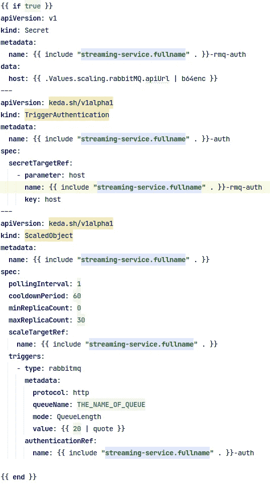

这为 RabbitMQ 中的队列建立了一个缩放对象。凭证和群集地址存储在关联的机密文件中。KEDA 将从 RabbitMQ 中获取队列的大小，将其除以 threshold( `value`字段)，并推断出要创建多少个实例。

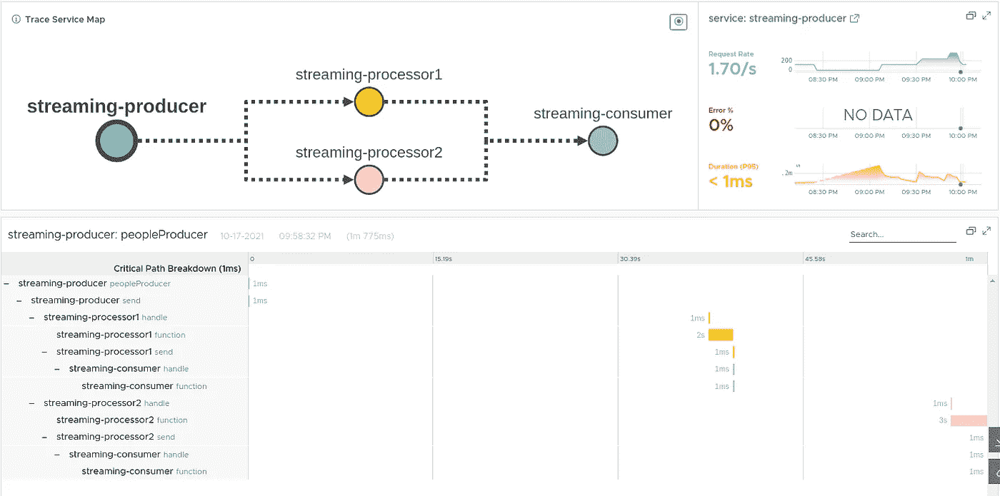

因为实例的数量取决于队列大小，这意味着自动缩放将适应输入速率与处理速率的比率。如果处理速度比输入速度快，那么队列将会增长，从而产生更多的实例。如果输入速率下降，队列被处理，实例被自动缩放器删除。

这允许为两个不同速度的流独立地调整处理速率。此外，如果队列为空一分钟，KEDA 会将所有实例的数量缩减为零。

# 测试自动缩放

让我们用这个设置做一点实验。

我们将只改变一个数字——一个生产者的复制品的数量，一个`helmfile.yaml`中的`replicaCount`值

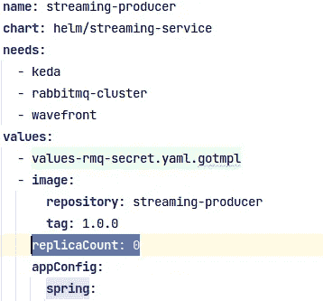

首先，让我们将其设置为`0`并部署`skaffold dev`

您将看到初始部署将不会部署任何生产者，而是非常快速地终止处理器:

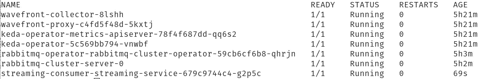

让我们将`replicaCount`设置为`1`:

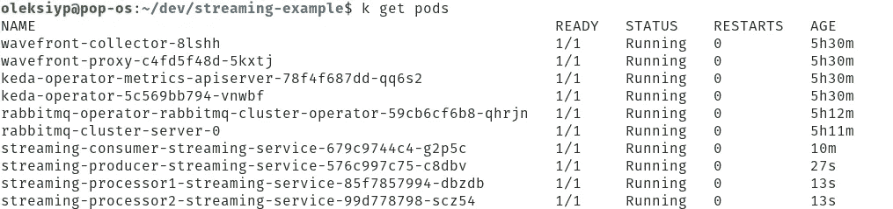

在开始时，生产者将在生产者启动后几乎立即运行到处理器`10` 秒，但是由于处理器的消耗率小于生产者的生产，队列将开始累积消息，最后，系统将随着更少的 pod 而稳定下来:

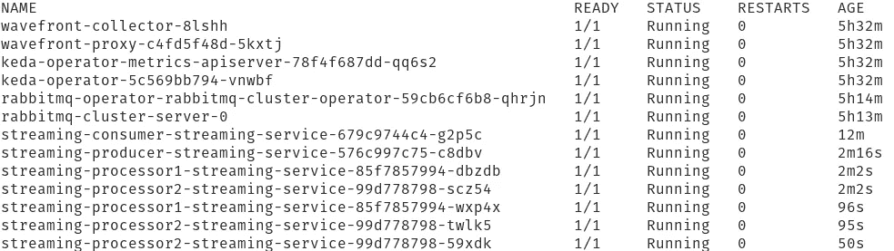

在这里，由于不同的利率，更多的豆荚发行。总共两个处理器组以`0.5 RPS`的速率运行，三个处理器组以`0.333 RPS`的速率运行，这允许以`2 RPS`的汇总速率处理最初产生的流。

您可以看到队列中充满了一定数量的消息:

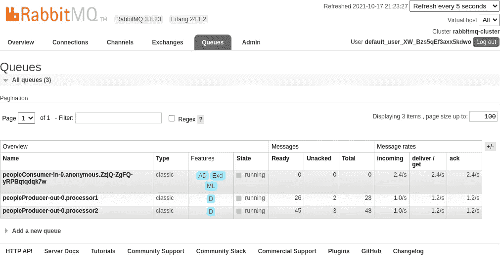

我们可以通过将 ScaleObject 改为与`queue length`一起使用`message rate`来清空队列。队列长度是一个非常灵活的度量标准，但总是使队列大小随着消息速率线性增长。将`messages rate`配置为扩展触发器需要对每个微服务的速率阈值进行更复杂的调整。

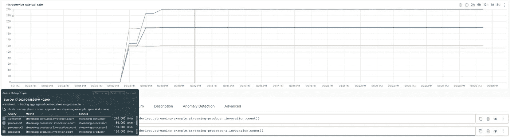

从`0`副本计数切换到副本计数 1 时的呼叫率

让我们向生产者容器中再添加一个副本。一段时间后，pod 将扩展到稳定状态:

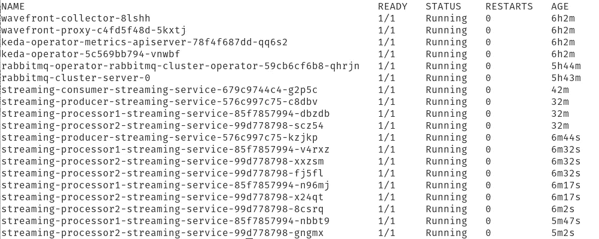

您可以看到费率得到了适当的调整:

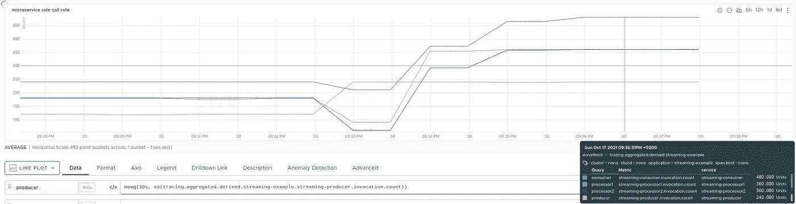

副本计数转换 1 到 2

让我们再添加一个生产者的复制品:

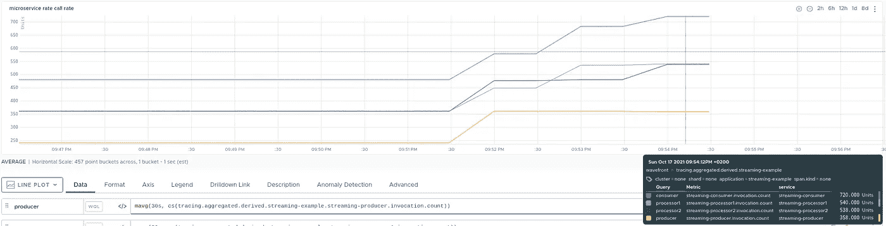

副本数量从 2 变为 3

现在让我们按比例缩小生产者:

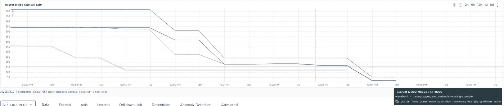

将副本从 2 扩展到 1 再扩展到 0

最后，您可以看到生产者和两个处理器被拆除:

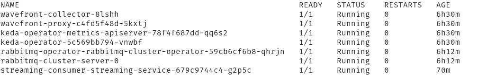

这意味着当不存在输入消息时，不分配任何资源。

# 源代码

关键文件:

*   [helm file . YAML](https://github.com/oleksiyp/faas-like-services-example/blob/master/helmfile.yaml)—helm file 将解决方案部署到 Kubernetes 的配置
*   [skaffold.yaml](https://github.com/oleksiyp/faas-like-services-example/blob/master/skaffold.yaml) —快速开发循环的配置 skaffold 观察器
*   [build . gradle](https://github.com/oleksiyp/faas-like-services-example/blob/master/streaming-lib/build.gradle)——所有微服务使用的公共库的构建文件，由于 Spring 的依赖性，它非常有价值
*   [cluster.yaml](https://github.com/oleksiyp/faas-like-services-example/blob/master/helm/rabbitmq-cluster/templates/cluster.yaml) —简单 RabbitMQ 集群部署的配置
*   [scaling . YAML](https://github.com/oleksiyp/faas-like-services-example/blob/master/helm/streaming-service/templates/scaling.yaml)—Kubernetes 自动声明的配置
*   [StreamingProducerApp.java](https://github.com/oleksiyp/faas-like-services-example/blob/master/streaming-producer/src/main/java/app/StreamingProducerApp.java)—生产商代码
*   [StreamingProcessor1App.java](https://github.com/oleksiyp/faas-like-services-example/blob/master/streaming-processor1/src/main/java/app/StreamingProcessor1Application.java)—处理器#1 代码
*   [StreamingProcessor2App.java](https://github.com/oleksiyp/faas-like-services-example/blob/master/streaming-processor2/src/main/java/app/StreamingProcessor2Application.java)—处理器#2 代码
*   [StreamingConsumerApp.java](https://github.com/oleksiyp/faas-like-services-example/blob/master/streaming-consumer/src/main/java/app/StreamingConsumerApplication.java)—消费者代码

# 结论

您可能有很多理由想要创建这样一个基于消息代理、函数和自动缩放器的事件驱动系统。

一个是在 PaaS 级别上运行，您在构建复杂系统时有很大的灵活性。您可以使用大量适合您需求的现成解决方案来增强系统，并将它们紧密集成。

RabbitMQ、KEDA 和 Spring Cloud Stream 都是久经考验的产品，拥有良好的声誉。这使得它们非常适合系统的核心组件。

结合 Kubernetes 丰富的 Helm 部署机会，这可能会产生一个非常敏捷和灵活的 FaaS 式系统。