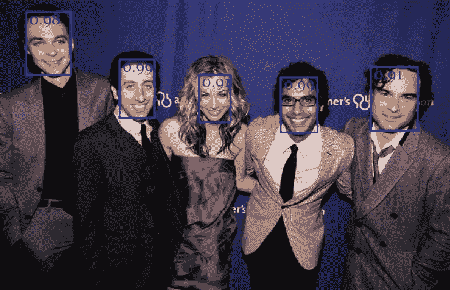
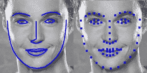
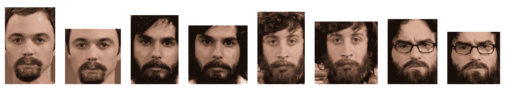
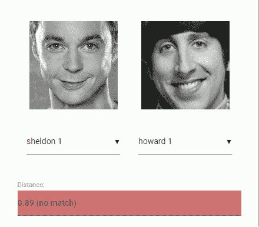
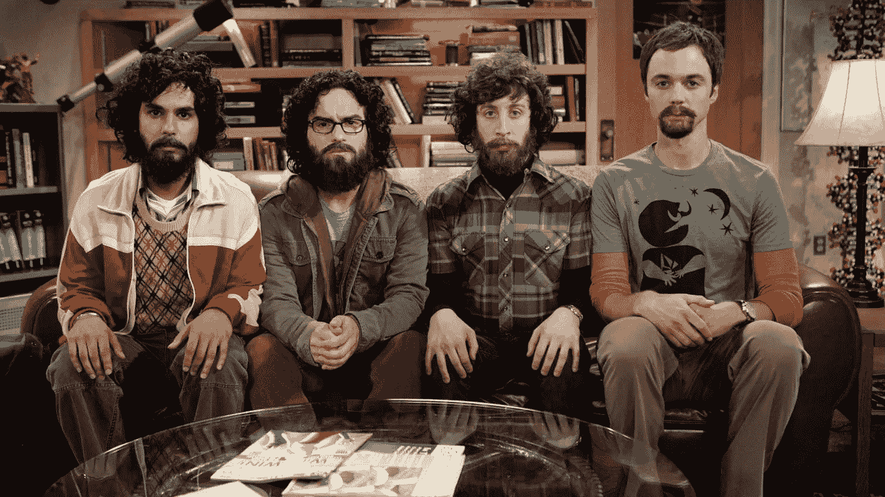
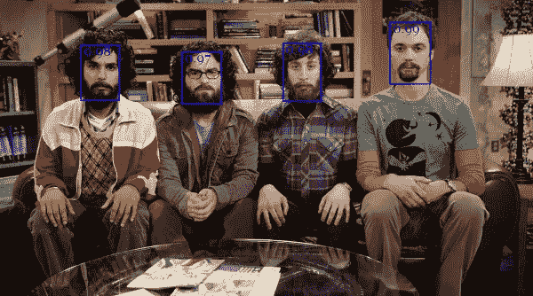
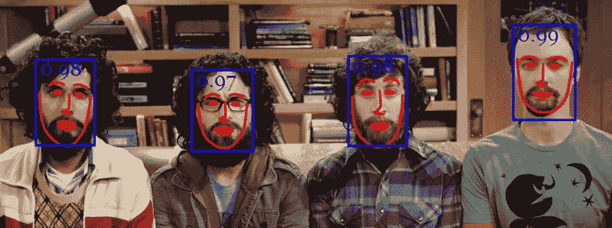
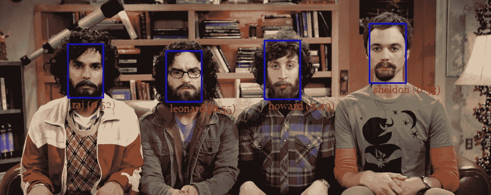

# Face-API . js-使用 tensorflow.js 在浏览器中进行人脸识别的 JavaScript API

> 原文：<https://itnext.io/face-api-js-javascript-api-for-face-recognition-in-the-browser-with-tensorflow-js-bcc2a6c4cf07?source=collection_archive---------0----------------------->

## 用于人脸检测、人脸识别和人脸标志检测的 JavaScript API


我很兴奋地说，终于可以在浏览器中运行人脸识别了！在这篇文章中，我将介绍一个 javascript 模块 [**face-api.js**](https://github.com/justadudewhohacks/face-api.js) ，它构建在 [**tensorflow.js 核心**](https://github.com/tensorflow/tfjs-core) 之上，实现了几个 **CNN** s **(** 卷积神经网络)来解决人脸检测、人脸识别和人脸地标检测，并针对 web 和移动设备进行了优化。

像往常一样，我们将查看一个简单的代码示例，它将让您只需几行代码就能立即开始使用这个包。如果您想先玩一些例子，请查看 [**演示页面**](https://justadudewhohacks.github.io/face-api.js/) **！**但是别忘了回来看文章。；)

让我们开始吧！

*注意，该项目正在积极开发中。请务必查看我的最新文章，了解 face-api.js 的最新特性:*

*   [***实时 JavaScript 人脸跟踪和人脸识别使用 face-api.js' MTCNN 人脸检测器***](/realtime-javascript-face-tracking-and-face-recognition-using-face-api-js-mtcnn-face-detector-d924dd8b5740)

# 先是 face-recognition.js，现在又是一个包？

如果你看过我的另一篇关于 nodejs 人脸识别的文章:[**node . js+Face-Recognition . js:使用深度学习的简单鲁棒的人脸识别**](https://medium.com/@muehler.v/node-js-face-recognition-js-simple-and-robust-face-recognition-using-deep-learning-ea5ba8e852) ，你可能会意识到，前段时间我组装了一个类似的包，比如[**Face-Recognition . js**](https://github.com/justadudewhohacks/face-recognition.js)，把人脸识别带到了 nodejs。

起初，我没有想到 javascript 社区对人脸识别包有如此高的需求。对于许多人来说，face-recognition.js 似乎是一个体面的免费使用和开源的人脸识别付费服务的替代品，例如微软或亚马逊提供的服务。但我也被问了很多问题，是否有可能完全在浏览器中运行完整的人脸识别管道。

终于是了，感谢 tensorflow.js！我设法使用 **tfjs-core** 实现了部分类似的工具，这将得到与 face-recognition.js **、**几乎相同的结果，但是是在浏览器中！此外，face-api.js 提供了模型，这些模型针对 web 和运行在资源移动设备上进行了优化。最棒的是，它不需要设置任何外部依赖，开箱即用。作为一个额外的奖励，它是 **GPU 加速的**，在 WebGL 后端运行操作。

这足以说服我，javascript 社区需要这样一个浏览器包！我将让您发挥想象力，用它来构建各种各样的应用程序。；)

# 如何用深度学习解决人脸识别

如果你是那种想尽快开始的人，你可以跳过这一节，直接进入代码。但是为了更好地理解 face-api.js 中用于实现人脸识别的方法，我强烈建议您跟随，因为我经常被问到这个问题。

简单来说，我们实际上想要实现的是，在给定一个人的脸部图像的情况下，例如**输入图像**，来识别这个人。我们这样做的方法是为我们想要识别的每个人提供一个(或多个)图像，用人名标记，例如**参考数据**。现在我们将输入图像与参考数据进行比较，并找到最相似的参考图像**。如果两幅图像足够相似，我们输出**人的名字**，否则我们输出**‘未知’**。**

听起来像个计划！然而，仍然存在两个问题。首先，如果我们有一个显示多个人的图像，并且我们想把他们都认出来，该怎么办？其次，我们需要能够获得两张人脸图像的这种**相似性度量**，以便对它们进行比较…

## 人脸检测

第一个问题的答案是人脸检测。简单来说，我们将首先定位输入图像中的所有人脸**。** Face-api.js 为不同的用例实现了多个人脸检测器。

最准确的人脸检测器是一个 **SSD** (单镜头多盒检测器)，基本上是一个基于 **MobileNet V1** 的 **CNN** ，在网络之上叠加了一些额外的盒预测层。

此外，face-api.js 实现了一个优化的**微型人脸检测器**，基本上是 Tiny Yolo v2 的一个更小的版本，利用深度方向可分离的卷积而不是常规卷积，与 SSD MobileNet V1 相比，这是一个更快但精度稍低的人脸检测器。

最后，还有一个 **MTCNN** (多任务级联卷积神经网络)的实现，然而，它现在主要用于实验目的。

网络返回每个人脸的**包围盒**，以及它们相应的**分数**，例如每个包围盒显示人脸的概率。分数用于过滤边界框，因为图像可能根本不包含任何人脸。注意，为了检索边界框，即使只有一个人，也应该执行面部检测。



## 人脸标志检测和人脸对齐

第一个问题解决！然而，我想指出的是，我们希望**对齐**边界框，这样我们就可以在将图像传送到人脸识别网络之前，提取每个框中位于人脸中心的图像，因为这将使人脸识别更加准确！

为此，face-api.js 实现了一个简单的 CNN，它返回给定人脸图像的 68 个点人脸标志**:**



根据标志位置，边界框可以位于面部的中心。在下图中，您可以看到人脸检测的结果(左)与对齐的人脸图像(右)的对比:



## 人脸识别

现在我们可以将提取和对齐的人脸图像馈入人脸识别网络，该网络基于类似于 **ResNet-34** 的架构，并且基本上对应于 [**dlib**](https://github.com/davisking/dlib/blob/master/examples/dnn_face_recognition_ex.cpp) 中实现的架构。该网络已经被训练来学习将人脸的特征映射到**人脸描述符**(具有 128 个值的特征向量)，这通常也被称为人脸嵌入。

现在回到我们比较两张人脸的原始问题:我们将使用每个提取的人脸图像的人脸描述符，并将它们与参考数据的人脸描述符进行比较。更准确地说，我们可以计算两张人脸描述符之间的**欧几里德距离**，并基于一个**阈值**来判断两张人脸是否相似(对于 150×150 大小的人脸图像 **0.6** 是一个好的阈值)。使用**欧几里德距离**效果惊人的好，但是当然你可以使用任何你选择的分类器。下面的 gif 通过欧几里德距离可视化了两张人脸图像的比较:



现在我们已经理解了人脸识别的理论，我们可以开始编写一个例子了。

# 编码时间！

在这个简短的示例中，我们将逐步了解如何对以下显示多个人的输入图像运行人脸识别:



## 包括剧本

首先从 *dist/face-api.js* 中获取 [**最新版本**](https://github.com/justadudewhohacks/face-api.js/tree/master/dist) 或者从 *dist/face-api.min.js* 中获取 minifed 版本并包含脚本:

```
<script src="face-api.js"></script>
```

如果您使用 npm:

```
npm i face-api.js
```

## 加载模型数据

根据您的应用程序的要求，您可以专门加载您需要的模型，但要运行完整的端到端示例，我们需要加载人脸检测、人脸标志和人脸识别模型。模型文件在 repo 上可用，可在 处找到 [**。**](https://github.com/justadudewhohacks/face-api.js/tree/master/weights)

模型权重已经过量化，与原始模型相比，模型文件大小减少了 **75%** ，使您的客户只需加载所需的最少数据。此外，模型权重被分割成最大 4 MB 的块，以允许浏览器缓存这些文件，这样它们只需加载一次。

模型文件可以简单地作为静态资产在您的 web 应用程序中提供，或者您可以将它们托管在其他地方，并且可以通过指定文件的路径或 url 来加载它们。假设您在 **models** 目录中提供它们，以及 **public/models** 下的资产:

## 从输入图像接收所有人脸的完整描述

神经网络接受 HTML 图像、画布或视频元素或张量作为输入。为了检测输入图像的所有人脸的边界框，我们简单地说:

完整的面部描述保存检测结果(边界框+分数)、面部标志以及计算的描述符。通过省略***faceapi . detect allfaces(input，options)*** 的第二个 ***选项*** 参数，SSD MobileNet V1 将默认用于人脸检测。要使用微型面部检测器或 MTCNN，您只需指定相应的选项即可。

有关面部检测选项的详细文档，请查看 github repo 的自述文件中的相应部分。请注意，您必须预先加载相应的模型，以便像我们对 SSD MobileNet V1 模型所做的那样使用面部检测器。

返回的边界框和界标位置是相对于原始图像/媒体大小的。如果显示的图像尺寸与原始图像尺寸不一致，您可以简单地调整它们的大小:

我们可以通过将边界框绘制到画布中来可视化检测结果:



面部标志可以显示如下:



通常，我为可视化所做的是在具有相同宽度和高度的 **img** 元素上覆盖一个绝对定位的画布(更多信息请参见 github 示例)。

## 人脸识别

既然我们知道了如何检索给定输入图像的所有人脸的位置和描述符，我们将获得一些显示每个人的图像，并计算他们的人脸描述符。这些描述符将成为我们的**参考数据**。

假设我们有一些可用的主题示例图像，我们首先从 url 获取图像，并使用***faceapi . fetchimage .***从它们的数据缓冲区创建 HTML 图像元素。对于每个获取的图像，我们将定位主题的面部并计算面部描述符，就像我们之前对输入图像所做的那样:

请注意，这次我们使用的是***faceapi . detectsingleface，*** ，它将只返回检测到的得分最高的人脸，因为我们假设在该图像中只显示给定标签的字符。

现在，剩下要做的事情就是将从我们的输入图像中检测到的面部的面部描述符与我们的**参考数据**进行匹配，例如标记的面部描述符。为此，我们可以利用 ***faceapi。面匹配器*和**如下:

面部匹配器使用欧几里德距离作为相似性度量，结果证明效果很好。我们最终为输入图像中检测到的每个人脸找到一个最佳匹配，包含标签+匹配的欧几里德距离。

最后，我们可以将边界框及其标签一起绘制到画布中，以显示结果:



我们走吧！到目前为止，我希望您已经初步了解了如何使用这个 api。我还建议看看回购中的其他例子。现在，尽情玩这个包吧！；)

*如果你喜欢这篇文章，欢迎留下一些掌声，并在 medium 和/或*[*Twitter*](https://twitter.com/justadudewhohax)*:)上关注我。也可以随意在* [***github 资源库***](https://github.com/justadudewhohacks/face-api.js) *上留下一颗星星。敬请关注更多教程！*